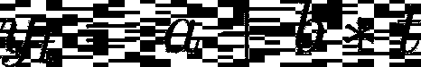
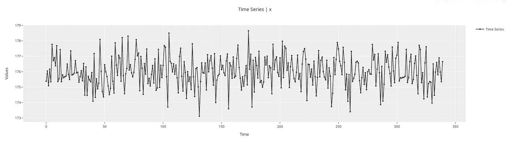
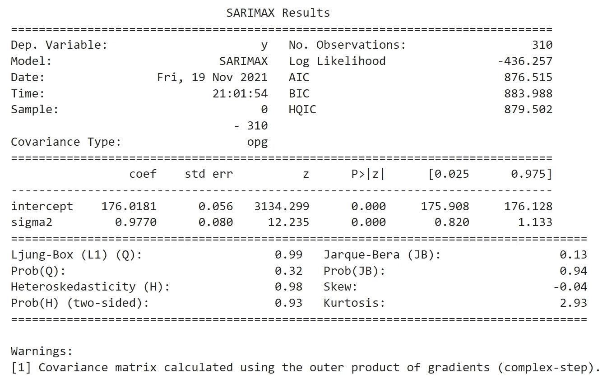
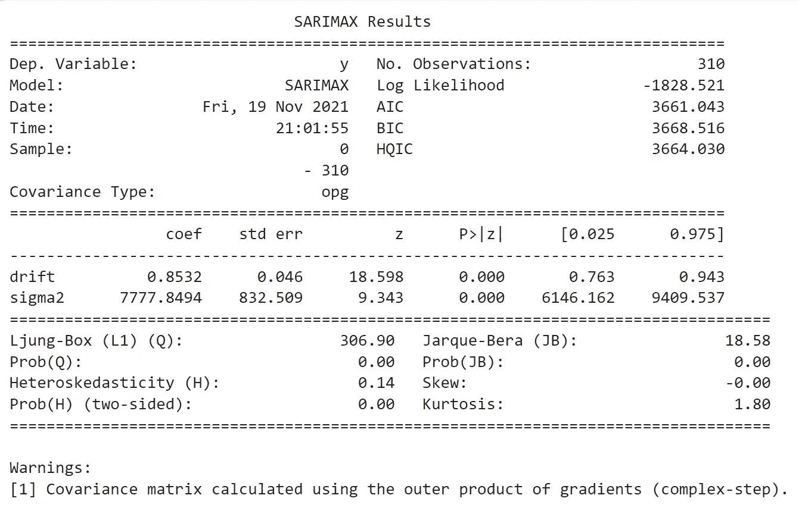
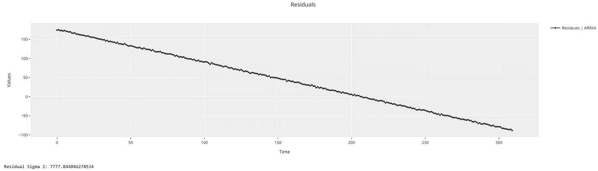
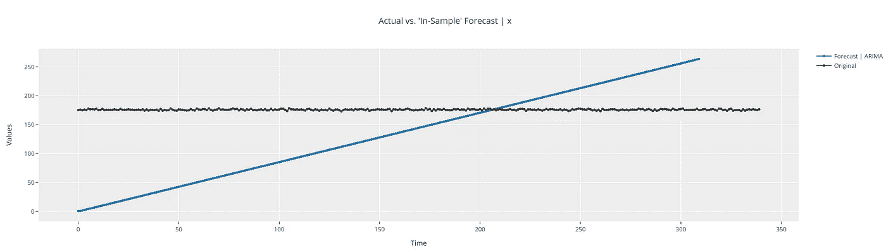
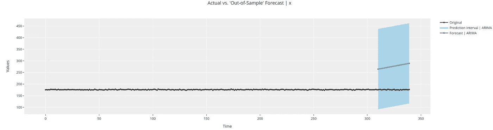
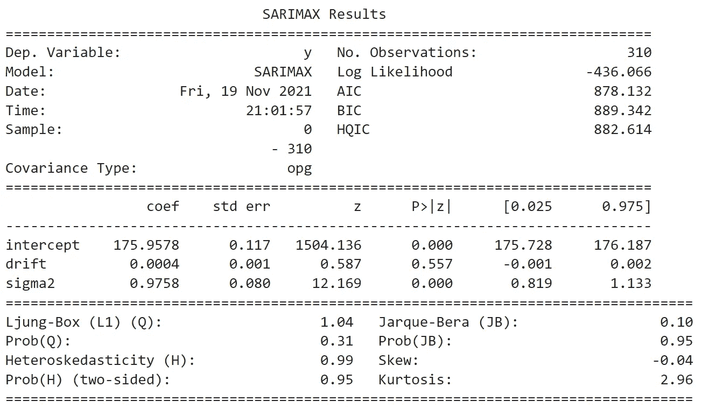
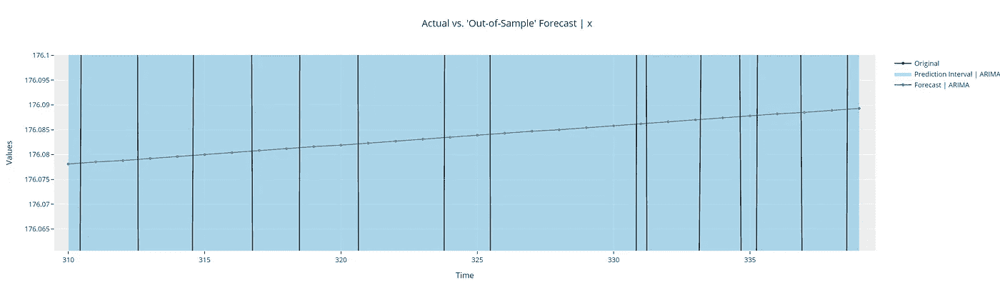

# 使用 PyCaret 的 ARIMA 模型实用指南—第 2 部分

> 原文：<https://towardsdatascience.com/understanding-arima-models-using-pycarets-time-series-module-part2-308ea7bfecf6?source=collection_archive---------10----------------------->

## 理解趋势术语


贾斯汀·摩根在 [Unsplash](https://unsplash.com?utm_source=medium&utm_medium=referral) 上的照片

## 📚介绍

在上一篇文章中，我们看到了 ARIMA 模型及其各种超参数的简要概述。我们从一个非常简单的 ARIMA 模型开始，这个模型没有表现出时间依赖性。本文将着眼于 ARIMA 模型的“趋势”部分，看看这是如何建模的，它代表了什么。

## 📖建议的先前阅读

本系列的前一篇文章可以在下面找到。我建议读者在继续阅读本文之前先浏览一遍。本文建立在前一篇文章中描述的概念的基础上，并且重用了前一篇文章中完成的一些工作。

[使用 PyCaret 的 ARIMA 模型实用指南—第 1 部分](/understanding-arima-models-using-pycarets-time-series-module-part-1-692e10ca02f2)

## ARIMA 模型中的 1️⃣“趋势”概述

顾名思义，趋势决定了时间序列如何随时间变化。在 ARIMA 模型中，这可以使用下面的基本方程[1]来建模。“a”称为“截距”，“b”称为“漂移”项。“漂移”不过是直线的斜率。



图片由作者使用[https://latex2png.com/](https://latex2png.com/)

有几种方法可以用这个方程来模拟趋势。

(1)不随时间变化的趋势分量。在这种情况下，漂移“b”= 0。

(2)从 0 开始并随时间线性变化的趋势分量(零截距“A”和非零斜率/漂移“b”)。

(3)不从 0 开始并随时间线性变化的趋势分量(非零截距“A”和非零斜率/漂移“b”)。

## 2️⃣️使用 PyCaret 理解趋势项

为了更好地理解这个概念，我们将使用在本系列的上一部分中使用的相同数据集。回顾一下，这个数据集是一个“白噪音”数据集。详细内容可以在本文的 Jupyter 笔记本中找到(可在文章末尾找到)。



白噪声数据集[图片由作者提供]

👉**步骤 1 & 2:设置 PyCaret 时间序列实验并执行 EDA**

因为我们已经在上一篇文章中执行了这些步骤，所以我们不再赘述。详情请参考上一篇文章。

👉**第三步:理论计算**

如上所述，ARIMA 模型中的“趋势”可以用 3 种方法计算。

(1)趋势组件固定的第一种方法与上一篇文章中介绍的模型相同。因此，同样的理论计算也适用于这种情况。作为复习，预测的估计值(样本内和样本外)是训练数据集的平均值(即“a”= 176.02)。预测区间的估计值为 174.08–177.96。

(2)第二种方法将趋势分量建模为截距“a”= 0 的直线。为了从理论上对此建模，我们可以使用 scikit-learn 的线性回归模型来重新创建它。当我们最终使用 ARIMA 模型对此进行建模时，我们预计会看到相同的结果。

```
X_train = np.arange(len(y_train)).reshape(-1, 1)
reg = LinearRegression(**fit_intercept=False**).fit(X_train, y_train)
print(f"Expected Intercept: {reg.intercept_}")
print(f"Expected Slope: {reg.coef_}")***>>> Expected Intercept: 0.0
>>> Expected Slope: [0.85317393]***
```

(3)第三种方法将趋势分量建模为截距“a”不为 0 的直线。我们可以使用 scikit-learn 如下再次创建它。

```
X_train = np.arange(len(y_train)).reshape(-1, 1)
reg = LinearRegression(**fit_intercept=True**).fit(X_train, y_train)
print(f"Expected Intercept: {reg.intercept_}")
print(f"Expected Slope: {reg.coef_}")***>>> Expected Intercept: 175.95815015173943
>>> Expected Slope: [0.00038807]***
```

👉**第四步:建立模型**

现在，我们已经讨论了理论计算，让我们看看这些模型的实践。

```
**# Trend with method 1 ----**
model2a = exp.create_model(
    "arima",
    order=(0, 0, 0),
    seasonal_order=(0, 0, 0, 0),
    **trend="c"**
)**# Trend with method 2 ----**
model2b = exp.create_model(
    "arima",
    order=(0, 0, 0),
    seasonal_order=(0, 0, 0, 0),
    **trend="t"**
)**# Trend with method 3 ----**
model2c = exp.create_model(
    "arima",
    order=(0, 0, 0),
    seasonal_order=(0, 0, 0, 0),
    **trend="ct"**
)
```

👉**第五步:分析结果**

我们将重用在上一篇文章中创建的相同的助手函数来分析结果。

**方法一:trend = "c"**

```
summarize_model(model2a)
get_residual_properties(model2a)
```



作者图片

这些结果与我们的理论计算相符，并与上一篇文章中的结果完全相同。我们将不再详细讨论它们。您可以参考本文末尾的 Jupyter 笔记本了解更多详细信息。

**方法二:trend = "t"**

```
**summarize_model**(model2b)
**get_residual_properties**(model2b)
```



方法二:统计汇总[图片由作者提供]

正如我们可以看到的，模型的漂移(0.8532)与使用 scikit-learn 的理论计算相匹配。



方法 2:残差和 sigma 2[图片由作者提供]

类似地，残差 Sigma2 (~ 7777)手动计算与模型中的计算相匹配。需要注意的一点是，对于这个数据集来说，这不是一个好的模型，因为无法解释的方差(sigma2)比以前高得多。让我们也来看看预测。

```
**plot_predictions**(model2b)
```



方法 2:样本内预测[图片来源



方法 2:样本外预测[作者图片]

我们可以看到，预测(样本内)从接近 0 开始，线性增加。PyCaret 提供了交互式图表，因此用户可以放大预测的各个部分，以更详细地分析它们。例如，可以将鼠标悬停在连续的点上，注意到它们的漂移值相差 0.8532。

样本外预测是样本内预测的延续，再次以 0.8532 的斜率/漂移线性上升。

对于目光敏锐的观察者来说，这是一个细微的差别。第一个样本内预测不为 0。它从值 0.8532(漂移值)开始。你能解释一下为什么吗？

**方法三:trend = "ct"**

```
**summarize_model**(model2c)
**get_residual_properties**(model2c)
```



方法三:统计汇总[图片由作者提供]

我们可以看到，模型的截距(175.9578)和漂移(0.0004)与使用 scikit-learn 的理论计算相匹配。漂移如此接近 0 是意料之中的，因为这是白噪声数据。此外，我们可以看到，该模型与方法 1 中的模型之间的“拟合优度”(较低的σ2 =更好的拟合)几乎没有差异。

让我们也来看看预测。除了小斜率/漂移部分之外，它们应该与方法 1 中的非常相似。同样，PyCaret 中的交互式绘图允许轻松检查结果，如下面的缩放结果所示。



方法 3:样本外预测(缩放)[图片由作者提供]

此外，这可能是显而易见的，但值得明确指出的是，尽管方法 1 和方法 3 在这种情况下给出了类似的拟合(假设数据是白噪声)，但情况并不总是如此。当数据呈现线性趋势时，与方法 1 相比，方法 3 通常会给出更好的拟合。我鼓励读者创建一个虚拟的线性数据集并尝试一下。

# 🚀结论

希望这个简单的模型为我们理解 ARIMA 模型中趋势部分的内部运作打下了良好的基础。在下一组文章中，我们将开始逐一介绍其他参数，并查看它们对模型行为的影响。在那之前，如果你愿意在我的社交渠道上与我联系(我经常发布关于时间序列分析的文章)，你可以在下面找到我。暂时就这样了。预测快乐！

🔗 [LinkedIn](https://www.linkedin.com/in/guptanick/)

🐦[推特](https://twitter.com/guptanick13)

📘 [GitHub](https://github.com/ngupta23)

*喜欢这篇文章吗？成为* [***中等会员***](https://ngupta13.medium.com/membership) *继续* ***无限制学习*** *。如果你使用下面的链接，* ***，我会收到你的一部分会员费，而不会给你带来额外的费用*** *。*

[](https://ngupta13.medium.com/membership) [## 通过我的推荐链接加入 Medium—Nikhil Gupta

### 阅读 Nikhil Gupta(以及媒体上成千上万的其他作家)的每一个故事。您的会员费直接支持…

ngupta13.medium.com](https://ngupta13.medium.com/membership) 

# 📗资源

1.  [**Jupyter 笔记本**](https://nbviewer.ipython.org/github/ngupta23/medium_articles/blob/main/time_series/pycaret/pycaret_ts_arima_trend.ipynb) 包含这篇文章的代码

# 📚参考

[1][R 中的常数和 ARIMA 模型](https://robjhyndman.com/hyndsight/arimaconstants/)，Hyndsight

[2] [第八章 ARIMA 模型](https://otexts.com/fpp2/arima.html)，《预测:原理与实践》，罗布·J·海德曼和乔治·阿萨纳索普洛斯