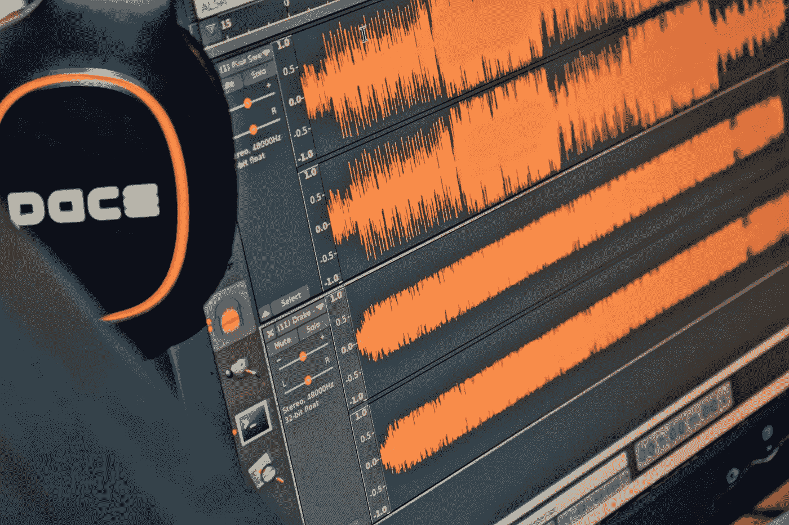
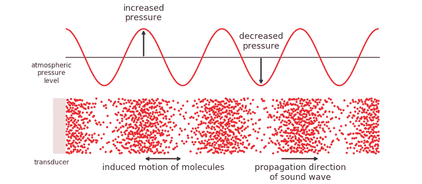
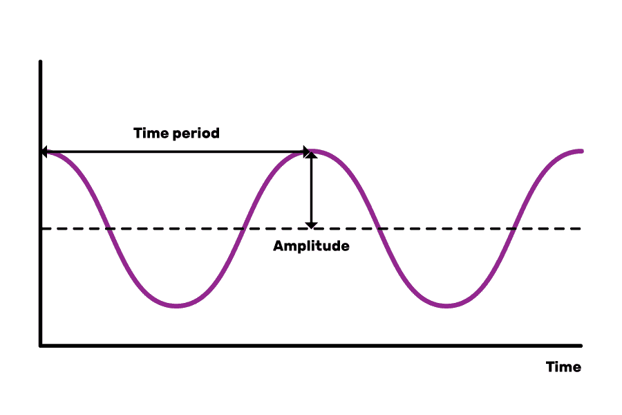

# 理解音频:什么是声音，我们如何利用它。

> 原文：<https://towardsdatascience.com/understanding-audio-what-sound-is-and-how-we-can-leverage-it-1e03d29cd7ce?source=collection_archive---------33----------------------->

## 使用人工智能和声音的物理属性来处理音频。

戈弗雷·尼安杰奇在 [Unsplash](https://unsplash.com?utm_source=medium&utm_medium=referral) 上拍摄的照片

音频无处不在。虽然音频处理已经存在了几十年，但人工智能和大数据的兴起让我们能够揭开音频的隐藏秘密，为企业和最终用户提供以前无法获得的见解。

更好地理解音频可以帮助我们在客户服务行业，让企业最大限度地提高客户满意度。情绪分析算法可以识别客户服务电话中客户的语气，并分析根本原因，使企业能够改变策略，以更好地支持他们的消费者。

另一个例子是美国宇航局的 SoundSee，该计划旨在为几个迷你机器人配备一系列麦克风，以监控国际空间站上的机器音频。使用人工智能，这些机器人识别违规行为，通知各方解决问题，充当系统故障的第一道防线。

在本文中，我们将探索声音到底是什么，如何测量它，以及如何使用人工智能来利用它。

# 那么，什么是声音呢？

简而言之，当振动的物体导致空气分子相互碰撞时，就会产生声音。这些空气分子的振荡在空气分子内产生微小的压差，这有效地产生声波。这些波也称为机械波，通过介质传播，将能量从一个位置传递到另一个位置。如果你想一想，这恰恰是为什么太空中没有声音；在真空的空间中，根本没有可以传播声音的介质。

来源:[https://www . research gate . net/figure/压力-声波-空气传播 _fig2_334784649](https://www.researchgate.net/figure/Pressure-propagation-of-a-sound-wave-through-air_fig2_334784649)

在上图中，底部的粒子图代表了声音在空气中造成的低压和高压区域。低压区域的颗粒密度较低，高压区域的颗粒密度较高。基于这种压力差，可以生成一条曲线，在具有较高气压的区域具有峰，在具有低气压的区域具有谷。

这种声波的可视化被称为波形，它提供了关于声音的大量细节，当试图从音频中提取特征时，可以利用这些细节。其中一些最基本的功能是:

## **频率**

在一个波中，周期是完成一个周期所需的时间(参考下图)。频率是周期的倒数，用 Hz 表示，转换为每秒的周期数。本质上，完成一个周期所需的时间越短，频率就越高，反之亦然。从视觉上看，波峰彼此靠近的波比波峰较远的波频率更高。

来源:[https://www . future learn . com/info/courses/presenting-data-with-images-and-sound/0/steps/53151](https://www.futurelearn.com/info/courses/representing-data-with-images-and-sound/0/steps/53151)

但是我们如何感知频率呢？

我们对频率的感知通常用声音的音高来表示。虽然频率描述了波形循环重复率的数值度量，但音高更多的是我们用来描述声音的主观术语。频率越高，声音的音高越高，频率越低，声音的音高越低。

## **强度**

就像频率一样，强度是理解声音构成的另一个重要维度。声强描述的是声音在一个区域内移动的声功率，单位是瓦特每平方米。声音的功率是声音在单位时间内传递能量的速率。简而言之，强度本质上是声音所转移的能量。

现在，就像频率一样，我们感知强度的方式更加主观。我们通常将强度较高的声音视为较响，强度较低的声音视为较柔和。然而，所有听众的音量并不一致。持续时间、频率和听者的年龄等混杂因素会影响声音的音量。

## **音色**

到目前为止，我们已经讨论了两个一维声音属性:频率和强度。与这些容易量化的属性不同，音色是一种相当神秘的声音属性，它描述了赋予声音特性的众多属性。音乐家喜欢把音色描述为声音的颜色，这是一个有趣但模糊的描述。

为了探究什么是音色，我们来看一个简单的例子。想象一个小号以和小提琴相同的音高、持续时间和强度演奏一个音符。虽然这两种声音有着大部分相同的特性，但对你我来说，这两种声音听起来明显不同。将这两种声音分开的特征的组合可以称为声音的音色。

# 从物理世界到数字世界

现在，我们对声音的物理性质及其属性有了基本的了解，我们如何利用这些属性并进行一些音频处理呢？首先，我们需要能够将音频转换成某种数字信号，其中包含操作和处理音频所需的信息。

## **麦克风的工作原理:模数转换(ADC)**

自然，所有音频都是模拟信号。模拟信号是时间与声音振幅的连续图，在每个无限小的时间单位内具有无限值。存储原始模拟信号几乎是不可能的，需要无限的存储空间。相反，我们以固定的时间间隔执行一系列操作来从模拟信号中提取值。这使得我们可以在一小部分内存中存储数字格式的信号，同时收集足够的数据来再现声音。这一过程称为模数转换(ADC)，它使用采样和量化来收集任意给定模拟信号的有限数值。

采样:采样不是收集连续模拟信号中的每个值，而是以固定的等距时间间隔提取值。音频最常见的采样速率是 44.1 kHz，即声音每秒 44，100 个值。这个采样速率最好地允许我们提取人类听觉范围内存在的所有数据值。

量化:采样侧重于沿水平轴以固定的时间间隔提取值，而量化将波形垂直轴上的值划分为一系列固定的等距值。当在给定的时间间隔选择一个值时，量化将给定时间的精确值舍入到最接近的量化值。量化值的数量也称为分辨率，以位为单位。普通的 CD 具有 16 位的位深度或分辨率，这意味着它具有 65，500 个量化值。量化期间的位深度越高，将模拟信号转换为数字信号时的动态范围就越大。

当麦克风拾取音频时，麦克风内部的振膜振动，形成模拟信号，该信号被发送到声卡。这个声卡执行 ADC，并将新生成的数字信号发送到计算机进行操作或处理。

## **利用人工智能进行音频处理**

我们知道什么是音频，以及如何将音频从物理格式转换成数字格式，但我们如何利用它做任何事情呢？虽然有各种不同的方法来处理音频，但我们将专注于人工智能如何渗透到音频领域，让我们更好地理解、增强和再现音频。

虽然我们不会详细讨论如何在音频处理中实现人工智能，但我们将讨论人工智能应用于音频的不同方式。

整体而言，人工智能是指计算机能够完成通常比一系列逻辑过程需要更高智能水平的任务。深度学习是人工智能的一个子集，模仿人脑的复杂算法本质上是从海量数据中学习。

为了让深度学习算法真正提供有价值的音频见解，我们需要访问大量的音频数据。这些数据集不仅需要很大，还需要整洁有序。大而干净的数据集与高效的人工智能算法的完美结合将为任何人工智能过程产生最佳结果。使用这些大型数据集，人工智能模型将观察这些不同声音的属性模式，如频率、持续时间、强度和音色。

## **语音识别**

目前，人工智能在音频领域最常见的用途之一是语音识别。亚马逊 Alexa、谷歌 Home 和苹果的 Siri 等个人助理都利用人工智能将一个人的语音转换为文本，理解他们请求的含义，并产生听觉响应。

## **语音/音乐合成**

语音识别只是 AI 在音频行业带来的机会的一小部分。目前，研究人员正在实现能够完全从零开始创造声音的人工智能模型。这种能力对于任何使用语音合成产生音频的文本到语音转换程序来说都是非常有用的。深度学习模型在数百小时的演讲及其抄本上进行训练。最终，他们学会了每个单词和字符听起来如何与他们的上下文相关，并能在给定一段文本时产生语音。

同样，人工智能正被用于音乐行业，在给定一组参数的情况下制作复杂的音乐作品。音乐合成的一个很好的例子是谷歌最近的 [Blob Opera](https://artsandculture.google.com/experiment/blob-opera/AAHWrq360NcGbw?hl=en) 应用程序，不管用户组织 Blob 的方式如何，它都能产生美妙的声音和声。

## **语音增强**

它不止于此。我们可以使用人工智能来智能地操纵数字音频，以改善现有的音频，满足我们的需求。例如，人工智能可以用于通过从一些音频中删除任何背景噪音或不必要的人工噪声来创建更干净的语音。音频超分辨率是音频增强的另一个方面，它允许我们通过增加保真度来显著增强低质量的音频。所有这些功能都可以改善通话过程中的音频质量，并提高录制不佳的音频的清晰度。

# 结论

今天，我们讲述了什么是声音以及声音背后的物理原理。具体来说，我们研究了声音的频率、强度和音色。理解声音和波形的属性对于构建更好的人工智能声音处理算法至关重要。

这个行业的潜力是无限的，随着越来越多的研究人员和开发人员认识到这一前景，我们可以期待在每个行业都看到人工智能音频处理。

感谢您花时间阅读本文。一如既往，我感谢您的任何意见/反馈。

最初发表于 [Audo AI](https://audo.ai/blog/my-understanding-audio-what-sound-is-and-how-we-can-leverage-it) 。