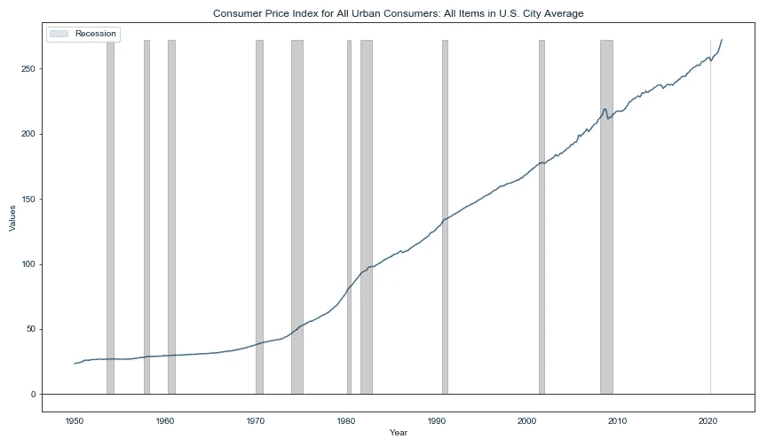
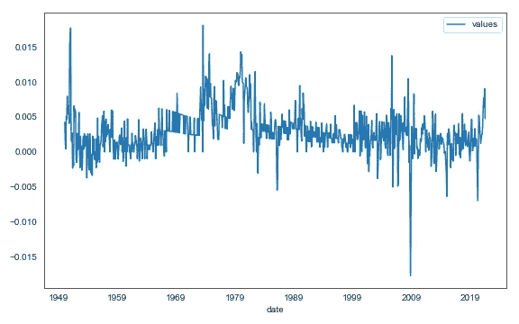
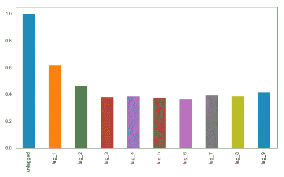
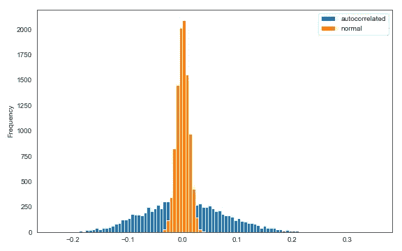
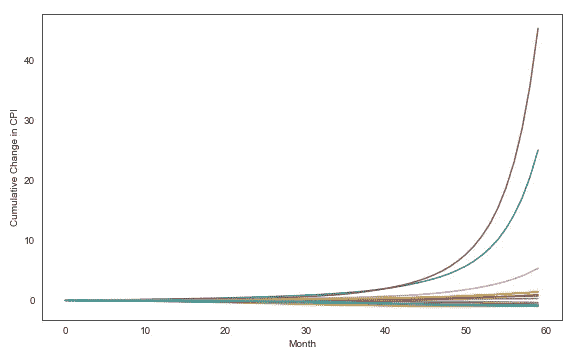
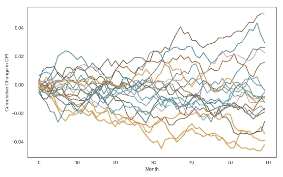

# 了解自相关

> 原文：<https://towardsdatascience.com/understanding-autocorrelation-ddce4f0a9fda?source=collection_archive---------18----------------------->


乔纳森·丹尼尔斯在 [Unsplash](https://unsplash.com?utm_source=medium&utm_medium=referral) 上拍摄的照片

## 及其对数据的影响(举例)

T4:最近我一直在处理自相关数据。在金融领域，某些时间序列(如房价或私人股本回报率)是出了名的自相关。正确考虑这种自相关对于构建稳健的模型至关重要。

一、什么是自相关？自相关是指过去的观察对当前的观察有影响。例如，如果你可以使用苹果公司上周的回报来可靠地预测其本周的回报，那么你可以说苹果公司的股价回报是自相关的。用数学术语来说:

```
y = B0 + B1*y_lag1 + B2*y_lag2 + ... + Bn*y_lagn + errorIf any of B1 to Bn is significantly nonzero, then we can say that the time series represented by y is autocorrelated.
```

# 我们为什么要关心自相关？

我想到两个原因:

1.  许多事情都是自相关的。因此，当我们试图通过构建模拟(例如经济的蒙特卡罗模拟)来研究世界时，**我们需要将自相关性考虑在内。否则我们的模型会产生错误的结果**(原因见原因 2)。
2.  自相关导致波动性被低估，尤其是在复合时。**自相关随机变量的复合乘积，即(1+r1)*(1+r2)…可以比没有自相关的随机变量具有更宽的结果分布。**

# 通货膨胀数据的例子

我们用一些实际数据来研究一下这个。我从 FRED(圣路易斯美联储银行的数据仓库)下载了一些 CPI 数据。看起来是这样的:



CPI(资料来源:圣路易斯美联储银行，图片由作者创作)

每当分析像 CPI 这样的时间序列数据时，你应该从变化率开始(使其更加平稳)。让我们这样做:

```
Here's what my raw CPI data looks like (stored in df):values
date              
1950-01-01   23.51
1950-02-01   23.61
1950-03-01   23.64
1950-04-01   23.65
1950-05-01   23.77
1950-06-01   23.88
1950-07-01   24.07
1950-08-01   24.20
1950-09-01   24.34
1950-10-01   24.50# My CPI data is stored in a dataframe called df
# The following line calculates the monthly rate of change
df_chg = (df/df.shift(1)-1).dropna()
```

结果看起来像这样(有一些明显的季节性，我们今天将忽略):



CPI 月度变化(来源:圣路易斯美联储银行，图表由作者创作)

我们可以通过观察 CPI 的月度变化与其滞后值的相关性来检查自相关性。我们可以使用移位方法来创建滞后。

```
df_chg.rename({'values': 'unlagged'}, axis=1, inplace=True)lags = 10for i in range(lags):
    if i > 0:
        df_chg['lag_'+str(i)] = df_chg['unlagged'].shift(i)
```

绘制 CPI 变化的未标记值与其各种滞后之间的相关性，我们看到存在显著的自相关性:



大量的自相关(由作者创建的图形)

# 忽略自相关，风险自负

Let’s do a quick simulation to see what happens if we ignore autocorrelation. The monthly change in inflation has a standard deviation of 0.32%. If it were a normally distributed random variable, we can annualize the 0.32% by multiplying it by the square root of 12 (because we are going from monthly to annual) — which gives us an annualized standard deviation of 1.11%. That’s a pretty low standard deviation and would imply that extreme events such as hyperinflation are virtually impossible.

The following code simulates a year’s worth of inflation 10,000 times so we can look at the difference in outcomes between including autocorrelation and ignoring it.

```
# c is the regression constant, a.k.a. the mean value
# we will set c to zero to simplify things
c = 0# List to store autocorrelated simulation results
auto_correl_list = []
# List to store normally distributed simulation results
normal_list = []# Run 10,000 scenarios
for sims in range(10000):
    # In each scenario, generate 12 months of "inflation"
    shocks = np.random.normal(0, target_vol, (12,))
    y_list = []
    # This loop takes the 12 shocks and adds autocorrelation
    for i, e in enumerate(shocks):
        if i == 0:
            y = c + betas[0]*0 + betas[1]*0 + e
            y_list.append(y)
        elif i == 1:
            y = c + betas[0]*y_list[i-1] + betas[1]*0 + e
            y_list.append(y)
        else:
            y = c + betas[0]*y_list[i-1] + betas[1]*y_list[i-2] + e
            y_list.append(y)
    # Calculate the compounded products
    auto_correl_list.append(((pd.Series(y_list)+1).cumprod()-1).iloc[-1])
    normal_list.append(((pd.Series(shocks)+1).cumprod()-1).iloc[-1])
```

Let’s take a look at the distribution of outcomes. Look at how much wider the autocorrelated version (in blue) is than the normal (in orange). The simulated standard deviation of the normal (the standard deviation of the orange histogram) is basically what we calculated earlier — 1.11%. **The standard deviation of the autocorrelated version is 7.67%, almost seven times higher.** Notice also that the means for both are the same (both zero) — autocorrelation impacts the variance but not the mean. This has implications for regression, which I will cover in a future article.



Finally, let’s talk a bit about why this occurs. **When something is autocorrelated (and the correlation coefficients are positive), it’s much more susceptible to feedback loops.** Trends tend to snowball — for example, in cases where the last few observations were high, the next observation tends to be high as well because the next is heavily impacted by its predecessors.

We can see this snowball effect by looking at a few of the individual paths from our CPI simulation (this time simulated out to 60 months instead of just 12). In the autocorrelated version, once things get out of hand, it tends to stay that way, either going to the stratosphere or to -100%.



Feedback loops can produce extreme results (Graphic created by author)

The normal version of our CPI simulation fails to capture this snowball effect and therefore understates the range of possible outcomes:



Assuming no autocorrelation understates volatility (Graphic created by author)

Which is closer to reality? My autocorrelated simulation definitely overstates the likely range of outcomes for inflation — it’s a simple simulation that fails to account for some of inflation’s other properties such as mean reversion. But without autocorrelation, you would look at your simulation results and assume that extreme phenomena like hyperinflation or persistent deflation are statistical impossibilities. That would be a grave mistake.

[***If you liked this article and my writing in general, please consider supporting me by signing up for Medium via my referral link here. Thanks!***](https://tonester524.medium.com/membership)