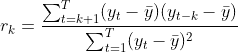
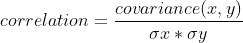
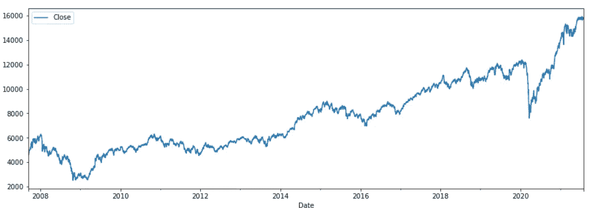
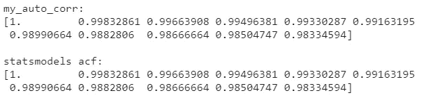
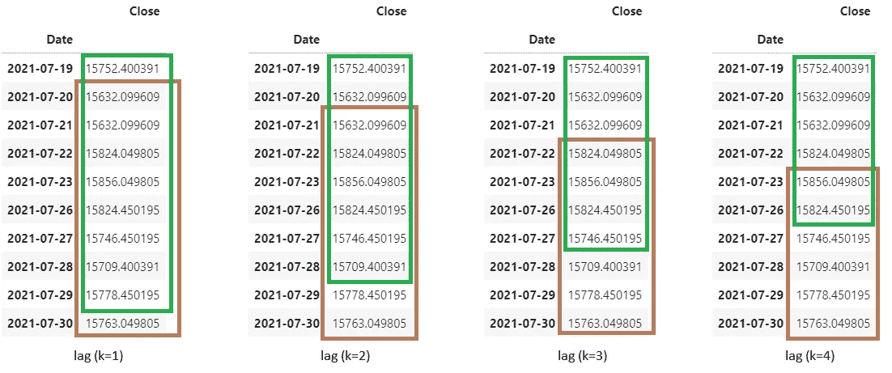

# 理解时间序列分析中的自相关

> 原文：<https://towardsdatascience.com/understanding-autocorrelation-in-time-series-analysis-322ad52f2199?source=collection_archive---------6----------------------->

## 对于初学者来说，理解自相关是如何工作的是非常重要的，这样可以使他们的时间序列分析之旅更加容易。

克里斯·利维拉尼在 [Unsplash](https://unsplash.com/s/photos/stock-market?utm_source=unsplash&utm_medium=referral&utm_content=creditCopyText) 上的照片

两年前我开始了我的时间序列分析之旅。最初，我开始通过 YouTube 视频学习，在那里我遇到了自相关，这是时间序列分析的一个基本概念。根据一些视频，自相关的定义是时间序列与其先前版本的关系/相关性。很少有人说，因为我们需要两个变量来计算相关性，但在一个时间序列中我们只有一个变量，我们需要计算时间序列与其自身第 k 个滞后版本的相关性。

## **什么是第 k 个滞后？**

这是我想到的第一个问题。随着我的继续，我知道了一个有第 k 个滞后的时间序列(y)是它在时间上落后第 t-k 个周期的版本。具有滞后(k=1)的时间序列是原始时间序列在时间上落后一个周期的版本，即 y(t-1)。

这些视频大多以股票市场每日价格为例来解释时间序列分析。这些价格每天都有记录。他们解释说，股票价格的自相关性是当前价格与过去“k”个时期价格的相关性。所以，具有滞后(k=1)的自相关是与今天的价格 y(t)和昨天的价格 y(t-1)的相关性。类似地，对于 k=2，计算 y(t)和 y(t-2)之间的自相关。

## **现在主要问题来了**

我们如何计算今天的价格与昨天的价格的相关性(甚至协方差)？因为相关性只能在具有多个值的变量之间计算。如果我试图计算两个单值之间的相关性，我会得到一个“NaN”。另外，这两个变量必须有相同的长度(值的个数)，所以，我甚至不能计算 y(起点到 t)和 y(起点到 t-1)之间的相关性。

然后，我开始寻找自相关的理论解释，偶然发现了如下所示的自相关公式。

作者图片

作者图片

# **理解公式**

*   自相关公式与相关公式相似(但不完全相同)。
*   分子类似于时间序列的当前版本和滞后版本之间的协方差(但没有“N-1”作为分母)。对分子的两个组成部分进行更仔细的检查表明，从它们中减去的是原始时间序列的平均值，即 mean(y)，而不是分别减去 mean(y(t))和 mean(y(t-k))。这使得公式的分子与协方差有点不同。
*   分母类似于原始时间序列的标准差(也称为方差)的平方(但没有“N-1”作为分母)。

**让我们来回答这个问题，如何计算自相关？通过用 Python 实现它**

我们将使用 Nifty(跟踪 50 只股票的印度股票指数)从 2007 年 9 月 17 日到 2021 年 7 月 30 日的收盘价数据。这些数据以 csv 格式从雅虎财经下载。我们将首先为时间序列分析准备数据。

俏皮的时间序列情节(作者图片)

我们将定义一个名为“autocorr”的函数，通过将时间序列数组和第 k 个滞后值作为输入，返回单个滞后的自相关(acf)。此函数将嵌套在另一个名为“my_auto_corr”的函数中，该函数通过调用“autocorr”函数来计算每个滞后值的 acf，从而返回滞后[k，0]的 acf。

让我们通过传递‘nifty’时间序列数据帧和 nlags=10 作为参数来调用‘my _ auto _ corr’函数。我们还将比较' my_auto_corr '函数和' statsmodels '的' acf '方法的输出。

作者图片

“my_auto_corr”的结果与“statsmodels”的“acf”方法的结果相同。让我们再来看一下我们之前看到的自相关公式，并试着去理解它。

作者图片

*   分母非常简单，它类似于原始时间序列的方差，但分母中没有“N-1”。**它在代码中用‘分母’变量来表示。**
*   如前所述，分子类似于时间序列的当前版本和滞后版本之间的协方差(没有 N-1 作为分母)。让我们来了解一下如何计算分子。

作者图片

*   **棕色**矩形代表分子第一部分的 **y(t)** 。从原始时间序列的平均值中减去 **mean(y)** 。**第一部分由公式中的代码& y(t)-mean(y)中的‘分子 _ P1’表示。** y(t)固定在底部，滞后(k)每增加一个单位，其顶部向下移动 1。
*   同样，**绿色**矩形代表分子第二部分的 **y(t-k)** 。它也是从原始时间序列的平均值中减去的， **mean(y)。第二部分由代码& y(t-k)中的‘分子 _ p2’——公式**中的均值(y)表示。y(t-k)在顶部是固定的，滞后(k)每增加一个单位，其底部就向上移动 1。

然而，正如我们前面看到的，公式的分子与协方差并不完全相同。然而，分母类似于原始时间序列的方差，但分母中没有“N-1”。因此，计算棕色和绿色矩形的协方差并除以原始时间序列的方差并不能得到自相关系数。

将自相关公式分解成片段并在 Python 中实现有助于我们更好地理解它。我们看到了分子中的协方差是如何在时间序列的当前版本和滞后版本之间计算的。因此，为了更好地理解一个概念，无论是机器学习算法还是统计学中的一个概念，了解其本质是很重要的。