# 理解反向传播

> 原文：<https://towardsdatascience.com/understanding-backpropagation-abcc509ca9d0?source=collection_archive---------5----------------------->

## 允许神经网络学习的方程的可视化推导

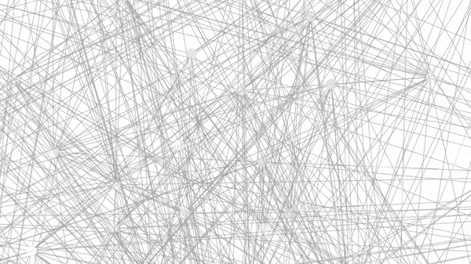

(图片由作者提供)

在最基本的情况下，神经网络获取输入数据并将其映射到输出值。无论你看的是图像、文字还是原始的数字数据，网络看到的都是数字，它只是在这些数字中寻找模式。输入数据通过权重矩阵进行过滤，权重矩阵是网络的参数，其数量可以是数千到数百万或数十亿。微调这些权重以识别模式显然不是任何人想做或能做的任务，因此设计了一种方法来做这件事，几次，但最著名的是在 1986 年[1]。该方法采用神经网络输出误差，并通过网络反向传播该误差，确定哪些路径对输出具有最大影响。这当然是反向传播。

反向传播识别出哪些路径对最终答案更有影响，并允许我们加强或削弱连接，以达到预期的预测。这是深度学习的一个基本组成部分，它总是会在你选择的包中为你实现。所以你真的可以在一无所知的情况下创造出令人惊叹的东西。同样徒劳的是，你也可以像我们许多人一样驾驶你的汽车，而丝毫不知道发动机是如何工作的。你不必去想它，仍然可以毫无问题地驾驶……直到你在路边抛锚。那你肯定希望你能明白引擎盖下发生了什么。

那辆坏掉的车，或者用现在的比喻来说，坏掉的模型把我带到了这一步。我需要理解，所以我开始挖掘，快速的维基百科搜索很快揭示了神经网络如何学习的内部工作原理:

> 本质上，反向传播将成本函数的导数的表达式评估为从左到右的每层*之间的导数的乘积——“向后”——每层之间的权重梯度是部分乘积的简单修改(“向后传播误差”)。"*

你说什么？我喜欢维基百科，但这是一个严重的拗口。很快就变得很清楚，反向传播不是一个简单的概念，确实需要一些认真的努力来消化将扔给你的概念和公式。虽然在你亲自动笔之前，你永远不会完全理解某些东西，但这里的目标是提供一种资源，使这样一个至关重要的概念更容易被那些已经在使用神经网络并希望“在引擎盖下达到顶峰”的人所理解。基本面不应该隐藏在公式的面纱后面，如果只是以一种连贯的方式呈现，将呈现一个路线图，而不是一个路障。

在理解反向传播的情况下，我们得到了一个方便的视觉工具，实际上是一张地图。这张地图将直观地引导我们完成推导，并把我们带到最终目的地，反向传播公式。我所指的图是神经网络本身，虽然它不遵循与计算图相同的约定，但我将以大致相同的方式使用它，并将它称为计算图，而不是图，以将其与更正式的图结构区分开来。这种视觉方法只有在读者能够看到过程发生时才真正受到启发，在一系列步骤中写下来会遇到常见的陷阱，即生成一大堆公式，其中的联系不是立即可见的，读者会不知所措。需要说明的是，我们最终仍然会得到许多公式，这些公式本身看起来令人生畏，但是在观察了它们演化的过程之后，每个公式都应该是有意义的，事情变得非常系统化。

这里用来传达这种视觉信息的工具是 manim，这是一个数学动画库，由来自 3Blue1Brown YouTube 频道的 Grant Sanderson 创建。我还必须从他的神经网络系列的网络类中使用一些代码。如果你不熟悉他的频道，帮自己一个忙，去看看吧( [3B1B 频道](https://www.youtube.com/channel/UCYO_jab_esuFRV4b17AJtAw))。虽然 manim 是我选择的工具，但它不是最容易的，在某种程度上介于“我已经走得太远了，现在不能停下来”和“我已经超出了我的能力范围”之间。我可能后悔这个决定，但我们在这里。如果你刚开始学习神经网络和/或需要复习前向传播、激活函数之类的东西，请参见[参考中的 3B1B 视频。[2](https://www.youtube.com/watch?v=aircAruvnKk&list=PLZHQObOWTQDNU6R1_67000Dx_ZCJB-3pi&index=1&t=165s) 获得一些立足点。一些微积分和线性代数也会对你有很大的帮助，但是我试着解释一些基本的东西，所以希望你仍然掌握基本的概念。虽然用代码实现神经网络对理解有很大的帮助，但是你可以在没有真正理解它的情况下很容易地实现反向传播算法(至少我是这样做的)。相反，这里的重点是详细了解反向传播实际上在做什么，这需要理解数学。

## 网络和符号

使用一个简化的模型来说明概念，以避免过程过于复杂。使用了一个 2 输入、2 输出、2 隐藏层网络，如图 1 所示。输出节点用表示误差的 *e* 表示，尽管你也可以看到它们通常用 C 表示成本函数。这通常是一个函数，如均方误差(MSE)或二进制交叉熵。 *E* 节点是 *e* ₁和 *e* ₂.的总误差或总和与典型的神经网络布局相比，这里的主要区别在于，我已经明确地将隐藏节点分成两个独立的函数，加权和( *z* 节点)和激活( *a* 节点)。这些通常被分组在一个节点下，但是为了更清楚，这里需要单独显示每个功能。我假设我们一直在处理一个训练示例，实际上，您必须对训练集中的所有训练示例进行平均。

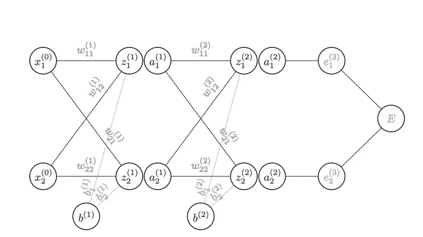

图 1:示例神经网络设置(图片由作者提供)

现在，成功的一半是把符号弄清楚。图 2 显示了示例网络中节点和权重的符号。上标表示层，下标表示节点。

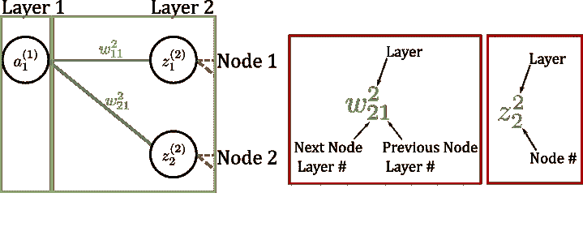

图 2:索引符号(作者图片)

权重下标索引可能会向后显示，但在我们构建矩阵时会更有意义。以这种方式索引允许矩阵的行与神经网络的行对齐，并且权重索引符合典型的(行、列)矩阵索引。

在我们开始数学之前，最后说明一下，为了传达推导的视觉本质，我使用了 GIF。有时你可能想停止或放慢一个动画，GIF 显然不是理想的，所以也请参见附带的 [YouTube 视频](https://youtu.be/9d2fwGjyb4M)以更好地控制速度。

## 最终层方程

反向传播的最终目的是找到误差相对于网络中权重的变化。如果我们在寻找一个值相对于另一个值的变化，那就是导数。对于我们的计算地图，每个节点代表一个函数，每个边在连接的节点上执行一个操作(乘以权重)。我们从错误节点开始，一次向后移动一个节点，取当前节点相对于前一层中的节点的偏导数。每一项都链接到前一项上以获得整体效果，这当然是链式法则。

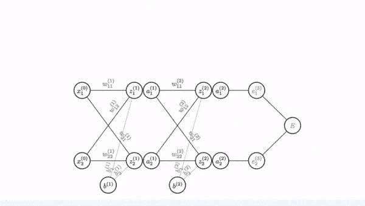

图 3:追踪 w11 的地图错误(图片由作者提供)

注意:该层上的权重仅影响₁*e*或₂*e*中的一个输出，因此在最终方程中仅出现相关误差。

在图 4 中，对从错误节点到最终层中每个权重的每条路径都进行了这种边和节点的追踪，并快速通过该路径。

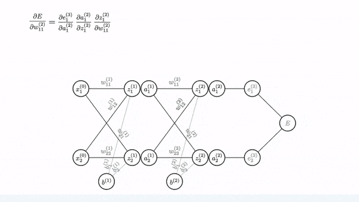

图 4:追踪最终图层中剩余权重的地图(图片由作者提供)

在这一点上，我们现在有一堆公式，如果我们不做一些簿记工作，这些公式将很难保持跟踪。这意味着将术语放入矩阵中，这样我们可以更容易地管理/跟踪术语。图 5 显示了术语是如何分组的，值得注意的是 Hadamard 运算符的使用(圆圈内有一个点)。这用于元素式矩阵乘法，有助于简化矩阵运算。

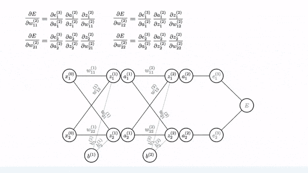

图 5:将术语排列成矩阵(图片由作者提供)

矩阵符号的最终方程如图 6 所示，我用大写字母表示变量的矩阵/向量形式。右边的前两项被重新分解为一个 delta 项。当我们追踪前面的层时，这些项会重复出现，因此计算一次并将其存储为 delta 变量以备将来使用是有意义的。

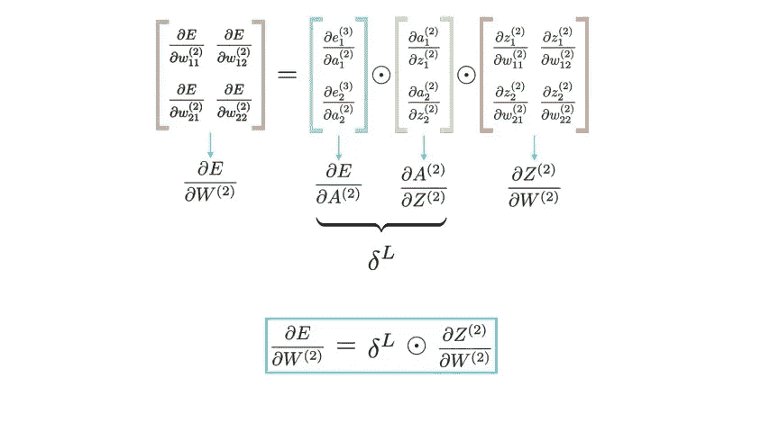

图 6:最终图层的最终矩阵(图片由作者提供)

## 更深层

对于更深的层，同样的方法适用于两个关键的更新:1)增量项再次出现在后面的层中，因此我们将进行适当的替换；2)现在从总误差节点到感兴趣的权重将有两条路径。当多个分支汇聚在一个节点上时，我们将添加这些分支，然后继续乘以剩余的函数链。图 7 显示了第一层权重之一的过程。

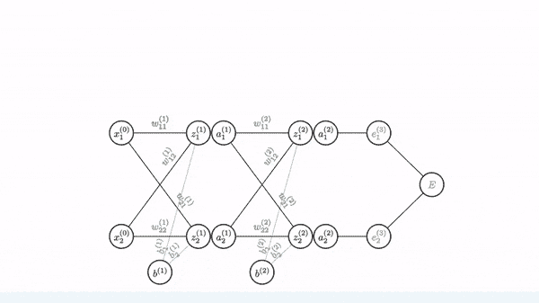

图 7:第一层链规则示例(图片由作者提供)

现在，如果我们仔细观察，您会注意到重复的项，图 8 回顾了以前的层方程以及我们当前的 *w₁₁* 方程，并显示了哪些项是重复的，并将它们作为 delta 因子。

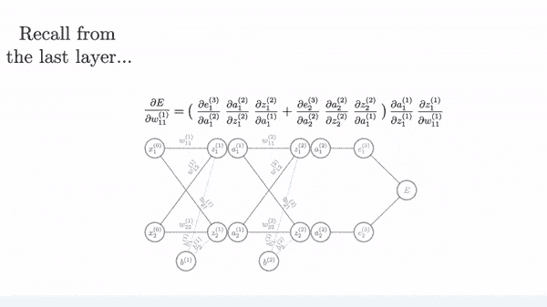

图 8:在最后一层和前一层计算中找到相似的项，并将其分解为增量项(图片由作者提供)

所有后续等式都遵循相同的方法。因为这变得相当重复，并且因为我只能把这么多的长度塞进 GIF，所以在图 9 中对所有剩余的权重快速重复这个过程。

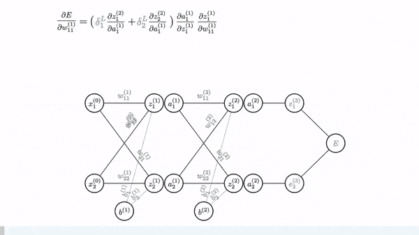

图 9:第一层剩余的渐变计算(不要眨眼)

我们又一次有了一大堆公式，我们将通过把它们输入矩阵来整理它们。一般分组遵循与第一层相同的模式。

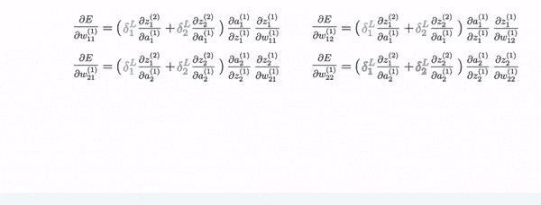

图 10:第一层的矩阵分组(作者图片)

最左边的矩阵当然可以进一步分解，我们需要单独的 delta 值，这样我们就可以简单地插入从前一层计算的值。现在，按照图 11，您必须回忆点积，它是行乘以列，所以我们还添加了一个转置到 delta 项。

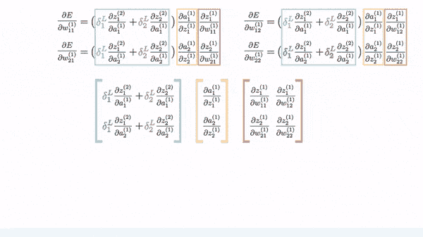

图 11:分解增量并最终确定矩阵公式(图片由作者提供)

添加矩阵符号给出最终公式

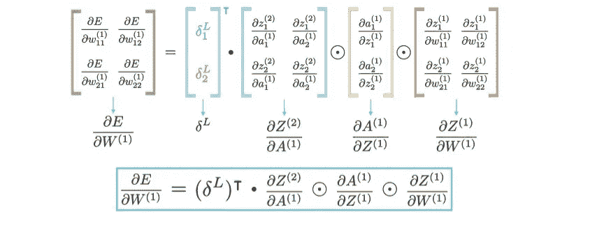

图 12:第一层的最终矩阵方程(图片由作者提供)

现在，无论激活函数是什么，图 12 中的一些导数项都是相同的。由边连接的节点产生线性输出，然后将其馈送到激活函数以引入非线性。给定函数的线性性质，找到节点函数相对于前一节点的导数是简化的，并且可以直观地确定。取 *dz/da* 项，这个导数告诉我们输出( *z* ₁)相对于输入、 *a* ₁.如何变化这些功能只通过边缘*w*₁₁*连接，所以权重是唯一的方式，其中 *a* ₁可以改变 *z* ₁也就是 *dz/da* = *w* ₁₁.图 13 表示由边连接的节点，并将边值代入矩阵作为导数项的解。*

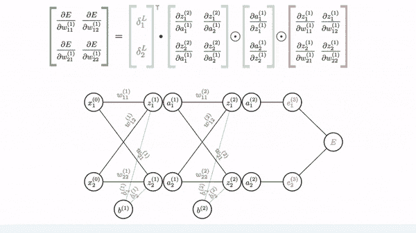

图 13:节点之间连接的可视化指示和结果衍生(图片由作者提供)

对于 *dz/dw* 来说也是类似的情况。在这种情况下，导数是相对于边而不是节点的，但同样的逻辑成立，只有一个通过边连接的函数影响 *z* 节点，那就是输入(我将它标记为 x⁰，但也可以标记为 a⁰).然后，导数解可以代入图 14 的矩阵方程。

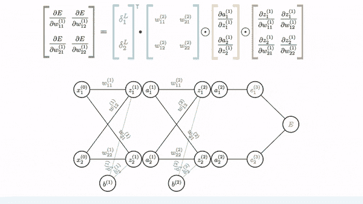

图 14:第一个节点和输入层之间连接的可视化指示，以及将导数解代入矩阵方程的结果(图片由作者提供)

我们终于有了最终层和初始层的方程。

图 15:两层网络的最终方程(图片由作者提供)

## 广义方程

如果你在阅读迈克尔·尼尔森的优秀在线书籍[3]，他会像 3B1B [4]一样注意到一些更通用的等式。这里的方程同样可以进一步推广。这里，上标 1 表示当前层( *l)* ，上标 0 表示前一层 *(l-1)* 。顶部等式中的上标 2 指的是下一层( *l+1* ),而在底部等式中，它指的是最后一层(L)…或者只看图 16 中的替换。

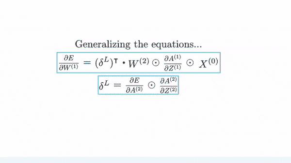

图 16:推广任意层深的方程(图片由作者提供)

## 偏见

尽管跳过偏见并告诉你这很简单并且是从上面得出的很有诱惑力，但看到它至少被解决一次确实很有帮助。因此，我将在图 17 中介绍一个例子。

图 17:描绘出一个偏向梯度(图片由作者提供)

如你所见，过程是一样的。需要注意的重要一点是，对于给定的层，除了最后一项，所有的项都与我们刚刚找到的关于给定权重的方程相同。最后一项只是偏差，其值为 1(偏差权重项用于调整偏差)。这使我们能够相对容易地简化和推广偏置方程，如图 18 所示。

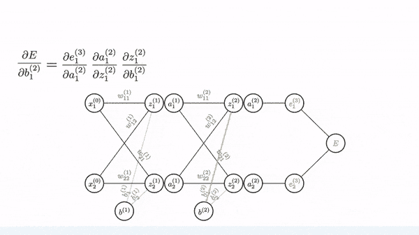

图 18:归纳偏见术语(作者图片)

将所有方程组合起来，我们就得到矩阵形式的最终广义方程组。

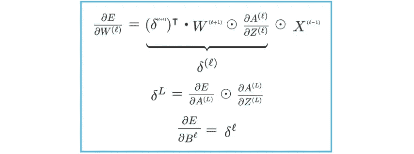

图 19:最终的反向传播方程(图片由作者提供)

## 结束语

如果一张图片胜过千言万语，那么一打以上的 GIF 肯定更有价值(或者你可能再也不想看到另一张 GIF 了)。我真的希望这有助于阐明一个棘手的概念。如果你喜欢这个，我希望很快会有更多的内容。这篇文章实际上是我的原始项目的一个迂回，我的原始项目是建立一个单一的拍摄对象探测器，在几个点上打破了导致我进入这个兔子洞。

与本文相关的其他资源:

*   [Github 链接到源代码](https://github.com/BrentScarff/Backprop-Animation)
*   随行的 [YouTube 视频](https://youtu.be/9d2fwGjyb4M)

## 参考

[1] D. Rumelhart，G. Hinton 和 R. Williams，[通过反向传播错误学习表征](https://www.nature.com/articles/323533a0) (1986)，自然

[2] G. Sanderson，[但是什么是神经网络呢？深度学习，第一章](https://www.youtube.com/watch?v=aircAruvnKk&list=PLZHQObOWTQDNU6R1_67000Dx_ZCJB-3pi&index=1&t=165s) (2017)，3Blue1Brown

[3] M. Nielsen，[神经网络与深度学习—第二章](http://neuralnetworksanddeeplearning.com/chap2.html#proof_of_the_four_fundamental_equations_(optional))，决心出版社 2015

[4] G. Sanderson，[反向传播微积分——深度学习，第 4 章](https://www.youtube.com/watch?v=tIeHLnjs5U8&list=PLZHQObOWTQDNU6R1_67000Dx_ZCJB-3pi&index=4&t=70s) (2017)，3Blue1Brown

[贝多芬定理](https://www.youtube.com/channel/UCxiWCEdx7aY88bSEUgLOC6A)是我用过的一个 YouTube 频道，里面有很多关于使用 Manim 的有用视频。