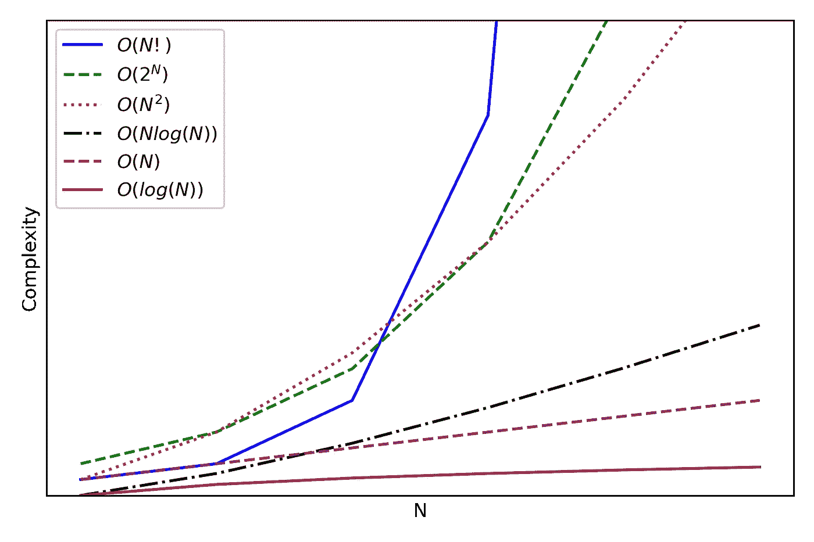

# 为数据科学家理解大 O 符号

> 原文：<https://towardsdatascience.com/understanding-big-o-notation-for-data-scientists-b892bc00e1e8?source=collection_archive---------20----------------------->

## 包含 Python 示例和练习


伯纳德·赫曼特在 [Unsplash](https://unsplash.com?utm_source=medium&utm_medium=referral) 上的照片

由于数据科学被描述为数学、领域知识和计算机科学的交叉点，**大 O 符号**在计算机科学中是一个非常重要的概念。理解它将有助于我们开发更有效的算法，优化速度和内存，这在我们处理越来越多的数据时是最基本的。

在本文中，我们首先定义大 O 符号，以及它如何描述时间和空间复杂性。然后，我们研究不同的情况，并为每种情况导出大 O 符号。最后，我们建议你做一些练习来练习你的学习。

# 定义大 O 符号

大 O 符号是一个数学表达式，描述了当算法的自变量趋向于一个非常大的数时算法的效率。

它用于描述给定函数的时间和空间复杂度。

时间复杂度是一个描述函数运行时间的概念:函数完成任务需要多长时间。评估时间复杂度要考虑的重要因素可以是数组的长度、进行比较的次数或者必须调用递归函数的次数。

空间复杂度描述了运行函数必须分配的内存量或空间。评估空间复杂性时要考虑的重要因素还有数组的长度、声明的变量数量、数据结构的副本数量等。

大 O 符号常用来描述预期情况的最坏情况。我们很少关心最好的情况。

例如，考虑数组排序的时间复杂度。最好的情况是我们排序的每个数组都已经排序了！这样一来，数组有多大就无关紧要了。这样，时间复杂度与数组的大小无关，记为 O(1)。然而，知道这一点并不是很有用，因为如果所有的输入数组都已经排序了，我们很少需要开发排序算法。

让我们通过一个简单的例子来获得对大 O 符号的直觉。

## 获得大 O 符号的直觉

考虑以下情况:你住在离杂货店 5 分钟路程的地方，你把每样东西都装进了自己的袋子里。

现在，假设你有一个特别大的购物清单，并决定在一天内买下清单上的所有东西。时空复杂度是多少？

知道你住的地方离杂货店只有 5 分钟的路程，无论你买了多少东西，你都要花 5 分钟的时间去拿你的杂货。如果你买了一盒牛奶，那么你需要 5 分钟把它带回家。如果你买了 10 盒牛奶，你仍然需要 5 分钟才能把它带回家。因此，所花费的时间与你购买的商品数量无关。因此，时间复杂度表示为 O(1)。

空间复杂度呢？在这种情况下，您将每件物品打包在自己的袋子中，这意味着一个袋子只能装一件物品。因此，随着你购买的物品越来越多，你需要的袋子数量会线性增加:1 件物品需要 1 个袋子，3 件物品需要 3 个袋子，10 件物品需要 10 个袋子，以此类推。因此，空间复杂度被表示为 O(N)，其中 *N* 是你在杂货店购买的商品数量。

# 可视化空间和时间复杂性

既然我们对如何得到大 O 符号有了直觉，让我们看看不同的表达式是如何相互比较的。下图显示了随着 *N* 的增加，一些常见的大 O 符号。



图片由作者提供。我们可以看到 O(N！)绝对是复杂度最差的场景，因为当 N 变大时，复杂度会迅速增加。另一方面，与其他情况相比，O(log(N))保持相对平坦。

看上面的图，我们可以看到我们是多么希望避免复杂度为 O(N！)，因为当 N 变大时它迅速增加。

您可能还会注意到图中没有 O(1)。这是因为很难在避免错误结论的同时确定界限。原因是 O(1)不一定意味着比 O(N)或 O(log(N))好。它只是表示一条平坦的线，因此它不会随 N 增加。但是，O(1)可能比 O(N)或 O(log(N))慢。

因此，我们可以改进我们对大 O 符号的定义，并将其解释为时间和空间复杂度的**增长率**。

# 大 O 符号杂集

在进入例子和练习之前，这里有各种大 O 符号的提示、技巧和约定。

## 我们不关心 N 的倍数

如果我们把一个函数的复杂度评估为 O(2N)，那么它等价于 O(N)。同样，O(5N)变成 O(N)。记住，大 O 符号描述了时间和空间的复杂性是如何扩展的。因此，我们可以放心地忽略 n 的任何倍数。

## 删除非主导术语

假设我们有 O(N + N)。从上图中，我们知道 O(N)的伸缩速度比 O(N)快得多。因此，O(N + N)等价于 O(N)，因为当 N 较大时，O(N)的贡献与 O(N)相比将是最小的。

什么 O(N + log(N))？再一次，我们看上面的图，看到 O(N)是主导项，因为它比 O(log(N))增加得更快。因此，O(N + log(N))等价于 O(N)。

## 什么时候做加法和乘法？

当操作必须一个接一个地进行时，我们增加了复杂性。考虑下面的代码:

```
def some_func(a: list, b: list) -> None:
    for each_a in a:
        print(each_a)
    for each_b in b:
        print(each_b)
```

我们看到`some_func`首先遍历数组`a`，然后遍历数组`b`。这样，时间复杂度为 O(A + B)，其中 A 是数组`a`的长度，B 是数组`B`的长度。

现在，当函数必须为每个操作执行一个任务时，我们增加了复杂性。这通常发生在嵌套的 for 循环中。

```
def nested_some_func(a: list, b:list) -> None:
    for each_a in a:
        for each_b in b:
            print(each_a, each_b)
```

这里，`nested_some_func`有一个嵌套的 for 循环，为`a`的每个元素打印`b`的每个元素。所以时间复杂度相乘，表示为 O(A * B)，其中 A 是数组`a`的长度，B 是数组`b`的长度。

## 我们什么时候看到 O(log(N))？

当问题空间在每次迭代中减半时，O(log(N))的复杂度是常见的。例如，二分搜索法的时间复杂度为 O(log(N))。

## 递归函数的复杂性

递归是一个概念，在这个概念中，一个问题通过一个较小问题的迭代来解决。以下列计算整数阶乘的函数为例:

```
def factorial(x: int):
    if x < 0:
        raise ValueError('Integer must be greater than or equal to 0')
    elif x == 0:
        return 1
    elif x == 1:
        return 1
    else:
        return (x * factorial(x-1))
```

假设我们想计算`factorial(3)`，那么这个递归函数会做:

*   3 * 2!
*   3 * 2 * 1!
*   3 * 2 * 1 = 6

那么这里的时间复杂度是多少呢？在本例中，该函数运行了 3 次。因此，我们看到了整数和函数运行次数之间的线性关系。因此，时间复杂度为 O(N)。

我们现在准备着手做一些练习。

# 练习

花点时间通读每个函数，在向下滚动并查看解释之前，尝试自己找出时间复杂度的大 O 符号。

## 练习 1

```
def foo(a: list) -> None:
    for each_a in a:
        print(a)
    for each_a in a:
        print(a)
```

**回答**:我们对同一个数组迭代两次，得到 O(2N)，相当于 O(N)。

## **练习二**

```
def foo(a: int) -> bool:
    if a > 0:
        return True
    else:
        return False
```

**回答**:这是一个简单的 if 语句。所以它的时间复杂度不成比例，所以是 O(1)。

## 练习 3

```
def foo(a: list) -> None:
    for i in a:
        for j in a:
            print(i, j)
```

**答**:我们在同一个数组上有一个嵌套的 for 循环。因此，它是 O(N)。您可以更精确地说 O(A)，其中 A 是数组的长度`a`。

## 练习 4

```
def is_prime(x: int) -> bool:
    i = 2
    while (i**2 <= x):
        if x % i == 0:
            return False
        i += 1
    return True
```

回答:我们来考虑一下例子`is_prime(9)`。该函数将执行以下操作:

*   2 小于 9 和`9 % 2 != 0`。因此，我们将`i`增加到 3。
*   3 是 9，所以这是最后一次检查。`9 % 3 == 0`，所以 9 是质数，函数返回`True`。

那`is_prime(11)`的案子呢？

*   2 小于 11 和`11 % 2 != 0`。所以我们将`i`增加到 3。
*   3 小于 11 和`11 % 3 != 0`。所以我们将`i`增加到 4。
*   4 大于 11。因此，11 是质数，函数返回`True`。

我们应该看到在最坏的情况下，当`i`达到`x`的平方根时，我们如何停止检查。因此，时间复杂度为 O(sqrt(N))。

# 摘要

大 O 符号是一个数学表达式，它描述了算法的效率随着其参数的增加而变化的速率。

它用来表达时间和空间的复杂性。

空间复杂度与一个功能需要分配的内存有关。时间复杂度与完成一项功能所需的时间有关。

我希望这篇短文能帮助你更好地理解大 O 符号的概念。虽然在最初的几个问题中它可能看起来模糊不清，但是随着你练习更多的问题，它会逐渐变得清晰。

干杯🍺！

*来源:破解编码访谈——盖尔·拉克曼·麦克道尔*