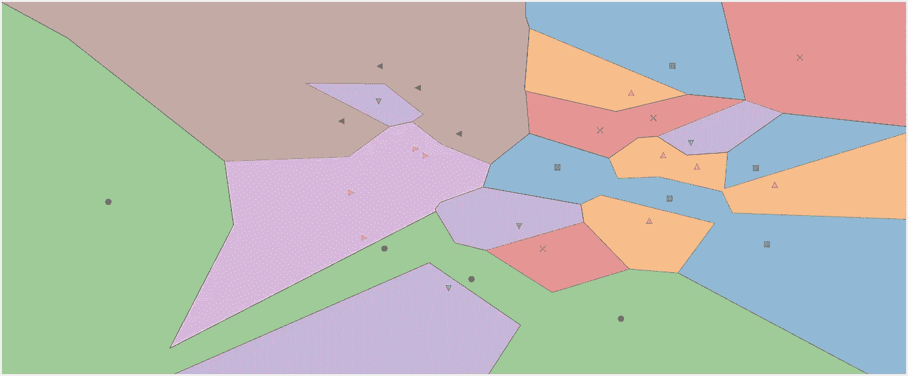
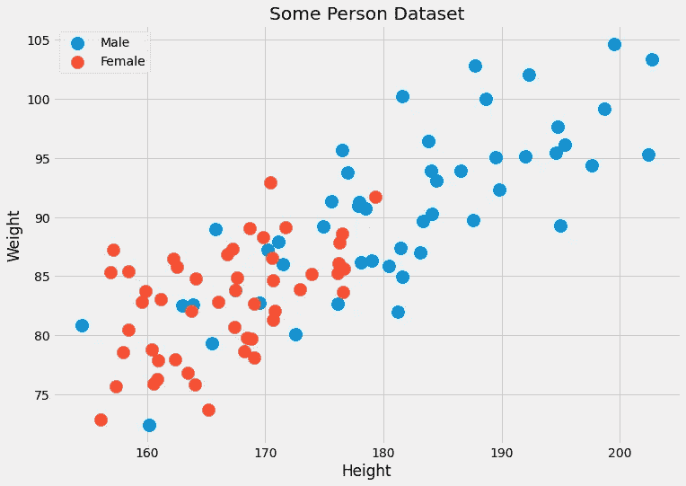
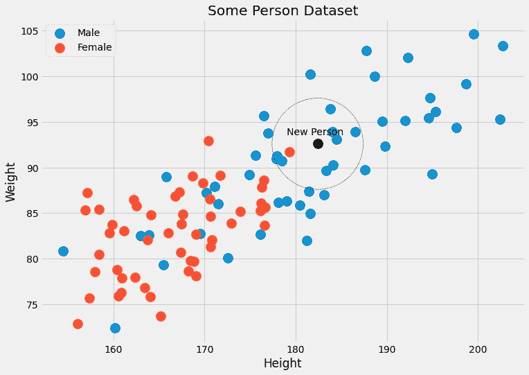
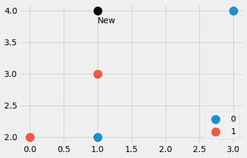
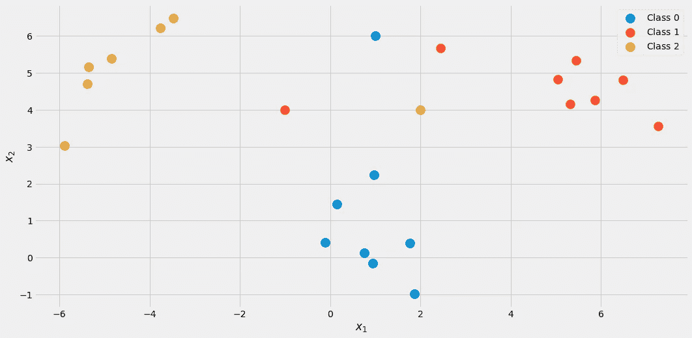
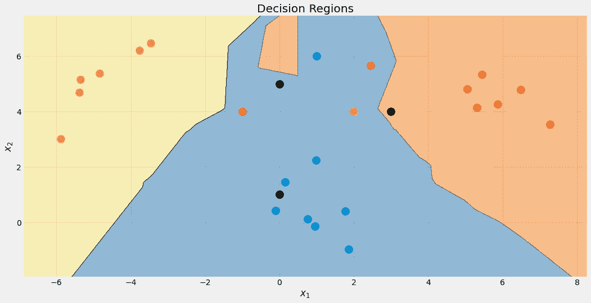
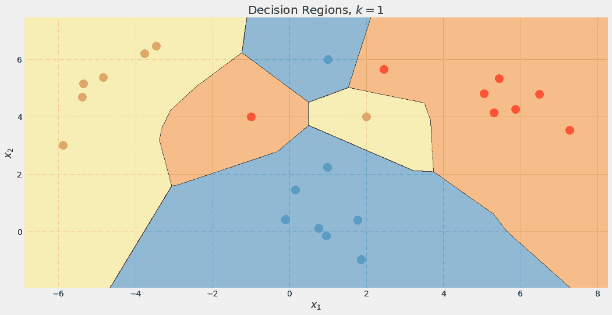
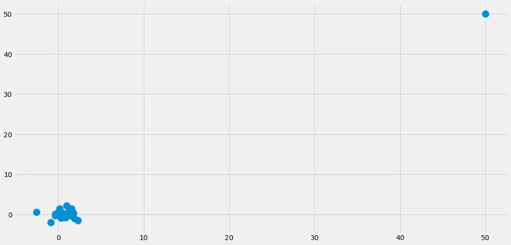

# 通过实现来理解:k-最近邻

> 原文：<https://towardsdatascience.com/understanding-by-implementing-k-nearest-neighbors-469d6f84b8a9?source=collection_archive---------31----------------------->

## 建立你自己的模型

## 了解 k-最近邻分类器的工作原理并在 Python 中实现它



1-最近邻分类器的判定区域。图片由作者提供。

A 第二天，另一个经典算法:*k*-最近邻居。像[朴素贝叶斯分类器](/learning-by-implementing-gaussian-naive-bayes-3f0e3d2c01b2)一样，这是解决分类问题的一个相当简单的方法。该算法非常直观，并且具有无与伦比的训练时间，这使得它成为您刚刚开始机器学习生涯时学习的绝佳候选。话虽如此，但做出预测是极其缓慢的，尤其是对于大型数据集。由于[维数灾难](https://en.wikipedia.org/wiki/Curse_of_dimensionality)，具有许多特征的数据集的性能可能也不是压倒性的。

在本文中，您将了解到

*   k 最近邻分类器的工作原理
*   为什么它被设计成这样
*   为什么它有这些严重的缺点，当然，
*   如何用 NumPy 在 Python 中实现？

因为我们将以 scikit learn-conform 的方式实现分类器，所以也值得看看我的文章[构建您自己的定制 scikit-learn 回归](/build-your-own-custom-scikit-learn-regression-5d0d718f289)。然而，scikit-learn 的开销很小，无论如何您都应该能够跟上。

> *你可以在* [*我的 Github*](https://github.com/Garve/TDS/blob/main/TDS%20-%20KNN.ipynb) *上找到代码。*

# 理论

这个分类器的主要思想非常简单。它直接来源于分类的基本问题:

> 给定一个数据点 x，x 属于某类 c 的概率是多少？

在数学的语言中，我们搜索条件概率*p*(*c*|*x*)。虽然[朴素贝叶斯分类器](/learning-by-implementing-gaussian-naive-bayes-3f0e3d2c01b2)试图使用一些假设直接模拟这种概率，但还有另一种直观的方法来计算这种概率——概率的频率主义观点。

## 对概率的天真看法

好吧，但这是什么意思呢？让我们考虑下面这个简单的例子:你掷出一个六面的、可能有作弊的骰子，想要计算掷出六的概率，即 *p* (掷骰数 6)。如何做到这一点？嗯，你掷骰子 *n* 次，写下它显示 6 的频率。如果你见过数字六 *k* 次，你说在 *k* / *n* 左右看到六的概率是**。这里没什么新奇的东西，对吧？**

现在，假设我们想计算一个条件概率，例如

> p(掷 6 号|掷一个偶数)

你不需要[贝叶斯定理](https://en.wikipedia.org/wiki/Bayes%27_theorem)来解决这个问题。再掷一次骰子，忽略所有奇数的骰子。这就是条件作用:过滤结果。如果你掷骰子 *n 次*次，已经看到 *m 个*偶数并且其中的 *k 个*都是一个六，那么上面的概率是**在*k*/*m*左右而不是 *k* / *n* 。**

## 激励 k-最近邻居

回到我们的问题。我们要计算*p*(*c*|*x*)，其中 *x* 是包含特性的向量， *c* 是某个类。在这个例子中，我们

*   需要大量的数据点，
*   过滤掉具有特征 *x* 和
*   检查这些数据点属于类别 *c* 的频率。

相对频率是我们对概率*p*(*c*|*x*)的猜测。

> 你看到这里的问题了吗？

**通常，我们没有很多具有相同特征的数据点。**往往只有一个，也许两个。例如，假设一个数据集有两个特征:人的身高(厘米)和体重(千克)。标签为*公*或*母*。于是， *x=* ( *x* ₁， *x* ₂)其中 *x* ₁是身高， *x* ₂是体重， *c* 可以取值男性和女性。让我们来看看一些虚假数据:



图片由作者提供。

因为这两个特征是连续的，所以具有两个数据点的概率是可以忽略的，更不用说几百个数据点了。

**另一个问题:**如果我们要对一个我们从未见过的特征的数据点进行性别预测，比如(190.1，85.2)，会发生什么？这就是预测的真正含义。这就是为什么这种天真的方法不起作用。相反，*k*-最近邻算法所做的如下:

> 它试图逼近概率 *p* ( *c* | *x* )，不是用具有**精确**特征 *x、*的数据点，而是用具有接近 *x* 特征的数据点。

**从某种意义上来说是不太严格的。**代替等待许多身高=182.4 和体重=92.6 的人，并检查他们的性别，*k*-最近邻居允许考虑接近具有这些特征的人。算法中的 *k* 是我们考虑的人数，它是一个*超参数*。

> 这些是我们或超参数优化算法(如网格搜索)必须选择的参数。它们不是由学习算法直接优化的。



图片由作者提供。

## 该算法

我们现在有了描述算法所需的一切。

**培训:**

1.  **以某种方式组织**训练数据。在预测时间内，该顺序应该能够为我们提供任何给定数据点 *x* 的 *k* 个最近点。
2.  已经这样了！😉

**预测:**

1.  对于新的数据点 *x* ，在组织好的训练数据中找到 *k* **最近邻**。
2.  **聚合**这些 *k* 邻居的标签。
3.  输出标签/概率。

目前还不能实现这个，因为有很多空白要填。

*   组织是什么意思？
*   我们如何衡量接近度？
*   如何聚合？

除了 *k* 的值，这些都是我们可以选择的，不同的决定给了我们不同的算法。让我们简单地回答如下问题:

*   组织=按原样保存训练数据集
*   邻近度=欧几里德距离
*   合计=平均

这需要一个例子。让我们再次用人员数据检查图片。


我们可以看到 *k* =5 个最接近黑色的数据点有 4 个男性标签和 1 个女性标签。因此，我们可以输出属于黑点的人实际上是 4/5=80%男性，1/5=20%女性。如果我们希望一个类作为输出，我们将返回 male。没问题！

现在，让我们实施它。

# 履行

最难的部分是找到一个点的最近邻居。

## 快速入门

让我们用一个小例子来说明如何在 Python 中做到这一点。我们从

```
import numpy as np

features = np.array([[1, 2], [3, 4], [1, 3], [0, 2]])
labels = np.array([0, 0, 1, 1])
new_point = np.array([1, 4])
```



图片由作者提供。

我们已经创建了一个由四个数据点和另一个点组成的小型数据集。哪些是最近的点？新点的标签应该是 0 还是 1？让我们来找出答案。输入

```
distances = ((features - new_point)**2).sum(axis=1)
```

给我们四个值 distance =[4，4，1，5]，这是从`new_point`到`features`中所有其他点的**平方**欧几里德距离。太棒了。我们可以看到三号点是最近的，其次是一号点和二号点。第四点是最远的。

如何从数组[4，4，1，5]中提取最近的点？一个`distances.argsort()`帮助。结果是[2，0，1，3]，它告诉我们索引为 2 的数据点最小(输出点编号为 3)，然后是索引为 0 的数据点，然后是索引为 1 的数据点，最后是索引为 3 的数据点最大。

注意`argsort`将`distances`中的第一个 4 放在第二个 4 之前。根据排序算法，也可以反过来，但是在这篇介绍性文章中，我们不讨论这些细节。

例如，如果我们想要三个最近的邻居，我们可以通过

```
distances.argsort()[:3]
```

并且标签对应于这些最近的点

```
labels[distances.argsort()[:3]]
```

我们得到[1，0，0]，其中 1 是离(1，4)最近的点的标签，零是属于下两个最近点的标签。

这就是我们所需要的，让我们开始真正的交易。

## 最终代码

你应该对代码很熟悉。唯一的新功能是`np.bincount`，它计算标签的出现次数。注意，我首先实现了一个`predict_proba`方法来计算概率。方法`predict`只是调用这个方法，并使用`argmax`函数返回概率最高的索引(=类)。该类等待从 0 到 *C* -1 的类，其中 *C* 是类的数量。

**免责声明:**此代码未经优化，仅用于教育目的。

```
import numpy as np
from sklearn.base import BaseEstimator, ClassifierMixin
from sklearn.utils.validation import check_X_y, check_array, check_is_fitted

class KNNClassifier(BaseEstimator, ClassifierMixin):
    def __init__(self, k=3):
        self.k = k

    def fit(self, X, y):
        X, y = check_X_y(X, y)
        self.X_ = np.copy(X)
        self.y_ = np.copy(y)
        self.n_classes_ = self.y_.max() + 1

        return self

    def predict_proba(self, X):
        check_is_fitted(self)
        X = check_array(X)

        res = []
        for x in X:
            distances = ((self.X_ - x)**2).sum(axis=1)
            smallest_distances = distances.argsort()[:self.k]
            closest_labels = self.y_[smallest_distances]
            count_labels = np.bincount(
                closest_labels,
                minlength=self.n_classes_
            )

            res.append(count_labels / count_labels.sum())

        return np.array(res)

    def predict(self, X):
        check_is_fitted(self)
        X = check_array(X)

        res = self.predict_proba(X)

        return res.argmax(axis=1)
```

就是这样！我们可以做一个小测试，看看它是否符合 scikit-learn*k*-最近邻分类器。

## 测试代码

让我们创建另一个小数据集进行测试。

```
from sklearn.datasets import make_blobs
import numpy as np

X, y = make_blobs(n_samples=20, centers=[(0,0), (5,5), (-5, 5)], random_state=0)
X = np.vstack([X, np.array([[2, 4], [-1, 4], [1, 6]])])
y = np.append(y, [2, 1, 0])
```

看起来是这样的:



图片由作者提供。

使用我们的分类器，k = 3

```
my_knn = KNNClassifier(k=3)
my_knn.fit(X, y)
my_knn.predict_proba([[0, 1], [0, 5], [3, 4]])
```

我们得到了

```
array([[1\.        , 0\.        , 0\.        ],
       [0.33333333, 0.33333333, 0.33333333],
       [0\.        , 0.66666667, 0.33333333]])
```

**阅读输出如下:**第一点是 100%属于类 1 第二点以 33%均等地位于每个类中，第三点是大约 67%的类 2 和 33%的类 3。

如果你想要具体的标签，尝试

```
my_knn.predict([[0, 1], [0, 5], [3, 4]])
```

它输出[0，0，1]。请注意，在平局的情况下，我们实现的模型输出较低的类，这就是点(0，5)被归类为属于类 0 的原因。

如果你检查图片，它是有意义的。但是让我们在 scikit-learn 的帮助下让自己安心吧。

```
from sklearn.neighbors import KNeighborsClassifier

knn = KNeighborsClassifier(n_neighbors=3)
knn.fit(X, y)
my_knn.predict_proba([[0, 1], [0, 5], [3, 4]])
```

结果是:

```
array([[1\.        , 0\.        , 0\.        ],
       [0.33333333, 0.33333333, 0.33333333],
       [0\.        , 0.66666667, 0.33333333]])
```

唷！一切看起来都很好。让我们检查算法的决策边界，因为它很漂亮。



图片由作者提供。

再说一遍，上面的黑点不是 100%蓝色的。它是 33%的蓝色、红色和黄色，但是算法确定性地决定了最低等级，即蓝色。

我们还可以检查不同值的 k 的决策边界。



图片由作者提供。

注意蓝色区域最后变大了，因为这个类的这个优待。我们还可以看到，对于 *k* =1，边界是混乱的:模型是**过度拟合**。另一个极端是， *k* 与数据集的大小一样大，所有点都用于聚合步骤。因此，每个数据点得到相同的预测:多数类。在这种情况下，模型**欠拟合**。最佳位置介于两者之间，可以使用超参数优化技术找到。

在结束之前，我们先来看看这个算法有哪些问题。

# k-最近邻的缺点

这些问题如下:

1.  寻找最近的邻居需要很多时间，特别是对于我们幼稚的实现。如果我们想预测一个新数据点的类别，我们必须对照数据集中的每一个其他点来检查它，这是很慢的。使用高级数据结构组织数据有更好的方法，但问题仍然存在。
2.  下面的问题 1:通常，您在更快、更强的计算机上训练模型，然后可以在较弱的计算机上部署模型。例如，想想深度学习。但是对于*k*-最近邻来说，训练时间比较容易，繁重的工作在预测时间内完成，这不是我们想要的。
3.  如果最近的邻居一点都不近会怎么样？那它们就没有任何意义。在包含少量要素的数据集中，这种情况可能已经发生，但当要素数量增加时，遇到这种问题的几率会大大增加。这也是人们所说的维数灾难。在 Cassie Kozyrkov 的这篇文章中可以找到一个很好的形象化的例子。



尤其是因为问题 2，你不会太经常在野外看到*k*-最近邻分类器。这仍然是一个你应该知道的很好的算法，你也可以把它用于小数据集，这没什么错。但是，如果你有数百万个包含数千个特征的数据点，事情就变得棘手了。

# 结论

在本文中，我们讨论了*k*-最近邻分类器是如何工作的，以及为什么它的设计有意义。它试图估计数据点 *x* 属于类别 *c* 的概率，并尽可能使用最接近 *x* 的数据点。这是一种非常自然的方法，因此这种算法通常在机器学习课程的开始讲授。

> 注意，构建一个*k*-最近邻**回归量**也非常简单。不需要计算类的出现次数，只需对最近邻的标签进行平均即可获得预测。你可以自己实现它，这只是一个小小的改变！

然后，我们模仿 scikit-learn API，以一种简单的方式实现了它。这意味着您也可以在 scikit-learn 的管道和网格搜索中使用这个估计器。这是一个很大的好处，因为我们甚至有超参数 *k* ，你可以使用网格搜索，随机搜索，或贝叶斯优化。

然而，这种算法有一些严重的问题。它不适合大型数据集，也不能部署在较弱的机器上进行预测。加上对维数灾难的敏感性，这是一种理论上很好的算法，但只能用于较小的数据集。

我希望你今天学到了新的、有趣的、有用的东西。感谢阅读！

**作为最后一点，如果你**

1.  **想支持我多写点机器学习和**
2.  **无论如何都要计划获得中等订阅量，**

**为什么不做** [**通过这个链接**](https://dr-robert-kuebler.medium.com/membership) **？这将对我帮助很大！😊**

透明地说，给你的价格不变，但大约一半的订阅费直接归我。

非常感谢，如果你考虑支持我的话！

> *有问题就在*[*LinkedIn*](https://www.linkedin.com/in/dr-robert-k%C3%BCbler-983859150/)*上写我！*