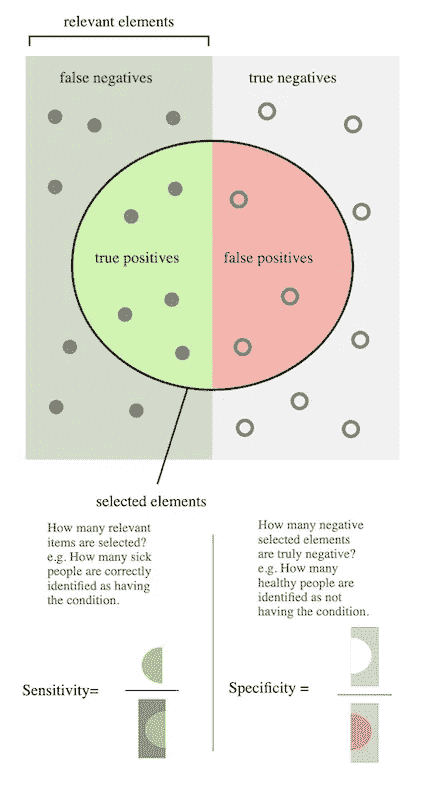
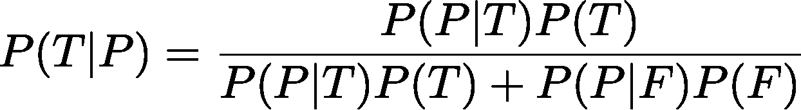
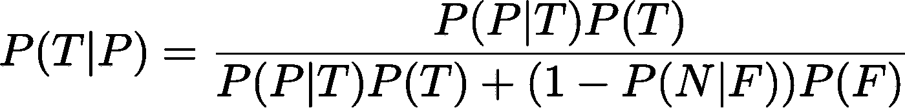
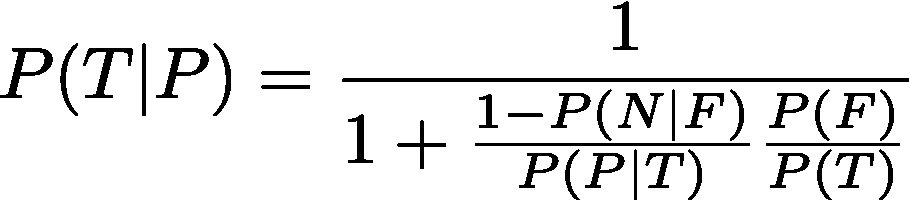

# 了解分类指标

> 原文：<https://towardsdatascience.com/understanding-classification-metrics-6b585a6377de?source=collection_archive---------38----------------------->

## 对于一个简单的二进制分类任务，初学者经常被大量的度量标准所迷惑。在这里，我给出了敏感性(也称为回忆)、特异性和精确性的自下而上的解释。

从事分类指标工作的人经常会遇到像真阳性率、假阳性率、召回率和精确度这样的术语，深入理解它们的含义是很有用的。

实际上有很多很好的来源来解释这些术语，但是真正的理解只能来自于坐下来思考问题。此外，我们有自己思考问题的方式，所以没有放之四海而皆准的方法。在这篇笔记中，我将我对这些术语的理解具体化，以供我参考，也供任何和我想法相同的人参考。

可视化的分类问题形式[https://commons.wikimedia.org/wiki/File:Precisionrecall.svg](https://commons.wikimedia.org/wiki/File:Precisionrecall.svg)

我将采用不同的方法，而不是直接介绍所有这些术语，并让读者经历我在阅读这些术语时遇到的同样的困惑。**我将讲述一个情景和一个实验，并通过数学来解决问题。只有到最后我才会说出这些术语。**这样一来，读者就会理解这个概念，然后再为这些名字而烦恼。

让我们来看一个场景，其中有一些状态可以是真(T)或假(F)。这可以说是个人的新冠肺炎状态，或者在 Imagenet 中图像是否是猫的图像。然后，我们有一个分类器，可能是那些可以嗅出新冠肺炎阳性患者的酷狗之一，或者是你最喜欢的 CNN 分类器，可以区分猫和非猫。当它们“认为”样本为真(T)时，它们将输出正(P ),当它们“认为”样本为假(F)时，它们将输出负(N)。

现在，在这一点上，我们有一些可以考虑的自然量。

1.  我们可以看看人口概率是真还是假，即 P(T)和 P(F)。请注意，它们的总和为 1。这可能是已知的(Imagenet 中的猫)或未知的(新冠肺炎病例的真实实例)，在后者中我们可能有估计。
2.  我们可以通过询问真实样本被发现为正 P(P|T)或负 P(N|T)的概率来查看我们的分类器执行得有多好。请注意，P(P|T) + P(N|T)=1 作为真实样本，只能以某种方式进行标记。类似地，我们可以讨论 P(P|F)和 P(N|F ),它们的和也是 1。
3.  我们还可以通过询问样本被发现为阳性的概率的*反问题*来查看我们的分类器表现如何，实际上是真 P(T|P)和假 P(F|P)。这些加起来也必须是 1，因为标记为阳性的样本必须是真或假，即 P(T|P) + P(F|P) = 1。同理，我们可以讲 P(T|N)和 P(F|N)。

现在我要讲一下贝叶斯定理。如果你只是知道它，但没有内化它，我会建议你停下来思考一下，努力理解它。这不是很难，可以用维恩图来理解。如果你没有听说过它，那么你应该在维基百科上阅读它，然后像我建议的那样努力思考它。我不会在这里激励它，只是简单地使用它。

现在，使用贝叶斯定理，我们可以联系上述数量

很明显，我还可以写出另外三个关系式，但是请注意，其中一个是通过 T F 和 P N 从上面得到的，另外两个是通过上面第 3 点中提到的概率总和为 1 得到的。此外，从商业角度来看，上述形式通常是最有用的。差不多了！我们只需要用上面第二点提到的概率总和来稍微调整一下。

就是这样！这就是全部了。然而**上面的一些术语有特殊的名称，我现在介绍一下**。左边的家伙，P(T|P)叫**精密。**这是一个非常有用的指标，因为它量化了那些被分类为阳性的样本中有多少部分是真实的。P(P|T)被称为**灵敏度**或**召回**，它是被分类器分类为阳性的真实样本的分数。最后，P(N|F)与前面的量非常相似，*不幸地不被称为对否定的回忆(这将使生活变得更简单，所以…显然不是)，而*被称为**特异性**。

通常，医学中报道的测试或分类器的度量是灵敏度和特异性。然而，人们经常提到，如果真实的人口密度是偏斜的，即 P(T) << P(F). Let’s see why that is the case. Let me massage the above expression further

Now suppose we have a *super fundoo* 分类器具有非常高的灵敏度 P(P|T) = 1 和非常高的特异性 P(N|F) = .99，那么人们可能会天真地认为该分类器非常好。然而，假设我们有 P(F)/P(T) ~ 1000，那么我们仍然会得到 10%的精度。

可以论证的是，从医学或商业的角度来看，精确度和召回率/敏感度通常比特异性和召回率/敏感度更有利于权衡比较。