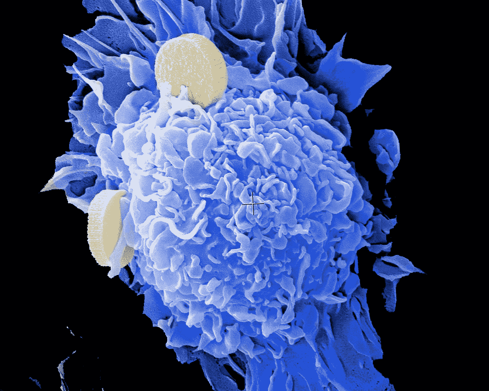

# 理解分类建模中的精度、灵敏度和特异性，以及如何用混淆矩阵计算它们

> 原文：<https://towardsdatascience.com/understanding-common-classification-metrics-titanic-style-8b8a562d3e32?source=collection_archive---------28----------------------->

## 直观、易于记忆的示例，用于理解常见的分类指标


照片由 [Alwi Alaydrus](https://unsplash.com/@dodyalaydrus?utm_source=medium&utm_medium=referral) 在 [Unsplash](https://unsplash.com?utm_source=medium&utm_medium=referral) 上拍摄

根据分类模型成功生成预测后，您会想知道预测的准确性。当涉及到分类模型时，准确性可能是一个非常微妙的概念，因为对您的模型有意义的度量标准将根据您的模型的目的而变化。例如，你是否试图预测一个病人是否患有癌症？还是想预测一个人是男是女？在评估这些模型时，您最有可能关注不同的指标，因为正如您所想象的，做出不正确的预测会产生不同的成本。

为了理解这些复杂性，让我们使用这些度量来评估一个分类模型。我们将使用的数据来自 Kaggle 著名的 [*泰坦尼克号——从灾难中学习的机器*](https://www.kaggle.com/c/titanic/data) 分类比赛。数据集的每一行都描述了泰坦尼克号上的一名乘客。比赛的目的是利用提供的特征(如性别、年龄等。)来预测给定乘客是活着还是死了。


# 评估指标

在不进行任何数据清理或特征工程的情况下，我们将通过在训练数据上拟合我们的模型来生成基线逻辑回归模型，然后在同一数据集上进行预测。为简单起见，我们将使用没有任何缺失值的特性和以下指标来评估模型的准确性:

*   混淆矩阵
*   准确(性)
*   分类错误率
*   精确
*   灵敏度
*   特征

# 模型

我们将使用数据集中的`Pclass`、`Sex`、`Age`、`SibSp`、`Parch`和`Fare`列来尝试和预测`Survived`，从而将逻辑回归模型拟合到我们的数据中。


符合我们的模型，现在让我们产生我们的预测。

# 评估我们的模型


照片由[斯科特·格雷厄姆](https://unsplash.com/@homajob?utm_source=medium&utm_medium=referral)在 [Unsplash](https://unsplash.com?utm_source=medium&utm_medium=referral) 上拍摄

现在我们有了一些预测，我们可以评估模型以确定它对实际类的预测有多好。理解我们模型准确性的一个关键是混淆矩阵。为了生成一个，我们将使用`caret`包中的`confusionMatrix`函数。该函数要求我们将输入作为因子提供，因此我们将进行转换并显示矩阵:


在查看上面的结果时，我们可以看到我们的基线模型表现得不是很好。对角线上的值，从左上角到右下角，是模型准确预测的类。列标题表示实际类别，行标签表示预测类别。用视觉表示法来理解混淆矩阵通常更容易:


作为一个例子，如果我们看第一列(“活的”、“活的”)，这是真阳性，我们看到模型正确地识别了 108 个活着的个体，但是，看左下角的(“活的”、“死的”)，这是假阴性，我们看到模型预测 234 个实际活着的个体死亡。

混淆矩阵对于理解我们将用于评估该模型的指标至关重要。

# 准确(性)


由 [Ricardo Arce](https://unsplash.com/@jrarce?utm_source=medium&utm_medium=referral) 在 [Unsplash](https://unsplash.com?utm_source=medium&utm_medium=referral) 上拍摄

在我们将要讨论的所有指标中，准确性是最直接的，也是您可能最熟悉的。当涉及到分类模型时，准确性主要是一个高层次的抽查，几乎不应该是用来评估您的模型的唯一指标。可以使用混淆矩阵中的值计算准确度:


当您的响应变量中有不平衡的类时，问题就来了。例如，如果您试图检测欺诈，而 1，000 笔交易中只有 1 笔是欺诈性的，即使您预测每笔交易都没有欺诈，您仍然会有一个 99.9%准确的模型。然而，也许一个欺诈案件会造成数百万美元的损失。我们知道，对于这样的模型，预测一个欺诈性交易将是模型的重点，我们的指标应该进行调整，以帮助我们了解模型在这方面的表现。因此，在大多数分类设置中，准确性需要进一步分解，以分析模型如何预测我们关心的结果。

让我们来看看我们模型的准确性:

```
## [1] 0.2065095
```

我们的模式真的很艰难。我们只是在 21%的时间里预测实际的类。

# 分类错误率


在 [Unsplash](https://unsplash.com?utm_source=medium&utm_medium=referral) 上 [NeONBRAND](https://unsplash.com/@neonbrand?utm_source=medium&utm_medium=referral) 拍摄的照片

这个度量是准确性的反义词。它向我们展示了我们的结果被错误分类的频率。其计算方法如下:


我们可以通过从 1 中减去我们的*准确性*度量来找到我们的模型的分类错误率。

```
## [1] 0.7934905
```

我们的模型在大约 79%的时间里预测错误的类别。

# 精确


照片由[博夫肖](https://unsplash.com/@hikeshaw?utm_source=medium&utm_medium=referral)在 [Unsplash](https://unsplash.com?utm_source=medium&utm_medium=referral) 上拍摄

精度是指实际阳性与预测阳性的比率。当误报的成本很高时，最常使用这种度量。例如，在一个将电子邮件分类为垃圾邮件或垃圾邮件的模型中，我们需要非常高的精确度，以便相关和重要的电子邮件不会被发送到垃圾文件夹或被阻止(误报)。这里假阳性的代价很高。精度计算如下:


对于我们的模型，我们必须稍微扩展一下这个故事，以使精度有意义。假设我们继承了一大笔钱，作为泰坦尼克号的历史爱好者，我们想给模型中确定的每个幸存者的家庭寄去 1000 美元。我们绝对不希望发送不必要的钱，所以我们真的希望我们的模型具有高精度，这意味着，我们尽可能多地向实际幸存者的家庭发送钱，并真正限制向遇难乘客的家庭发送钱的频率。

让我们看看我们模型的精度:

```
## [1] 0.1858864
```

我们模型的精确度是糟糕的。如果我们按照现在的模式发送 1，000 美元的礼物，只有大约 19%的家庭会收到礼物，其余的钱按照我们的目标都是浪费！

# 敏感度(回忆)



[国立癌症研究所](https://unsplash.com/@nci?utm_source=medium&utm_medium=referral)在 [Unsplash](https://unsplash.com?utm_source=medium&utm_medium=referral) 上拍摄的照片

当你关注于识别阳性结果并且假阳性的成本很低时，灵敏度或回忆是重要的——这意味着只要我们识别尽可能多的实际阳性，我们就可以拾取一些假阳性。如果我们要预测一名患者是否患有癌症，灵敏度必须高得令人难以置信，这样我们才能捕捉尽可能多的阳性病例，即使这意味着我们会引入一些实际上没有患癌症的患者。这里假阳性的成本很低。灵敏度计算如下:


让我们假设我们想给模型中确定的每个幸存者的家庭送一朵玫瑰。我们没有足够的钱给幸存者和死者的家人送花，所以我们必须做出选择。在我们内心深处，对我们来说非常重要的是，我们至少要给真正幸存者的家庭送去玫瑰。然而，我们不介意最终给遇难乘客的家庭送去一些玫瑰。我们在好市多大量购买玫瑰，所以它们相当便宜。在这种情况下，我们希望我们的敏感度非常高，以便尽可能多的幸存者家庭收到玫瑰，即使少数非幸存者家庭也收到玫瑰。

让我们计算一下我们模型的敏感度:

```
## [1] 0.3157895
```

我们模型的灵敏度真的是相当可怕。如果我们使用这个模型，只有 32%的幸存者家庭会得到一朵玫瑰！那是不能接受的！

# 特征


由[乔希·弗雷内特](https://unsplash.com/@joshfrenette?utm_source=medium&utm_medium=referral)在 [Unsplash](https://unsplash.com?utm_source=medium&utm_medium=referral) 上拍摄的照片

特异性是真阴性与所有阴性结果的比率。如果你担心你的否定率的准确性，并且肯定的结果有很高的成本，那么这个指标是有意义的——所以如果没有必要，你就不要吹这个口哨。例如，如果你是一名审计员，正在检查财务交易，一个肯定的结果意味着一年的调查，但是找不到一个结果只会给公司造成 50 美元的损失。特异性计算如下:


假设我们想给我们的模型所识别的死亡乘客的家人发送一封手写的邮件。自从 1912 年泰坦尼克号沉没以来，我们觉得这些家庭有时间从他们的损失中恢复过来，所以不会因为收到一张纸条而心烦意乱。然而，我们觉得给幸存者的家人发一封短信是不可思议的麻木不仁，因为他们的死亡时间会更近(最后一位泰坦尼克号幸存者于 2009 年去世，享年 97 岁)，而家人仍然沉浸在悲痛之中。

让我们计算一下我们模型的特异性:

```
## [1] 0.1384335
```

我们的专一是可耻的！如果我们使用目前的模型，大约 86%的纸币接收者会记住他们最近的损失！我们不能这样！

# 结论

在查看我们模型的衡量标准时，有一点是清楚的:我们不应该将这种模型用于任何类型的礼物赠送。我们的模型非常不准确，只会引起恐慌。

虽然我们不会根据这个练习给泰坦尼克号幸存者写任何手写的笔记，但我们以一种令人难忘的方式学习了一些用于分类模型的最常用的度量标准。当然，还有其他重要的指标，如 F1 得分、ROC 曲线和 AUC，但是，我们将把这个讨论留到以后。

# 谢谢大家的支持！

感谢您阅读本文！如果你觉得有帮助，请给我一两下掌声:)