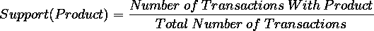
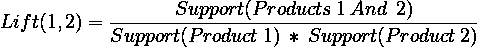
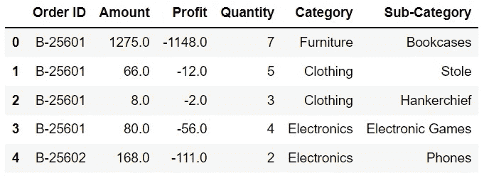
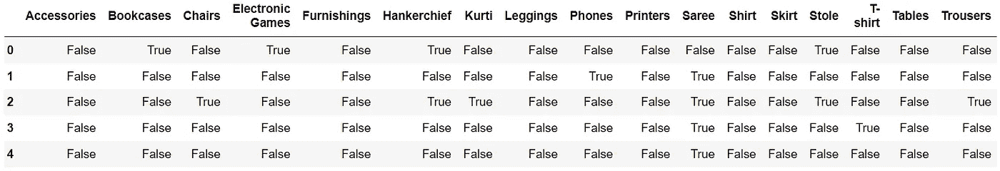
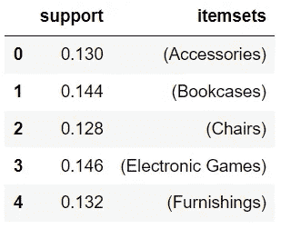
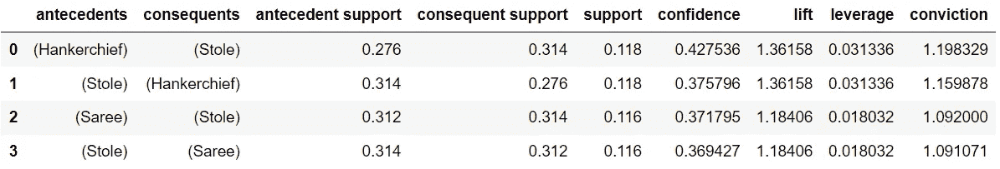

# 用购物篮分析理解消费者行为

> 原文：<https://towardsdatascience.com/understanding-consumer-behavior-with-the-market-basket-analysis-3d0c017e5613?source=collection_archive---------15----------------------->

## 了解用于优化零售和电子商务行业销售的数据挖掘技术

塔曼娜·茹米在 [Unsplash](https://unsplash.com?utm_source=medium&utm_medium=referral) 拍摄的照片

预测客户的兴趣是许多商业模式中采用的策略。公司在各种策略上进行了大量投资，从进行客户调查到建立复杂的机器学习模型以更好地了解客户行为。

使用的一个比较突出的方法是**市场篮子分析**，这是一种数据挖掘技术，可以识别表现出强关系的产品。

这项研究可以识别出表面上看不出来的高相关性产品。这是一个重要的工具，因为知道哪些产品有利于购买其他产品可以使企业以更大的成功率推广和推荐商品。

在这里，我们将涵盖市场篮子分析的来龙去脉。

# 市场篮子分析

购物篮分析是关联规则挖掘的一种形式，它发现具有强关联或相关性的项目。

在解释购物篮分析之前，重要的是要涵盖一些关键术语。

在一个事务中购买的一组项目被称为一个**项目集**。

一个**关联规则**本质上是一个 if-then 语句，旨在建立所购买商品之间的关系。

假设你正在网上寻找一部新手机。将手机放入购物车后，您决定也要买一个手机壳。您将手机壳添加到购物车中并进行购买。

在这种情况下，项目集是{Phone，Phone Case}。

此项集的关联规则是:if {Phone}，then {Phone Case}。

项目集中的乘积可以分为两组:前因和后果。

**前件**指的是位于关联规则左侧的产品。

**结果**是指位于关联规则右侧的产品。

在这个例子中，先行词是电话，而结果词是手机壳。

购物篮分析需要找到表现出最强关联的项目集。

也就是说，通过识别和评估项目的所有组合来找到最显著的项目集是困难的，因为它提出了两个问题。

## **问题#1** :单从表面价值来看，我们无法区分最显著的项目集。

有了上面的例子，购买手机和购买手机壳有很强的相关性就说得通了。但是，如何评价表面上没有那么直接联系的物品呢？

幸运的是，有一些评估指标可以帮助定量地衡量前因和后果之间的联系。

**support** 度量测量项目集的频率。换句话说，它将告诉您购买项目集中的产品的频率。

支持度量的公式为:

**置信度**衡量的是在购买了前因的情况下，购买后果的可能性。

置信度度量的公式为:

**提升**指标衡量购买前因对购买后果的影响。

提升度量的公式为:

如果关联的提升为 1，那么前件和后件的购买是独立的。

如果一个关联的提升大于 1，购买前因会增加购买后果的可能性。

如果一个关联的提升值小于 1，购买前因会降低购买后果的可能性。

通过这些评估指标，我们可以筛选出不符合标准的产品组合。

## 问题 **#2** :考虑到项目集组合的总数，我们无法处理所有的项目集。

简单来说，测试和评估每一个可能的唯一项集是不合理的。

客观地说，如果你有 1000 种不同的产品，那么在寻找最佳关联规则时，你需要考虑 499，500 种不同的两种商品的组合。任何大小组合的总数都超过了海滩上沙粒的数量。

谢天谢地，有一个简单的方法可以绕过这个问题。

apriori 算法是一种有效的替代方法，可以帮助识别频繁项集，同时过滤掉不频繁的项集。它可以不考虑项目集，而不必对它们进行评估。本文不会涉及 apriori 算法的内部工作原理，但是如果你感兴趣，你可以在这里了解更多。

# 缺点

尽管购物篮分析是一种非常有用的数据挖掘技术，但它绝不是对消费者行为的可靠研究。

首先，即使产品之间的关联显示出有希望的评价指标，它也不能直接证明产品之间的因果关系。毕竟，相关性不等于因果关系。

其次，像任何数据挖掘技术一样，购物篮分析容易出错。它可能会错误地忽略重要的关联或错误地包含不重要的关联。

在你进行分析的时候，记住这些缺点，以免你从你的发现中得出错误的结论。

# 个案研究

我们可以通过对一个存储电子商务购买的数据集(无版权保护)进行研究来演示市场购物篮分析，该数据集可以在这里访问。

这是数据集的预览。

代码输出(由作者创建)

我们只对每位顾客购买的商品感兴趣，这在“子类别”栏中有提及。让我们将这个列转换成一个列表的列表，每个列表代表一个项集。

代码输出(由作者创建)

执行市场篮分析需要计算每个项目集中关联的支持度、置信度和提升度量，如果手动执行，可能会非常耗时。谢天谢地，Python 中的 [mlxtend](https://rasbt.github.io/mlxtend/) 模块允许我们轻松地执行这样的操作。

现在我们有了项目集列表，我们必须使用 apriori 算法来删除不常用的项目集。这样做需要对数据进行一次热编码。

mlxtend 模块有自己的编码器，可以对项集进行一次性热编码。

代码输出(由作者创建)

使用 mlxtend 模块，我们可以使用 apriori 算法来识别支持值大于或等于 0.1 的项集。

代码输出(由作者创建)

因为目标是识别具有强关系的产品，所以我们将使用 association_rules 函数来查找关联类型符合要求的产品。

在这种情况下，如果一个项集中的提升值超过 1，我们将认为该关联是理想的。

代码输出(由作者创建)

根据结果，有手帕和披肩的项目集具有最高的提升值。值得探究的是，为什么购买手帕会增加购买披肩的可能性，反之亦然。

请记住，这项研究只证实了这两个项目之间的强相关性，而不是因果关系。

从这一分析中得出的一个误导是，向购买披肩的人积极推销手帕是最理想的。只有在进一步探索这两个项目之间的潜在关系后，才能得出这样的结论。

# 结论

照片由[普拉蒂克·卡蒂亚尔](https://unsplash.com/@prateekkatyal?utm_source=medium&utm_medium=referral)在 [Unsplash](https://unsplash.com?utm_source=medium&utm_medium=referral) 拍摄

能够理解消费者的行为几乎就像是一种超能力。

这就是为什么购物篮分析作为一种技术脱颖而出，在寻找客户购买的模式和趋势时可以依赖。

这种分析本身似乎很简单，但它是产品推荐和促销系统基础的一部分，服务行业在未来许多年都将依赖这种系统。

我祝你在数据科学的努力中好运！

# 参考

1.  罗山，B. (2019)。电子商务数据，第 2 版。于 2021 年 11 月 12 日从 https://www.kaggle.com/benroshan/ecommerce-data.取回