# 理解对比学习

> 原文：<https://towardsdatascience.com/understanding-contrastive-learning-d5b19fd96607?source=collection_archive---------0----------------------->

## 学习如何使用自我监督学习法进行无标签学习。

拉奎尔·马丁内斯在 [Unsplash](https://unsplash.com?utm_source=medium&utm_medium=referral) 上拍摄的照片

# 什么是对比学习？

> **对比学习** *是一种机器学习技术，用于通过教导模型哪些数据点相似* *或不同**来学习无标签**数据集的**总体特征*。****

**让我们从一个简单的例子开始。想象你是一个新生婴儿，正在试图理解这个世界。在家里，我们假设你有两只猫和一只狗。**

**即使*没有人告诉你*他们是“猫”和“狗”，你可能仍然会意识到，与狗相比，这两只猫看起来很相似。**

**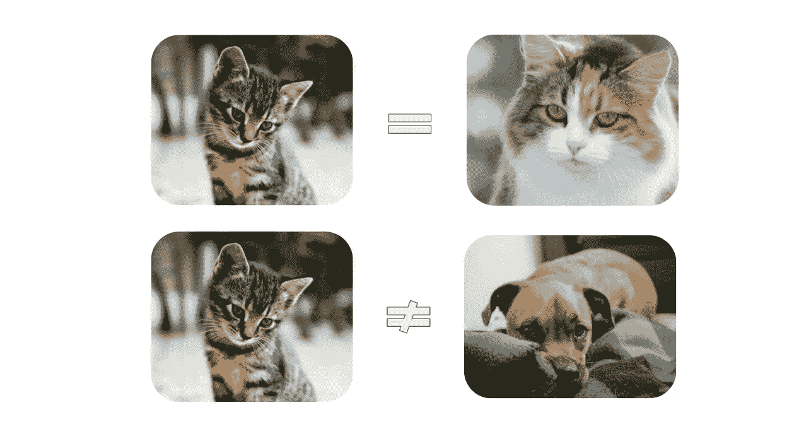**

**(左)照片由[埃德加](https://unsplash.com/@e_d_g_a_r)拍摄于 [Unsplash](https://unsplash.com/photos/nKC772R_qog) |(右上)照片由[拉娜·维德诺瓦](https://unsplash.com/@lana_lite)拍摄于 [Unsplash](https://unsplash.com/photos/4N3vTdAPJp8) |(右下)图片由[鲁比·施曼克](https://unsplash.com/@rubyschmank)拍摄于 [Unsplash](https://unsplash.com/photos/Y-s3mossjMU?utm_source=unsplash&utm_medium=referral&utm_content=creditShareLink)**

**仅仅通过识别我们毛茸茸的朋友之间的异同，我们的大脑就可以学习我们世界中物体的高级特征。**

**例如，我们可能下意识地认为两只猫的耳朵是尖的，而狗的耳朵是下垂的。或者我们可以*对比* *(提示-提示)*狗凸出的鼻子和猫扁平的脸。**

**本质上，**对比学习**允许我们的机器学习模型做同样的事情。它查看哪些数据点对是*【相似】**【不同】*，以便了解关于数据的*更高层次的特征*，甚至在之前的*还有分类或分割等任务。***

***这个为什么这么厉害？***

**这是因为我们可以训练模型*学习大量*关于我们的数据 ***没有任何注释或标签，*** *因此得名，* ***自我监督学习。*****

**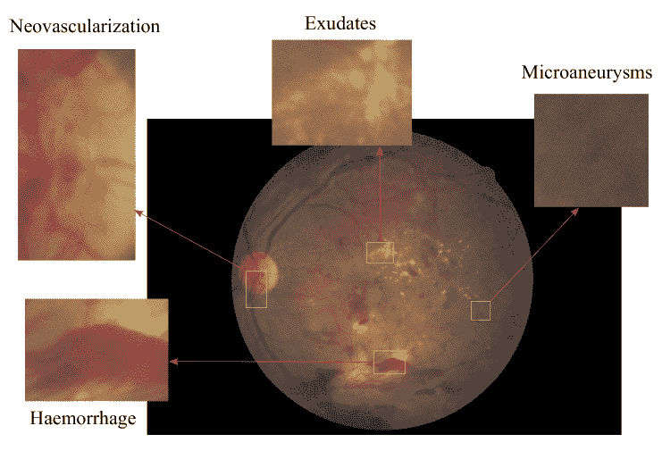**

**视网膜的眼底图像，带注释。来源:[1]**

**在大多数真实世界的场景中，我们*没有*为每张图片贴标签。以医学成像为例。为了创建标签，专业人员必须花费无数时间来查看图像，以手动分类、分段等。**

**通过对比学习，即使只有一小部分数据集被标记，也可以显著提高模型性能。**

**既然我们理解了什么是对比学习，以及它为什么有用，让我们看看*对比学习是如何工作的。***

# **对比学习是如何工作的？**

**在本文中，我重点关注 **SimCLRv2** ，这是谷歌大脑团队最近提出的最先进的对比学习方法之一。对于其他的对比学习方法，如脸书的 MoCo，我建议回顾下面的文章。**

** [## 对比自我监督学习的框架和新方法的设计

### 我们制定了一个框架的特点对比自我监督学习方法，看看 AMDIM，CPC…

towardsdatascience.com](/a-framework-for-contrastive-self-supervised-learning-and-designing-a-new-approach-3caab5d29619) 

幸运的是， **SimCLRv2** 非常直观。

整个过程可以简明地描述为三个基本步骤:

*   对于我们数据集中的每个图像，我们可以执行两个*增强组合*(即裁剪+调整大小+重新着色、调整大小+重新着色、裁剪+重新着色等。).我们希望模型知道这两个图像是“相似的”,因为它们本质上是同一图像的不同版本。

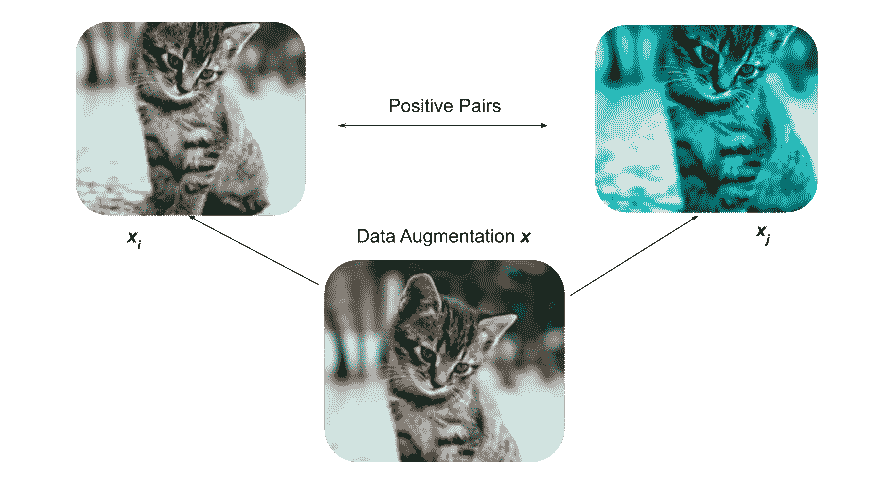

作者图。照片由[埃德加](https://unsplash.com/@e_d_g_a_r)在 [Unsplash](https://unsplash.com/photos/nKC772R_qog) 上拍摄

*   为此，我们可以将这两幅图像输入到我们的深度学习模型(Big-CNN，如 ResNet)中，为每幅图像创建*矢量表示*。目标是训练模型为相似的图像输出相似的表示。

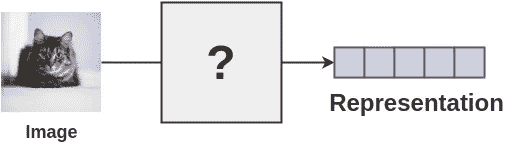

将图像表示为矢量表示。来源:Amit Chaudhary 的图解 SimCLR 框架， [amitness](https://amitness.com/2020/03/illustrated-simclr/)

*   最后，我们试图通过最小化对比损失函数来最大化两个向量表示的相似性。

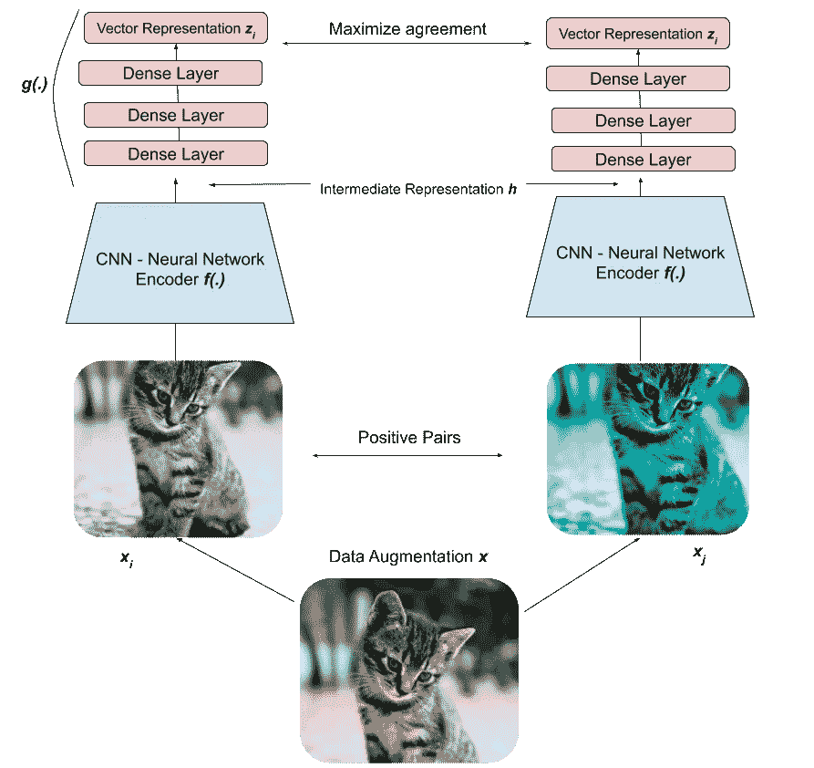

SimCLRv2 框架概述。作者图。照片由[埃德加](https://unsplash.com/@e_d_g_a_r)在 [Unsplash](https://unsplash.com/photos/nKC772R_qog) 上拍摄

随着时间的推移，模型将了解到两个猫的图像应该具有相似的*表示*，并且猫的表示应该不同于狗的表示。

这意味着模型能够*区分不同类型的图像*，甚至不知道图像是什么！

我们可以将这种对比学习方法进一步分解为三个主要步骤:**数据扩充、编码和损失最小化。**

## 1)数据扩充

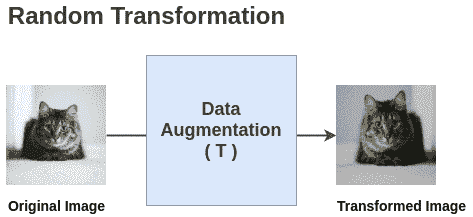

来源:Amit Chaudhary 的图解 SimCLR 框架， [amitness](https://amitness.com/2020/03/illustrated-simclr/)

我们随机执行以下增强的任意组合:裁剪、调整大小、颜色失真、灰度。在我们的批处理中，我们对每个图像做两次*，*以创建两个增强图像的正对**。**

## 2)编码

然后我们使用我们的 Big-CNN 神经网络，我们可以简单地认为它是一个*函数*， ***h = f(x)，*** *，其中“x”是我们的一个增强图像，*到*将我们的两个图像编码为矢量表示。*

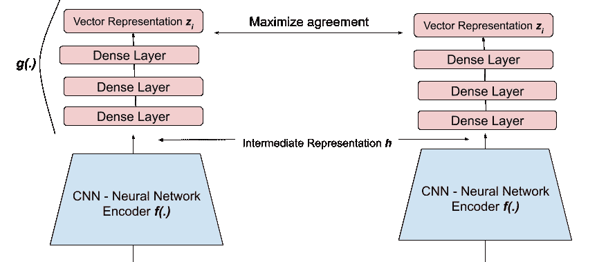

作者图片

然后将 CNN 的输出输入到一组称为**投影头、*z =*******g(h)***的密集层，将数据转换到另一个空间。经验表明，这一额外步骤可以提高性能[2]。*

*如果您不熟悉潜在空间和向量表示，我强烈推荐您在继续之前阅读我的文章，这篇文章直观地解释了这个概念。*

* [## 理解机器学习中的潜在空间

### 学习深度学习的一个基本的，但经常是“隐藏的”概念

towardsdatascience.com](/understanding-latent-space-in-machine-learning-de5a7c687d8d) 

通过将我们的图像压缩到潜在空间表示中，模型能够*学习图像的高级特征*。

事实上，当我们继续训练模型以最大化相似图像之间的向量相似性时，我们可以想象模型正在学习潜在空间中相似数据点的*聚类*。

例如，猫的表现形式会更接近，但离狗的表现形式更远，因为这是我们训练模型学习的内容。

## **3)表示的损失最小化**

现在我们有了两个向量， ***z*** ，我们需要一种方法来**量化它们之间的相似性。**

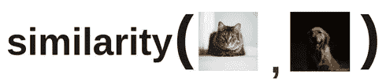

来源:Amit Chaudhary 的图解 SimCLR 框架， [amitness](https://amitness.com/2020/03/illustrated-simclr/)

因为我们正在比较两个向量，自然的选择是**余弦相似度**，这是基于空间中两个向量之间的*角。*

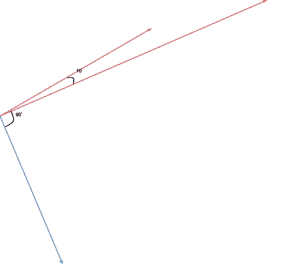

空间中的 2D 矢量。作者图片

合乎逻辑的是，当向量在空间上*越靠近*(它们之间的角度越小)，它们就越相似。因此，如果我们将**余弦(两个向量之间的角度)**作为度量**，**我们将在角度接近 0 时获得高相似性，否则获得低相似性，这正是我们想要的。

我们还需要一个可以最小化的损失函数。一种选择是 NT-Xent(归一化温度标度交叉熵损失)。

我们首先计算两幅增强图像相似的概率**。**

*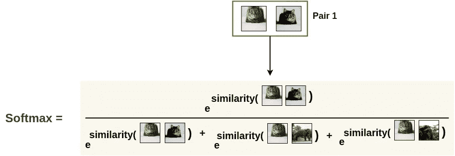*

*来源:Amit Chaudhary 的图解 SimCLR 框架，[友好](https://amitness.com/2020/03/illustrated-simclr/)*

*注意，分母是 e^similarity( *所有对*的总和，包括**负对**。**负对**通过在我们的增强图像和我们批次中的所有其他图像之间创建对来获得。*

*最后，我们将这个值放在一个 *-log()* 中，使得*最小化*这个损失函数对应于*最大化*两个增强图像相似的概率。*

*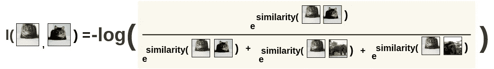*

*来源:Amit Chaudhary 的图解 SimCLR 框架， [amitness](https://amitness.com/2020/03/illustrated-simclr/)*

*要了解更多关于 SimCLR 的细节，我推荐阅读下面的文章。*

* [## 图示的 SimCLR 框架

### 近年来，许多自我监督学习方法已被提出学习图像表示，每一个…

amitness.com](https://amitness.com/2020/03/illustrated-simclr/) 

## SimCLR 版本 2

值得注意的是，自最初发布 SimCLR 框架以来，作者对管道进行了以下重大改进[2]:

*   **更大的 ResNet 型号**用于 Big-CNN 编码器——152 层 Res-Net，3 倍宽的通道，选择性内核，注意机制。
*   **更多投影头—** 转换中间表示时使用三个密集层，而不是两个。

# 对比学习的应用

## 半监督学习

当我们*只有很少的标签*时，或者如果很难获得特定任务(即临床注释)的标签，我们希望能够使用已标记数据*和未标记数据*来优化我们模型的性能和学习能力。这就是**半监督学习的定义。**

一种在文献中日益流行的方法是*无监督预训练、有监督微调、知识提炼*范式【2】。

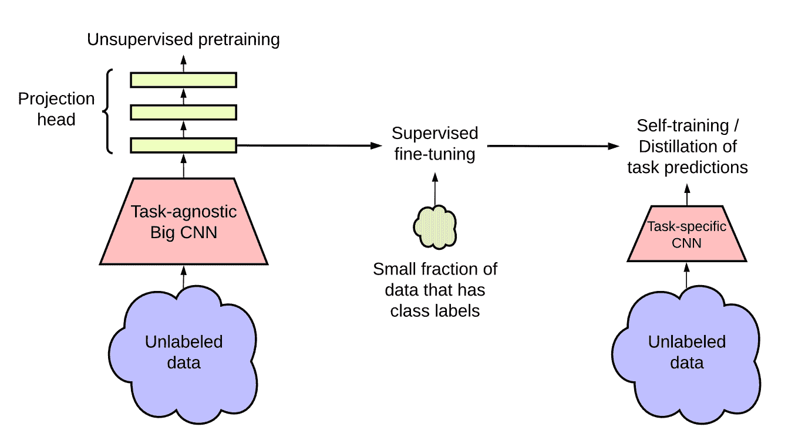

半监督学习范式综述。来源:[2]

在这种范式中，自我监督对比学习方法是一个关键的“预处理”步骤，它允许大 CNN 模型(即 ResNet-152)在试图使用有限的标记数据对图像进行分类之前，首先从未标记数据中学习一般特征。

谷歌大脑团队证明了这种半监督学习方法*非常具有标签效率*，并且更大的模型可以带来更大的改进，特别是对于低标签分数。

随着模型变大，模型在各种标签分数下的最高精度。来源:[2]

## NLP 模拟

有趣的是，类似的自我监督方法已经在自然语言处理领域广泛使用。

例如， **Word2Vec** ，一种将文本转换为嵌入向量的算法，使用了类似的自我监督方法。在这种情况下，我们希望句子中彼此*更接近的单词*具有更相似的向量表示。

来源:克里斯·麦考密克的图， [Word2Vec 教程——跳格模型](http://mccormickml.com/2016/04/19/word2vec-tutorial-the-skip-gram-model/)

因此，我们通过在一个窗口内的单词之间创建配对来创建我们的“积极配对”。我们使用一种叫做**负采样**的技术来创建我们的负对。

这篇文章包含了对 Word2Vec 算法的直观和详细的解释。

 [## 图示的单词 2vec

### 讨论:黑客新闻(347 分，37 条评论)，Reddit r/MachineLearning (151 分，19 条评论)翻译…

jalammar.github.io](http://jalammar.github.io/illustrated-word2vec/) 

就像 SimCLRv2 一样，Word2Vec 允许“相似”的单词在潜在空间中具有更相似的向量表示，我们可以将这些学习到的表示用于更具体的下游任务，如文本分类。

# 关键要点

*   对比学习是一种*自我监督、独立于任务的*深度学习技术，允许模型学习数据，甚至是没有标签的*。*
*   模型*通过学习哪些类型的图像是相似的，哪些是不同的，来学习关于数据集的一般特征*。
*   SimCLRv2 是对比学习方法的一个示例，该方法学习如何表示图像，使得相似的图像具有相似的表示，从而允许模型学习如何区分图像。
*   对数据有大致了解的*预训练模型*可以*微调*用于特定任务，如图像分类*当标签稀缺时*显著提高标签效率，并有可能超过监督方法。

我希望这篇文章对什么是对比学习，对比学习是如何工作的，以及什么时候你可以将对比学习应用到你自己的项目中，提供一个清晰的直觉。自我监督学习真的很神奇！

# 参考

[【1】Islam 等.利用视网膜眼底图像进行基于深度学习的糖尿病视网膜病变早期检测和分级，2018](https://arxiv.org/abs/1812.10595)

[[2]陈等.大自监督模型是强半监督学习器，2020](https://arxiv.org/abs/2006.10029)****