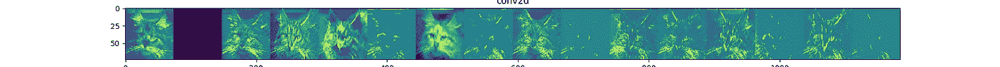

# 理解卷积神经网络

> 原文：<https://towardsdatascience.com/understanding-convolutional-neural-networks-316d0bb099a4?source=collection_archive---------39----------------------->

## 看一看引擎盖下面


图片由维基共享资源上的 [Cecbur](https://commons.wikimedia.org/w/index.php?title=User:Cecbur&action=edit&redlink=1) 提供

在本文中，我将训练一个深度神经网络来对图像进行分类，但我也将让您了解神经网络本身内部正在发生什么，以及卷积实际上是如何工作的。

我们将探讨以下部分。

[卷积](#69fc)
∘ [滤波器](#68da)
∘ [池化](#bb48)
[网络](#2617)
∘ [预处理](#3d90)
∘ [模型](#022f)
∘ [训练网络](#9db7)
[预测](#62e8)
[神经网络“看到”了什么？](#c2ec)

我将向你展示网络的运行，向你展示当它通过潜入它的“大脑”——网络的各层——做出决定时，它实际上“看到”了什么，我们将一起努力理解它如何决定图像的重要特征。

当你看到一只猫的图像时，你(也就是你的大脑)是如何识别出图像中有一只猫的？即使你以前没有见过具体的动物，你又如何区分猫和狗呢？

这些问题很难回答。也许我们应该从简单的开始…

你如何给计算机编程来识别图像中的猫？一只随机出现在图片中的猫。

你可以通过观察猫的不同特征来捕捉猫的本质，比如毛发的长度和颜色或者耳朵的形状。

但是这种方法有几个大问题。

首先，不同种族的猫看起来很不一样，你不可能捕捉到它们所有的特征。第二，不依赖于猫在图像中位置就能检测出猫的算法并不简单。

如果你观察像素，左边有一只猫的图像和右边有一只猫的图像看起来非常不同。

你如何独立于猫的位置和大小来检测猫？这是一个非常棘手的问题，如果不是不可能的话，通过经典编程来解决。

# 回旋

卷积的思想是通过以一种非常聪明的方式检测猫的特征来解决上述问题。

我们使用有监督的机器学习算法，而不是显式地对它们编程。

也就是我们拿一个有一定架构的神经网络。然后我们给它看很多带有相应标签的图像(像*猫*和*狗*，通过训练，它会学习当我们要对猫狗的图像进行分类时，哪些特征是最重要的。

然而，标准的神经网络不能立即解决上述“大小和位置”问题。

这就是回旋的用武之地。你看，卷积通过使一些像素值变大和变小来突出一些形状。因此他们改变了形象。

## 过滤

它的工作方式如下。我们用过滤器，这只是二维数组的数字，你应该想象我们通过图像的像素。

对于图像的每个像素值，将滤镜居中放置在该像素的“上方”,并将滤镜的每个数字乘以其正下方的像素。我们将这些新值作为像素放在新图像中。


图片由 Vincent Dumoulin，Francesco Visin 在维基共享资源上提供

这些操作的结果被传递到网络的下一层。

> 这类似于视觉皮层中的神经元对特定刺激的反应，因此这种架构受到生物大脑的启发。
> 
> —维基百科

更低级地说，对于每个过滤器，结果图像是输入图像的变换，其中，根据过滤器，一些特定的形状被突出显示。

## 联营

CNN 的第二个要素是池的概念。

共用是指通过将 n×n 个像素向下映射到 1 个像素来对图像进行缩减像素采样。同样，您应该想象一个 n×n 的数组在图像上移动，但这次不需要多次映射像素，而是将不相交的正方形映射到像素。


图片由 Andreas Maier 在维基共享资源上提供

此过程将保留重要特征，但会缩小图像大小。例如，如果我们使用一个 2×2 的数组进行池化，得到的图像将缩小 *4* 倍。

# 网络

在这一段中，我将向你展示如何处理未经预处理的图像数据！

首先要做的是获取一些数据。

在本教程中，我将从 Kaggle 下载狗和猫的图像。你可以在这里得到它们。

我已经解压了 train.zip 并将文件夹放在名为 data 的目录中。也就是说，我有路径 **data/train** ，所有的训练图像都在这里。

如果一个图像以“猫”开始，那么它是一只猫的图像，如果它以“狗”开始，那么它是一只狗的图像。我将使用此模式将训练数据分类为狗和猫。

## 预处理

现在我们需要做一些预处理。我将创建两个函数来完成这项工作。

现在只需创建一些目录，并使用适当的参数运行这些函数。

您可以通过运行以下命令进行快速检查，以确保它正常工作:

输出应该是

```
11250
11250
1250
1250
```

现在我们已经完成了预处理部分，好戏就要开始了。

## 模型

让我们构建将要训练的神经网络的架构，并将其保存到一个名为 **model** 的变量中。

现在如果我们跑

```
print(model.summary())
```

我们得到以下输出

让我们试着从这个图像中理解神经网络的架构。您应该注意的第一件事是，第一次卷积后得到的变换图像看起来是 148×148 的形状，即使我们输入的网络图像是 150×150 的形状。

原因很简单。当第一次卷积发生时，我们使用一个 3 × 3 的阵列在图像上滑动。现在，由于数组中的每个值都需要在图像中的某个像素之上，所以数组的中心不能在图像边缘的任何像素之上，因为这样一来，数组中的一些相邻数字下面就没有像素了。

因此，我们切掉边缘，留下一个 148×148 的图像。

此外，请注意，由于我们使用了一个 2×2 的数组，因此池层的输出要小 *4* 倍(每边的一半)。

在进入网络的第二状态之前，我们有三对卷积池层。

第二个状态是实际分类发生的地方。在展平层之后，神经网络查看卷积的提取特征，并尝试将它们分类为狗或猫。

通过查看代码，您可能会注意到最后一层仅由一个神经元组成。这个神经元的激活函数是 **sigmoid 函数**，它是

σ(x)= 1/(1+e^(-x)).

当 x 是一个非常大的负数时，sigmoid(x)变得接近 *0* ，当 x 是一个非常大的正数时，sigmoid(x)变得接近 *1* 。

神经网络因此学习到根据 sigmoid 函数的这种二元行为来对猫和狗进行分类。

既然我们已经设计了模型，我们需要训练它。首先，让我们创建一些生成器。

反过来，这些发生器将把数据成批地输入神经网络。标签将从我们在预处理阶段创建的图像的文件夹名称中继承。

我们还将进行图像增强，这是确保我们的网络“看到”更多数据的一种方式。如果它没有在训练数据中以一个角度看到一只正在攀爬的猫，它可能不会在训练时将其归类为猫。在将图像传送到网络之前，通过以不同方式旋转、移动、剪切和翻转图像，我们将确保训练数据捕获尽可能多的特征。

你可能会注意到我们也在重新缩放图像。这是标准做法，被称为规范化。其思想是，重要的是像素值之间的关系，而不是像素值本身。

当然，这不仅适用于图像数据。

这个生成器很酷的一点是，实际转换的图像没有保存在磁盘上，你的训练数据保持不变。就在它们被馈送到网络进行训练之前，在 RAM 中动态地发生增强。

我们还需要将目标大小设置为 150×150，因为这是我们告诉模型的输入形状。

## 训练网络

让我们训练模型。

你不需要 TensorBoard 回调，但是如果你知道它是什么，请随意使用它。我将在另一篇文章中讨论这个问题。

当我运行时，我得到了大约 0.76 的验证精度，这意味着它正确地分类了大约 76%以前没有见过的图像。当然，这是在我们调整模型的超参数等等之前。

如果我们得到更多的训练数据，精确度就会提高。另一种获得更好模型的方法是使用迁移学习，在一个巨大的预先训练好的模型上建立你的网络。我将在另一篇文章中向您展示如何做到这一点。通过这种方式，你可以得到 90%以上的精确度。

# 预测

让我们以下面一只猫为例。


图片由维基共享资源上的 [Alvesgaspar](https://commons.wikimedia.org/wiki/User:Alvesgaspar) 提供

我们可以问我们新训练的神经网络这是猫还是狗。

我运行这段代码时的输出是

```
cat
```

非常好。

# 神经网络“看到”了什么？

让我们试着深入了解一下，试着弄清楚网络认为哪些特性是重要的。

让我们看一下训练数据中的一幅图像，看看它是如何通过网络进行转换的。以下图像是训练好的网络中卷积层的输出，让我们了解网络学习到的哪些滤波器最重要。



作者图片


作者图片


作者图片

如果你仔细观察，你会发现在第一次回旋后，猫的胡须和耳朵都亮了，这表明这些是将它归类为猫的重要特征。

如果你看第三个图像，似乎眼睛也很重要。

这表明，卷积神经网络可以识别形状，而不管形状的大小和位置，因为它通过卷积来学习哪些过滤器最重要。然后，具有 sigmoid 输出的简单神经网络通过反向传播校准其权重，以从卷积中对这些图像特征进行分类。

这篇短文展示了 TensorFlow 必须提供的一些强大的 API。希望这也能给我们一个关于卷积到底是什么的直觉。

如果您有任何问题、评论或顾虑，请在 LinkedIn 上给我发短信。

<https://www.linkedin.com/in/kasper-m%C3%BCller-96ba95169/> 