# 了解卷积神经网络(CNN)

> 原文：<https://towardsdatascience.com/understanding-convolutional-neural-networks-cnns-81dffc813a69?source=collection_archive---------17----------------------->

## 对最强大的深度学习工具之一及其构建模块的温和介绍

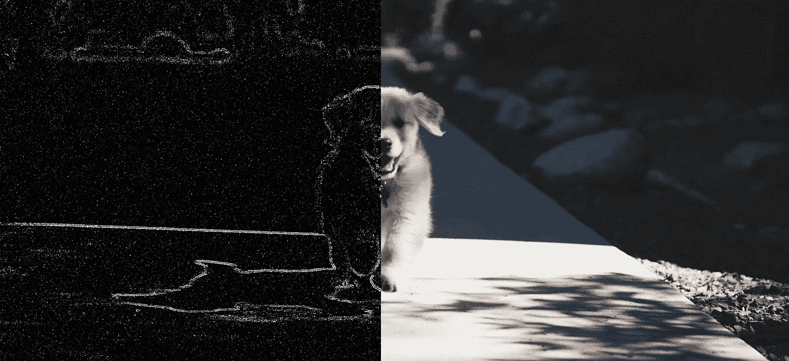

原文由[安德鲁·舒尔茨](https://unsplash.com/s/photos/andrew-schultz)在 [Unsplash](https://unsplash.com/)

本文将涵盖卷积神经网络(CNN)的所有主要方面，它们如何工作以及这项技术的主要构件。本文中使用的参考资料可以在我的 [github 资源库](https://github.com/vinyluis/Articles/tree/main/Como%20funcionam%20as%20CNNs)中找到。

卷积神经网络(CNN)或简称为卷积网络是一种至少在其一层中使用卷积运算而不是矩阵乘法的神经网络。

这种类型的网络有效地用于数据元素与其相邻元素具有某种关系的应用中，如图像(由二维像素阵列表示)或时间序列或音频文件(由规则时间帧中的一维数据点样本序列表示)。

由于能够有效地提取图像特征，细胞神经网络被广泛应用于目标检测、人脸识别、语义分割、图像处理和操作等任务中。一些摄像头也有基于 CNN 的智能过滤器，自动驾驶汽车使用这些网络来导航和检测障碍物，许多其他系统都基于这种方法。

# 卷积运算

卷积是两个函数之间的线性数学运算。给出了函数 ***x(t)*** 和 ***w(a)*** ，分别称为*输入*和*内核*。函数 ***x*** 与 ***w*** 的卷积超过 ***a*** ，对于给定的*为:*

*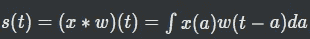*

*通配符运算符 ***(x*w)*** 代表卷积，输出***【s(t)***通常称为*特征图*。*

*该算子可以扩展到离散函数，这是在一维 CNN 上使用的情况(例如用于时间序列的情况):*

*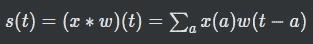*

*而在 2D 卷积的情况下，非常用于图像处理，并且考虑到将*I 作为输入图像，并且将 ***K*** 作为二维核，卷积可以表示为:**

**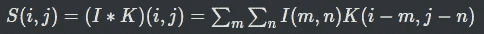**

**通常核比图像小，卷积使用一个核来处理整个图像。由于简化的表示，每个卷积核(或层)需要学习少量的参数。**

**另一方面，由于标准 ann(人工神经网络)使用权重矩阵将给定层的神经元连接到前一层的输出，每个权重将代表一个单一的连接，因此对于相同的任务，ann 将需要学习比等效 CNN 多得多的参数。**

# **图像卷积**

**正如我已经说过的，卷积广泛用于图像处理。通过改变使用的内核，有可能操纵模糊和形状，改变图像的风格或检测其边缘。下图显示了一些不同内核在基础映像上的应用。**

**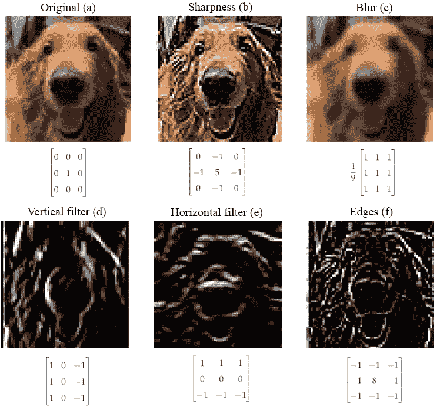**

**在基础映像上使用不同的内核。内核是在它们各自的图像下表示的矩阵。图片作者。**

**核应用于图像的每个像素，核和图像受影响区域之间的卷积运算的结果将成为输出图像上的新像素，如下图所示。但是，内核不能应用于边界像素，因为内核的一部分会在图像之外，因此，生成的图像比原始图像稍小。**

**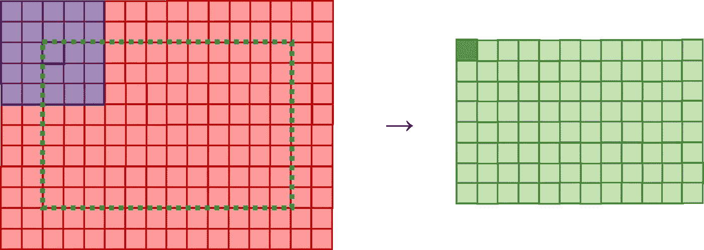**

**图像上的二维卷积。内核(蓝色)应用于图像(红色)。操作的结果将成为输出图像的新像素(绿色)。由于内核不能应用于真实图像之外，因此绿色区域是卷积发生的地方，从而产生一个稍小的图像。在卷积过程中，内核将滑过原始图像。图片作者。**

**在上图中，5x5 内核(蓝色)与 16x12 图像(红色)的卷积将产生 12x8 图像(绿色)。新的宽度和高度可以用下面的公式计算:**

**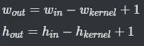**

**在 CNN 上，我们认为卷积是网络的一层，但是每层可以有一个以上的核。输出将具有与内核数量相同的特征映射。**

**例如，具有 4 个内核的卷积层接收尺寸为(***win***x***hin***x 1)的灰度图像，将产生尺寸为(***wout***x***hout***x 4)的矩阵作为输出。该矩阵将不再被认为是图像，而是对应于由该层的四个内核检测的特征的一组四个特征图。**

**通过在构成网络结构的层上链接特征地图和内核，CNN 可以捕捉图像上存在的各种特征，这是允许这些网络学习识别物体和其他特征的过程。**

# **多核过滤器**

**在多通道图像中，如 RGB 图像或由网络内层产生的特征图，卷积将在每个通道一个核的情况下发生。所有这些内核一起形成一个*滤波器*，每个滤波器的内核数量与输入图像的通道数量相同。**

**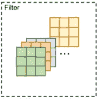**

**多核过滤器示例。图片作者。**

**每个滤波器将产生一个单一的特征图，因此我们需要通过求和或求平均值来聚集各个内核的输出，从而产生该滤波器的单一输出。**

**使用 ***n*** 滤镜的图层将生成 ***n*** 特征地图作为图层的输出。**

# **填料**

**为了避免图像边缘像素上的内核卷积问题，我们可以在输入上应用*填充*。我们可以通过简单地在边框上添加更多的像素来放大它。**

**下图说明了三种类型的填充:零填充*(a)在输入图像的周界上插入值 0；将内部像素反射到边界上的*反射填充*；以及用常数值(包括 0)填充新边框的*常量填充* (c)。***

**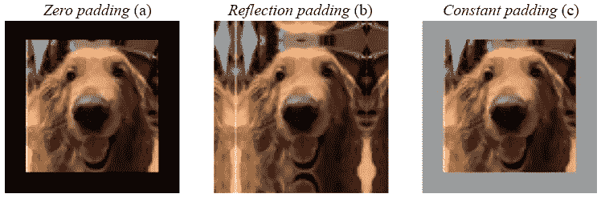**

**填充边界的大小可以由网络的创建者决定，但通常我们选择一个值来消除输出图像上的缩减效果。我们可以用下面的公式计算新的尺寸:**

**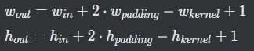**

# **联营**

**当网络学习最佳滤波器以仅从图像中提取相关特征时，每个滤波器也将产生噪声和与后续层不相关的信息。我们可以在卷积示例中看到，边缘检测器发现了一些不属于狗的像素。**

**池技术用代表像素组的值来代替像素组。下图说明了大小为 2 的`MaxPool`，它将像素分组为 2x2 的正方形，并用最强像素的值替换整个组。类似地，我们可以执行`AvgPool`，其中产生的像素是组的平均强度。**

**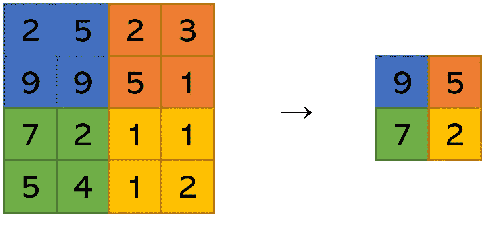**

**最大池操作。图片作者。**

**作为池层的直接结果，信息被压缩，只保留对后续层最重要的信息并减少干扰。输出也减少了一个因子，该因子取决于池大小(在本例中，输出的宽度和高度是输入的一半)，因此每个卷积需要处理的像素更少，结果网络变得更有效。**

**下图说明了`MaxPool`和`AvgPool`在应用于狗图像的边缘检测器结果中的应用。**

**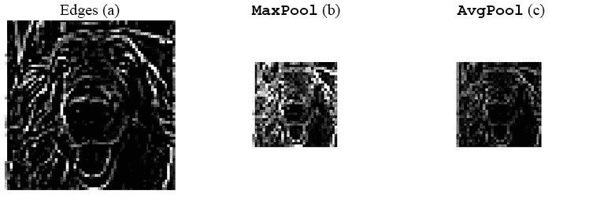**

**池技术在边缘图像上的应用。图片作者。**

**`MaxPool`的另一个重要方面是，它使网络对输入端的小转换更加健壮。由于相邻像素被所有像素中的最高值替换，如果转换将最重要的像素保留在同一组中，结果将保持不变。**

# **进展**

**我们还可以使用步长卷积来降低图像(或特征图)在各层中的维数。stride 参数表示每次迭代后内核将行走多少像素(或矩阵元素)。**

**在前面的例子中，我们使用了 stride = 1，这意味着内核将移动到下一个像素，当一行结束时，它将继续下一行。下图的上半部分通过对红色输入应用 5x5 内核来说明这种情况。蓝色方块代表每次迭代中内核的中心。**

**图片的下半部分代表步幅= 2 的情况。在这种情况下，当在行上行走时，内核将跳过一个像素，当行结束时，它也将在继续之前跳过一整行。正如我们所看到的，内核停止的像素比前一种情况少，所以生成的图像更小。**

**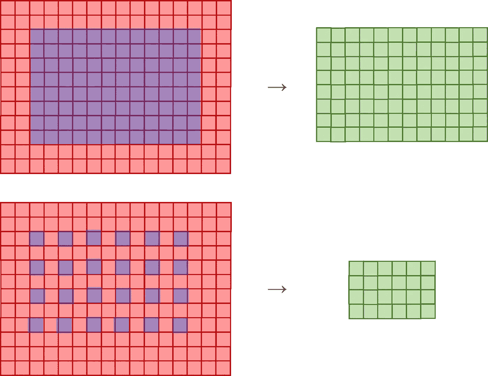**

**比较跨距= 1(上)和跨距= 2(下)的卷积。产生的输出大小不同。图片作者。**

**当我们想要恢复小于输入的输出时，维数减少是很重要的，例如编码器想要压缩图像，或者二进制分类器有一个单一的值作为输出。**

**我们可以为宽度( ***wstride*** )和高度( ***hstride*** )定义不同的步幅，因此可以使用下面的表达式来计算得到的尺寸。**

**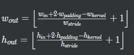**

# **转置卷积**

**在其他应用中，我们可能希望在一层之后增加输出的维度。一些生成方法通常从压缩表示(如潜在向量)开始，并通过层增加维度，直到输出生成最终图像。**

**实现这一点的一种方法是使用转置卷积(很多时候会被反卷积误操作)，即在输入图像通过“传统”卷积之前，结合使用填充和步幅来放大输入图像，从而使输出大于输入。**

**下图说明了通过使用核为 3x3 且步幅= 1 的转置卷积，从 3x3 输入生成 5x5 图像的过程。**

**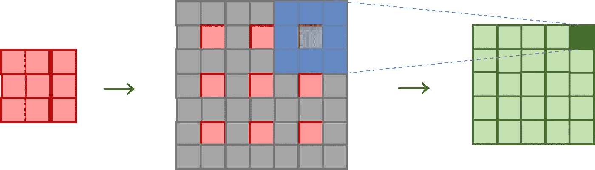**

**转置卷积。图片作者。**

**在 5x5 图像中，内核为 3x3 且步幅= 1 的“传统”卷积将生成 3x3 特征图作为输出，因此我们需要使用相同的参数执行转置卷积，以实现相反的操作。**

**它分两步走:**

1.  **图像将在其原始像素(红色)之间以及边界上插入零值像素(灰色)。**
2.  **现在，卷积将应用于放大的图像，内核为 3x3，步幅= 1。**

**为了计算转置卷积后的输出维数，我们可以使用以下公式:**

**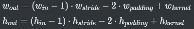**

**转置卷积并不是增加图层输出维度的唯一方法。其他架构使用传统的调整大小技术，如最近邻插值，然后是传统的卷积层。**

# **棋盘文物**

**转置卷积的一个缺点是，当通过图像时，内核会重叠，从而加强这些区域中像素的重要性。结果，生成的图像(或特征图)将具有周期性出现的*棋盘状伪像*。这种机制可以在下图中看到。**

**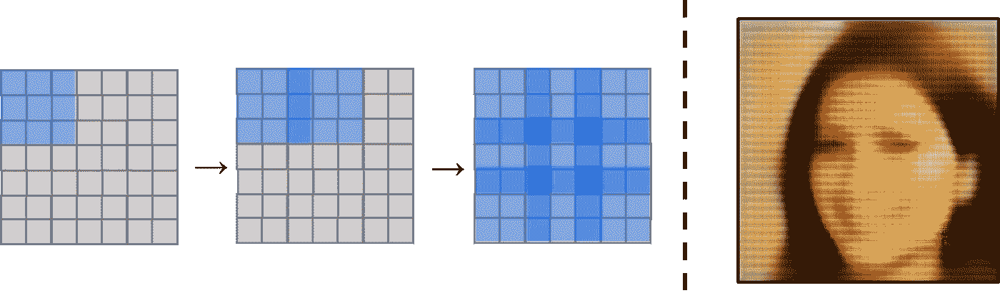**

**产生棋盘状伪像的机制。图片作者。**

**通过使用其他技术，如上面提到的调整卷积大小，我们可以避免这种影响。**

# **结论和意见**

**关于卷积有很多东西要学，但第一步是理解基础知识，我希望这篇文章对很多人有帮助。**

**这篇课文改编自我的硕士学位论文。**

**特别感谢我的狗布鲁斯，他好心地让我给他拍照并用作例子。他是最好的男孩。**

# **如果你喜欢这个帖子…**

**支持我一杯咖啡！**

**

给我买杯咖啡！** 

**看看这个很棒的帖子**

** [## 开始数据职业生涯的 5 个技巧

### 让我成为一名跨国公司数据科学家的步骤

towardsdatascience.com](/5-tips-to-start-a-career-in-data-211ad15a7ca8) 

# 参考

奥登纳等。艾尔。[反卷积和棋盘状工件](https://distill.pub/2016/deconv-checkerboard/)

古德费勒等人。艾尔。[深度学习。](https://www.deeplearningbook.org/contents/convnets.html)第九章:卷积网络

一般化和网络设计策略。技术报告 CRG-TR-89–4

Dumoulin，v .，Visin，F.: [深度学习卷积算法指南。arXiv:1603.07285 (2016 年)](https://arxiv.org/pdf/1603.07285.pdf)

拉德福德，a .，梅斯，l .，钦塔拉，S.: [深度卷积生成对抗网络的无监督表示学习](https://arxiv.org/pdf/1511.06434.pdf)。**