# 手动理解卷积与张量流

> 原文：<https://towardsdatascience.com/understanding-convolutions-by-hand-vs-tensorflow-8e64053f673e?source=collection_archive---------21----------------------->

## 你觉得我们可以手工匹配 TensorFlow 吗？你打赌！

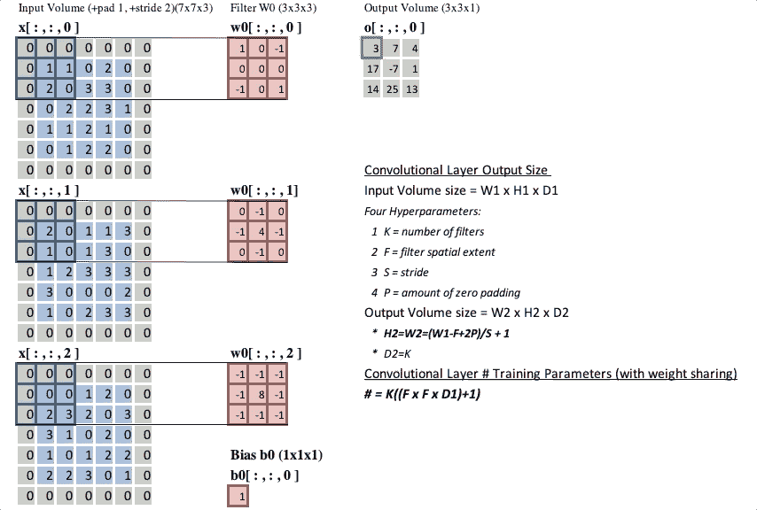

图片由作者提供，灵感来自[来源。](https://cs231n.github.io/convolutional-networks/)

# 1.目的

TensorFlow 和各种其他用于机器学习的开源库，如 SciPy，提供了这些用于执行卷积的内置函数。然而，尽管这些函数很好，但是打开引擎盖去发现代码背后的强大功能是值得的。在我看来，如果没有卷积层，计算机视觉就会像蝙蝠一样瞎。因此，我希望您喜欢这篇文章，因为我们将深入研究构成卷积层的卷积，并一起了解全局。

我为此制作的 Jupyter 笔记本在我的 [GitHub](https://github.com/stevensmiley1989/Convolutions_by_hand_vs_TensorFlow) 上。

# 2.背景

卷积对于计算机视觉中的深度学习任务来说并不新鲜。它们只是图像处理中使用的一种技术。在图像处理中，卷积运算是将输入图像的每个元素与其局部相邻元素相加的过程，通过内核进行加权。输出大小将取决于以下因素:

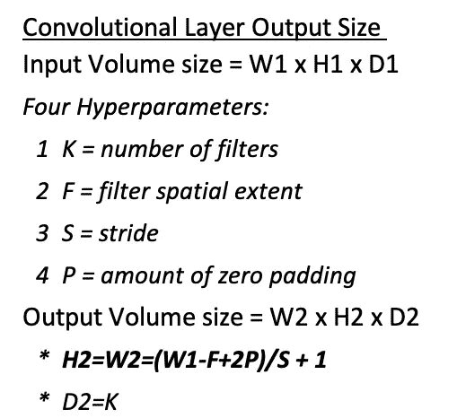

图片由作者提供，灵感来自[来源。](https://cs231n.github.io/convolutional-networks/)

# 3.输入过滤器

玉米粒有各种形状和大小。这些内核组成了滤波器，滤波器是卷积层中使用的一个参数。对于本文，我将坚持使用基于边缘检测的普通过滤器:

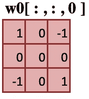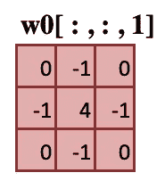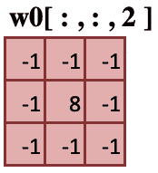

图片作者。

# 4.输入音量

为了便于对示例进行数学检查，我将使用 5x5x3 的随机输入量:

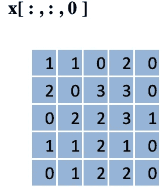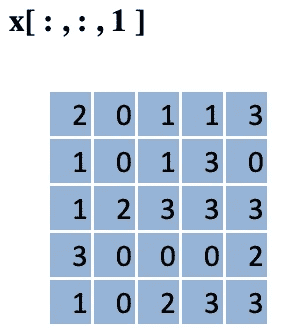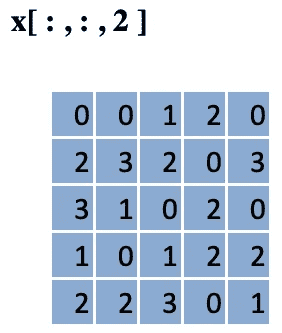

图片作者。

# 5.零填充

通常，零填充被添加到输入图像中。因此，在本例中，我将添加一个零填充，P=1，这将返回 7x7x3 的输入量:

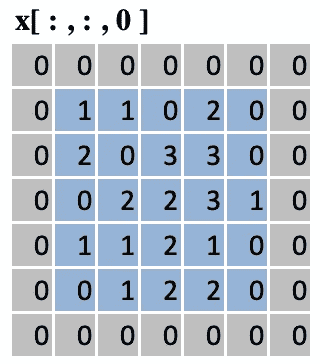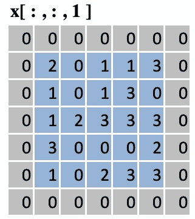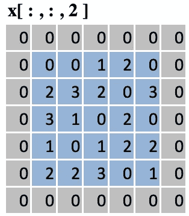

图片作者。

# 6.进展

对于这个例子，步幅将是 S=2。

# 7.手算输出量

将过滤器通过左上方输入体积的局部感受野:

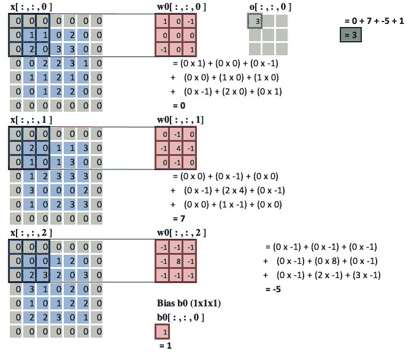

图片作者。

按步幅移动，S=2:

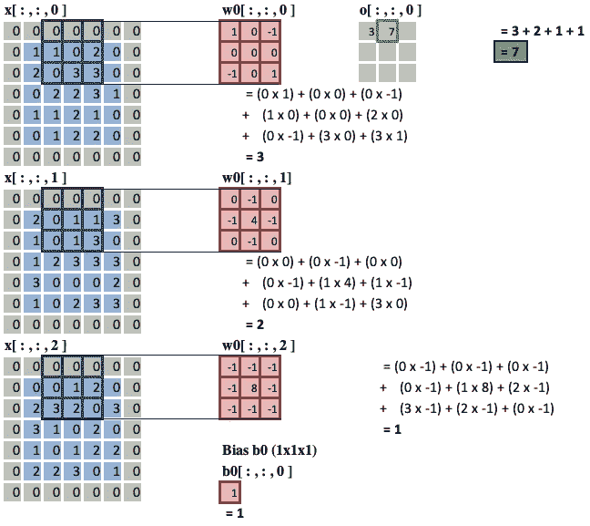

图片作者。

手动将它投入使用:

现在将过滤器通过整个输入体积:

图片由作者提供，灵感来自[来源。](https://cs231n.github.io/convolutional-networks/)

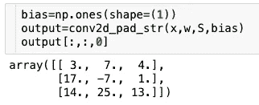

# 8.使用张量流

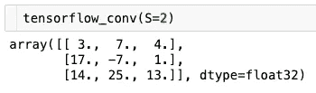

厉害！与我在上一节中手工做的相匹配。现在让我们试着以 S=1 的步幅传递一个图像。

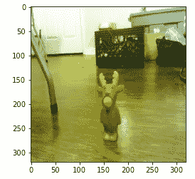

图片作者。

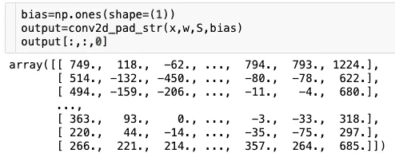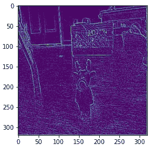

图片作者。

使用 TensorFlow:

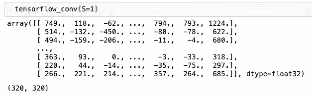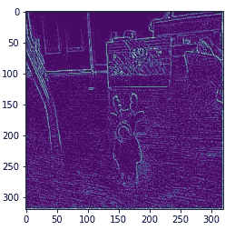

图片作者。

不出所料！TensorFlow 和手动定制功能产生相同的卷积图像。边缘检测过滤器现在真的更有意义了，因为你可以看到玩具驯鹿周围的线条。

这是卷积神经网络(CNN)如此伟大的原因之一。随着卷积层被训练，权重(核)被更新，并且有希望创建有意义的特征图，以使用训练过的模型来执行你的计算机视觉任务。

感谢您的阅读！我希望你已经学到了一些关于卷积的新知识，如果你还不能看到的话，我希望你能在这之后看到更大的图景。

# 9.参考

1.内核(图像处理)[[https://en . Wikipedia . org/wiki/Kernel _(图像处理)]](https://en.wikipedia.org/wiki/Kernel_(image_processing)])

2.TF . nn . conv 2d[【https://www.tensorflow.org/api_docs/python/tf/nn/conv2d】T2

3.Python。特拉维斯·奥列芬特。用于科学计算的 Python,《科学与工程中的计算》, 9，10–20(2007 年 b) K. Jarrod Millman 和 Michael Aivazis。面向科学家和工程师的 Python，科学与工程中的计算，13，9–12(2011)

4.张量流。马丁·阿巴迪、阿希什·阿加瓦尔、保罗·巴勒姆、尤金·布莱夫多、陈质枫、克雷格·西特罗、格雷格·科拉多、安迪·戴维斯、杰弗里·迪恩、马蒂厄·德文、桑杰·格玛瓦特、伊恩·古德菲勒、安德鲁·哈普、杰弗里·欧文、迈克尔·伊萨德、拉斐尔·约泽福维茨、杨青·贾、卢卡斯·凯泽、曼朱纳斯·库德鲁尔、乔希·莱文伯格、丹·曼内、迈克·舒斯特、拉杰特·蒙加、雪莉·穆尔、德里克·默里、克里斯·奥拉、黄邦贤·施伦斯、伯努瓦·施泰纳 TensorFlow:异构系统上的大规模机器学习，2015。tensorflow.org 提供的软件。

5.SciPy。保利·维尔塔宁、拉尔夫·戈默斯、特拉维斯·奥列芬特、马特·哈伯兰、泰勒·雷迪、戴维·库尔纳波、叶夫根尼·布罗夫斯基、皮鲁·彼得森、沃伦·韦克塞、乔纳森·布赖特、斯蒂芬·范德沃特、马修·布雷特、约书亚·威尔逊、贾罗德·米尔曼、尼古拉·马约罗夫、安德鲁·纳尔逊、埃里克·琼斯、罗伯特·克恩、埃里克·拉森、希杰·凯里、i̇lhan·波拉特、余峰、埃里克·摩尔、杰克·范德普拉斯、丹尼斯·拉克萨尔德、约瑟夫·佩尔(2019)SciPy 1.0-Python 中科学计算的基本算法。预印本 arXiv:1907.10121

6.NumPy。特拉维斯·奥列芬特。美国 NumPy 指南:特雷戈尔出版公司(2006 年)。(b)斯蒂芬·范德沃特、克里斯·科尔伯特和盖尔·瓦洛夸。NumPy 数组:高效数值计算的结构，科学与工程中的计算，13，22–30(2011)

7.IPython。费尔南多·佩雷斯和布莱恩·格兰杰。IPython:用于交互式科学计算的系统，科学与工程中的计算，9，21–29(2007)

8.Matplotlib。亨特，“Matplotlib:2D 图形环境”，《科学与工程中的计算》，第 9 卷，第 3 期，第 90–95 页，2007 年。

9.熊猫。韦斯·麦金尼。Python 中统计计算的数据结构，第 9 届科学中的 Python 会议录，51–56(2010)

10.sci kit-学习。法比安·佩德雷戈萨、加尔·瓦洛夸、亚历山大·格拉姆福特、文森特·米歇尔、贝特朗·蒂里翁、奥利维尔·格里塞尔、马蒂厄·布隆德尔、彼得·普雷登霍弗、罗恩·韦斯、文森特·杜伯格、杰克·范德普拉斯、亚历山大·帕索斯、戴维·库尔纳波、马蒂厄·布鲁彻、马蒂厄·佩罗特、爱德华·杜谢斯奈。sci kit-learn:Python 中的机器学习，机器学习研究杂志，12，2825–2830(2011)

11.sci kit-图像。斯蒂芬·范德沃特、约翰内斯·l·舍恩伯格、胡安·努涅斯-伊格莱西亚斯、弗朗索瓦·布洛涅、约书亚·d·华纳、尼尔·雅戈、伊曼纽尔·古亚尔特、托尼·于和 scikit-image 供稿者。sci kit-Image:Python 中的图像处理，PeerJ 2:e453 (2014)