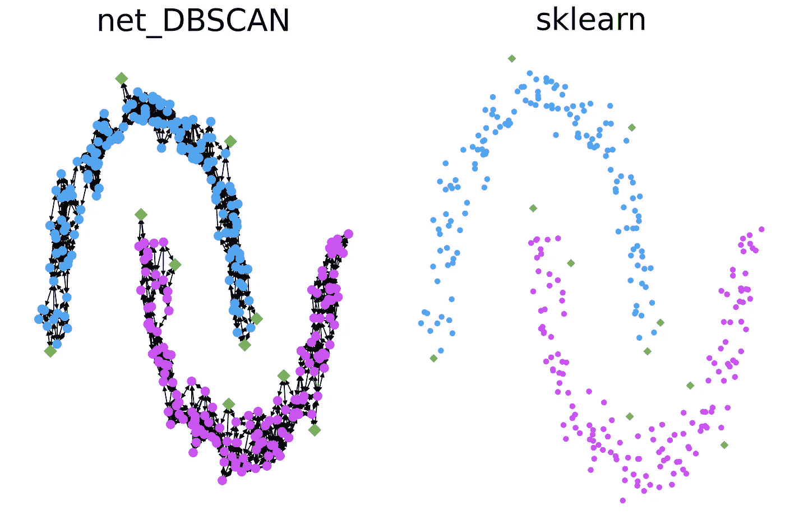
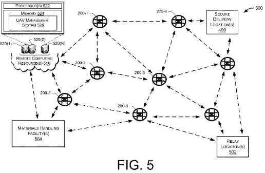
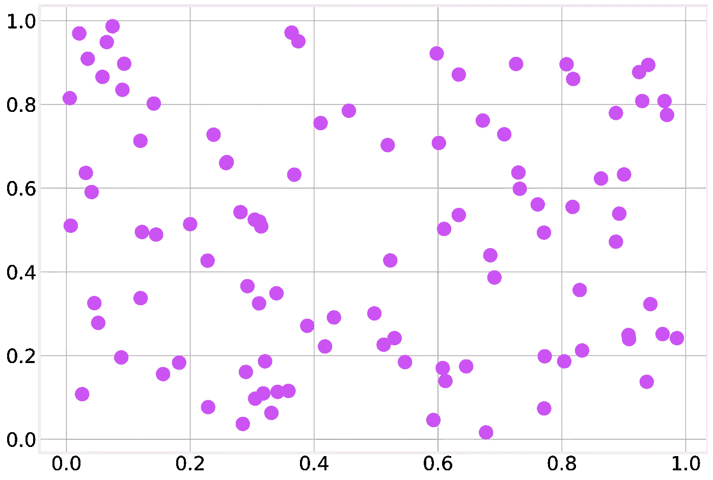
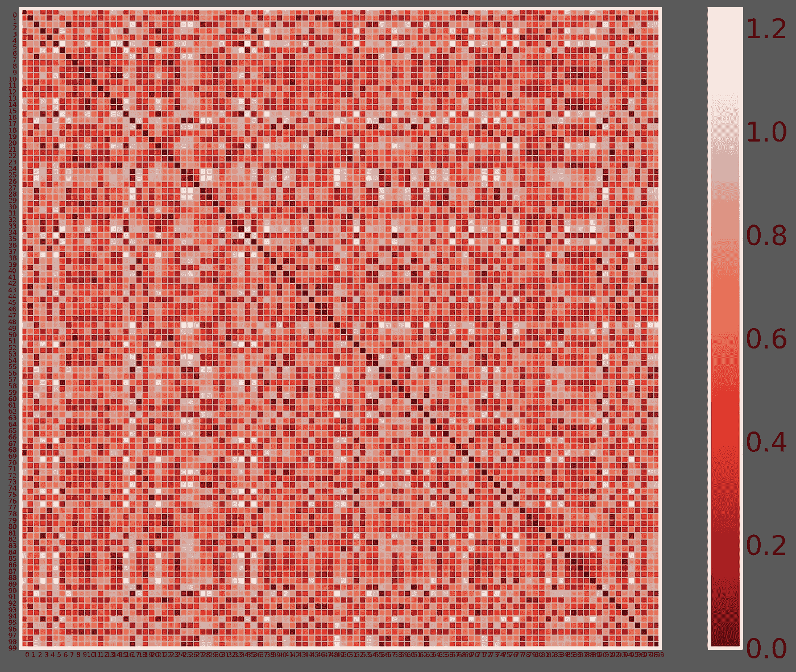
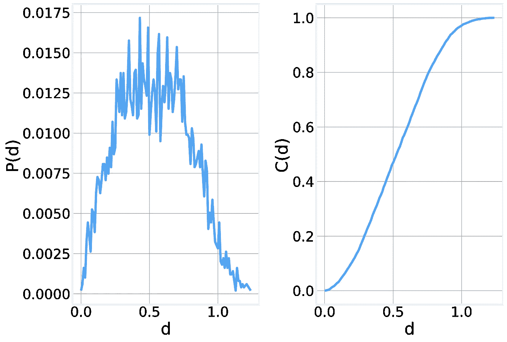
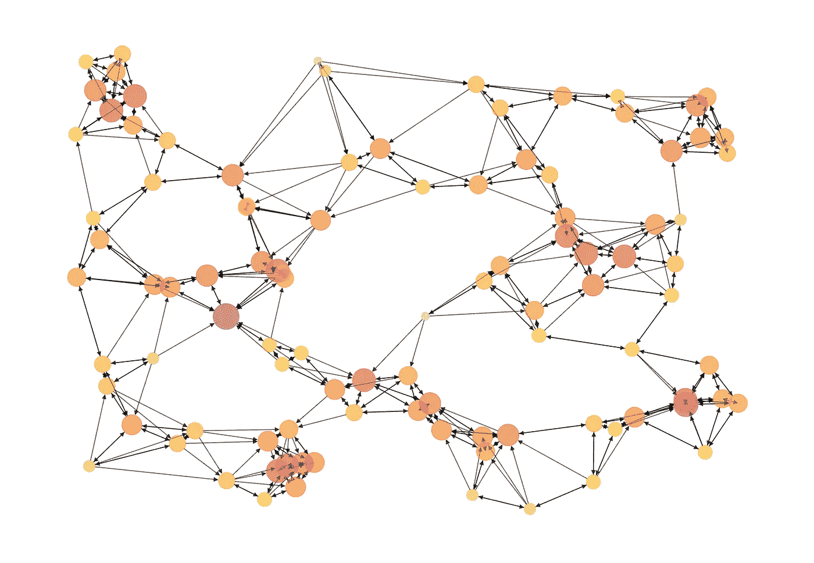
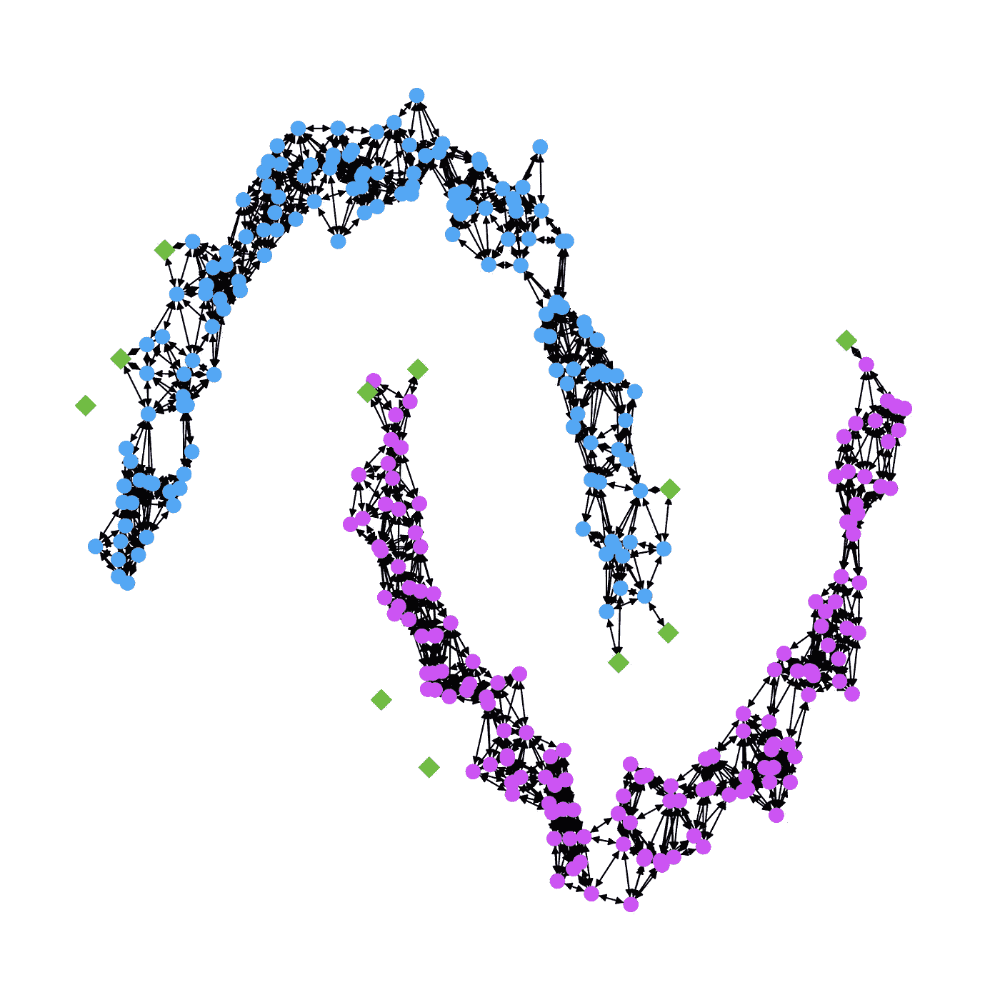

# 用随机几何图形理解 DBSCAN 和 K-NN

> 原文：<https://towardsdatascience.com/understanding-dbscan-and-k-nn-with-random-geometric-graphs-ed26cf5e5b71?source=collection_archive---------16----------------------->



作者提供的图片

## [实践教程](https://towardsdatascience.com/tagged/hands-on-tutorials)

## 从距离矩阵到图形

在这篇文章中，我们将更详细地探索空间网络的具体属性，并使用它们来深入了解两种流行的机器学习算法，[k-最近邻](https://en.wikipedia.org/wiki/K-nearest_neighbors_algorithm)和 [DBSCAN](https://en.wikipedia.org/wiki/DBSCAN) 。


我们从关注最简单的例子[随机几何图形](https://en.wikipedia.org/wiki/Random_geometric_graph) (RGG)开始探索空间网络。rgg 是通过简单地将节点随机放置在某个(比如说，2D)空间中，并在某个距离 d 内的任何一对节点之间添加一条边来构建的

虽然这种结构可能看起来像是只有最纯粹的数学家才会玩的那种东西，但它是一种令人惊讶的有用的图形结构，在现实世界中具有实际应用，例如用于近距离连接无人机的自组网络。



亚马逊最近甚至有一项这类应用的专利，你可以在 [USPTO](http://appft.uspto.gov/netacgi/nph-Parser?Sect1=PTO1&Sect2=HITOFF&d=PG01&p=1&u=%2Fnetahtml%2FPTO%2Fsrchnum.html&r=1&f=G&l=50&s1=%2220150120094%22.PGNR.&OS=DN/20150120094&RS=DN/20150120094) 阅读更多内容，内华达大学机器人实验室[的研究人员提出了一种](https://rrl.cse.unr.edu/en/)[无人机协调搜救行动的算法](https://rrl.cse.unr.edu/media/documents/2020/REU2019_Laik_Ruetten.pdf)。

# 随机几何图形

事不宜迟，让我们建造我们自己的 RGG。我们首先在单位正方形中随机放置 100 个节点:



下一步是连接在一定距离 d 内的所有节点。为此，我们计算包含所有节点对之间距离的距离矩阵。



计算全距离矩阵有点浪费，因为它需要 O(N)个工作。一种更复杂的方法是使用 [KDTrees](https://en.wikipedia.org/wiki/K-d_tree) 来实现线性性能，但这超出了本文的范围，因为我们只是试图熟悉这些概念，而不是开发一个实际的实现。

使用这个矩阵，我们可以很容易地计算每对节点之间的距离分布 P(d)和距离的累积分布 C(d)。



该分布遵循准钟形曲线(实际分布更有趣一点)。从累积分布可以清楚地看出，根据我们为 RGG 选择的阈值 d，我们将得到或多或少的边缘。

在 GitHub 存储库中，您可以使用一个交互式工具来查看距离矩阵和图形在您更改阈值时是如何变化的:


如果你更倾向于数学，你可以把这个阈值距离矩阵想象成图的一个[加权邻接矩阵](https://en.wikipedia.org/wiki/Adjacency_matrix)。在以后的文章中，我们会有更多关于邻接矩阵的内容，但是现在你需要知道的是，邻接矩阵只是一个矩阵，其中每个非零元素对应于两个节点之间的一条单独的边。

# k-最近邻

[k-最近邻](https://en.wikipedia.org/wiki/K-nearest_neighbors_algorithm)算法是一个众所周知的机器学习算法家族，可用于分类或回归。这两种情况下的基本思想都相当简单。如果你想知道一个新数据点的标签或值应该是什么，你可以咨询它的 k 近邻，然后简单地采用大多数。k 的具体值是在训练模型时必须定义的超参数。

与随机几何图形的联系现在应该很清楚了。我们简单地将每个节点与其 k 个最近的节点连接起来，而不是仅仅将每个节点与某个距离 d 内的所有其他节点连接起来。

当我们玩这个游戏，并连接每个先前的节点到它的 5 个最近的邻居，我们得到:


如果你仔细检查这个矩阵，你会开始注意到一些不寻常的东西。它是不对称的！确认这一点最容易的地方是沿着主对角线，你偶尔会注意到一边有一个值，而另一边没有。这似乎是一个非常奇怪的结果。如果我们的距离度量是对称的，欧几里德距离肯定是对称的，那么网络怎么可能不是对称的呢？原因可以用一个简单的例子来说明。

想象一下，由于某种奇怪的命运转折，你发现自己完全孤独，迷失在撒哈拉沙漠中。在那个时刻，地理上离你最近的 5 个人可能在最近的城市，但是他们都有比你更近的人！你只是一个古怪的异类。验证这种直觉的一种方法是检查节点的入度分布。您会发现，与每个节点恰好有 k 条传出边的出度不同，一个节点可以有更多或更少的传入边，这取决于它与聚类外围的接近程度以及有多少离群值。

这是关于 k-NN 算法的基本观点。更中心的节点将通过许多短距离链路连接，而离群点将连接到较远且具有很少或根本没有传入边的节点。

一个形象化的观点可以让我们明白这一点。这里我们绘制了与上图中的距离矩阵相对应的有向图。如果你仔细观察靠近图中心的孤立节点，你会注意到，虽然它有 5 条长的向外的边，但由于它的外围位置，它只有一条向内的边……迷失在撒哈拉沙漠的中央。



自然，如果我们要测量这个图中的距离分布，它看起来会与我们之前看到的非常不同，因为我们严格限制了允许的距离，只保留每个节点的 k 个最短外出边。

# 基于密度的噪声应用空间聚类

基于密度的含噪声应用空间聚类(DBSCAN)是一种无监督聚类算法，其明确目标是以有效的方式识别任意形状的聚类。最初的 KDD 论文[将算法](https://citeseerx.ist.psu.edu/viewdoc/download;jsessionid=EB3E94BE87F0E7733696B6EB06D29997?doi=10.1.1.121.9220&rep=rep1&type=pdf)概括为:

> *为了找到一个聚类，DBSCAN 从一个任意点 p 开始，并从 p wrt 中检索所有密度可达的点。Eps 和 MinPts。如果 p 是一个核心点，这个过程产生一个聚类 wrt。Eps 和 MinPts(见引理 2)。如果 p 是一个边界点，没有点是从 p 密度可达的，DBSCAN 访问数据库的下一个点。*

我们可以通过将该算法转换成网络算法来更直观地表达该算法，该网络算法明确地利用了我们上面讨论的 RGG 和 k-NN 算法的特征。DBSCAN 通过连接(用有向边)距离小于一定距离的点(节点)来识别数据集中的聚类(就像在 **RGG** s 中一样)。外围节点和离群节点的输出少于 k(就像在**中的 k-NN** )。相比之下，任何在规定距离内有 k 个或更多邻居的节点称为“核心节点”。最后，数据中的聚类可以用结果图中的连接组件来唯一标识。

这种显式构建每个节点的邻域的方法计算量大，需要 O(N)存储空间，而更有效的实现(如原始论文中的实现)可以显著降低内存和计算需求。

```
def net_DBSCAN(X, eps=0.17, min_samples=5):
    # Building the neighborhood matrix and truncate it 
    # at the maximum distance
    matrix = distance_matrix(X, X)
    matrix[matrix >= eps] = 0 # Build the directed graph using the non-zero elements of the matrix
    G = nx.DiGraph()
    G.add_edges_from(np.asarray(np.nonzero(matrix)).T) # Create an undirected version of the network for ease of core computation
    G2 = G.to_undirected() # Find all core nodes
    results = {}
    results['core_sample_indices_'] = [node_i 
                                for node_i, k in G2.degree() 
                                     if k >= min_samples-1] # Use the connected components to label each node 
    # as belonging to each cluster
    labels = []
    for label, comp in enumerate(nx.connected_components(G2)):
        for node in comp:
            labels.append(label) results['labels_'] = np.asarray(labels)
    results['G'] = G # Identify the outlier nodes.
    results['non_core'] = set(np.arange(X.shape[0])) - set(results['core_sample_indices_']) return results
```

当我们将上面的代码应用到 two moons 数据集时，我们得到:



其中蓝色和紫色表示数据集中的两个集群，绿色方块表示“非核心”节点。与 sklearn 实现完美匹配:


我们希望你喜欢这种看待古老的 k-NN 和 DBSCAN 算法的方式，并对它们如何工作有了新的认识。你可以在我们的伙伴 GitHub 库【https://github.com/DataForScience/Graphs4Sci找到这篇文章中分析的所有代码

当然，别忘了[注册](https://graphs4sci.substack.com/subscribe?utm_medium=web&utm_source=subscribe-widget&utm_content=32043787)我的时事通讯，这样你就不会错过另一篇文章了。