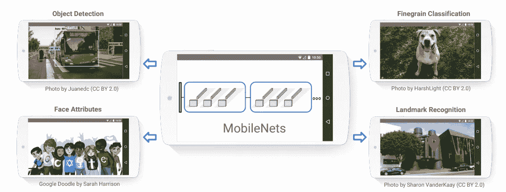

# 理解深度可分卷积和移动网络的效率

> 原文：<https://towardsdatascience.com/understanding-depthwise-separable-convolutions-and-the-efficiency-of-mobilenets-6de3d6b62503?source=collection_archive---------5----------------------->

## 移动网和深度可分卷积的解释

## 简介:

在卷积神经网络(CNN)中，2D 卷积是最常用的卷积层。MobileNet 是一种 CNN 架构，速度更快，模型更小，使用了一种新的卷积层，称为深度方向可分离卷积。由于模型的尺寸较小，这些模型被认为对于在移动和嵌入式设备上实现非常有用。因此得名 MobileNet。

关于 MobileNets 的原始论文可在此处获得— [MobileNets:用于移动视觉应用的高效卷积神经网络](https://arxiv.org/pdf/1704.04861.pdf)

表 1。MobileNet 与 GoogleNet 和 VGG 16 的参数和准确性比较(来源:原始论文中的表格)

表 1 清楚地显示了即使是最深入的 MobileNet 架构也比著名的 CNN 架构具有更少的参数。较小的 MobileNets 只有 130 万个参数。此外，模型的大小明显更小。虽然 VGG16 型号可以占用高达 500 MB 的磁盘空间，但 MobileNet 只需要 16–18MB。这使得它非常适合在移动设备上加载。

图一。MobileNets 可以用于移动设备上的对象检测、分类、属性检测，甚至是地标识别(来源:图片来自原论文)

## 深度方向卷积；

*差异* —

2D 卷积和深度卷积之间的主要区别在于，2D 卷积是在所有/多个输入通道上执行的，而在深度卷积中，每个通道保持分离。

*接近* —

1.  3 维输入张量被分成单独的通道
2.  对于每个通道，输入与滤波器(2D)进行卷积
3.  然后将每个通道的输出叠加在一起，得到整个 3D 张量的输出

*图形描述* —

图二。深度方向卷积的图解说明(来源:图片由作者创建)

## 深度方向可分离卷积；

深度方向卷积通常与另一个步骤(深度方向可分离卷积)结合使用。这包含两个部分— 1 .过滤(所有前面的步骤)和 2。组合(根据需要，组合 3 个颜色通道以形成“n”个通道——在下面的示例中，我们将看到如何组合 3 个通道以形成 1 个通道输出)。

图 3。深度方向可分离卷积的图解说明(来源:图片由作者创建)

## 为什么深度可分卷积如此高效？

*深度方向卷积是* -所有通道上的 1x1 卷积

假设我们有一个大小为 8x8x3 的输入张量，

并且期望的输出张量的大小是 8×8×256

**在 2D 回旋**——

所需的乘法次数—(8×8)x(5x5x 3)x(256)=***1，228，800***

**在深度方向可分离卷积中**

所需的乘法次数:

a.**滤波** —分成单通道，所以需要 5x5x1 滤波器来代替 5x5x3，由于有三个通道，所以需要的 5x5x1 滤波器总数为 3，所以，

(8x8)x(5x5x 1)x(3)= 3800

b.**合并** —所需通道总数为 256，因此，

(8x8) x (1x1x3) x (256) = 49，152

乘法总数= 3800+49152 =***53952***

因此，2D 卷积需要 1，228，800 次乘法运算，而深度方向可分离卷积只需要 53，952 次乘法运算即可达到相同的输出。

最后，

**1，228，800/53，952 = 23 倍减去所需乘法运算**

> *因此深度方向可分卷积的效率很高。这些是在 MobileNet 架构中实现的层，用于减少计算数量并降低功耗，以便它们可以在没有强大图形处理单元的移动/嵌入式设备上运行。*

# MobileNet

1.  使用 ***深度方向可分离卷积***
2.  使用两个 **S *收缩超参数*:**

a.*调整通道数量的宽度乘数*

表二。MobileNet 中的宽度乘数(来源:原始论文中的表格)

b.*分辨率倍增器*，调整特征图和输入图像的空间尺寸

表 3。MobileNet 中的分辨率乘数(来源:原始论文中的表格)

*架构*—MobileNet 的第一层是全卷积，而所有后续层都是深度方向可分离的卷积层。所有层之后是批量标准化和 ReLU 激活。最终分类层具有 softmax 激活。完整的架构如表 4 所示。

表 4。MobileNet 架构(来源:原始论文中的表格)

图 4。左:标准卷积层，右:MobileNet 中深度方向可分离的卷积层(来源:图片来自原论文)

图 4 显示了普通 CNN 模型和 MobileNets 在架构流程上的区别。在图像的左侧，我们看到一个 3x3 卷积层，后面是批归一化和 ReLU，而在右侧，我们看到深度方向可分离卷积层，由一个 3x3 深度方向卷积和一个批范数和 ReLU 组成，后面是一个 1x1 点方向卷积，再后面是一个批范数和 ReLU。

## 结论:

MobileNets 是专门为移动设备设计的非常高效的小型深度学习架构。由于尺寸较小，与较大的全卷积架构相比，精度会有所下降，但这种情况非常微小。例如，在 Stanford dogs 数据集上，Inception V3 模型的准确率为 84%，而最大的 MobileNet 的准确率为 83.3%。但是如果我们看看每个模型架构的参数数量，Inception V3 有 2320 万个参数，而 MobileNet 只有 330 万个参数。此外，仅仅通过使用宽度倍增器或分辨率倍增器，就可以制作更小更快的 MobileNet 版本。这使得 MobileNets 成为移动和嵌入式设备上非常受欢迎的深度学习模型。

接下来，我打算展示如何使用 TensorFlow 在 python 中从头开始创建 MobileNet 架构。

**参考文献:**

1.  Howard，A. G .，Zhu，m .，Chen，b .，Kalenichenko，d .，Wang，w .，Weyand，t .，Andreetto，m .和 Adam，H. (2017)。MobileNets:用于移动视觉应用的高效卷积神经网络