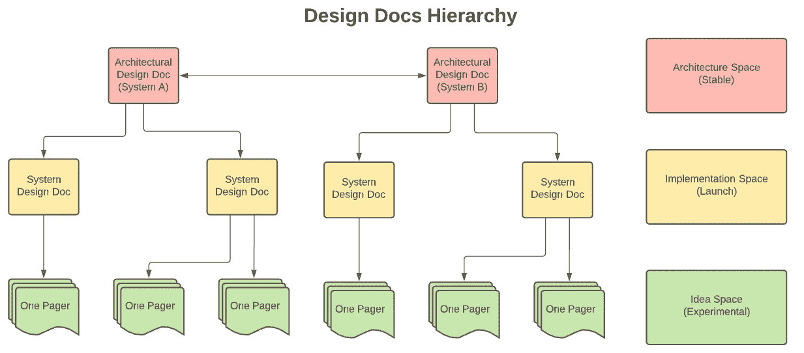

# 理解设计文档原则

> 原文：<https://towardsdatascience.com/understanding-design-docs-principles-for-achieving-data-scientists-53e6d5ad6f7e?source=collection_archive---------26----------------------->

## [行业笔记](https://towardsdatascience.com/tagged/notes-from-industry)《数据科学家生产力指南》

## 使用正确的设计文档有效运行您的数据项目

来源( [Unsplash](https://unsplash.com/photos/zYx5rjk8dfU)

> 一个好的设计文档离不开一个好的数据科学家和工程师——Vincent Tatan，Google ML 工程师
> 
> 在大多数情况下，工程师花了 18 个月的时间思考和撰写如何最好地为客户服务的文档。— [尤金·严](https://eugeneyan.com/writing/writing-docs-why-what-how/)，亚马逊数据科学家

上个月，我展示了设计文档不可否认的[重要性，它将设计文档解释为构建和运行机器学习系统的概念灯塔。](/the-undeniable-importance-of-design-docs-to-data-scientists-421132561f3c)

由于设计文档非常重要，我很乐意分享我创建设计文档的原则，以有力地执行您的数据项目。

# 为什么？

来源( [memegen](https://imgflip.com/i/xb96w) )

设计文档提供了 [**概念灯塔来指导您的数据项目**](/the-undeniable-importance-of-design-docs-to-data-scientists-421132561f3c) 。

*   **设计文档从概念上指导** **您**在每一步中理解您的目标、影响和执行，以使利益相关者受益。设计文件确保您的项目落地产生影响。
*   **设计文档为您节省设计时间**在执行之前突出实施和替代解决方案。
*   **设计文档主持团队间的讨论**，集体讨论最佳解决方案并实施数据项目。
*   **设计文档是永久的人工制品**为未来的合作巩固你的想法。

# 谁啊。

你的读者是你写设计文档的关键原因。在每篇设计文档中，你必须了解你的受众，例如:

*   你自己:确定学习旅程，集思广益，制定未来有影响力的项目。
*   **团队成员**:识别协作点、升级和系统特定影响。在设计文档中，您需要将您的假设与团队成员的现有知识保持一致。
*   **跨部门**:识别跨部门协作。你的设计文档需要传达先验知识和成功标准。
*   **高管**:做决策。您需要提供可靠的建议来推动高级指标(例如:用户采用率、收入和商誉)
*   **外部:**培养专业声誉和网络。你需要提供可靠的外卖，避免使用术语。

# **为合适的空间(环境)寻找合适的设计文档类型**

我想强调三种不同的环境，它们需要不同类型的设计文档。对于术语，我将强调这些环境为*解决方案空间:架构空间、实现空间和想法空间。*

具有各自解决方案空间的设计文档层次结构(由作者提供)

# 建筑空间(稳定)

## **设计文件特征**

*   **目标**:记录解决复杂问题并直接影响用户的系统的高层架构。
*   **主要受众**:高管、技术主管
*   **时间**:缓慢平稳。理想情况下，除非出现中断，否则它很少发生变化。

## 设计文件的类型

*   **架构文档**:记录具有明确目标的高层系统架构，例如，project Google Loon 旨在解决可靠的互联网基础设施匮乏的问题。
*   **北极星指标:**确定衡量高管沟通成败的关键指标。例如，在面向客户的应用中，衡量标准将是用户采用率，而 it 将在反滥用应用中保护用户。

# 实施空间(启动)

## 设计文档特征

*   **目标**:促进系统设计实施，例如数据存储、ML Ops、数据隐私访问等。该文档确保数据产品得到正确的发布、扩展和评估。
*   **主要受众**:技术领导、跨部门(尤其是上下游应用)
*   **时间**:中度变化

## 设计文件的类型

*   **系统设计**:突出系统实施流程图、上下游交互、数据存储、申诉等。
*   **时间表发布文档:**强调系统发布的进度和时间表。在谷歌，我们有标准的操作程序(SOP)来确保每次发布都得到适当的维护和扩展。
*   **隐私文档:**管理关于用户或其他敏感机构的机密数据。

# 想法空间(实验)

## 设计文档特征

*   **目标**:试验小的调整、想法头脑风暴和快速反馈收集。创意空间允许数据专业人员寻找创意，以快速产生重大影响。
*   **主要受众**:包括跨部门的所有人
*   **时间**:高度动态。每天都有一个寻呼机被起草、分析和丢弃。你的目标是迅速失败，然后继续前进。

## 设计文件的类型

*   **一页纸:**快速移动设计文档，以促进早期的想法审查。随着想法成长为成熟的概念，一页纸将被提升为两页纸和系统设计文档。
*   **学习之旅**:根据过去的演示、设计文档、发布的模型来确定学习之旅。在大公司，学习之旅对于跟踪跨部门和地区合作中快速发生的变化是必要的。
*   **执行前评估:**如果我们推出一个产品(例如:模型/调整)，预期的影响*是什么？*
*   **执行后评估**:在过去推出的产品后*有什么影响(例如:模型/调整)？*
*   **预分析:**当产品推出时，哪些*可能会出错*？
*   **事后分析:**过去推出产品后有哪些*出了问题*？

> “如果你不知道你想在你的演讲中达到什么目的，你的观众永远也不会知道。”—哈维·戴蒙德

# 管理设计文档的五个原则

这些是关于如何管理设计文档的简单指南。

1.  从想法开始:总是在一页纸上开始你的实验(想法空间)。创建一个思想实验，并在投入更多时间之前迅速进行头脑风暴。
2.  **在较低层次的空间投入时间:**空间越高(想法→实现→架构)，就应该投入更多的时间。最多花 1 周在一页纸上(想法空间)，1 个月在实施/分析空间，1 个季度/学期在架构空间。当然这取决于范围，但你得到了要点。
3.  **优先考虑有前途的 One Pagers:** 根据影响推广和调整你的 One Pagers。如果这个想法是为了交叉协作，花更多的时间考虑你的目标如何与高层空间(北极星度量、系统设计等)保持一致。
4.  **登陆北极星:**对于一般的成功指标，关注时间投入最低的想法(例如:对机器学习的小调整)，对北极星指标有很大影响。这有助于你为在更高的空间着陆打下坚实的基础。
5.  直接指向金块:你的设计文档需要尽可能直接地将观众指向金块。空间越高，这个金块应该越直接。

# 结论

**一般来说，通过了解这些原则，你将创建设计文档来帮助你:**

1.  在所有概念空间中导航动态的、不明确的或未被很好理解的项目。
2.  产生具有高影响力的项目，这些项目可以促进高管沟通。
3.  优化时间投资，以获得突出北极星指标的最佳效果。

我希望这篇文章能帮助您创建设计文档，并有效地运行您的数据项目。

索利·迪奥·格洛丽亚。

# 关于作者

文森特用 ML @ Google 对抗网络滥用。文森特使用高级数据分析、机器学习和软件工程来保护 Chrome 和 Gmail 用户。

除了在谷歌的工作，文森特还是《走向数据科学媒体》的特约撰稿人，为全球 100 多万观众的有志 ML 和数据从业者提供指导。

在空闲时间，文森特在佐治亚理工学院攻读硕士学位，并为铁人三项/自行车旅行进行训练。

最后，请通过 [**LinkedIn**](http://www.linkedin.com/in/vincenttatan/?source=post_page---------------------------) **，** [**Medium**](https://medium.com/@vincentkernn?source=post_page---------------------------) **或** [**Youtube 频道**](https://www.youtube.com/user/vincelance1/videos?source=post_page---------------------------) 联系文森特

# 参考

*   Eugene Yan post [如何为机器学习系统撰写设计文档](https://eugeneyan.com/writing/ml-design-docs/)
*   Clement Mihailescu 谈[什么是软件工程中的设计文档](https://www.youtube.com/watch?v=bgHL41e7vgI)