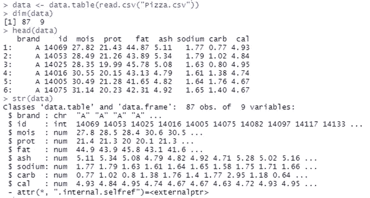
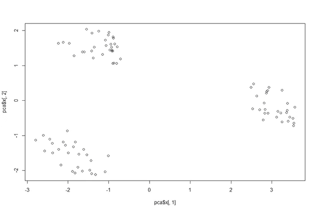
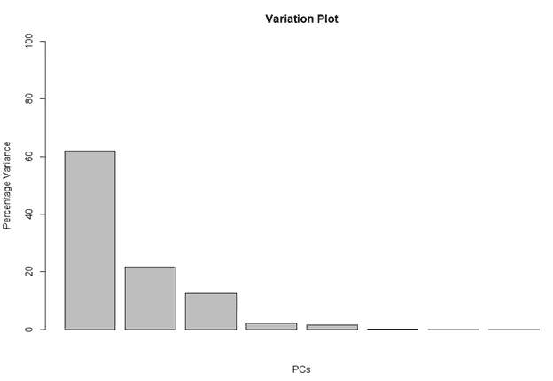
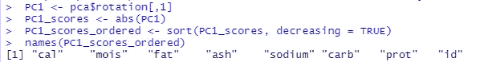
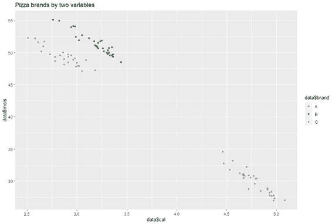

# 理解数据科学 R 中的降维和主成分分析

> 原文：<https://towardsdatascience.com/understanding-dimension-reduction-and-principal-component-analysis-in-r-e3fbd02b29ae?source=collection_archive---------10----------------------->

## 什么是降维，我们如何使用 R 中的主成分分析来确定重要的特征

当你在数据科学和分析领域工作时，处理高维数据是其中的一部分。您可能有一个包含 600 个甚至 6000 个变量的数据集，其中一些列在建模中被证明是重要的，而另一些是无关紧要的，一些是相互关联的(如体重和身高)，还有一些是完全相互独立的。我们非常清楚使用数以千计的特征对于我们的模型来说既乏味又不切实际，因此我们的目标是创建一个维数减少的数据集(全部不相关),以尽可能多地解释原始数据集中的变化。从高维数据到低维数据的转换需要我们提出 a)统计解决方案和 b)数据压缩活动，一种称为 PCA(主成分分析)的技术。


图片由 [@marcojodoin](https://unsplash.com/@marcojodoin) 在【unsplash.com】T2 上

在本文中，我们将讨论三个目标:

1.  理解降维的必要性

2.执行 PCA 并分析数据变化和数据组成

3.确定在数据识别中最有用的特征

***“PCA 是机器学习中的一种无监督学习技术，它通过显示数据集中的最大变化(通过关注实际区分数据的变量)，将高排名矩阵的维度降低为低排名矩阵，从而捕捉原始数据的本质。”***

PCA 产生主成分(等于特征的数量)，这些主成分按照方差的顺序排列(PC1 显示最大方差，PC2 显示第二大方差，依此类推)。为了更详细地理解这一点，让我们使用 r 中的 prcomp()函数来处理一个样本数据集。我使用了一个在[**data . world**](https://data.world/sdhilip/pizza-datasets)**(一个开源平台)**上可用的数据集，它为您提供了几种不同品牌的披萨的营养成分。我只保留了 A、B & C 品牌的披萨。csv 使我们的分析简单易懂。

**步骤 1:导入库并将数据集读入表格**

确保您在当前目录中。csv 被放置(使用 getwd())或者能够使用 setdw()将其更改为当前文件。

```
library(dplyr)
library(data.table)
library(datasets)
library(ggplot2)data <- data.table(read.csv("Pizza.csv"))
```

**第二步:理解数据**

这些函数告诉你 a)维数，即矩阵的行 x 列 b)数据的前几行和 c)变量的数据类型。

```
dim(data)
head(data)
str(data)
```



基本初始功能(图片由作者提供)

**第三步:获取主成分**

我们希望让我们的目标变量为空，因为我们希望我们的分析告诉我们有不同类型的比萨饼品牌。一旦我们完成了这些并复制了数据集以保持原始值，我们将运行 prcomp()。scale = TRUE，以便在分析前将变量缩放到单位方差。

```
pizzas <- copy(data)
pizzas <- pizza[, brand := NULL]pca <- prcomp(pizzas, scale. = TRUE)
```

## 关于 prcomp()需要知道的重要事情是，它返回 3 样东西:

1.  **x :** 存储数据的所有主要成分，我们可以使用这些成分来绘制图表，并了解 PC 之间的相关性。
2.  **sdev** :计算标准差，了解每台电脑在数据上有多少变化
3.  **旋转:**确定哪个加载分数对 PCA 图有最大影响，即最大坐标(绝对值)

**第四步:使用 x**

尽管目前我们的数据具有两个以上的维度，但我们可以使用 x 绘制我们的图表。通常，前几个 PCs 捕获最大方差，因此 PC1 和 PC2 绘制在下面以理解数据。

```
pca_1_2 <- data.frame(pca$x[, 1:2])

plot(pca$x[,1], pca$x[,2])
```



PC1 对比 PC2 图(图片由作者提供)

该图清楚地向我们展示了前两个 PCs 如何根据定义它们的特征将数据分成三个聚类(或 B & C 比萨饼品牌)。

**步骤 5:使用 sdev**

这里我们使用 sdev 的平方，并计算每台电脑的变化百分比。

```
pca_var <- pca$sdev^2pca_var_perc <- round(pca_var/sum(pca_var) * 100, 1)barplot(pca_var_perc, main = "Variation Plot", xlab = "PCs", ylab = "Percentage Variance", ylim = c(0, 100))
```



百分比变化图(图片由作者提供)

这个柱状图告诉我们，PC1 显示了几乎 60%的数据变化，PC2 显示了 20 %, PC3 显示了 12%,其余的 PC 捕捉到的数据变化很少。

**步骤 6:使用旋转**

这一部分解释了在区分比萨饼品牌时，哪些特征最重要；旋转将权重分配给特征(技术上称为负载), PC 的“负载”数组称为特征向量。

```
PC1 <- pca$rotation[,1]PC1_scores <- abs(PC1)PC1_scores_ordered <- sort(PC1_scores, decreasing = TRUE)names(PC1_scores_ordered)
```



(图片由作者提供)

我们看到变量*‘cal’*(样品中每 100 克的卡路里量)是区分品牌的最重要特征，其次是*‘mois’*(样品中每 100 克的水含量)，依此类推。

**第七步:利用两个最重要的特征区分品牌**

```
ggplot(data, aes(x=data$cal, y=data$mois, color = data$brand)) + geom_point() + labs(title = “Pizza brands by two variables”)
```



通过权重最大的柱形成聚类(图片由作者提供)

该图清楚地显示了如何代替数据集中给我们的 8 列，仅两列就足以理解我们有三种不同类型的比萨饼，从而使 PCA 成为一种成功的分析工具，将高维数据减少到较低的一列，用于建模和分析目的。

这篇文章背后的灵感来自于约翰·霍普斯金在 Coursera 上开设的数据科学专业的第三门课程和 Josh Starmer 的 StatQuest。