# 将离散卷积理解为多项式乘法

> 原文：<https://towardsdatascience.com/understanding-discrete-convolution-as-polynomial-multiplication-5f94a13acd55?source=collection_archive---------17----------------------->

## 卷积是数字信号处理中的一种基本运算

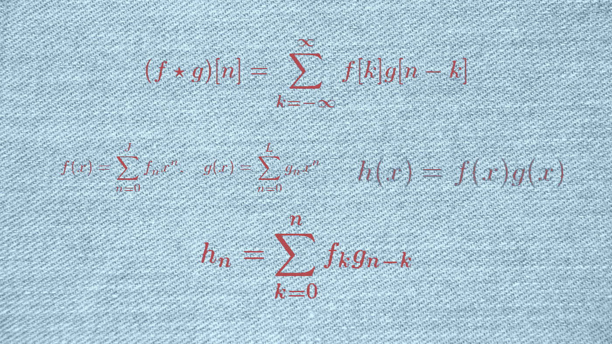

作者插图

卷积是数字信号处理中的基本运算。它通常由以下公式定义:

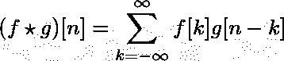

DSP 书籍从这个定义开始，详细解释如何计算。我们通过傅立叶变换了解了时域卷积与频域乘法的相同之处。有限和无限脉冲响应滤波器的操作用卷积来解释。这成为所有数字滤波器设计的基础。然而，卷积本身的定义仍然有些深奥。对我来说，这个定义一直有点神奇，直到我仔细研究了多项式代数。然后，关于这个定义如何自然产生的实现发生了。从那以后，它一直伴随着我。我妹妹今天让我解释卷积运算。最初，我试图用典型的 DSP 方法来解释，但毫无效果。最后，我回到了多项式乘法的方法，这对她来说是显而易见的。所以它来了。

考虑两个简单的多项式:

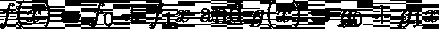

计算他们的产品:

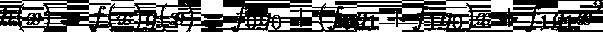

如果我们把 h(x)写成

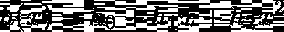

那么我们可以将 h(x)的系数匹配为:

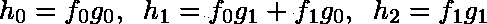

一种模式似乎正在形成。让我们更大胆地使用二次多项式:

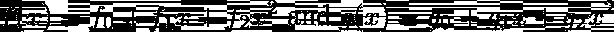

这是他们的产品:

h(x)现在具有系数为 4 的度:

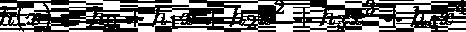

由以下等式给出:

是时候概括了。我们现在来看两个 J 次多项式 f(x)和 l 次多项式 g(x)。

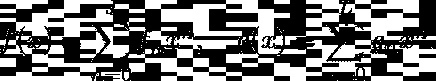

它们的乘积是 J+1 次多项式 h(x ):

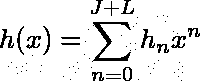

其中多项式系数由以下关系式给出:

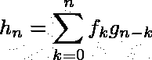

假设 f_k 和 g_k 对于没有指定它们的索引被假设为零。即，对于负 n，f_n 和 g_n 均为零，n > J 时 f_n 为 0，n > L 时 g_n 为零，建议读者检查 h_n 的定义是否与之前 1 次和 2 次多项式相乘的结果一致。事实上，如果我们忽略无穷和的收敛问题，那么假设多项式系数分别在 f(x)和 g(x)的指数[0，J]和[0，K]之外为零，那么将该公式写成:

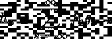

我们现在可以为多项式 f(x)，g(x)和 h(x)的系数形成(有限)序列 f[n]，g[n]，h[n]，并将卷积运算定义为:

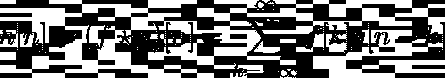

其中该定义源于将序列视为相应多项式的系数。

**总结**:如果我们把数字序列看成多项式的系数，那么它们的卷积不过是对应多项式的乘积。

**关于收敛性的一个注释**:一般来说，收敛对于有限序列来说不是问题。然而，它与 IIR 滤波器相关，因为它们的脉冲响应有无限多项。从实分析可以看出，如果序列 f_n 和 g_n 是绝对可和的，则卷积和是收敛的。即，如果总和:

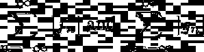

收敛，那么它们的卷积对每个 n 也收敛。