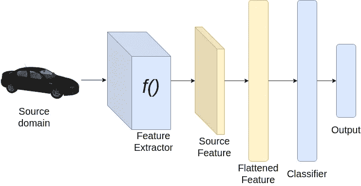
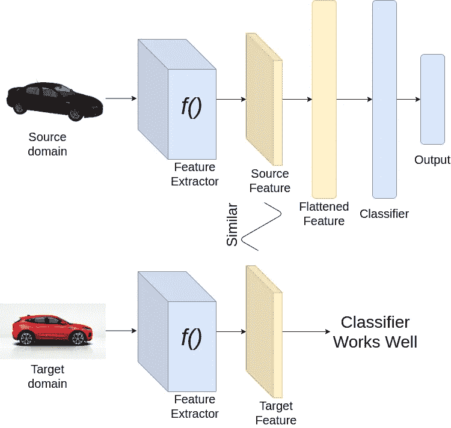
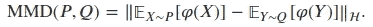
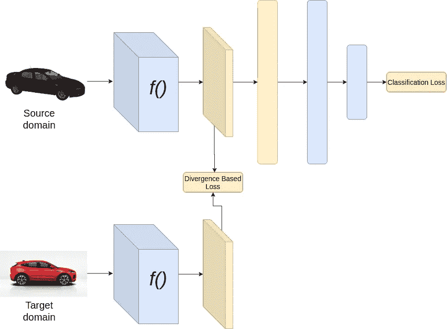
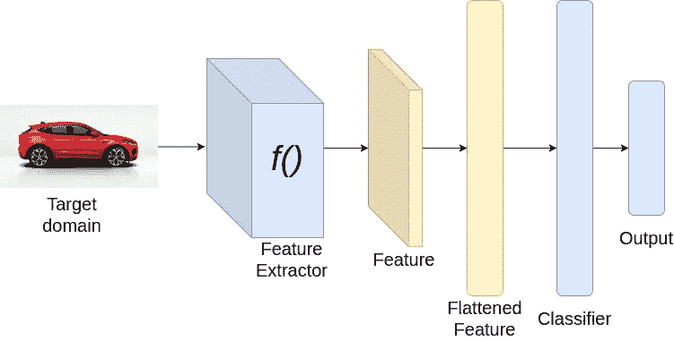
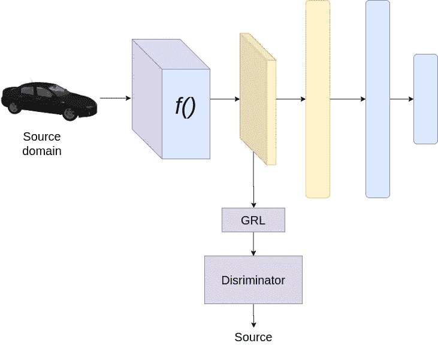
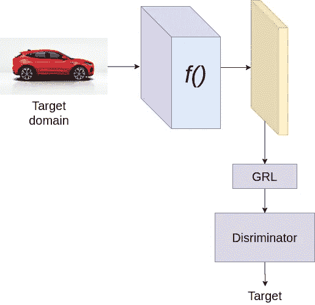
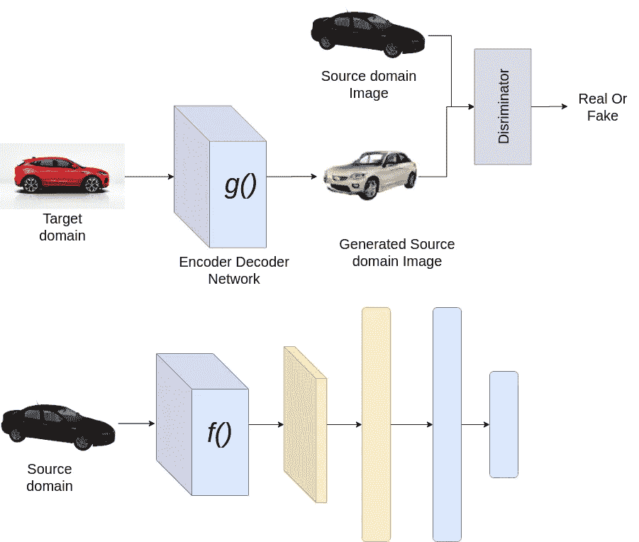
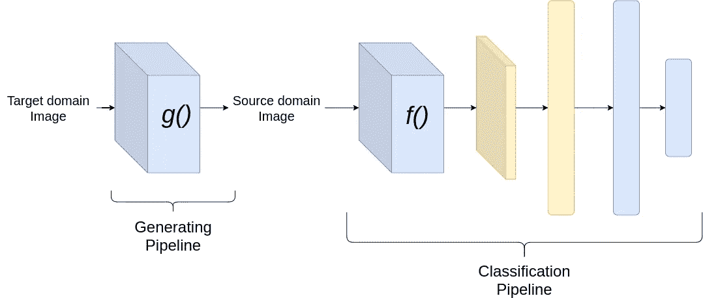

# 理解领域适应

> 原文：<https://towardsdatascience.com/understanding-domain-adaptation-5baa723ac71f?source=collection_archive---------1----------------------->

## 了解如何设计深度学习框架，使他们能够适应领域

詹妮弗·罗在 [Unsplash](https://unsplash.com?utm_source=medium&utm_medium=referral) 上的照片

注意——我假设读者对神经网络及其工作有一些基本的了解。

领域适应是计算机视觉的一个领域，我们的目标是在**源数据集**上训练神经网络，并在与源数据集显著不同的**目标数据集**上确保良好的准确性。为了更好地理解领域适配及其应用，让我们先来看看它的一些用例。

*   我们有许多用于不同目的的标准数据集，如用于德国交通标志识别的 GTSRB，用于交通灯检测的 LISA 和 LARA 数据集，用于对象检测和分割的 COCO 等。然而，如果你想让神经网络很好地完成你的任务，例如印度道路上的交通标志识别，那么你必须首先收集印度道路的所有类型的图像，然后为这些图像做标记，这是一项既费力又耗时的任务。这里我们可以使用域自适应，因为我们可以在 GTSRB(源数据集)上训练模型，并在我们的印度交通标志图像(目标数据集)上测试它。
*   在许多情况下，很难收集数据集，这些数据集具有训练健壮的神经网络所需的所有变化和多样性。在这种情况下，在不同计算机视觉算法的帮助下，我们可以生成大型合成数据集，这些数据集具有我们需要的所有变化。然后在合成数据集(源数据集)上训练神经网络，在真实数据(目标数据集)上测试。

*为了更好地理解，我假设我们没有可用于目标数据集/域的注释，但这并不是唯一的情况。请继续阅读进一步的解释。*

因此，在领域自适应中，我们的目标是在标签或注释可用的一个数据集(源)上训练神经网络，并在标签或注释不可用的另一个数据集(目标)上确保良好的性能。

分类管道(图片由作者提供)

现在让我们看看如何实现我们的目标。考虑上述图像分类的情况。为了从一个领域适应另一个领域，我们希望我们的**分类器能够很好地处理从源数据集和目标数据集**中提取的特征。因为我们已经在源数据集上训练了神经网络，所以分类器必须对源数据集表现良好。然而，为了使分类器在目标数据集上表现良好，**我们希望从源数据集和目标数据集提取的特征是相似的。**因此，在训练的同时，我们实施特征提取器来提取源和目标域图像的相似特征。

成功的域名改编(图片由作者提供)

# 基于目标域的域适应类型

根据可从目标域获得的数据类型，域适应可分为以下几类:

*   **监督的**-您已经标记了来自目标域的数据，并且目标数据集的大小与源数据集相比要小得多。
*   **半监督** —您既有目标域的已标记数据，也有未标记数据。
*   **无监督** —你有很多目标领域的未标记样本点。

# 领域适应技术

主要使用三种技术来实现任何域自适应算法。以下是用于领域适应的三种技术:

*   基于散度的领域适应
*   基于对抗的领域适应
*   基于重构的域适应

现在让我们一部分一部分地来看每一种技术。

## 基于散度的领域适应

基于散度的域适应的工作原理是**最小化源和目标分布之间的一些基于散度的标准，因此导致域不变特征**。常用的基于差异的标准有对比域差异、相关比对、最大平均差异(MMD)、Wasserstein 等。为了更好地理解这个算法，我们先来看一些分歧。

在最大平均差异(MMD)中，我们试图找出给定的两个样本是否属于同一分布。我们将两个分布之间的距离定义为特征的平均嵌入之间的距离。如果我们有两个分布，比如说集合 **X** 上的 **P** 和 **Q** 。然后用一个特征映射 *𝜑* 定义 mmd:**x**→**h**，其中 h 称为再生核希尔伯特空间。MMD 的配方如下所述

为了更好地理解 MMD，请看下面的描述 **— *如果两个分布的矩相似，则它们是相似的。通过应用一个核，我可以变换变量，使得所有的矩(一阶、二阶、三阶等)。)进行计算。在潜在空间中，我可以计算出矩之间的差，然后求平均值。***

在相关性比对中，我们尝试使用 MMD 中的线性变换来比对源和目标域之间的相关性(二阶统计量)。

训练期间(图片由作者提供)

推理过程中(图片由作者提供)

上面的架构假设源域和目标域具有**相同的类**。在上述架构中，在训练期间，我们最小化两个损失，分类损失和基于散度的损失。分类损失通过更新特征提取器和分类器的权重来保证良好的分类性能。而基于散度的损失通过更新特征提取器的权重来确保源和目标域的特征是相似的。在推断时间内，我们只需从我们的神经网络传递目标域图像。

所有的发散通常是非参数的和手工制作的数学公式，其不特定于数据集或我们的问题，如分类、对象检测、分割等。因此，这种基于公式的方法对于我们的问题来说并不是非常个性化的。然而，如果可以基于数据集或问题来学习散度，那么与传统的预定义散度相比，它有望表现得更好。

## 基于对抗的领域适应

为了实现基于对抗的领域适应，我们使用 GANs。如果你对 GANs 不太了解，请看这里的。

这里，我们的生成器只是特征提取器，我们添加了新的鉴别器网络，它学习区分源和目标域特征。由于这是一个双人游戏，鉴别器帮助生成器生成源域和目标域不可区分的特征。由于我们有一个可学习的鉴别器网络，我们学习提取特征(特定于我们的问题和数据集)，这有助于区分源域和目标域，从而帮助生成器产生更鲁棒的特征，即不容易区分的特征。

培训期间—来源(图片由作者提供)

训练期间—针对目标(图片由作者提供)

假设分类的问题，我们用的是两个损耗，分类损耗和鉴别器损耗。分类损失的目的在前面已经解释过了。鉴别器损失有助于鉴别器正确区分源和目标域特征。这里我们使用梯度反向层(GRL)来实现对抗性训练。GRL 块是一个简单的块，它在反向传播时将梯度乘以-1 或负值。在训练期间，为了更新生成器，我们有来自两个方向的梯度，第一个来自分类器，第二个来自鉴别器。由于 GRL，来自鉴别器的梯度乘以负值，从而导致训练发生器的效果与鉴别器的方向相反。例如，如果优化鉴别器损失函数的计算梯度是 2，那么我们用-2 更新生成器(假设负值是-1)。通过这种方式，我们试图以这样一种方式训练生成器，即使是鉴别器也不能区分源域和目标域的特征。GRL 层在许多关于领域适应的文献中非常常用。

## 基于重构的域适应

这是基于图像到图像翻译的思想。一种简单的方法是学习从目标域图像到源域图像的转换，并在源域上训练分类器。利用这个想法，我们可以引入多种方法。图像到图像转换的最简单模型可以是基于编码器-解码器的网络，并使用鉴别器来加强编码器-解码器网络，以产生与源域相似的图像。

训练期间(图片由作者提供)

测试期间(图片由作者提供)

另一种方法是我们可以使用自行车甘斯。在循环 GAN 中，我们使用两个基于编码器-解码器神经网络。一个用于将目标变换到源域，另一个用于将源变换到目标域。我们同时训练两个在两个域(源和目标)中生成图像的 gan。为了确保一致性，引入了**周期一致性损失**。这确保了从一个域到另一个域的变换，以及从一个域到另一个域的变换，会产生与输入大致相同的图像。因此，两个配对网络的全部损耗是两个鉴别器的 GAN 损耗和周期一致性损耗的总和。

# 结论

我们已经看到了三种不同的技术，它们可以帮助我们实现或实现不同的领域适应方法。它在图像分类、目标检测、分割等方面有着广泛的应用。在某些方面，我们可以说这种方法类似于人类学习视觉识别不同事物的方式。我希望这篇博客能让你对我们如何看待不同的领域适配管道有一个基本的了解。

*成为* [*介质会员*](https://medium.com/@AnveeNaik/membership) *解锁并阅读介质上的许多其他故事。关注我们的*[*Medium*](https://medium.com/@AnveeNaik)*，阅读更多此类博文*。