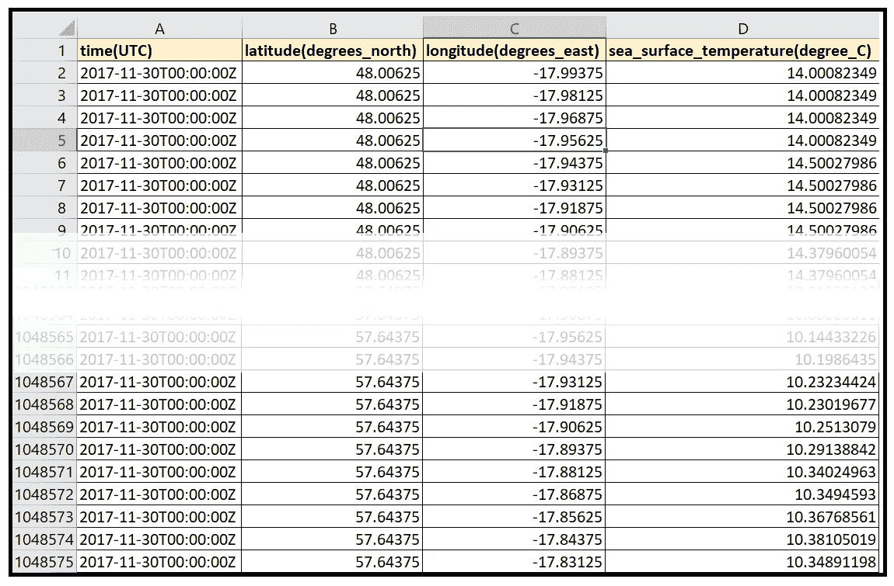
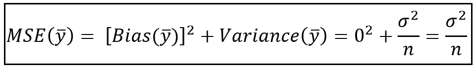

# 理解估计偏差和偏差-方差权衡

> 原文：<https://towardsdatascience.com/understanding-estimation-bias-and-the-bias-variance-tradeoff-79ba42ab79c?source=collection_archive---------19----------------------->


北大西洋的海面温度。图片来源: [NOAA OSPO](https://www.ospo.noaa.gov/Products/ocean/sst/contour/) 根据[使用条款](https://www.ospo.noaa.gov/Organization/About/use.html)

## 另外，如何根据偏差、方差和均方差来比较估计量

统计估计量可以根据其预测的偏差程度、其性能的一致性以及其预测的效率来评估。你的模型的预测质量取决于它所使用的估计器的质量。

在本文中，我们将详细介绍**偏差**的特性，并学习如何测量它。

通过一个叫做**偏差-方差权衡**的概念，估计者的偏差恰好与估计者预测的**方差**相结合，因此，我们也将学习这个概念。

最后，我们将讨论估计量的**均方误差**及其对回归建模的适用性，我们将展示如何使用偏差、方差及其均方误差的属性来评估总体均值的各种估计量。

# 什么是估计量？

估计量是用于预测或估计某个未知量的值的任何程序或公式，例如，您的航班的起飞时间，或今天的纳斯达克收盘价。

在我们的日常生活中，我们倾向于使用各种类型的估计量，甚至没有意识到这一点。以下是我们常用的一些估计类型:

## 基于好(或坏！)判断

你让你的股票经纪人朋友估计你最喜欢的股票一年后的价格会有多高。在这种情况下，你很可能得到价格的 [**区间估计**](/interval-estimation-an-overview-and-a-how-to-guide-for-practitioners-e2a0c4bcf108) ，而不是**点估计**。

## 基于经验法则和一些计算的估计量

你使用一些评估技术，比如[工作分解结构](https://en.wikipedia.org/wiki/Work_breakdown_structure)，来评估完成下一个家庭装修项目需要付出的努力。

## 基于轮询的估计量

你问奇数个朋友，他们认为谁会赢得下一次选举，你接受多数人的结果。

在每种情况下，你都希望估计一个你不知道的参数。

在统计建模中，均值，尤其是总体的**均值，是一个经常被估计的基本参数。**

让我们看一个现实生活中的数据样本。

以下是一年中特定时间东北大西洋表面温度的数据集:



[东北大西洋实时海表温度数据集](https://data.gov.ie/publisher/marine-institute)下载自 [data.world](https://data.world/marineinstitute/a88b89dc-401b-48ea-a917-4185d0c5d5d5) 下 [CC BY 4.0](https://creativecommons.org/licenses/by/4.0/)

这个数据集包含许多遗漏的读数。我们将通过将它加载到 Pandas 数据帧中并删除包含缺失温度值的所有行来清理它:

```
**import** pandas **as** pddf = pd.**read_csv**('NE_Atlantic_Sea_Surface_Temperatures.csv', **header**=0, **infer_datetime_format**=True, **parse_dates**=['time(UTC)'])df = df.**dropna**()**print**(df)
```

我们得到以下输出:


清除了所有 NaN 行的数据集(图片由作者提供)

在将近 800，000 个数据点(n=782，668)的情况下，这个数据集构成了一个非常大的数据样本。通常，你将不得不凑合使用十几个、几百个、偶尔几千个样本。

让我们打印出该示例中温度值的频率分布:

```
**from** matplotlib **import** pyplot **as** pltdf['sea_surface_temperature(degree_C)'].**hist**(**bins**=50)plt.**show**()
```

我们得到如下的情节:


东北大西洋温度值的直方图(图片由作者提供)

现在，假设我们希望估计整个东北大西洋的平均表面温度，换句话说，人口平均值。

这里有三种可能的总体均值估计量:

*   **估计值#1:** 我们可以取上述样本中最小和最大温度值的平均值:

```
y_min = df['sea_surface_temperature(degree_C)'].**min**()
y_max = df['sea_surface_temperature(degree_C)'].**max**()
**print**('**y_min**='+**str**(y_min) + ' **y_max**='+**str**(y_max))
**print**('**Estimate #1 of the population mean**='+**str**((y_max-y_min)/2))
```

我们得到以下输出:

```
y_min=0.28704015899999996 y_max=15.02521203Estimate #1 of the population mean=**7.3690859355**
```

*   **估计值#2:** 我们可以从样本中选择一个随机值，并将其指定为总体均值:

```
rand_temp = df.**sample**()['sea_surface_temperature(degree_C)'].**iloc**[0]
print('**Estimate #2 of the population mean**='+**str**(rand_temp))
```

我们得到以下输出:

```
Estimate #2 of the population mean=**13.5832207**
```

*   **估计值#3:** 我们可以使用下面的估计值，它平均出数据样本中的所有温度值:


人口平均值的估计值(图片由作者提供)

```
y_bar = df['sea_surface_temperature(degree_C)'].**mean**()
**print**('**Estimate #3 of the population mean**='+**str**(y_bar))
```

我们得到以下输出:

```
Estimate #3 of the population mean=**11.94113359335031**
```

我们应该使用哪个估计量？可以看出，第三个估计量——*y _ bar*，即 *n* 值的平均值——提供了*总体均值*的无偏估计。不过话说回来，前两个也是！

无论如何，这可能是更好地理解*偏差*概念的好时机。

# 估计偏差

假设你正在打篮球。当一些球穿过球网时，你会发现你大部分的投球都是在篮筐下的一点。在这种情况下，无论你用什么技术来估计投掷的正确角度和速度，都是低估了(未知的)角度和速度的正确值。你的估计值有负偏差。


一个有偏见的扣篮技术，似乎更多的时候，低于位于人物中心的篮子(图片由作者提供)

通过练习，你的投掷技术会提高，你也能更频繁地扣篮。从偏见的角度来看，你开始超过篮子的次数和低于篮子的次数差不多。你已经设法减少了评估技术的偏差。


一种更少偏见，更“平衡”的扣篮技术，在这种技术中，失误经常发生在图中心的篮筐两侧(图片由作者提供)

# 偏差-方差权衡

从上面两张图中，您可能会发现一个明显的方面，即在第一张图中，虽然偏倚很大，但遗漏镜头的“分散性”较小，导致结果的方差较低。在第二个图中，偏差无疑减少了，因为错过的镜头分布更加均匀，但这也导致了更高的分布，也就是更高的方差。

第一种技术似乎具有较大的偏差和较小的方差，第二种技术则相反。这不是巧合，很容易证明(事实上，我们将在后面证明！)在你的评估技术的偏差和方差之间有一个直接的交换。

# 如何计算估计量的偏差

让我们继续篮球的例子。我们可以看到篮筐的位置(两个图中间的橙色点)是保证扣篮的投掷角度和投掷速度的(未知)群体平均值的代表。失误(蓝点)代表你的技术对投掷角度和速度的总体平均值的估计。

用统计学的术语来说，每一次投掷都是一次产生结果的实验。结果的值是球(蓝点)在包含篮子的垂直平面上的位置。

如果你假设每一次投掷的结果都独立于前一次投掷(这在现实生活中几乎是不可能的，但是让我们一起玩吧！)，我们可以定义 *n* 个独立，同分布的随机变量 *y_1，y_2，y_3，…y_n* 来代表你的 *n* 投。

让我们回忆一下我们的 n 样本平均值估计量:


人口平均值的估计值(图片由作者提供)

请注意，这意味着 *y_bar* 与我们的样本 *n* 值有关，即 *n* 球投掷，或 *n* 海洋表面温度等。转到海洋温度的例子，如果我们收集另一组 *n* 海洋温度值并平均它们，我们将得到样本平均值 *y_bar* 的第二个值。大小为 *n* 的第三个样本将产生第三个样本平均值，依此类推。所以，样本均值 *y_bar* 本身就是一个随机变量。而且就像任何随机变量一样， *y_bar* 有一个概率分布和一个期望值，用 *E(y_bar)* 表示。

我们现在可以为总体平均值定义估计量 *y_bar* 的偏差如下:

总体均值的估计量 *y_bar* 的偏差，是样本均值 *y_bar* 的期望值与总体均值的差值。公式如下:


总体均值估计量的偏差(图片由作者提供)

一般来说，给定一个总体参数 *θ* (如平均值、方差、中位数等。)，以及 *θ* 的一个估计量 *θ_cap* ，则 *θ_cap* 的**偏差为 *θ_cap* 的期望值与总体参数 *θ* 的实际(真)值之差，如下:**


估计量的偏差 *θ_cap* 对于*总体参数*θ*(图片由作者提供)*

# 样本均值作为总体均值的无偏估计量

我们现在将展示我们之前看到的 n 个样本值的平均值估计器 *y_bar* ，在其预测总体平均值的能力中证明了**零偏差**。

使用偏差表达式， *y_bar* 的偏差由下式给出:


总体均值估计量的偏差(图片由作者提供)

现在，我们来计算 *E(y_bar)* :


样本均值 y_bar 的期望值(图片由作者提供)

随机变量 *y_1，y_2，y_3，…y_n* 都围绕总体均值*同分布。*因此，他们每个人都有一个期望值:


样本均值 y_bar 为零偏差(图片由作者提供)

零偏差估计器不一定是个好东西。事实上，回想一下我们也考虑过的平均表面温度的下列两个估计量:


人口平均数的另外两个估计值(图片由作者提供)

由于每个随机变量 *y_i* 的期望值是总体均值，估计器(1)和(2)各有一个偏差 *B(。)= E(y_bar)- = - =0* 。

但是常识告诉我们，估计量#(1)和#(2)明显劣于均值-of- *n-* 样本 *-* 值估计量#(3)。因此，必须有其他的性能度量，通过这些度量，我们可以评估 n- 样本值的平均值估计的适用性，并显示它优于其他估计。

其中一个度量是**均方误差** (MSE)。

# 估计量的均方误差及其在回归建模中的适用性

对于大多数处理回归模型的人来说，**均方误差**是一个熟悉的性能度量。诸如用于线性模型的普通最小二乘(OLS)估计器之类的一些估计器，以及一些神经网络估计器寻求最小化训练数据和模型预测之间的均方误差。

考虑回归模型的一般方程:


具有附加残差的回归模型的一般方程(图片由作者提供)

*其中，****y _ OBS****=【y _ 1，y_2，y_3，…y _ n】=训练数据样本，* ***X****=回归变量矩阵，* ***β_ cap****=拟合*

**是模型的预测。 *f(* ***X，β_cap)=y_cap*** 是观测值向量 ***y_obs 对应的拟合值向量。*** 所以，上面的模型方程可以简洁地写成如下:**

****

**带有附加残差的回归模型(图片由作者提供)**

**估计函数***y _ cap****= f(.)*是:**

****

**估计函数的均方误差 *f(* ***X，β_cap)*** *(图片由作者提供)***

**回归模型的估计函数通常会(但不总是)尝试最小化 MSE。**

**MSE 的上述等式可以用期望值的语言写成如下:**

****

**估计函数的均方误差 *f(* ***X，β_cap)*** *(图片由作者提供)***

**请注意，我们还颠倒了括号中术语的顺序，只是为了保持惯例。**

**从下图可以看出，上述两个 MSE 方程是等价的:**

****

**以期望值表示的 MSE 公式(图片由作者提供)**

**从上图中我们看到，常用的均方误差公式只是简单地假设每个均方差 *(y_i-y_cap_i)* 出现的概率均匀分布在区间*【0，n】，*上导致每个概率为 *1/n.***

**让我们回到估计量的 MSE 的一般公式:**

****

**估计函数的均方误差 *f(* ***X，β_cap)*** *(图片由作者提供)***

**假设我们使用 n 个样本值的平均值估计器 *y_bar* 。因此， *y_cap=y_bar* ，因此 *y_obs* 现在是理论上已知的(但实际上未观察到的)总体均值。因此，样本均值 *y_bar* 的 MSE 可以表示如下:**

****

***样本均值 Y_bar 的均方误差(图片由作者提供)***

**为了计算 *y_bar* 的 MSE，我们将使用期望理论的以下结果:**

****

**随机变量 Y 的期望和方差之间的关系(图片由作者提供)**

**将上述公式应用于 MSE 表达式的 R.H.S .,我们得到以下结果:**

****

**样本均值 Y_bar 的 MSE(图片由作者提供)**

**让我们检查上面等式的 R.H.S。正方形下面的第一项是 *E(y_bar-)，我们知道，它是样本均值 y_bar 的偏差。***

**因为总体均值是一个常数，所以 R.H.S. *方差(y_bar- )* 的第二项就是*方差(y_bar)* 。因此，R.H.S 是偏差(平方)和 *y_bar 的方差之和。***

**我们可以将这一发现归纳如下:**

**任何总体参数 *θ* 的估计量 *θ_cap* 的均方误差，是估计量 w.r.t. *θ* 的偏差 *B(θ_cap)* 与估计量 w.r.t. *θ* 的方差 *Var(θ_cap)* 之和:**

****

**偏差-方差权衡(图片由作者提供)**

**在估计任何数量时，人们常常以某个目标均方误差为目标。上述等式清楚地表明，为了实现指定的均方误差，必须在估计器的*偏差*和*方差*之间进行权衡。**

**当 *θ_cap=Y_bar，*n 个样本值的平均值时，我们可以计算 Y_bar 的 MSE，如下所示:**

****

**样本平均值的均方误差(图片由作者提供)**

**我们已经证明了样本均值是总体均值的无偏估计量。所以*偏置(y_bar)* 为零。让我们计算样本均值的方差。**

****

**样本均值的方差(图片由作者提供)**

**我们现在将使用 *n 个*独立随机变量 *y_1，y_2，y_3，…y_n* 的线性组合的方差的以下性质:**

****

**n 个独立随机变量线性组合的方差(图片由作者提供)**

**这里，*C1，C2，…，c_n* 是常数。将此结果应用于 *y_bar* ，我们得到:**

****

**独立同分布随机变量样本均值的方差(图片由作者提供)**

***y_1，y_2，y_3，…y_n* 不仅是独立的随机变量，而且是同分布的，因此它们都具有相同的均值和方差，并且等于这两个参数各自的总体值。具体来说，对于所有的 *i* ， *Var(y_i)* = *σ。*因此:**

****

**独立同分布随机变量样本均值的方差(图片由作者提供)**

**因此，我们已经表明*n-I . I . d .随机变量的平均值*估计量的方差是 *σ /n.***

****

**独立同分布随机变量样本均值的方差(图片由作者提供)**

**这个结果也证实了我们的直觉，随着样本量的增加，样本均值的方差应该减少。**

**将这一结果插回到公式中用于 *MSE(y_bar)* ，记住 *Bias(y_bar)=0* ，我们得到:**

****

**n 个独立同分布随机变量样本均值的均方误差(图片由作者提供)**

**现在让我们回到大西洋东北部表面温度的数据集。我们的样本量是 782，668。我们考虑了未知总体均值的以下三种估计量:**

****

**总体均值的三个候选估计值(图片由作者提供)**

**让我们使用偏差、方差和 MSE 的度量来比较三种估计器的性能，如下所示:**

****

**我们可以看到*n 个样本值的平均值*估计量(估计量#3)具有零偏差，并且在三个候选值中具有最低的方差和最低的均方误差。**

# **摘要**

*   **估计量是用来预测或估计某个未知量的值的任何程序或公式。**
*   **给定一个总体参数 *θ* (如平均值、方差、中位数等。)，以及 *θ* 的一个估计量 *θ_cap* ， *θ_cap* 的**偏差是 *θ_cap* 的期望值与总体参数 *θ的实际(真)值之差。*****
*   ****样本均值**，当表示为 *n 个*独立同分布随机变量的平均值时，**是总体均值**的无偏估计量。**
*   ***n* 独立同分布随机变量的样本均值**方差为 *σ /n* ，其中 *σ* 为总体方差。****
*   **估计量的**均方误差** *θ_cap* 是:1)其偏差的平方和 2)其方差之和。因此，对于任何期望的均方误差，在估计器输出的偏差和方差之间总是有一个折衷。**
*   **使用小偏差估计量的回归模型不一定比使用大偏差估计量的回归模型具有更高的拟合优度。还应该考虑估计量的其他属性，如 MSE、一致性和效率。**
*   **一些估计量，如最大似然估计量，并不寻求最小化均方误差。对于这样的估计器，人们使用[拟合优度度量来测量它们的性能，例如偏差](/the-complete-guide-to-r-squared-adjusted-r-squared-and-pseudo-r-squared-4136650fc06c)。**

# **参考文献和版权**

## **数据集**

**[东北大西洋实时海表温度数据集](https://data.gov.ie/publisher/marine-institute)下载自 [data.world](https://data.world/marineinstitute/a88b89dc-401b-48ea-a917-4185d0c5d5d5) 下 [CC BY 4.0](https://creativecommons.org/licenses/by/4.0/)**

## **形象**

**北大西洋的海面温度。图片来源: [NOAA OSPO](https://www.ospo.noaa.gov/Products/ocean/sst/contour/) 根据[使用条款](https://www.ospo.noaa.gov/Organization/About/use.html)**

**本文中所有其他图片的版权归 [Sachin Date](https://www.linkedin.com/in/sachindate/) 所有，版权归 [CC-BY-NC-SA](https://creativecommons.org/licenses/by-nc-sa/4.0/) 所有，除非图片下方提到了不同的来源和版权。**

***感谢阅读！如果你喜欢这篇文章，请* [***关注我***](https://timeseriesreasoning.medium.com/) *获取关于回归和时间序列分析的技巧、操作和编程建议。***