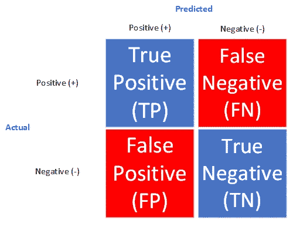
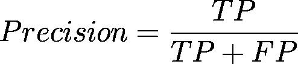
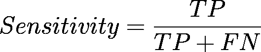
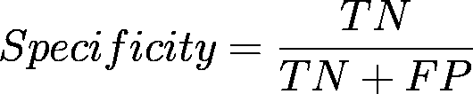
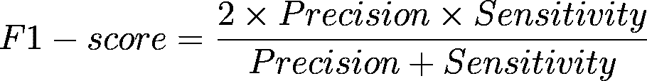
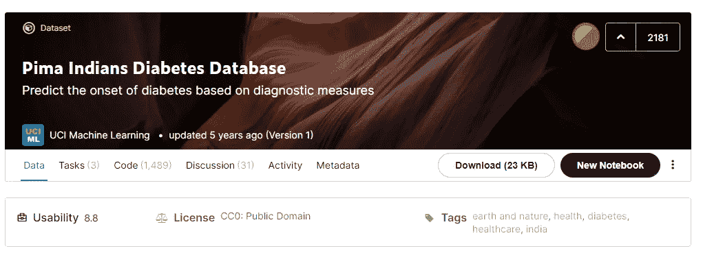
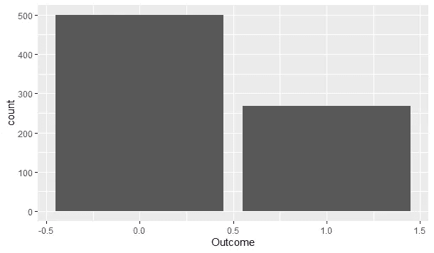

# 理解分类建模中的评估指标

> 原文：<https://towardsdatascience.com/understanding-evaluation-metrics-in-classification-modeling-6cc197950f01?source=collection_archive---------23----------------------->


凯文·Ku 在 [Unsplash](https://unsplash.com?utm_source=medium&utm_medium=referral) 上的照片

## 更好地理解分类模型性能的指南

## 动机

分类建模成为机器学习中广泛使用的技术之一，例如欺诈检测、流失分析、疾病检测以及图像分类。为了了解分类建模中的模型性能，我们使用分类结果表，通常我们称之为混淆矩阵。

在大多数情况下，大多数人可能只是观察模型产生的精度值来确定模型的性能。但是，在某些情况下，我们不能简单地使用准确性来确定模型的性能(例如，当数据不平衡时)。在本文中，我将告诉您如何在分类建模中正确使用评估指标。

> **注意:在这篇文章中，我将解释二进制分类情况下的评估指标。**

## 这个概念

首先，我们必须先了解评估指标。在机器学习中，评估指标对于帮助我们理解模型性能非常重要，从而确定我们可以从分析中给出的建议。在分类建模中，评估指标是根据真阳性(TP)、假阳性(FP)、真阴性(TN)和假阴性(FN)计算的。所有这些值都以表格形式列出(为了进一步解释，我们称之为**混淆矩阵**)，如下图所示。



困惑矩阵(图片来自作者)

根据建模目的或使用的数据，**应适当考虑将要使用的评估指标，这样结果就不会误导**。在这里，我将解释分类建模中的一些评估指标，以及何时应该正确使用它们。

## 准确(性)

分类建模中最常见的评估指标。此指标衡量正确预测与评估的实例总数的比率。


此指标可用于大多数情况，但我建议在数据平衡时使用(即多数类和少数类的差异不太大)。

## 精确

精度度量用于测量从肯定类别中的全部预测模式中正确预测的肯定模式。



## 回忆还是敏感

灵敏度度量用于测量被正确分类的肯定模式的比例。

我建议您在少数类为阳性的数据不平衡时(例如，新冠肺炎或其他疾病数据集)使用此指标。当然，你不想错误地将一个阳性患者预测为阴性患者)。


分析不平衡数据时经常发生(图像由 [Imgflip](https://imgflip.com/i/54tghz?herp=1617874830765) 生成)



## 特征

与敏感性相反，特异性度量用于测量被正确分类的阴性模式的比例。

当少数类为正类的数据不平衡时，建议使用敏感度指标；当少数类为负类的数据不平衡时，建议使用特异性指标，例如，流失数据集。



## f1-分数

最后一个是 F1 成绩。该指标代表召回值和精确值之间的调和平均值
，也可以写成如下形式。



当数据集不平衡时，建议使用此指标。

## 例子

为了在实践中了解更多，这里我用 Kaggle 的 [Pima 印度糖尿病数据库](https://www.kaggle.com/uciml/pima-indians-diabetes-database)给出一个例子。分析将使用 R 编程语言进行。



皮马印度糖尿病数据库(图片来自 [Kaggle](https://www.kaggle.com/uciml/pima-indians-diabetes-database)

像往常一样，首先，我们需要导入库和数据。

```
library(car)
library(MASS)
library(tseries)
library(lmtest)
library(tidyverse)
library(imbalance)
library(mice)
library(caret)
library(caTools)
library(rsample)#Data Importing
data=read.csv("data_input/diabetes.csv")
```

我们按如下方式检查数据汇总。

```
> str(data)
'data.frame': 768 obs. of  9 variables:
 $ Pregnancies             : int  6 1 8 1 0 5 3 10 2 8 ...
 $ Glucose                 : int  148 85 183 89 137 116 78 115 197 125 ...
 $ BloodPressure           : int  72 66 64 66 40 74 50 0 70 96 ...
 $ SkinThickness           : int  35 29 0 23 35 0 32 0 45 0 ...
 $ Insulin                 : int  0 0 0 94 168 0 88 0 543 0 ...
 $ BMI                     : num  33.6 26.6 23.3 28.1 43.1 25.6 31 35.3 30.5 0 ...
 $ DiabetesPedigreeFunction: num  0.627 0.351 0.672 0.167 2.288 ...
 $ Age                     : int  50 31 32 21 33 30 26 29 53 54 ...
 $ Outcome                 : int  1 0 1 0 1 0 1 0 1 1 ...
```

然后，让我们检查数据中是否存在缺失值，如下所示。

```
> md.pattern(data)
 /\     /\
{  `---'  }
{  O   O  }
==>  V <==  No need for mice. This data set is completely observed.
 \  \|/  /
  `-----'Pregnancies Glucose BloodPressure SkinThickness Insulin BMI
768           1       1             1             1       1   1
              0       0             0             0       0   0
    DiabetesPedigreeFunction Age Outcome  
768                        1   1       1 0
                           0   0       0 0
```


缺失的价值分析(图片由作者提供)

没有缺失值！因此，我们好进行下一步。让我们绘制因变量(即数据中的**结果**)来找出数据集是否不平衡。

```
#Data Visualization
ggplot(data, aes(Outcome))+geom_bar()
imbalanceRatio(data,classAttr = "Outcome")
```



“结果”变量的数据可视化(图片由作者提供)

```
> imbalanceRatio(data,classAttr = "Outcome")
[1] 0.536
```

我们可以看到数据集是不平衡的，其中少数类是正类(标为 1)。因此，**我们有兴趣了解将从模型**中产生的灵敏度指标。

接下来，我们将数据分为数据训练和数据测试，如下所示。

```
#Data Splitting
split=initial_split(data,prop=0.7)
data.train=training(split)
data.test=testing(split)
```

**对于本文中的例子，我将使用逻辑回归**对这些数据进行建模。您可以尝试使用不同的模型和/或优化它来查看不同的结果。

```
> #Modeling
> model=glm(Outcome~.,data=data.train,family=binomial(link="logit"))
> summary(model)Call:
glm(formula = Outcome ~ ., family = binomial(link = "logit"), 
    data = data.train)Deviance Residuals: 
    Min       1Q   Median       3Q      Max  
-2.4025  -0.7510  -0.4492   0.7687   2.7652Coefficients:
                          Estimate Std. Error z value Pr(>|z|)    
(Intercept)              -7.930549   0.818065  -9.694  < 2e-16 ***
Pregnancies               0.117947   0.037190   3.171  0.00152 ** 
Glucose                   0.032608   0.004247   7.678 1.61e-14 ***
BloodPressure            -0.009801   0.006241  -1.570  0.11633    
SkinThickness             0.003591   0.008125   0.442  0.65849    
Insulin                  -0.001708   0.001088  -1.569  0.11657    
BMI                       0.083122   0.017663   4.706 2.53e-06 ***
DiabetesPedigreeFunction  0.615187   0.340094   1.809  0.07047 .  
Age                       0.015894   0.010867   1.463  0.14358    
---
Signif. codes:  0 ‘***’ 0.001 ‘**’ 0.01 ‘*’ 0.05 ‘.’ 0.1 ‘ ’ 1(Dispersion parameter for binomial family taken to be 1)Null deviance: 699.94  on 537  degrees of freedom
Residual deviance: 530.59  on 529  degrees of freedom
AIC: 548.59Number of Fisher Scoring iterations: 4
```

通过编写如下代码，让我们来看看这个使用来自`caret`库的`confusionMatrix`的示例模型的性能。

```
> pred=predict(model,data.test,type='response')
> pred=ifelse(pred>0.5,1,0)
> confusionMatrix(table(actual=data.test$Outcome,pred),positive="1")
Confusion Matrix and Statisticspred
actual   0   1
     0 136  17
     1  28  49

               Accuracy : 0.8043          
                 95% CI : (0.7471, 0.8536)
    No Information Rate : 0.713           
    P-Value [Acc > NIR] : 0.001005        

                  Kappa : 0.5446          

 Mcnemar's Test P-Value : 0.136037        

            Sensitivity : 0.7424          
            Specificity : 0.8293          
         Pos Pred Value : 0.6364          
         Neg Pred Value : 0.8889          
             Prevalence : 0.2870          
         Detection Rate : 0.2130          
   Detection Prevalence : 0.3348          
      Balanced Accuracy : 0.7858          

       'Positive' Class : 1
```

乍一看，我们可能会说基于精度的模型性能良好，其中精度为 0.8043。但是，**如果我们从敏感度上看，得分仅为 0.7424，这意味着预测结果**仍有许多假阴性(FN)，因此我们可以说该模型仍需要一些改进以增加敏感度得分，从而减少假阴性的发生。

让我们看看，如果我们从第一个模型中删除统计上最不重要的变量(即`SkinThickness`变量)，会看到不同的结果。

```
> model2=glm(Outcome~Pregnancies+Glucose+BloodPressure+Insulin+BMI+DiabetesPedigreeFunction+Age,data=data.train,family=binomial(link="logit"))
> summary(model2)Call:
glm(formula = Outcome ~ Pregnancies + Glucose + BloodPressure + 
    Insulin + BMI + DiabetesPedigreeFunction + Age, family = binomial(link = "logit"), 
    data = data.train)Deviance Residuals: 
    Min       1Q   Median       3Q      Max  
-2.1998  -0.7277  -0.4219   0.7465   2.7713Coefficients:
                           Estimate Std. Error z value Pr(>|z|)    
(Intercept)              -8.1105881  0.8266014  -9.812  < 2e-16 ***
Pregnancies               0.1408917  0.0387610   3.635 0.000278 ***
Glucose                   0.0356517  0.0043220   8.249  < 2e-16 ***
BloodPressure            -0.0118975  0.0061181  -1.945 0.051819 .  
Insulin                  -0.0010592  0.0009106  -1.163 0.244758    
BMI                       0.0793557  0.0158026   5.022 5.12e-07 ***
DiabetesPedigreeFunction  1.1127198  0.3435883   3.239 0.001201 ** 
Age                       0.0085905  0.0114574   0.750 0.453386    
---
Signif. codes:  0 ‘***’ 0.001 ‘**’ 0.01 ‘*’ 0.05 ‘.’ 0.1 ‘ ’ 1(Dispersion parameter for binomial family taken to be 1)Null deviance: 708.97  on 537  degrees of freedom
Residual deviance: 516.31  on 530  degrees of freedom
AIC: 532.31Number of Fisher Scoring iterations: 5> pred2=predict(model2,data.test,type='response')
> pred2=ifelse(pred2>0.5,1,0)
> confusionMatrix(table(actual=data.test$Outcome,pred2),positive="1")
Confusion Matrix and Statisticspred2
actual   0   1
     0 150  11
     1  29  40

               Accuracy : 0.8261          
                 95% CI : (0.7708, 0.8728)
    No Information Rate : 0.7783          
    P-Value [Acc > NIR] : 0.04490         

                  Kappa : 0.5526          

 Mcnemar's Test P-Value : 0.00719         

            Sensitivity : 0.7843          
            Specificity : 0.8380          
         Pos Pred Value : 0.5797          
         Neg Pred Value : 0.9317          
             Prevalence : 0.2217          
         Detection Rate : 0.1739          
   Detection Prevalence : 0.3000          
      Balanced Accuracy : 0.8112          

       'Positive' Class : 1
```

结果好多了！我们可以看到敏感度得分增加到 0.7843，这意味着我们可以从预测结果中减少假阴性的发生(从混淆矩阵中可以看出)。

完整的代码如下。

```
library(car)
library(MASS)
library(tseries)
library(lmtest)
library(tidyverse)
library(imbalance)
library(mice)
library(caret)
library(caTools)
library(rsample)#Data Importing
data=read.csv("data_input/diabetes.csv")
summary(data)
str(data)
md.pattern(data)#Data Visualization
ggplot(data, aes(Outcome))+geom_bar()
imbalanceRatio(data,classAttr = "Outcome")#Data Splitting
split=initial_split(data,prop=0.7)
data.train=training(split)
data.test=testing(split)#Modeling
model=glm(Outcome~.,data=data.train,family=binomial(link="logit"))
summary(model)
pred=predict(model,data.test,type='response')
pred=ifelse(pred>0.5,1,0)
confusionMatrix(table(actual=data.test$Outcome,pred),positive="1")model2=glm(Outcome~Pregnancies+Glucose+BloodPressure+Insulin+BMI+DiabetesPedigreeFunction+Age,data=data.train,family=binomial(link="logit"))
summary(model2)
pred2=predict(model2,data.test,type='response')
pred2=ifelse(pred2>0.5,1,0)
confusionMatrix(table(actual=data.test$Outcome,pred2),positive="1")
```

## 结论

我们到了。在本文中，您将学习如何根据建模目的或分析中使用的数据来正确使用评估指标。

像往常一样，如果您有任何问题，请随时在我的联系人下面提问或讨论！下一篇文章再见，保持健康！

## 作者的联系人

领英:[拉登·奥勒留和希卡·维亚迪努格罗霍](https://www.linkedin.com/in/raden-aurelius-andhika-viadinugroho-b84b19163/)

中:[https://medium.com/@radenaurelius](https://medium.com/@radenaurelius)

## 参考

[1] Lever，j .，Krzywinski，m .，& Altman，N. (2016)。[分类评价](https://www.nature.com/nmeth/journal/v13/n8/full/nmeth.3945.html)。*性质*。

[2]m . hos sin 和 m . n . Sula Iman(2015 年)。[审查数据分类评估的评估指标](https://www.researchgate.net/profile/Mohammad_Hossin/publication/275224157_A_Review_on_Evaluation_Metrics_for_Data_Classification_Evaluations/links/57b2c95008ae95f9d8f6154f.pdf)。*国际数据挖掘杂志&知识管理过程*，第 5 卷，第 2 期，第 1–11 页。

[https://www.kaggle.com/uciml/pima-indians-diabetes-database](https://www.kaggle.com/uciml/pima-indians-diabetes-database)