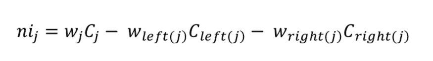
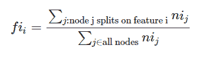
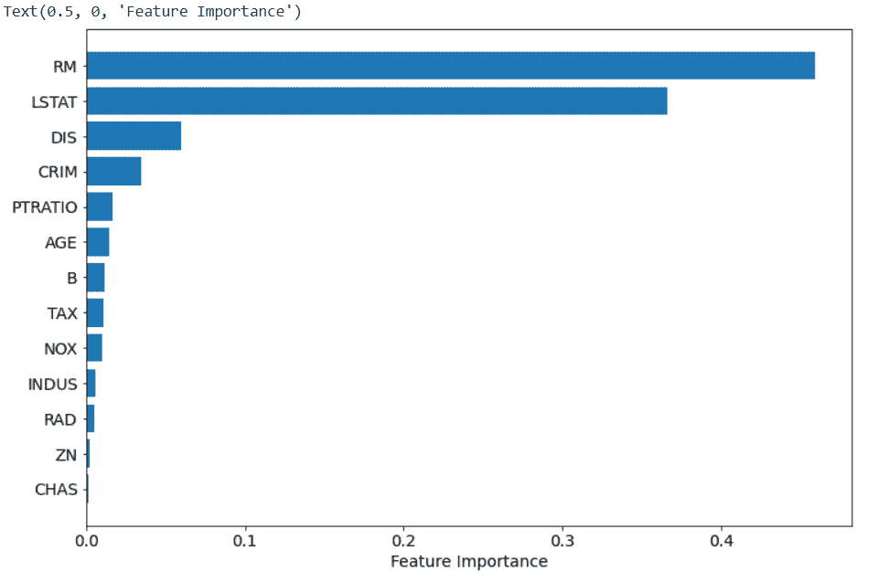
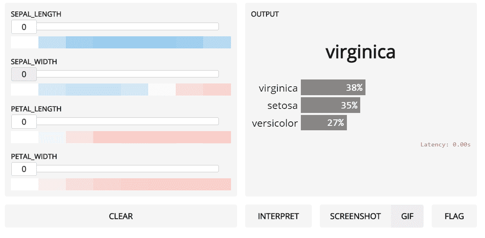
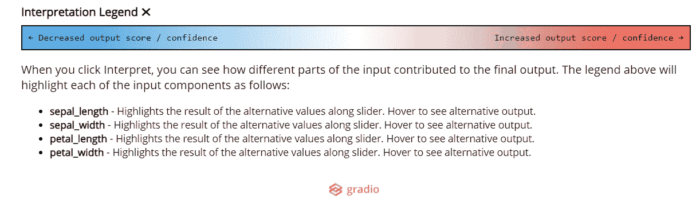

# 了解特性的重要性以及如何在 Python 中实现它

> 原文：<https://towardsdatascience.com/understanding-feature-importance-and-how-to-implement-it-in-python-ff0287b20285?source=collection_archive---------2----------------------->

## 了解最实用的数据科学概念之一


弗洛里安·施梅兹在 [Unsplash](https://unsplash.com/?utm_source=unsplash&utm_medium=referral&utm_content=creditCopyText) 上的照片

> ***请务必*** [***订阅此处***](https://terenceshin.medium.com/membership) ***千万不要错过另一篇关于数据科学指南、诀窍和技巧、生活经验等的文章！***

# 目录

1.  介绍
2.  什么是特性重要性
3.  为什么特性重要性如此有用？
4.  Python 中特性的重要性
5.  具有梯度的特征重要性

# 介绍

有了所有可用的包和工具，构建一个机器学习模型并不困难。然而，构建一个**好的**机器学习模型就是另一回事了。

如果你认为机器学习只是简单地将数百列数据扔进一个笔记本，并使用 scikit-learn 建立一个模型，那么请再想想。

经常被忽视的一件大事是为这些模型选择合适的特征。无用的数据会导致偏见，从而扰乱我们机器学习的最终结果。在本文中，我们将讨论在机器学习中起关键作用的特征重要性。

在本文中，我们将介绍什么是特性重要性，为什么它如此有用，如何用 Python 代码实现特性重要性，以及如何在 [Gradio](https://www.gradio.app/) 中可视化特性重要性。

# 什么是特征重要性？

要素重要性是指为给定模型的所有输入要素计算分数的技术-分数仅代表每个要素的“重要性”。较高的分数意味着特定特征将对用于预测某个变量的模型产生较大的影响。

为了更好的理解，让我们举一个现实生活中的例子。假设你要在工作地点附近买一套新房子。在买房时，你可能会考虑不同的因素。你做决定时最重要的因素可能是房产的位置，因此，你可能只会寻找靠近你工作地点的房子。要素重要性以类似的方式工作，它将根据要素对模型预测的影响对要素进行排序。

# 为什么特性重要性如此有用？

特征重要性非常有用，原因如下:

## 1)数据理解。

构建模型是一回事，但理解进入模型的数据是另一回事。像相关矩阵一样，特征重要性允许您理解特征和目标变量之间的关系。它还可以帮助您了解哪些功能与模型无关。

## 2)模型改进。

训练模型时，可以使用根据要素重要性计算的分数来降低模型的维度。较高的分数通常被保留，较低的分数被删除，因为它们对模型不重要。这不仅简化了模型，还加快了模型的工作速度，最终提高了模型的性能。

## 3)模型的可解释性。

特性重要性对于向其他涉众解释和交流您的模型也很有用。通过计算每个特征的得分，可以确定哪些特征对模型的预测能力贡献最大。

# 特征重要性背后的数学原理

有不同的方法来计算特征重要性，但本文将只关注两种方法:基尼重要性和排列特征重要性。

## 基尼系数

在 Scikit-learn 中，Gini 重要度用于计算节点杂质，而特征重要度基本上是节点杂质的减少量，该减少量通过从样本总数中到达该节点的样本数来加权。这就是所谓的节点概率。假设我们有一棵有两个子节点的树，我们的等式是:



这里我们有:

nij =节点 j 重要性
wj=到达节点 j 的加权样本数
Cj=节点 j 的杂质值
左(j) =节点 j 左边的子节点
右(j) =节点 j 右边的子节点

这个等式给出了节点 j 的重要性，用于计算每个决策树的特征重要性。单个特征可以用在树的不同分支中。因此，我们计算特征重要性如下。



根据树中存在的所有特征值的总和对特征进行归一化，然后用它除以随机森林中的树的总数，我们得到总体特征重要性。这样，您可以更好地理解随机森林中的特性重要性。

## 置换特征重要性

排列特征重要性背后的思想很简单。当我们改变一个特性的值时，通过注意误差的增加或减少来计算特性的重要性。如果置换值导致误差发生巨大变化，这意味着该特征对我们的模型很重要。这种方法最好的一点是，它可以应用于每一个机器学习模型。它的方法是模型不可知的，这给了你很大的自由。背后没有复杂的数学公式。置换特征重要性基于如下工作的算法。

1.  用原始值计算均方误差
2.  打乱要素的值并进行预测
3.  计算混洗值的均方误差
4.  比较它们之间的区别
5.  按降序对差异进行排序，以获得重要性从高到低的特征

# Python 中特性的重要性

> ***如果你想自己测试代码，就去看看***[***Saturn cloud***](https://saturncloud.io/?utm_source=TerenceShinMedium+&utm_medium=Medium&utm_campaign=TerenceShinFellow&utm_term=understanding-feature-importance)***，一个可扩展的、灵活的数据科学平台。***


在本节中，我们将使用波士顿数据集创建一个随机森林模型。

首先，我们将导入所有需要的库和数据集。

```
import numpy as np
import pandas as pd
from sklearn.datasets import load_boston
from sklearn.model_selection import train_test_split
from sklearn.ensemble import RandomForestRegressor
from sklearn.inspection import permutation_importance
from matplotlib import pyplot as plt
```

下一步是加载数据集，并将其分成测试集和训练集。

```
boston = load_boston()X = pd.DataFrame(boston.data, columns=boston.feature_names)
y = boston.targetX_train, X_test, y_train, y_test = train_test_split(X, y, test_size=0.25, random_state=42)
```

接下来，我们将创建随机森林模型。

```
rf = RandomForestRegressor(n_estimators=150)
rf.fit(X_train, y_train)
```

一旦创建了模型，我们就可以进行特征重要性分析，并将其绘制在图表上，以便于解释结果。

```
sort = rf.feature_importances_.argsort()plt.barh(boston.feature_names[sort], rf.feature_importances_[sort])plt.xlabel("Feature Importance")
```



RM 是每个住宅的平均房间数，从上面可以看出，它是预测目标变量的最重要的特征。

# 具有梯度的特征重要性

Gradio 是一个漂亮的包，有助于为机器学习模型创建简单的交互式界面。使用 Gradio，您可以实时评估和测试您的模型。关于 Gradio 的一个有趣的事情是，它使用单个参数计算要素重要性，我们可以与要素进行交互，以查看它如何影响要素重要性。

这里有一个例子:

首先，我们将导入所有需要的库和数据集。在这个例子中，我将使用 Seaborn 库中的 iris 数据集。

```
**# Importing libraries**
import numpy as np
import pandas as pd
import seaborn as sns**# Importing data**
iris=sns.load_dataset("iris")
```

然后，我们将拆分数据集，并将其放入模型中。

```
from sklearn.model_selection import train_test_splitX=iris.drop("species",axis=1)
y=iris["species"]
X_train, X_test, y_train, y_test = train_test_split(X, y, test_size=0.25) from sklearn.svm import SVCmodel = SVC(probability=True)
model.fit(X_train,y_train)
```

我们还将创建一个将在 Gradio 界面中使用的预测函数。

```
def predict_flower(sepal_length, sepal_width, petal_length, petal_width):
   df = pd.DataFrame.from_dict({'Sepal Length':[sepal_length],
                                'Sepal Width': [sepal_width],
                                'Petal Length': [petal_length],  
                                'Petal Width': [petal_width]}) predict = model.predict_proba(df)[0] return {model.classes_[i]: predict[i] for i in range(3)}
```

最后，我们将安装 Gradio 和 Pip 并创建我们的界面。

```
**# Installing and importing Gradio** !pip install gradio
import gradio as grsepal_length = gr.inputs.Slider(minimum=0, maximum=10, default=5, label="sepal_length")sepal_width = gr.inputs.Slider(minimum=0, maximum=10, default=5, label="sepal_width")petal_length = gr.inputs.Slider(minimum=0, maximum=10, default=5, label="petal_length")petal_width = gr.inputs.Slider(minimum=0, maximum=10, default=5, label="petal_width")gr.Interface(predict_flower, [sepal_length, sepal_width, petal_length, petal_width], "label", live=True, interpretation="default").launch(debug=True)
```

gr.Interface 接受一个解释参数，该参数为我们提供了模式特征的重要性。下面是结果:



图例告诉您更改该功能将如何影响输出。所以增加花瓣长度和花瓣宽度会增加在 virginica 类的信心。只有在增加花瓣长度让你更快“更红”(更自信)的意义上，花瓣长度才更“重要”。

# 感谢阅读！

如果你做到了这一步，恭喜你！希望你已经彻底理解了什么是特性重要性，它为什么有用，以及你实际上如何使用它。

如果您觉得这很有用，请关注我以获取更多内容。同时，我祝你在学习上一切顺利！

# 感谢阅读！

> ***务必*** [***订阅此处***](https://terenceshin.medium.com/membership) ***千万不要错过另一篇关于数据科学指南、诀窍和技巧、生活经验等的文章！***

我希望你觉得这很有趣，很有见地。在评论里让我知道你最喜欢的 2022 年的数据可视化是什么！

不确定接下来要读什么？我为你挑选了另一篇文章:

[](/over-100-data-scientist-interview-questions-and-answers-c5a66186769a) [## 超过 100 个数据科学家面试问题和答案！

### 来自亚马逊、谷歌、脸书、微软等公司的面试问题！

towardsdatascience.com](/over-100-data-scientist-interview-questions-and-answers-c5a66186769a) 

**或者您可以查看我的媒体页面:**

[](https://terenceshin.medium.com/) [## 特伦斯·申—中号

### 阅读特伦斯·申在媒体上的文章。数据科学@ KOHO，SaturnCloud |理学硕士，MBA |…

terenceshin.medium.com](https://terenceshin.medium.com/) 

# 特伦斯·申

*   [***Fellow @ Saturn cloud***](https://saturncloud.io/?utm_source=TerenceShinMedium+&utm_medium=Medium&utm_campaign=TerenceShinFellow&utm_term=understanding-feature-importance)
*   [***订阅我的媒体***](https://terenceshin.medium.com/membership)
*   [***跟我上媒***](https://medium.com/@terenceshin)
*   [***在领英上关注我***](https://www.linkedin.com/in/terenceshin/)