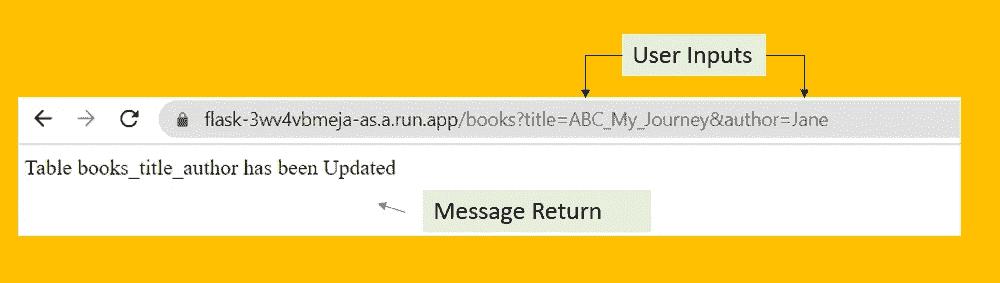
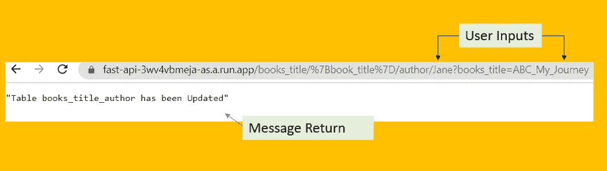
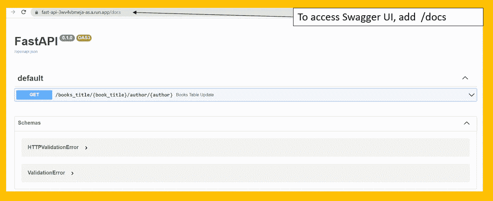
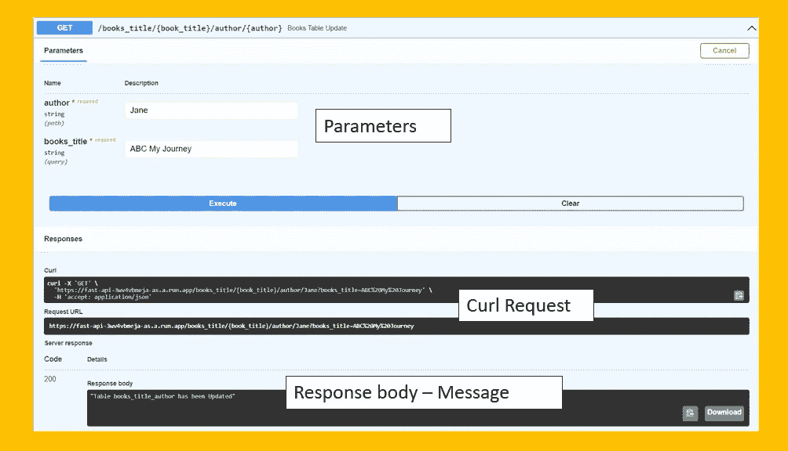
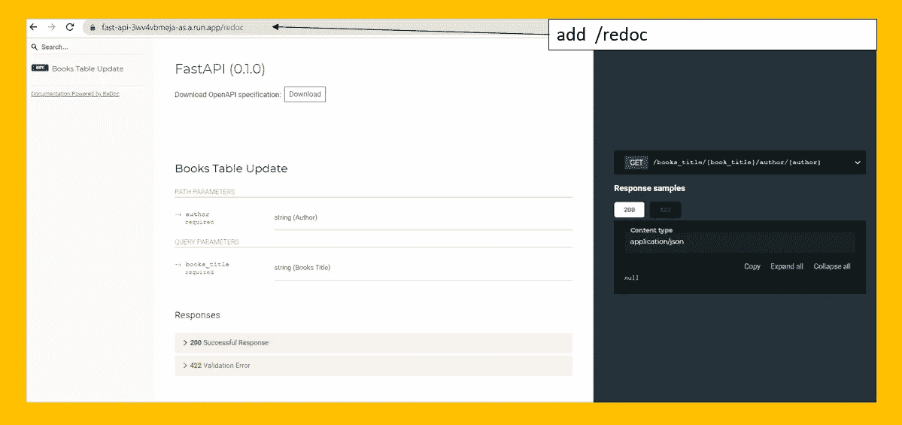
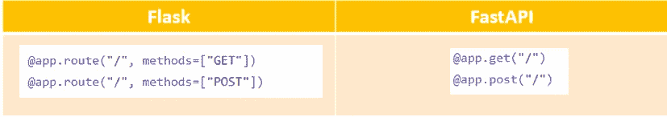
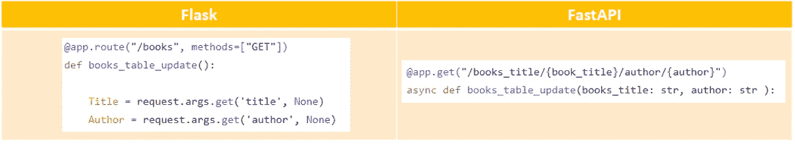
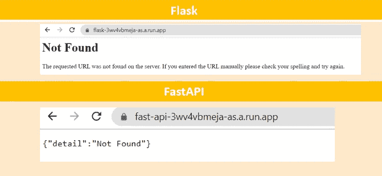
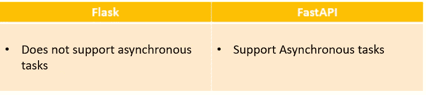

# 了解 Flask vs FastAPI Web 框架

> 原文：<https://towardsdatascience.com/understanding-flask-vs-fastapi-web-framework-fe12bb58ee75?source=collection_archive---------0----------------------->

## 两种不同 RestAPI 框架的比较

Daria Shevtsova 拍摄于 [Unsplash](https://unsplash.com/)

## **简介**

作为一名数据科学家并不仅仅局限于模型构建，而是朝着下一步，模型部署，努力。模型部署对于向其他人展示您的最终结果很重要*(或者可能是您的客户)*。这群人可能不懂编码，也不会通过查看您的代码来理解；他们更喜欢查看最终的应用程序，这样可以立即查看结果。一种常见的方法是将您的代码包装在 RestAPI 中，并作为微服务进行部署。

在本文中，我将介绍两种不同的可以快速搭建 web 服务器的框架: **Flask** 和 **FastAPI** 。Flask 和 FastAPI 都是用于构建小规模网站和应用程序的框架。

## **砂箱框架**

Flask 于 2010 年发布，这是一个用 python 编写的微型 web 框架，以最少的代码支持 web 应用程序的部署。它旨在作为微服务轻松、灵活且快速地部署。Flask 构建在 [WSGI (Python Web 服务器网关接口)](https://flask.palletsprojects.com/en/2.0.x/deploying/index.html)之上，服务器将为每个请求绑定一个工作器。

下面是一个使用 Flask *进行部署的示例(这是一个使用“GET”方法获取用户输入并将值插入到 Google Big Query 中的示例——该示例部署在 Google Cloud Run 上)*

使用 Flask 部署示例程序

使用 Flask 完成部署后，您可以运行 URL 并在 URL 中传递输入，将会返回一条消息。

使用 Flask 调用微服务部署

## **FastAPI 框架**

FastAPI 比 Flask 更新，发布于 2018 年。它的工作方式类似于 Flask，后者用最少的代码支持 web 应用程序的部署。然而，FastAPI 比 Flask 更快，因为它建立在 ASGI(异步服务器网关接口)之上，从而支持并发/异步代码。这是通过用*异步定义*语法声明端点来实现的。

对于 FastAPI 来说，值得强调的一点是文档。在使用 FastAPI 框架进行部署时，它将生成文档并创建一个交互式 GUI (Swagger UI ),允许开发人员更方便地测试 API 端点。

下面是一个使用 FastAPI *进行部署的示例(这是一个使用“GET”方法获取用户输入并将值插入到 Google Big Query 中的示例—该示例部署在 Google Cloud Run 上)*

使用 Flask 完成部署后，您可以运行 URL 并在 URL 中传递输入，将会返回一条消息，其工作方式与 Flask 类似。

使用 FastAPI 调用微服务

现在，真正让我兴奋的是 FastAPI 的附加功能，即**自动生成文档(Swagger UI)** 。要访问 Swagger UI，请输入 API endpoint /docs，这就是测试 API 端点的交互式 GUI。拥有一个大摇大摆的用户界面也更容易向他人解释你的程序。

FastAPI — Swagger UI

通过使用 Swagger UI，您可以轻松地测试您的 API 端点并通过接口指定参数。例如，在下图中，您可以在提供的列中轻松指定“书名”和“作者”。

从 Swagger UI 测试“获取请求”

除了 Swagger UI，FastAPI 还附带了另一个文档——“ReDoc”。该文档包含列出的所有端点，如果在同一个服务中部署了许多端点，这将非常有用。要访问文档页面，请输入 API 端点/redoc。

FastAPI — ReDoc

## **烧瓶和 FastAPI 的对比:**

## HTTP 方法:

HTTP 方法

*   在 Flask 和 FastAPI 中指定“GET”或“POST”方法是不同的。

## **传递参数&数据验证:**

使用 Get 方法

*   Flask 不提供对数据格式的验证，这意味着用户可以传递任何类型的数据，如字符串或整数等。(或者，可以将输入数据接收的验证脚本内置到脚本中，但这需要额外的工作)
*   FastAPI 允许开发人员对收到的参数声明额外的标准和验证。

## **错误信息显示:**

烧瓶& FastAPI 的错误消息

*   默认情况下，Flask 中显示的错误消息是 HTML 页面，而 FastAPI 中显示的错误消息是 JSON 格式的。

## **异步任务:**

比较异步任务

*   正如本文前面提到的，Flask 部署在不支持异步任务的 [WSGI (Python Web 服务器网关接口)](https://flask.palletsprojects.com/en/2.0.x/deploying/index.html)上，而 FastAPI 部署在支持异步任务的 [ASGI(异步服务器网关接口)](https://fastapi.tiangolo.com/benchmarks/)上。

## **结论:**

在研究了 Flask 和 FastAPI 之后，我会考虑将来采用 FastAPI，因为它有异步功能和自动生成的非常详细和完整的文档。此外，使用 FastAPI 进行部署所需的工作量与 Flask 相同。

如果您一直在使用 Flask，您可以考虑试用 FastAPI 并观察比较。

**参考文献&链接:**

[1]https://flask.palletsprojects.com/en/2.0.x/

[2]https://fastapi.tiangolo.com/

[3][https://analyticsindiamag . com/fastapi-vs-flask-comparison-guide-for-data-science-发烧友/](https://analyticsindiamag.com/fastapi-vs-flask-comparison-guide-for-data-science-enthusiasts/)

[https://www.programmersought.com/article/60453596349/](https://www.programmersought.com/article/60453596349/)

[5][https://www . analyticsvidhya . com/blog/2020/11/fastapi-the-right-replacement-for-flask/](https://www.analyticsvidhya.com/blog/2020/11/fastapi-the-right-replacement-for-flask/)