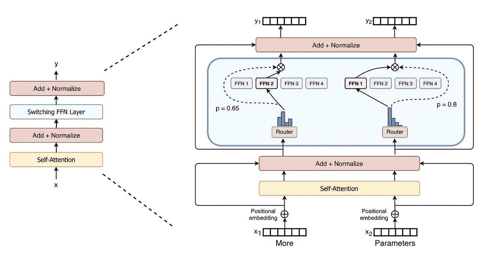
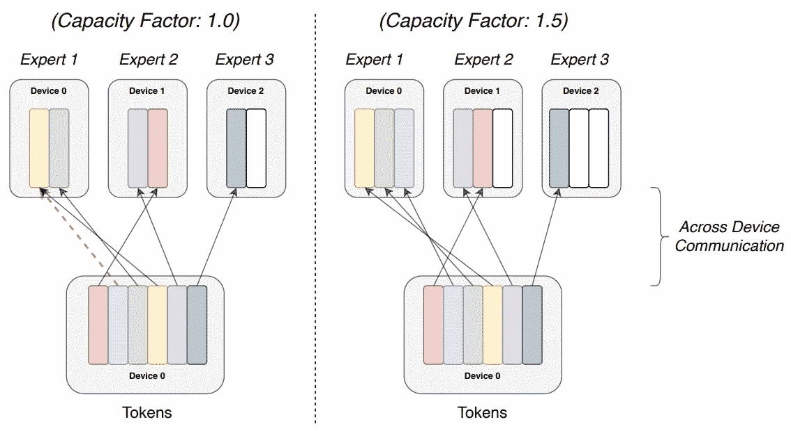
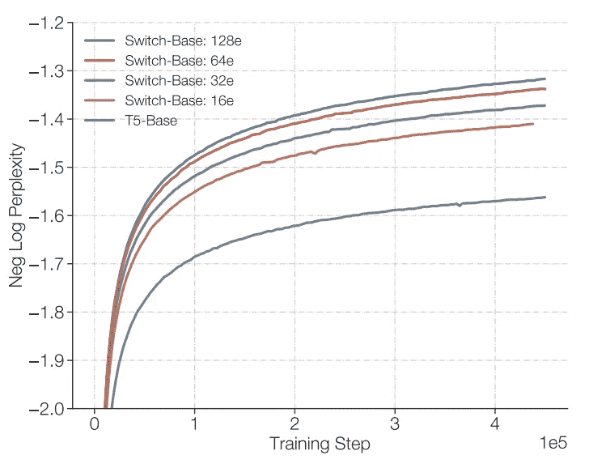

# 了解谷歌的 Switch Transformer

> 原文：<https://towardsdatascience.com/understanding-googles-switch-transformer-904b8bf29f66?source=collection_archive---------7----------------------->

## 谷歌如何无成本地创建了世界上最大的语言模型

乔纳森在 [Unsplash](https://unsplash.com?utm_source=medium&utm_medium=referral) 上拍摄的照片

当 GPT-3 在 2020 年 5 月由 [OpenAI](https://openai.com/) 在[推出](https://arxiv.org/abs/2005.14165)时，消息不胫而走。不仅在人工智能社区，甚至在主流媒体上也有类似于“[一个机器人写了这篇文章](https://www.theguardian.com/commentisfree/2020/sep/08/robot-wrote-this-article-gpt-3)”和“[你读过 GPT 3 写的东西吗？](https://www.nbcnews.com/tech/tech-news/have-you-read-something-written-gpt-3-probably-not-it-n1240384)”。人们很兴奋！

在 GPT-3 之前，最大的语言模型是 2020 年 2 月发布的拥有 170 亿个参数的图灵-NLG 模型。那年晚些时候，OpenAI 用 1750 亿个参数把它炸出了公园。突然，出现了一种语言模型，它可以产生与人类通常无法区分的内容。

2021 年初，谷歌发布了一篇[论文](https://arxiv.org/abs/2101.03961)，题为“*开关变压器:用简单高效的稀疏性*扩展到万亿参数模型”。虽然这确实得到了一些人工智能社区之外的小媒体报道，但它并不接近 GPT-3，尽管创建了一个参数几乎十倍多的模型！

这种覆盖面的缺乏并不令人惊讶。谷歌的 1.6 万亿参数模型在性能方面不是最先进的，也没有一个整洁的 API 前端来演示人工智能的未来。然而，这并不意味着动机或结果对未来的人工智能和机器学习研究不重要。

在本文中，我们将尝试理解开关变压器背后的动机，它是如何工作的，以及为什么这些结果对机器学习研究和应用的未来如此重要。

# 动机

[经验表明](https://arxiv.org/abs/2001.08361)语言模型的性能随着参数数量(模型大小)、数据集大小和计算预算的增加而呈幂律增长。

然而，随着这些费用的增加，培训的财务费用也在增加。这导致开源、预先训练的语言模型越来越受欢迎，如谷歌的 [BERT](https://github.com/google-research/bert) ，它可以在特定的下游语言任务上进行微调，如分类、问答或总结，使数据科学从业者受益于谷歌、脸书和 OpenAI 等公司掌握的大量资源。

然而，GPT-3 证明，如果这些模式继续增长，即使是大型企业和组织也可能开始陷入困境。GPT-3 花费了[据称](https://venturebeat.com/2020/06/01/ai-machine-learning-openai-gpt-3-size-isnt-everything/)1200 万美元训练。这个[包括](https://www.forbes.com/sites/robtoews/2020/06/17/deep-learnings-climate-change-problem/)近 5000 个模型版本的训练，使用了将近 10000 天的 GPU 时间。

同样值得注意的是，成本不仅是经济的。据估计，这次培训产生了 78，000 磅的二氧化碳排放量。类似于一个美国成年人两年生产的东西！

照片由[i̇smail·埃内斯·艾汉](https://unsplash.com/@ismailenesayhan?utm_source=medium&utm_medium=referral)在 [Unsplash](https://unsplash.com?utm_source=medium&utm_medium=referral) 上拍摄

OpenAI 的研究表明，用于训练人工智能模型的计算量每 3.4 个月翻一番，这在经济和环境方面产生了令人担忧的预测。

这就是 Switch Transformer 背后的动机，在不增加计算成本的情况下，创建更大的机器学习模型。

# 开关变压器

开关变压器是一个开关前馈神经网络(FFN)层，取代了[变压器](https://arxiv.org/abs/1706.03762)架构中的标准 FFN 层。关键区别在于，每个交换层包含多个 FFN，称为专家，而不是包含单个 FFN。

当每个令牌通过这一层时，它首先通过路由器功能，然后将令牌路由到特定的 FFN 专家。

> 由于每个令牌只通过一个专家 FFN，浮点运算(FLOPS)的数量保持不变，而参数的数量随着专家数量的增加而增加。

这创建了一个稀疏模型，其中不是每个参数都用于每个令牌。在这方面，开关变压器解决了上述动机，在不增加计算量的情况下增加模型参数的数量，计算量以 FLOPs 计。

在开关变压器前馈神经网络层中，每个令牌通过路由器功能将其发送到单个前馈神经网络，称为专家。由于每个令牌仅通过单个 FFN，所以计算不会增加，但是参数的数量随着专家的数量而增加。图片来自原开关变压器[纸](https://arxiv.org/pdf/2101.03961.pdf)。

## 专家混合

使用专家来增加模型参数数量的概念对于开关变压器来说并不新奇。一篇描述专家混合层的[论文](https://arxiv.org/abs/1701.06538)于 2017 年发布，其架构与开关变压器几乎相同。

关键区别在于路由器功能会将每个令牌发送给多个 FFN 专家。作者假设路由器功能将无法学习如何路由令牌，除非它可以通过路由到 k>1 个专家来比较至少两个令牌。

另一方面，开关变压器仅使用 k=1，提供三大优势:

1.  路由器的计算量减少了，因为它只路由到一个 FFN 专家。
2.  每个专家的批量*至少减半*(即 k=1 而不是 k ≥2)。
3.  降低了设备之间(即路由器到专家)的通信成本。

## 功率

第二个好处需要进一步分析。每个专家的批量大小也称为专家能力，即专家在给定通道中能够处理的令牌数量。

理想情况下，这将等于令牌数除以专家数，称为容量因子 1。这样，在给定的步骤中不会浪费专家的能力。

然而，这假设路由器功能在专家之间平均分配令牌。实际上，一些专家 FFN 会溢出，导致某些令牌在该步骤中没有被 FFN 专家处理。

为了避免溢出，导致令牌在该步骤中不被任何 FFN 处理，必须增加容量因子。这增加了计算和通信成本，因此辅助损耗不利于不平衡路由。图片来自原开关变压器[纸](https://arxiv.org/pdf/2101.03961.pdf)。

容量因子可以增加，但是这将导致一些专家具有未使用的容量，增加计算和通信成本。

作为一种折衷，作者在总损失函数中增加了一个辅助损失，通过路由器功能来惩罚令牌的不平衡路由。他们根据经验发现，容量系数为 1.25 时性能最佳。

# 结果

为了衡量 Switch Transformer 的性能，他们在*庞大干净的爬虫语料库*()上训练了几个模型，用 [T5](https://ai.googleblog.com/2020/02/exploring-transfer-learning-with-t5.html) 语言模型作为基准，对比了负 log 困惑度。

考虑到动机，为了在不增加所需计算的情况下增加参数的数量(从而增加性能)，他们训练的模型与 T5 相当，即每个令牌的计算量保持相等。

他们发现了以下情况:

*   经过 100，000 步后，开关变压器模型比触发器匹配的 T5 等效模型具有更大的负损耗困惑。
*   开关变压器达到质量阈值(负。日志 perp。=-1.495)比同等的 T5 更快。在 T5 基的情况下，这个阈值从未达到过！
*   开关变压器每秒能够处理更多的样本。

## 缩放属性

除了分析整体性能，作者还在预训练期间查看了缩放属性。也就是说，给定一个无限的计算预算，如何缩放模型是最好的？

对三个不同的维度进行了分析，以了解模型的缩放特性:步骤、时间和针对更大的密集模型。

**步长调整:**对于固定数量的训练步长，开关变压器将优于触发器匹配的 T5 模型。增加专家数量将进一步提高性能，而不会增加失败次数。拥有 64 名专家的开关变压器模型在 60k 步中实现了与 T5 基模型在 450k 步中相同的性能，相当于 7.5 倍的加速。

T5 基极与触发器匹配的等效开关变压器模型的步进调整，专家人数不同。图片来自原开关变压器[纸](https://arxiv.org/pdf/2101.03961.pdf)。

**时间缩放:**直观上，时间缩放应该等同于步长缩放。然而，跨设备的额外通信成本和路由器功能的计算意味着这需要被明确地分析。结果显示，对于固定的训练时间，开关变压器优于触发器匹配的等效 T5 基极模型。在 T5 基模型和 64 专家开关变压器模型之间观察到 7 倍的加速。

**更大的密集模型:**作者最后考虑了这样一种情况，为了匹配开关变压器的性能，使用 T5-大模型代替 T5-Base。然而，他们表明，这导致每个令牌的 FLOPS 增加了 3.5 倍，并且 FLOPS 匹配的开关变压器模型将优于此。

这些缩放结果表明，对于任何可用的计算增加，较大的开关变压器模型将优于较大的密集模型。考虑到减少语言模型的计算足迹的动机，这是一个极其重要的结果。

## 下游结果

为了测量下游性能，将 T5-Base(223m 参数和 124B 触发器)和 T5-Large (739M 参数和 425B 触发器)与匹配开关-Base (7.4B 参数)和开关-Large (26.3B 参数)模型的触发器进行了比较。

这些模型在 11 个不同的语言任务中进行了比较，包括分类、问题回答和总结等任务。除了[电弧](https://allenai.org/data/arc)之外，开关变压器模型在所有任务中都优于触发器匹配的等效 T5 模型。

## 多语言学习

作为性能的最终测试，作者在 101 种不同语言的预训练中测量了模型的质量。在*所有*语言中，基于开关的模型比基于 T5 的模型具有更大的负对数困惑，并且观察到平均 5 倍的训练加速。

# 万亿参数模型

在文章的结尾，作者介绍了两个大型开关变压器模型 Switch-XXL 和 Switch-C 的设计和训练，它们分别具有 3950 亿和 1.571 万亿个参数。

开关-XXL 模型与 T5-XXL 模型是匹配的。但是，由于 Switch-C 模型的大小，架构大小(层大小、深度、注意力头数量等。)，因此一偏，是减少了。

照片由 [Unsplash](https://unsplash.com?utm_source=medium&utm_medium=referral) 上的 [Kaffeebart](https://unsplash.com/@kaffeebart?utm_source=medium&utm_medium=referral) 拍摄

这可能是 Switch-XXL 模型的负对数困惑度大于 Switch-C 的部分原因，表明增加专家人数的收益递减，特别是以牺牲其他模型维度为代价。然而，在预训练后，两种模型都优于 T5-XXL。

这些模型也在下游任务中被测量。然而，这些结果都不是最先进的。

这也许是为什么开关变压器没有得到与 GPT-3 相同的媒体曝光率的原因。万亿参数模型虽然令人印象深刻，但也需要有令人印象深刻的性能做后盾。

然而，这并没有降低这项研究的重要性。迄今为止，增加密集语言模型的规模是生产最先进模型阻力最小的途径；但很明显，这在经济和环境上都是不可持续的。

谷歌已经表明，可以创建创新的模型架构，在不增加计算成本的情况下提高模型性能，这是数据科学和人工智能社区在不久的将来肯定会看到的事情。