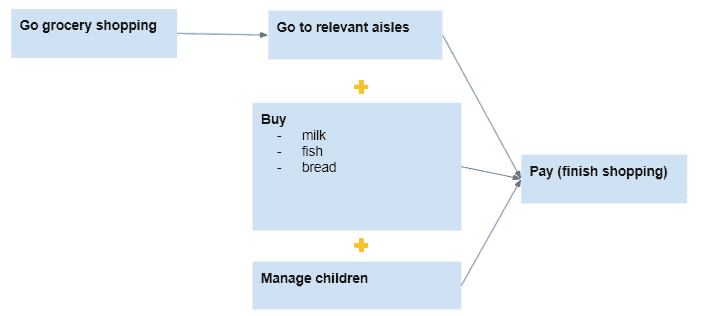

# 理解图形挖掘

> 原文：<https://towardsdatascience.com/understanding-graph-mining-e713183a64f3?source=collection_archive---------12----------------------->

## 图形挖掘学习指南

## 你学习深度学习的第一步


来源( [Unsplash](https://unsplash.com/photos/8bghKxNU1j0) )

> *想象一下脸书:你如何在朋友层内建立联系？*
> 
> *想象一下推荐系统:你怎么知道一个人的偏好与其聚类密切相关？*
> 
> 欢迎来到图形挖掘

# 理解图形分类

图形分类在大量连接的数据(例如:社交、生物和支付)中生成图形，并使用图形来识别标签(监督的)或聚类(非监督的)。

如果这听起来对你来说很难，你可以看看你的大脑，因为它是快速推断图表之间联系的大师。

例如，你的大脑知道如何从 A 点到 B 点，甚至不需要思考。想象一下你在长时间购物后的最后一次购物之旅。带着孩子去购物时，你可以浏览商品目录，并在不同类别的过道中画出多条直线来比较产品。

所有这些行动都需要整合，根据一系列子行动来推断最佳行动，以达到最终目标。尽可能以最轻松的方式完成。



一个简单的 DAG(有向无环图)流程图(来源于作者)

# 同样地…

图挖掘使用特征来查看一组观察结果如何与用户面临的相似性信号相关联。

图形表示基于距离公式化的实体(节点)之间的关系(边)。

有两个常见的特征:

*   来自外部来源的自然图表。例如支付网络、社交媒体和道路。
*   来自节点间相似距离度量的相似图。例如，元数据的 blob 然后通过图形表示共享 blob 结构。

根据图形的特征，我们可以将每个图形分类为

*   具有一种节点和边的简单齐次
*   复杂异构，具有多种类型的节点、多种类型的边。这些可以是有向的，也可以是无向的。


图的基本组成部分(在这种情况下是无向的)是节点和边。([来源](https://www.geeksforgeeks.org/graph-data-structure-and-algorithms/):geeksforgeeks.org)

# 为什么图表很重要？

## 图表无处不在

图表是多用途的。您可以通过对周围的邻域进行分类来构建监督模型，通过将现有标注传播到邻域中缺失的标注来构建半监督模型，以及通过训练节点级嵌入来描述数据的结构角色来构建非监督模型

您可以使用图表完成各种各样的任务。例如，您可以根据您的用例对节点、图形和链接进行分类。

其中包括多项突破，如:[谷歌 DeepMind 的超级分段图预测到达时间(ETA)](https://deepmind.com/blog/article/traffic-prediction-with-advanced-graph-neural-networks) 和来自 Pinterest 的[PinSage](https://medium.com/pinterest-engineering/pinsage-a-new-graph-convolutional-neural-network-for-web-scale-recommender-systems-88795a107f48)。

## 图形计算具有关系和同一性的抽象概念

图形抽象出*局部信息*，从数据中提取有用的*全局信息*。图形结构/拓扑可以告诉我们很多关于数据的信息，比如发现数据点的聚类，或者为无形的概念提供距离度量。

## 图表是灵活的数据类型

图形通过嵌入和组合多种类型的特征灵活地工作，例如:文本(例如:Jaccard 相似性)、视觉(例如:图像相似性)和其他语义属性。例如，当分析师处理活动规则检测时，他们会使用几个特性，如正则表达式设置之间的相似性，并部署正则表达式来捕获这些站点。

## 图表是可缩放的

图形采样用于寻找感受野上的子图。这些子图可以在工人的异步分布之上公式化:获取模型参数的专用服务器。

这种可扩展性也提供了在图中使用联合学习来保护用户隐私的方法(例如基于 Android 的 ML 训练)


带有分布式警告的可伸缩性图表(来源于作者)

# 图形挖掘和网络入门

## 案例研究:GNNs 与 Cora

在这个案例研究中，我们将使用 Cora 数据，它提供了一个引用网络基准，具有 2708 个节点，5429 条边，7 个主题单词包，140 个训练，500 个验证和 1000 个测试观察。

请随意使用下面的 colab 作为你的教程。

<https://colab.sandbox.google.com/drive/1d8YEErtymICvB_-YjFRH8LfUgtw-8YWW?usp=sharing>  

## 使用的库

[Spektral](https://graphneural.network/) 作为图形深度学习的开源 Python 库，基于 Keras 和 Tensorflow2。这个项目的主要目标是为创建图形神经网络(GNNs)提供一个简单而灵活的框架。

Spektral 有一个方便的功能，允许我们快速加载和预处理标准图形表示学习。它还允许函数访问特征矩阵、邻接、矩阵和掩码数组，以了解哪个节点属于训练、验证和测试集。

TF GNN 库对模型 API 是不可知的，集成了 DeepMind graphNet、Google 神经结构化学习、基于 MPNN 论文的 TF GNN API。该图还可以通过 TPU 支持的批处理/序列化在 Keras 层之间传递。

**在 colab 中安装和导入这些库非常简单**

```
!pip install numpy
!pip install tensorflow
!pip install spektral==0.6.1
import numpy as np
import tensorflow as tf
import spektral
```

## 从频谱生成形容词矩阵和特征矩阵

adj 指的是邻接矩阵，features 指的是 feature_matrix，labels 指的是论文的主题，mask sets 指的是哪个节点属于哪个数据集。

```
adj, features, labels, train_mask, val_mask, test_mask = spektral.datasets.citation.load_data(dataset_name=’cora’)
```

然后，我们替换密集特征，将特征转换为邻接矩阵，同时在 float32 中将它们设置为标准的机器学习输出格式。

```
features = features.todense()
adj = adj.todense() + np.eye(adj.shape[0])
features = features.astype(‘float32’)
adj = adj.astype(‘float32’)
```

## 培训和评估流程

我们按照以下步骤在 Cora 数据集上训练我们的 GNN:

1.  定义 2 个 GNN 图层(输入-单位，输出-7 个主题，带 sumpooling)
2.  用 Relu 激活函数实现定义层的 GNN。
3.  使用 [tf。GradientTape()](https://www.youtube.com/watch?v=ENOycxDU9RY) 记录自动微分的操作。这有助于我们观察变量和梯度，以捕捉回传播错误
4.  将优化器应用于渐变(Adam opt 是标准)
5.  基于特征和邻接矩阵指定逻辑和精度计算

## 评估流程

您可以使用参数(单位、时期和学习率)进行实验，以定义验证准确性和训练/val 损失。

```
train_cora(features,adj,gnn,32,200,0.01)## Results ##
Epoch 0 | training loss: 1.9685615301132202 | val_accuracy: 0.20399999618530273 | test_accuracy:0.20799998939037323
Epoch 1 | training loss: 2.1238698959350586 | val_accuracy: 0.30399999022483826 | test_accuracy:0.3100000023841858
Epoch 2 | training loss: 1.6506766080856323 | val_accuracy: 0.6060000061988831 | test_accuracy:0.6150000095367432
Epoch 3 | training loss: 1.504560112953186 | val_accuracy: 0.628000020980835 | test_accuracy:0.6359999775886536
…
Epoch 129 | training loss: 0.004622798413038254 | val_accuracy: 0.7520000338554382 | test_accuracy:0.7450000047683716
```

正如你所看到的，似乎越多的纪元和训练步骤运行，我们可以从中获得更多的准确性。

搞定了。祝贺你的第一个图表网络！

# 关于作者

文森特用 ML @ Google 对抗网络滥用。文森特使用高级数据分析、机器学习和软件工程来保护 Chrome 和 Gmail 用户。

除了在谷歌的工作，Vincent 还是[佐治亚理工学院计算机科学硕士校友](/5-biggest-tips-to-juggle-work-and-study-as-data-scientists-7cad143f10a)、[三项全能运动员](https://medium.com/swlh/my-journey-from-a-noob-to-half-ironman-triathlete-de0b21662cd5)和[面向数据科学媒体的特约作家，为有抱负的 ML 和数据从业者提供指导，在全球拥有 100 多万观众](https://medium.com/@vincentkernn)。

最后，请通过 [**LinkedIn**](http://www.linkedin.com/in/vincenttatan/?source=post_page---------------------------) **，**[**Medium**](https://medium.com/@vincentkernn?source=post_page---------------------------)**或** [**Youtube 频道**](https://www.youtube.com/user/vincelance1/videos?source=post_page---------------------------) 联系文森特

索利·德奥·格洛丽亚

# 参考

*   [谷歌图挖掘和学习](https://www.youtube.com/watch?v=MTSb0HWPh9M)
*   [用 Spektral 在 TF 和 Keras 中绘制神经网络图](https://arxiv.org/pdf/2006.12138.pdf)