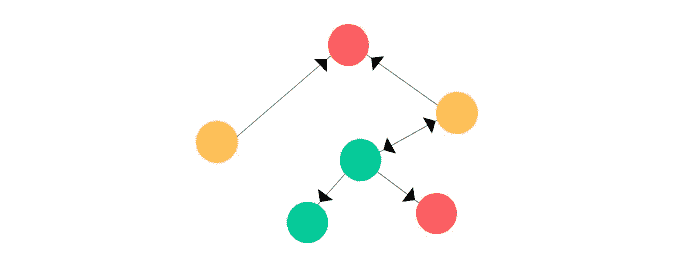

# 理解和实现图形神经网络

> 原文：<https://towardsdatascience.com/understanding-graph-neural-network-using-pytorch-geometric-c77a7ad76459?source=collection_archive---------18----------------------->

## 图形数据结构介绍，如何定义自己的简单图形，以及如何建立一个简单的图形神经网络



来源:图片来自 Upsplash

图形神经网络(GNNs)在许多项目相互关联的预测任务中变得越来越流行(例如，药物发现中的分子结构、路径投影等)。然而，与其他公知的深度学习数据源(如图像、文本和/或表格)相比，图形数据结构可能更难掌握。

在这篇文章结束时，希望你已经熟悉了图形结构，以及如何使用 **PyTorch Geometric (PyG)** 库实现你自己的 GNNs。

# 目录:

1.  装置
2.  图表介绍
3.  使用 PyG 构建简单图形
4.  使用 PyG 训练和评估简单的 gnn

# 装置

注意:安装要求您至少安装 PyTorch 1.4.0。如果你还没有，请点击这个[链接](https://pytorch.org/get-started/locally/)。

1.  检查您是否已经有 PyTorch > 1.4.0

```
$ python -c "import torch; print(torch.__version__)"
>>> 1.8.0
```

2.找到 PyTorch 安装的 CUDA 版本:

```
$ python -c "import torch; print(torch.version.cuda)"
>>> 11.1
```

3.导出特定 torch 和 CUDA 版本的变量。

```
export TORCH=1.8.0
export CUDA=11.1
```

4.安装软件包，其中${TORCH}和${CUDA}是之前定义的版本。

```
pip install torch-scatter -f [https://pytorch-geometric.com/whl/torch-${TORCH}+${CUDA}.html](https://pytorch-geometric.com/whl/torch-${TORCH}+${CUDA}.html)pip install torch-sparse -f [https://pytorch-geometric.com/whl/torch-${TORCH}+${CUDA}.html](https://pytorch-geometric.com/whl/torch-${TORCH}+${CUDA}.html)pip install torch-cluster -f [https://pytorch-geometric.com/whl/torch-${TORCH}+${CUDA}.html](https://pytorch-geometric.com/whl/torch-${TORCH}+${CUDA}.html)pip install torch-spline-conv -f [https://pytorch-geometric.com/whl/torch-${TORCH}+${CUDA}.html](https://pytorch-geometric.com/whl/torch-${TORCH}+${CUDA}.html)pip install torch-geometric
```

# 图表介绍

图形通常具有以下基本结构，包括:


图形结构

1.  节点:编号为 0、1、2 的三个圆圈
2.  属性:每个节点的值( *x1* )
3.  边:连接不同节点的线

更复杂的图形结构(不在本文讨论范围之内)将具有额外的特性，例如:

1.  邻接矩阵:定义节点如何在一个 n 乘 n 的矩阵中相互连接，其中 n 是图中节点的数量
2.  边属性:边的值(例如，从 A 点到 B 点所需的米距离)

# 使用 PyG 构建简单图形

使用 PyG，我们可以使用简单的函数调用来重现上面的图形，如下所示:

```
import torch
from torch_geometric.data import Data

edge_index = torch.tensor([[0, 1, 1, 2],
                           [1, 0, 2, 1]], dtype=torch.long)
x = torch.tensor([[-1], [0], [1]], dtype=torch.float)

data = Data(x=x, edge_index=edge_index)
```

这看起来很复杂，但是让我们来分解代码:

1.  *edge_index* :是一个 2D 数组，其中第二维由 2 个子数组组成，分别表示源节点和目的节点(例如，从节点 0 到节点 1，从节点 1 到节点 0，从节点 1 到节点 2，以及从节点 2 到节点 1)
2.  *x* :三个节点的值属性
3.  *数据*:当您提供 x 属性和 edge_index 时，构建图形数据结构

您可以找到图表的元数据详细信息，*数据，*，格式如下

```
# The number of nodes in the graph
data.num_nodes
>>> 3# The number of edges
data.num_edges
>>> 4# Number of attributes
data.num_node_features
>>> 1# If the graph contains any isolated nodes
data.contains_isolated_nodes()
>>> False
```

# 使用 PyG 训练和评估简单的 gnn

现在让我们尝试使用 PyG 实现我们自己的 GNN。让我们使用 PyG 库提供的基准数据集 Cora。

```
from torch_geometric.datasets import Planetoid

dataset = Planetoid(root='/tmp/Cora', name='Cora')
>>> Cora()
```

我们可以使用 PyG 提供的模块定义一个简单的 GNN。你可以在 PyTorch [这里](https://pytorch.org/tutorials/recipes/recipes/defining_a_neural_network.html)了解更多关于定义 NN 网络的知识。

```
import torch
import torch.nn.functional as F
from torch_geometric.nn import GCNConv

class Net(torch.nn.Module):
    def __init__(self):
        super(Net, self).__init__()
        self.conv1 = GCNConv(dataset.num_node_features, 16)
        self.conv2 = GCNConv(16, dataset.num_classes)

    def forward(self, data):
        x, edge_index = data.x, data.edge_index

        x = self.conv1(x, edge_index)
        x = F.relu(x)
        x = F.dropout(x, training=self.training)
        x = self.conv2(x, edge_index)

        return F.log_softmax(x, dim=1)
```

上面的代码简单地表示:初始化第一个图卷积层，然后是 ReLU 激活函数和 dropout 层，接着是第二个图卷积层，然后将输出馈送到 log_softmax 激活函数。

类似地，培训脚本可以编写如下:

```
model = Net()
data = dataset[0]
optimizer = torch.optim.Adam(model.parameters(), lr=0.01,               weight_decay=5e-4)

model.train()for epoch in range(200):
    optimizer.zero_grad()
    out = model(data)
    loss = F.nll_loss(out[data.train_mask], data.y[data.train_mask])
    loss.backward()
    optimizer.step()
```

首先，我们初始化预定义的 Net()类和相应的优化器。我们将训练 200 个时期或步骤，其中我们将在调用 backward()函数进行反向传播之前应用负对数似然损失函数。

评估脚本将会是:

```
model.eval()_, pred = model(data).max(dim=1)
correct = int(pred[data.test_mask].eq(data.y[data.test_mask]).sum().item())acc = correct / int(data.test_mask.sum())
print('Accuracy: {:.4f}'.format(acc))>>> Accuracy: 0.8150
```

在这里我们调用 eval()方法来防止反向传播，并将模型设置为评估模式。此后，我们传递我们想要使用的测试数据，并计算正确答案的比例，以获得准确性分数。

就是这样！希望你能学到新东西。

# 结论

这篇文章简要总结了一个简单的图形结构，以及如何使用 PyG 来构造它。接下来，我们实现了一个简单的 GNN，其中我们使用了流行的 GNN 的变体，称为图形卷积网络(GCN)。我们还成功地训练和评估了我们的基准数据集。如果您想修改网络，请在 PyG [文档](https://pytorch-geometric.readthedocs.io/en/latest/modules/nn.html)中找到更多详细信息。

***做订阅我的邮件简讯:***[*【https://tinyurl.com/2npw2fnz】*](https://tinyurl.com/2npw2fnz)****在这里我定期用通俗易懂的语言和漂亮的可视化方式总结 AI 研究论文。****