# 理解假设检验

> 原文：<https://towardsdatascience.com/understanding-hypothesis-testing-65f9b3e9ab1f?source=collection_archive---------11----------------------->

## 假设检验

## 假设检验的基本原则


[附身摄影](https://unsplash.com/@possessedphotography?utm_source=medium&utm_medium=referral)在 [Unsplash](https://unsplash.com?utm_source=medium&utm_medium=referral) 上拍照

假设检验是数据科学领域中使用的一个重要的数学概念。虽然从 python 库中调用一个随机方法来为您执行测试确实很容易，但是了解幕后实际发生的事情既必要又有趣！什么是假设检验，我们为什么需要它，它有什么作用，它是如何工作的？让我们来了解一下！

# 什么是假设检验？

假设检验是一种统计方法，用来确定你的假设是否成立。假设可以是关于数据集中的两个变量、两个群体之间的关联或一种情况。

该方法评估两个互斥的语句(不能同时发生的两个事件)，以确定哪个语句最受样本数据支持，并做出明智的决策。

假设检验的组成部分是:

1.  假设—无效和替代
2.  统计测试
3.  概率分布
4.  检验统计量
5.  临界值
6.  显著性水平(α)
7.  p 值

# **假说。**

假设检验的过程包括两个假设——一个无效假设和一个替代假设。

*   **零假设**是一种假设两个变量之间没有关系、两个组之间没有关联或者**当前情况**没有变化的陈述，因此为“零”。它由 *H0* 表示。
*   **替代假设**与零假设相反，因为它假设两个变量之间存在某种关系，或者当前情况中存在**某种变化——因此称为“替代”。用*哈*或 *H1* 来表示。**

假设检验的结论是零假设是不被拒绝(所以你接受没有变化)还是被拒绝(所以你拒绝没有变化)。

我们用一个例子来理解这个。

有一个数据集包含了过去一年中住院病人的信息。该数据集中的两个特征是位置和总花费。我们相信住院期间的总花费会因一个人的居住地而有所不同——这种说法是你的**替代假设**，因为它假设了地点和住院花费之间的关系。

因此，**无效假设**将是基于一个人的居住地在医院花费的金额**没有差异。**

现在我们需要弄清楚我们是否应该拒绝零假设。我们如何做到这一点？

# **统计检验。**

统计检验通过为我们提供来自样本数据的**检验统计量**(单个数值)来帮助我们拒绝或不拒绝我们的零假设。该检验统计量**测量样本数据与原假设**一致的程度——如果一致，则原假设不被拒绝，否则被拒绝。

对于不同的用例，存在多种统计测试。选择哪种统计检验来使用假设检验取决于几个因素，例如样本的分布(是否正态分布(遵循正态分布))、样本大小、方差是否已知、您拥有的数据类型以及其他一些因素。基于测试遵循的概率模型/分布，每个测试都有自己的测试统计。

比如说—

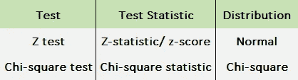

作者图片

统计检验有两种类型——**单尾和双尾**。

尾部的概念与**概率分布相关。**

概率分布是一种统计函数，其输出是实验中不同事件(可能的结果)发生的概率。

例如:

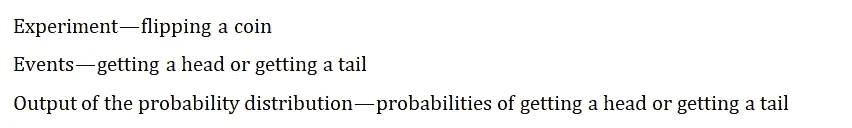

概率分布有数据和图表两种形式，但图表是理解尾部的更好方式。

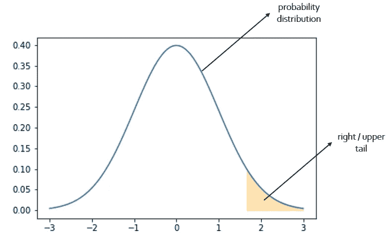

作者图片

分布的尾部是分布两侧曲线/图形的末端。右端称为右尾或上尾，左端称为左尾或下尾。

一个分布没有必要在所有情况下都有两个尾部，它可以只有一个。尾巴的数量取决于你的无效假设和替代假设。

因此我们有单尾分布和双尾分布。

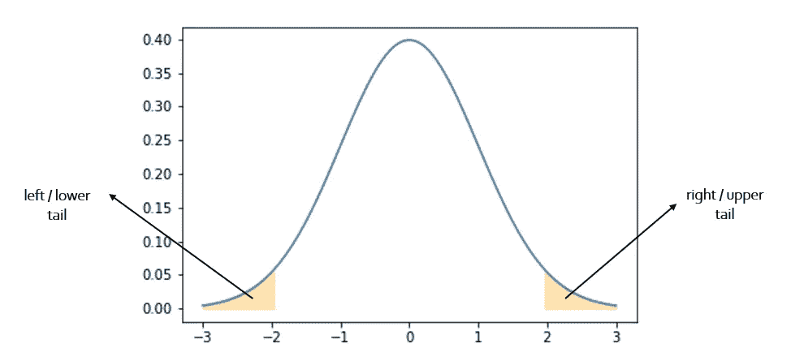

作者图片

因此，**单尾统计检验是指其分布只有一个尾**——要么是左尾(左尾检验)，要么是右尾(右尾检验)。**双尾统计检验是指其分布有两个尾部**——左边和右边。

统计检验中尾部的目的是看得到的检验统计量是在尾部之内还是之外。尾部区域被称为拒绝的**区域**——这是有意义的，因为如果测试统计落在这个区域内，则零假设被拒绝。如果它落在它之外，则接受零假设。

确定尾部从哪里开始是借助于一个称为**显著性水平的参数——alpha**。它是当零假设为真时拒绝零假设的概率。alpha 最常见的值是 5%，即 0.05。这意味着你面临着拒绝零假设的 5%的风险，也就是说，当实际上没有差异时，你相信当前的情况有差异。

就我们的分布而言，alpha 是构成拒绝区域的分布区域，因此它是尾部。因为尾部在分布的末端，我们实际上是在说，在显著性水平下，我们的检验统计量离零假设有多远，才能真正拒绝零假设。

因此，如果我们选择一个右尾检验，我们的显著性水平是 5%，那么曲线右端分布区域的 5%将是我们的拒绝区域。利用这一点，我们计算 x 轴上的值，该值界定了剔除区域的开始位置，这就是所谓的**临界值**。

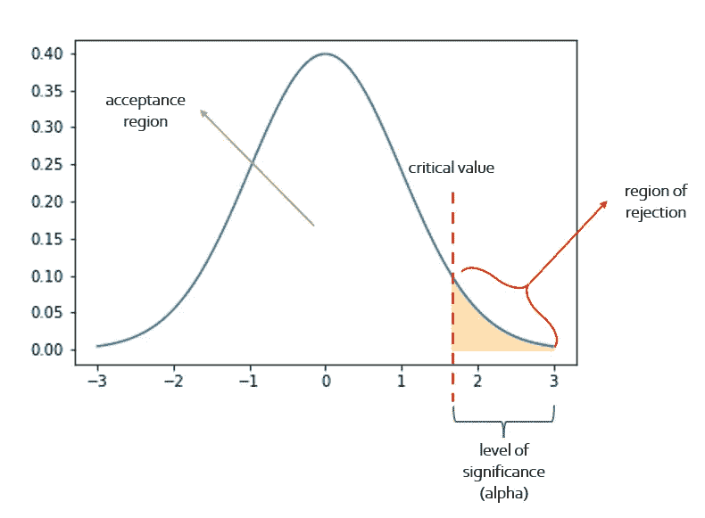

作者图片

在双尾检验的情况下，我们将显著性水平除以 2.5%，这将是曲线两侧每个拒绝区域的面积。那么我们将有两个临界值，拒绝区域也称为临界区域。

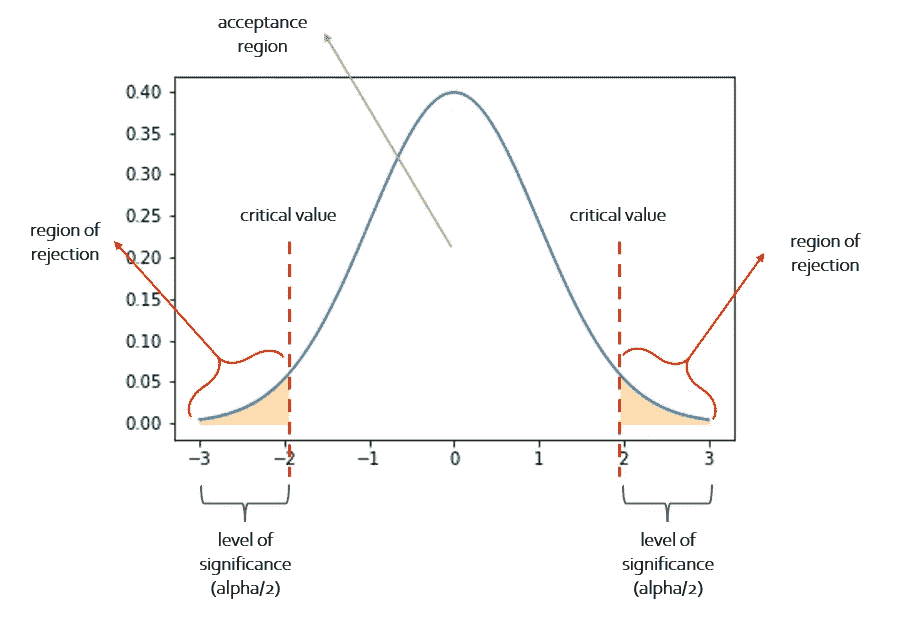

作者图片

**单尾检验是有方向性的，因为只有一个拒绝区域**。您正在寻找一个属于唯一拒绝区域的测试统计。**双尾检验是无方向性的，因为有两个拒绝区域**，如果检验统计量落入其中任何一个区域，则零假设被拒绝。

例如，牙医诊所患者的样本平均年龄是 18 岁，这是您的零假设(因为这是当前的情景，并且您假设没有变化)。另一位牙医加入了这一行业，你认为现在患者的样本均值将大于 18——这是你的另一种假设。由于“大于”，它是有方向性的——只有当样本均值大于 18 时，您才会拒绝零假设。如果小于 18，你的零假设不会被拒绝。

如果这是一个双尾检验，你的另一个假设就是患者的样本平均年龄不等于 18 岁。样本均值可能大于或小于 18，无论哪种情况，零假设都会被拒绝，因此它是无方向性的。

到目前为止，我们已经有了假设，一个基于概率分布的统计测试，一个我们从中获得临界值的拒绝区域的显著性水平，以及一个落在我们分布中某处的测试统计。

# 但是， **p 值**从何而来？

如前所述，测试统计与临界值进行比较。**p 值与显著性水平进行比较。**

p 值是您获得的检验统计数据是随机的概率，这意味着零假设实际上是正确的。如果 p 值低于显著性水平，则它在统计上是显著的，无效假设被拒绝，因为这意味着无效假设为真的概率小于 5%。如果它高于显著性水平，则不拒绝零假设。

根据概率分布的图形表示，p 值是检验统计右侧的曲线面积。

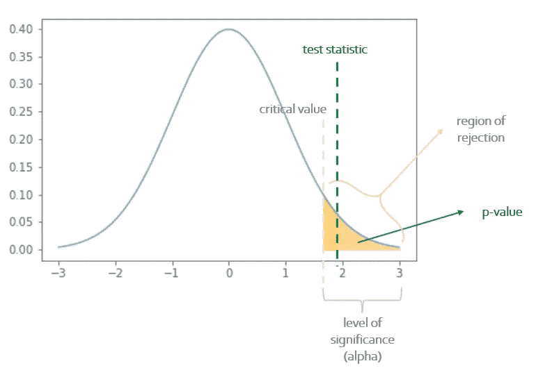

作者图片

p 值的一个很大的优点是，它不需要针对不同的显著性水平进行重新计算，因为它是直接可比的。在检验统计的情况下，必须将它们与临界值进行比较，临界值需要针对不同的显著性水平进行重新计算(如果剔除区域的面积发生变化，则区域起点的 x 轴值也将发生变化)。这就是为什么在假设检验中使用 p 值总是更好的原因。

尽管有上述优点，p 值仍然是概率性的。因此，即使无效假设是真的，也有可能被拒绝。Alpha(显著性水平)是这种情况发生的可能性。这种错误被称为**I 型错误**或**假阳性**。

与上述错误相反的是，即使无效假设不成立，也不拒绝它。这被称为**类型 II 错误**或**假阴性**。

这两个误差是反向相关的，也就是说，如果你试图减少一个，另一个就会增加。那么如何获得完美的情境呢？你不需要，你只需要决定在你的情况下哪个错误风险更小。例如，当他们实际上是阴性的时候，告诉某人他们是新冠肺炎阳性的风险较小——这是假阳性(I 型错误)。假阴性是说某人没有表现出欺诈行为，而实际上他们表现出了欺诈行为。

最后，我们对假设检验的所有构件进行了分类，因此这个过程也非常清楚。假设检验的步骤是:

1.  阐明你的假设
2.  选择重要程度
3.  识别统计测试
4.  计算测试统计量
5.  计算 p 值并将其与显著性水平进行比较
6.  结论——拒绝或不拒绝你的无效假设

让我们通过上面使用的关于看牙医的患者平均年龄的例子来完成这些步骤。我们知道平均年龄是 18 岁，标准差是 8。让我们假设数据服从正态分布。我们认为平均年龄不是 18 岁，但实际上比 18 岁大。

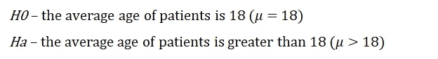

作者图片

因为我们的替代假设有方向性，我们需要一个右尾统计检验。

我们正在比较样本的平均年龄，因此我们可以使用 z 检验来确定我们的替代假设是否可能。

我们的显著性水平是 5%,我们正在进行右尾检验，因此曲线的右尾是拒绝区域。

我们的样本数据是随机抽取的 30 名患者，我们计算样本的平均年龄。

所以我们有:

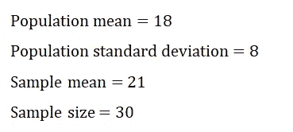

作者图片

现在我们需要计算我们的测试统计量，在 z 测试的情况下是 z 得分。z 得分的公式为

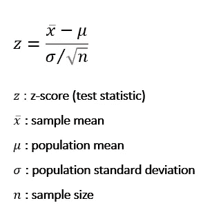

作者图片

所以我们的 z 值是

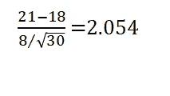

作者图片

α为 0.05 的正态分布的临界值为 1.645。因此，我们已经可以看到，我们的测试统计大于我们的临界值，因此，我们可以拒绝零假设。但如前所述，p 值是确定我们是否应该拒绝零假设的最佳方法，所以我们也来计算一下。

在正态分布上得到值 2.05 的概率是 0.9798。由于 p 值是检验统计数据右侧的区域，因此可以通过从 1 中减去 0.9798 来计算。

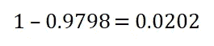

作者图片

p 值 0.0202 小于 0.05，因此我们可以拒绝零假设，并得出结论，样本均值更有可能大于 18。

现在让我们用 python 来实现所有这些吧！

我们将使用新冠肺炎数据集。它包含 2020 年初以来的区域确诊病例和死亡病例。它还包含温度、湿度、纬度和经度。

第一步是导入所有必需的包:

```
import pandas as pd
import statsmodels.api as sm
```

我们将使用熊猫来读取我们的数据和 stasmodels 来实际执行我们的假设检验。

将数据读入数据帧:

```
covid = pd.read_csv(“Covid-19.csv”)
covid = covid.drop([“Unnamed: 0”], axis=1)
covid.head()
```

我认为温度和确诊的新冠肺炎病例数之间有关系——确诊新冠肺炎病例的地区的平均温度是否高于 12 度？

假设检验的第一步是阐明假设。我们的会是:

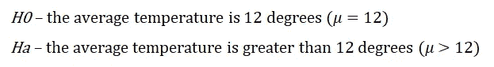

作者图片

由于我们的替代假设是方向性的，我们将进行单尾统计检验(右尾检验)，即 z 检验。

显著性水平为 0.05，检验统计量为 z 得分，临界值为 1.645。

使用 [statsmodels](https://www.statsmodels.org/stable/index.html) ztest 方法计算测试统计量和 p 值非常简单。让我们将这个功能包装在我们自己的函数中，并添加 alpha 和 p 值之间的比较。

```
def hyptest(data, value, alternate, alpha):
    z, p = sm.stats.ztest(data, value=value, alternative=alternate)
    result = 'null hypothesis rejected!' if p < alpha else 'null hypothesis not rejected'
    return z, p, result
```

现在我们调用我们的函数—传递温度列(因为这是我们的假设中存在的变量)，数字 12 作为值，因为这是我们要测试的度量，以及“更大”的替代参数，因为我们的替代假设是平均值大于值。

```
hyptest(covid.Temperature, 12, "larger", 0.05)**(1.0033989581188794, 0.15783420330389508, 'null hypothesis not rejected')**
```

结果分别是 z 得分、p 值和结论。由于 p 值大于 0.05，我们不拒绝零假设。

这就是你如何进行假设检验！

需要记住的一些关键事项是:

*   假设检验是对总体样本进行的，因此是样本数据。(如果你想确定年龄是否会影响入院的可能性，那么“人口”就是地球上的每一个人。“样本”是从这个群体中随机选择的一些人)
*   假设检验的输出是概率性的，因为它是对样本而不是总体进行的。所以你永远不能完全肯定地说零假设是真的还是假的。你干脆拒绝或者不拒绝。
*   零假设总是被写成等式=，≤或≥
*   备择假设总是写着≦，< or >
*   p 值受样本大小的影响-如果样本大小增加，那么如果要拒绝零假设，p 值将会降低。

请在下面的评论中告诉我你对这篇文章的想法，或者通过[林克丁](https://www.linkedin.com/in/shubhangihora/)联系我，我们可以联系上！

原始数据取自[约翰·霍普斯金的 GitHub 库](https://github.com/CSSEGISandData/COVID-19)，然后经过修改得到该地区的温度。用于执行测试和创建图表的代码可以在[这里](https://github.com/shubhangihora/python-articles)找到。