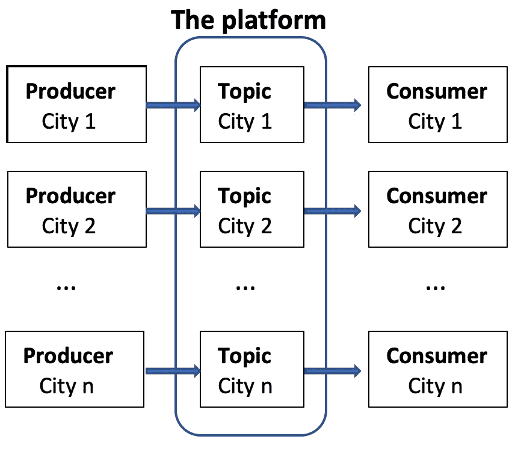
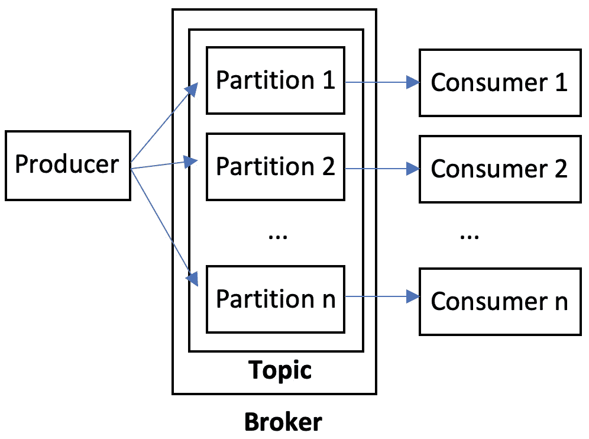
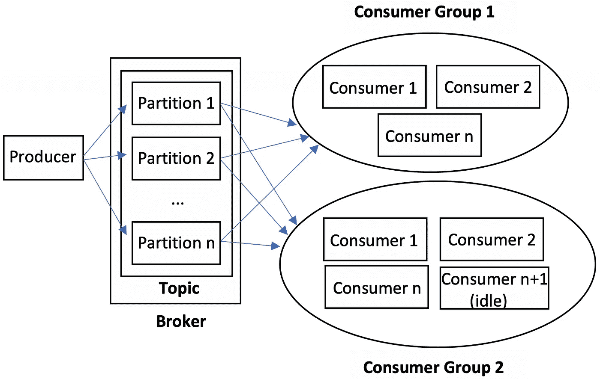
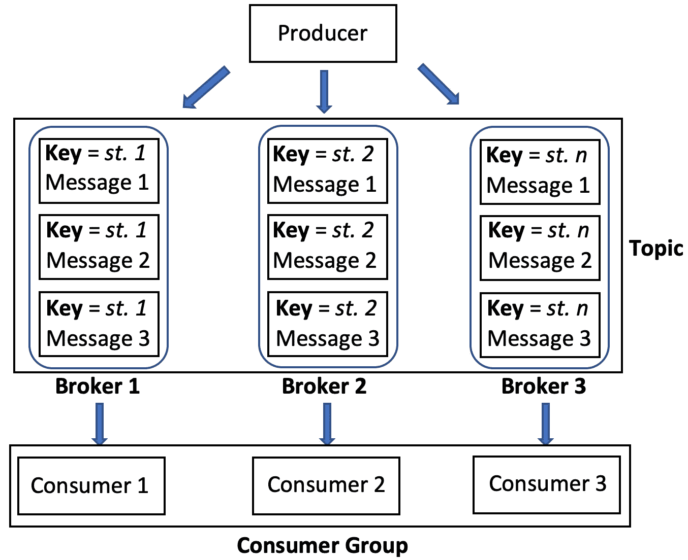

# 理解卡夫卡，就像是你设计的一样——第二部分

> 原文：<https://towardsdatascience.com/understanding-kafka-as-if-you-had-designed-it-part-2-33d0d24c79f1?source=collection_archive---------16----------------------->

## 从内向外理解阿帕奇卡夫卡式建筑

这是旨在解释卡夫卡的关键建筑元素系列的第二部分。这个想法是提供一个关于它的设计决策和内部的直觉。与消息传递语义、生产者和消费者的配置、安装、安全性等相关的细节将留到以后的文章中讨论。

还有一个重点是可读性和趣味性，所以如果你想在学习的同时获得乐趣，请继续读下去。

[以前](/understanding-kafka-as-if-you-had-designed-it-part-1-3f9316cb8fd8)，你负责开发一个解决方案，帮助你的一个朋友将一个革命性的天气预报模型变成现实。他有了模型，但接收测量数据、存储、处理和大规模管理它们仍然是一项艰巨的任务。尽管如此，您还是推出了一款工具，它能够:

*1。* *接收包含任何格式的记录并无缝存储它们*

*2。* *几乎实时地按到达顺序处理这些记录*

*3。* *以非常高效的方式从任何特定偏移或时间查找记录*

*4。* *以最佳方式删除记录*

你甚至去度假庆祝这一壮举。然而，你朋友的一些问题仍然悬而未决，当你欣赏阿尔卑斯山倒映在湖面上的可塑性时，你几乎无法将它们从脑海中抹去:

1.  如何支持多个城市？是否有必要为每个新城市准备一个基础设施？
2.  如何支持多个并行读取器和写入器？
3.  如何确保数据的持久性，例如在磁盘出现故障后？
4.  如何在读写器全速运行的情况下备份数据？

我们回去工作吧。

# **继续分…**

现在，您必须为多个城市提供您的解决方案，每个城市都有自己的一套测量方法。

第一个显而易见的解决方案是多次部署您的平台，每个城市一次。但是它足够可维护吗？大概不会。让每个城市给它产生的记录附上一个 id 怎么样？听起来很有趣，但是这需要截取所有记录，分配 id，然后分派修改后的记录，由于错误的 id、失败的截取等原因，这很容易出错。这个问题开始看起来很棘手。

然而，你已经学到了“分而治之”这一永恒的教训，也许这能有所帮助。如果分储呢？更确切地说，在当前状态下，所有记录都被发送到同一个目录。如果您可以创建多个目录，并决定消息应该发送到哪个目录，会怎么样？如果能够做到这一点，每个城市的名称都可以成为一个目录，这将使相同的部署服务于多个城市成为可能，并具有适当的数据隔离。

您匆忙实现了这个非常有前途的想法，但是在编码时，您意识到“目录”是一个已经使用的名称，也就是说，它在多种上下文中使用，如果有一个专门为这个工具定制的概念就好了。您也开始考虑该工具能够服务于大量用例，因此需要一个更通用的名称。你的推理是这样的:

人们或其他系统向平台发送消息，而平台则充当将消息传递给接收者的管道。这些消息与一个主题相关联，所以我可以将每个存储目录命名为 ***主题*** *。但是这个名字也在其他语境中被广泛使用。所以也许是一个相关的术语，比如话题？哎…是啊，* ***题目*** *！*

从尤利卡来的！瞬间，你准备好了更多:

*好吧，但是无论是谁向一个主题发送消息，都不仅仅是简单地写它，更一般地说，是产生它。同样，一个人不只是阅读信息，而是消费它。所以实际上，我们确实有* ***生产者*** *向主题发送消息和* ***消费者*** *获取它们。*

您如何通过一个部署支持多个流程(图片由作者提供)

# …一次又一次…

方向看起来完全正确。您刚刚创建了 3 个新概念:*生产者*、*消费者*和*主题*。通过允许在同一个平台上有多个主题，您还允许多个生产者和消费者共享同一个部署。然而，还有两个问题需要解决。首先还是和命名有关。第二个与可伸缩性有关。你从最简单的开始。

将整个系统称为“平台”听起来不太合适。你希望是通用的，但不要太多。平台可以是任何东西，你所拥有的是一个促进双方交流的系统。在“现实世界”中，这种类型的服务被称为*经纪*。那么，为什么不把保存主题的系统称为**代理**？问题一解决了。

第二个问题有点复杂。在大多数情况下，消费消息可能比生成消息更耗时。因此，能够横向扩展消费至关重要。

一个可能的解决方案是多线程消费者。一个线程(让我们称之为*分配器*)将使用来自代理的消息，并将负载分配给其他线程。但是如果单个节点不够呢？如果需要在多台机器之间分配负载，该怎么办？在这种情况下，您需要更改分发服务器以支持网络通信。然而，如果添加了足够多的节点，以至于分发服务器本身成为瓶颈，该怎么办？

避免诸如分发服务器这样的瓶颈的最直接的方法之一是允许消费者节点直接从主题消费，而不需要任何类型的中介。然而，主题中的条目是通过偏移量来处理的(这里是您开发的)。如何协调每个消费者正在处理哪些补偿？分而治之再次拯救(你开始认为这种方法是一个真正的银弹)。

您将代理划分为多个主题，每个主题都有其偏移量跟踪。如果你将主题进一步划分为子主题，并允许每个子主题都有自己的偏移量，会怎么样呢？然后，每个消费者可以从不同的子主题中获取，扩展系统就像创建更多的子主题和添加更多的消费者一样简单。另一方面，生产者将向代理查询主题的子主题，并以循环方式向每个子主题发送消息。美女！

但是，命名还是一件事。将新概念命名为副主题有点误导，因为它暗示了一个新的主题，尽管仍然与主主题相关。但是你没有一个新的主题，你只有相同主题的划分或分割。由于你有很多事情要做，你决定尽快解决它，并将子主题重命名为**分区**。

可以并行使用的分区主题(图片由作者提供)

# 最后，举一个反例来各个击破

那栋建筑看起来真的很棒，你为此感到骄傲。但是，如果一个消费者死了会怎么样呢？！因为生产者在分区之间平均分配数据，所以如果一个消费者死亡，消息的处理就变得不完整，因为整个分区都没有被处理。

你的思维习惯于分而治之，你会挣扎一会儿，直到这次决定走相反的路。如果消费者在元数据级别上分组会怎样？更具体地说，如果系统的另一个组件开始跟踪每个分区分配了哪些用户，以及最后使用了哪个偏移量，会怎么样？然后，如果一个消费者死亡，可以查询相同的组件，新的消费者可以从上一个消费者停止的地方开始。有了这个新概念，消费者不再单独工作，而是分组工作。那么，还有什么比消费者群体更好的名字呢？当然，如果一个使用者组中的使用者比主题中的分区多，一些使用者将被闲置。

现在消费者可以被无缝替换(图片由作者提供)

但是哪个组件会跟踪消费者群体呢？是否应该添加一些外部的东西，以便消费者在工作时可以接触到它？听起来不错，但是这样做也增加了新的依赖性，需要维护、监控等。但是将这种能力添加到代理本身怎么样呢？消费者已经联系了代理，所以它知道哪个消费者正在每个分区上工作。然而，经纪人不太了解消费者本身，也就是说，他们正在用他们正在消费的记录做什么。如果消费者从一个给定的偏移量读取一条记录，然后立即死亡，那该怎么办？代理可以假定记录已被处理，还是应该将相同的记录交给新的消费者来代替死去的消费者？

为了解决这个难题，您决定为消费者和代理增加一个额外的可选步骤。获取记录后，消费者可以通过发送*提交*消息来告诉代理消费是否成功。如果没有收到消息，代理将假设处理失败，因此，当要求新记录时，它将返回与以前相同的记录。另一种可能性是让经纪人设定提交的最后期限。如果消费者在给定的时间内没有联系，代理将认为消费是成功的，当被要求提供新的记录时，将提供与下一个补偿相关的记录。

当考虑这种机制时，你会意识到它实际上可以被设计成一种配置。在上面提到的第二种情况下，代理会自动提交。在第一种情况下，你有相反的行为。因此，您决定添加一个名为**使能**的配置。**自动提交**，可以设置*真*或*假*。

# 最后一次分裂

这真是太棒了。该系统现在可以平衡多个代理之间的负载，从而允许并行消费。现在，扩展系统就像添加一个新的代理一样简单。更好的是，如果一个消费者死了，一个新的可以开始，在被添加到消费者组后，它将准确地从上一个停止的地方开始。但是如果整个经纪人都死了会怎么样呢？我的意思是，从制作人的角度来看，这很容易，制作人可以从目的地列表中删除该代理，并继续向剩余的代理发送记录。但是，如果记录仍然没有被使用，会发生什么情况呢？太棒了，一个系统不能容忍数据丢失的可能性。

你首先想到的是这样一个想法:弹性通常来自冗余。如果你想承受失去某样东西，你首先需要它的复制品。在这种情况下，你希望能够失去经纪人，并保持系统的工作。然而，如果您失去了一个代理，您并没有失去一切，只是失去了一些分区。因此，如果您复制一个代理中的所有分区，该代理很容易被包含副本的分区所取代。为此，您需要做的就是决定哪个代理拥有主分区，哪个包含副本分区。一旦有了这些，生产者就可以写入主分区，另一种机制可以将记录复制到副本。前途无量！

但是，在开始编码之前，和往常一样，您需要为新概念指定合适的名称。乍一看，“主分区”和“副本分区”听起来还行。然而，副本是与其他东西相同的东西，在这种情况下，副本在某些时候可能不相同。当主分区接收到记录时，它变得不同于它的副本。没错，复制品将会跟上，但在赶上之前，它们不再是复制品。但是，嘿…这些复制品实际上是在跟随，所以把他们每个人命名为**追随者**听起来是对的。追随者跟随一个领导者，所以你有它。主分区，从现在开始，将被称为**首领**。

主题分布在分区中，分布在领导者和追随者中(图片由作者提供)

这个解决方案看起来像万灵药，但是有一个潜在的问题:如果复制过程失败了会发生什么？当然，您已经添加了*消息提交*的概念，但是如果您提交了书面记录，但是将记录复制到跟随者失败了，会发生什么呢？

与你已经经历的相比，这是一个更容易的问题。在这种情况下，您只需要添加一个规则，指定记录写入只能在成功复制到最小数量的跟随者之后提交。

这种设计还有一个优点。如果您将关注者添加到一个组(类似于消费者组)，您可以跟踪他们中哪些人落后了。然后，如果一个领导者失败了，你可以从与前一个领导者同步的群体成员中选出新的领导者。这个组甚至可以作为系统的标尺，例如，通过指定至少一定百分比的追随者在任何时候都应该同步。这个小组的好名字是什么？好吧，这一次，既然它们是同步的，就可以认为是复制品。那么，为什么不使用**同步副本集**，或者简称为 **ISR** ？

# 开个玩笑，这是真正的最后一次分裂

你完成了实现，并急于向你的朋友展示新的特性，他完全被你的独创性惊呆了。你感到受宠若惊和兴奋，但当他告诉你其他城市的研究人员刚刚告诉他，今天早些时候，他们需要按街道分类的测量值时，这种感觉几乎消失了。

当前的解决方案不玩排序，你也看不到一个简单的方法来做到这一点。你的第一个想法是让每条街道上的传感器给它们产生的信息附加一个 id 和一个序列号，然后在读取时对记录进行分类。但是，这将需要大量的内存用于聚合，或者如果磁盘必须用于随机访问，则会影响性能。还有，散兵游勇怎么办？您应该保持这种状态并等待他们到达多长时间？事情开始变得过于复杂。要是你能保证同一条街上的传感器产生的记录最终能在同一个分区里就好了……但是，嘿，你不能吗？

如果记录按 id 和值划分，您可以更改生成器，强制它们将包含相同 id 的所有记录发送到同一个分区。这样，无论它们产生的顺序是什么，它们都将在同一个分区中进行排序。这样做还有更大的好处，因为通过对消息进行自然分组可以加快处理速度。在定义键没有意义的场景中，生产者只是继续做他们已经在做的事情，以循环的方式向主题分区发送消息。答对了。除了名字，一如既往。将成对的事物称为 **id** 和**值**并不常见，但是**键**和**值**完全没问题，所以就这样了。

包含相同键的记录现在被发送到相同的分区(按作者排序)

# 完整的画面

这就是了！将您之前开发的[与您现在创建的](/understanding-kafka-as-if-you-had-designed-it-part-1-3f9316cb8fd8)结合起来，您将获得以下结果:

1.  能够随着新硬件的增加而水平扩展的分布式平台
2.  与模式无关的存储系统
3.  一种通过利用页面缓存和顺序读写来支持极高吞吐量同时仍使用磁盘的机制
4.  通过将主题分割成分区并创建消费者组，并行消费记录并在失败时平滑追赶的策略
5.  通过在代理之间复制分区来避免数据丢失的弹性方法
6.  一种通过监控同步副本来保证系统健康的机制
7.  一种通过使用键来保证分区内记录顺序的方法

每一个听到这个解决方案的人都同时感到吃惊和惊讶。每一个人也询问它将被赋予的名字，而这一次你不知道。只有你，命名怪胎！

你必须承认的一点是，你创建的解决方案看起来有点超现实。它与模式无关，在使用磁盘时提供高吞吐量，在作为分布式系统时保证某种排序，允许代理无缝地来回切换，等等。

你记得你坐在阿尔卑斯山上读的一本书，关于一个人试图到达一个不可能的城堡，一个永远无法到达的遥远的愿景，正如你的设计元素。无论你如何达到它。此外，你喜欢那本书，因为它给了你一段美好的时光，那么为什么不用它来命名系统呢？但是将一个平台命名为城堡并不合适。那么作者呢？是啊，听起来绝对不错。从现在开始，当人们问起，你会告诉他们你的系统叫做**卡夫卡。**

# 参考

1.  [文档](https://kafka.apache.org/documentation/)

2.[本系列的第一部分](/understanding-kafka-as-if-you-had-designed-it-part-1-3f9316cb8fd8)

你给这个世界的能力