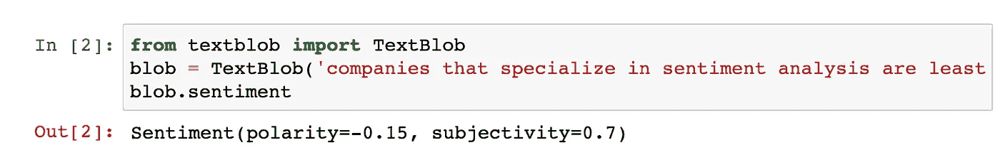
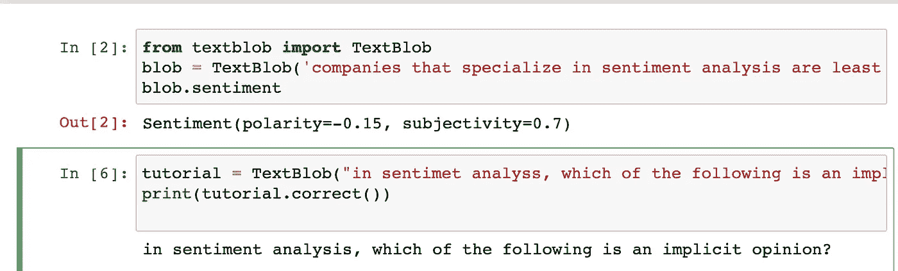
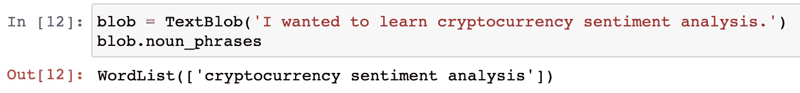

# 通过 Python 中的情感分析理解语言

> 原文：<https://towardsdatascience.com/understanding-language-through-sentiment-analysis-in-python-e7bee1575cbb?source=collection_archive---------38----------------------->

## 使用 TextBlob 的自然语言处理能力


普里西拉·杜·普里兹在 [Unsplash](https://unsplash.com?utm_source=medium&utm_medium=referral) 上的照片

为了将数据转化为信息并发现原始数据的真正好处，开发人员、企业、机构、大学甚至犯罪分子对数据科学领域产生了浓厚的兴趣。在我们知道之前，通过代码模仿人脑功能的能力已经向我们展示了分析语言的能力是推动社会和人类进步的最重要的方法之一。由此，数据科学、机器学习和自然语言处理的发展已经被实施到消费者每天使用的工具中，如 Siri、Alexa 和 Cortana。

开源数据和数据处理的发展已经引导了稳健方法的使用，以将数据用于自然语言处理、情感分析和确定情绪。数据现在是下一个淘金热，因为我们开始了解数据需要如何提取、转换、加载，并为了充分的利益而转化为信息。理论上，和黄金一样，数据也是一种商品。

在本文中，我计划让您对利用编程工具在社交媒体网络中使用 Python 进行情感分析有一个基本的了解，以及如何利用基于文本的数据分析能力，使用基于计算机的代码来理解真实的情感。

# 介绍 TextBlob

作为 Python 的 NLP 库， [TextBlob](https://textblob.readthedocs.io/en/dev/) 已经成为开发人员的首选包之一。

> *TextBlob* 是一个用于处理文本数据的 Python (2 和 3)库。它提供了一个简单的 API，用于处理常见的自然语言处理(NLP)任务，如词性标注、名词短语提取、情感分析、分类、翻译等。— [TextBlob 的网站](https://textblob.readthedocs.io/en/dev/)

# 使用 TextBlob 理解情感分析

> `[**sentiment**](https://textblob.readthedocs.io/en/dev/api_reference.html#textblob.blob.TextBlob.sentiment)`属性返回一个形式为`Sentiment(polarity, subjectivity)`的命名元组。极性分数是[-1.0，1.0]范围内的浮点数。主观性是在[0.0，1.0]范围内的浮动，其中 0.0 非常客观，1.0 非常主观。— [TextBlob 快速入门教程](https://textblob.readthedocs.io/en/dev/quickstart.html)

TextBlob 返回句子的**极性**和**主观性**。

**极性**是介于[-1.0，1.0]范围之间的浮动值。

*   -1 表示负面情绪
*   1 定义积极的情绪。

**主观性**介于[0.0，1.0]之间。

*   0.0 很客观，1.0 很主观。
*   如果主观性< 0.5, the sentence is more subjective than objective and vice versa.

TextBlob also provides labels for semantics which allow for the detection and analysis of emojis, tones of sentence like exclamation marks, and more.

# Installing From the Python PyPI

```
$ pip install -U textblob
```

TextBlob is available as a [康达](http://conda.pydata.org/)包。要使用`conda`安装，请运行

```
$ conda install -c conda-forge textblob
```

# Python 中的 TextBlob

首先，在你首选的笔记本编译器中导入`*textblob.*`。

然后，我们需要做的就是使用`TextBlob(text)`,以便利用 TextBlob 的许多不同方法。

```
**from** textblob **import** TextBlobblob = TextBlob(text)
```

一旦你创建了一个 **textblob 对象**，你就可以访问普通的文本处理操作。我将把 TextBlob 对象视为 Python 字符串，以展示 NLP 在情感分析等方面的强大功能。

# 使用 textblob 分析情感

为了使用 **textblob** 执行情感分析，我们必须使用如下所示的*情感()*方法；

```
blob = TextBlob('companies that specialize in sentiment analysis are least likely to look at for data.') 
blob.sentiment
```

## 结果

```
Sentiment(polarity=-0.15, subjectivity=0.7)
```



# 有益的补充

## 拼写纠正

在我们分析大型数据集的用例中，单词的拼写错误可能会对数据产生不利影响，因此纠正单个单词的拼写非常重要。

```
tutorial = TextBlob("in sentimet analyss, which of the following is an implicit opinion?")print(tutorial.correct())
```

## 结果



```
 in sentiment analysis, which of the following is an implicit opinion?
```

# 名词短语抽取

名词短语是以一个名词为中心的一组两个或多个单词(例如，“狗”、“女孩”、“男人”)，包括修饰语(例如，“the”、“a”、“None of”)。例如，“男孩”不是一个名词短语，但“一个乐于助人的男孩”是一个名词短语。

通常在数据科学中，研究人员可能希望提取一个句子中的所有名词短语，而不是确定单个名词。

```
blob = TextBlob('I wanted to learn cryptocurrency sentiment analysis.')
blob.noun_phrases
```

## 结果



```
WordList(['cryptocurrency sentiment analysis'])
```

正如我们所看到的，只有“情感分析”是从句子中提取的，因为它是句子中唯一的名词短语。

# 结论

最常见的情况是，公司雇佣开发人员来分析大量数据，以获得原始数据，这些数据随后可以发现诸如消费者或客户对产品或体验的感受之类的事情。公司可以通过基于正则表达式的文本识别和抓取基本网页来识别电话号码、个人姓名、位置和其他特定实体。对语言学概念有更深入的理解，如部分词、中间词、原生词、同义词、词干、词汇化、词类、词义消歧和类似领域。

我希望这篇文章能帮助您发现自然语言处理(NLP)的强大之处，并提供一些在您自己的环境中进行测试的例子。

# **感谢您阅读**

欢迎建设性的批评和反馈。[可以在 Instagram](https://ualready.com/pages/nicholas-resendez?ref=hackernoon.com) [@nirholas](http://instagram.com/nirholas?ref=hackernoon.com) 、LinkedIn **、**和 [Twitter @nickresendez](https://twitter.com/nickresendez) 上联系到 nickresendez，了解新文章的更新。