# 理解 R 中的线性回归输出

> 原文：<https://towardsdatascience.com/understanding-linear-regression-output-in-r-7a9cbda948b3?source=collection_archive---------0----------------------->

## 自信地解释您的模型与数据的吻合程度


克里斯·利维拉尼在 [Unsplash](https://unsplash.com?utm_source=medium&utm_medium=referral) 上的照片

无论是业余爱好者还是专业人士，回归都是一种非常普遍的分析形式。这是为什么呢？因为它是理解变量之间关系的最强大的工具之一。此外，它还允许我们对以前看不见的数据进行预测。大多数人都上过统计学课程，运行过简单的线性回归模型。我猜想，大多数人，给定一些模型输出，可以挑选出 y 截距和可变系数。虽然这些信息非常重要，但是我们运行模型时返回的所有其他数据呢？


> **还有其他我们应该考虑的事情吗？其他值告诉我们什么？**

# 数据


照片由 [Unsplash](https://unsplash.com?utm_source=medium&utm_medium=referral) 上的 [NeONBRAND](https://unsplash.com/@neonbrand?utm_source=medium&utm_medium=referral) 拍摄

我们将深入研究上述每个指标，目的是深入理解每个指标告诉我们关于模型的什么，而不是如何计算每个数字的具体细节。为此，我们将使用来自国家篮球协会(NBA)的数据集[。该数据集包括 2017-2018 赛季每个球员的工资信息和赛季得分。我们将调查一个赛季的得分和球员工资之间的关系。我们可以通过看一个球员得了多少分来预测他的薪水吗？下面是数据集的预览:](https://www.kaggle.com/koki25ando/salary)

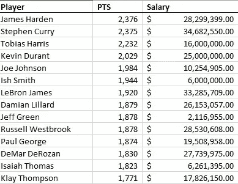

# 简单线性回归输出

我们首先运行一个简单的回归模型，将*薪水*作为我们的因变量，将*积分*作为我们的自变量。该回归模型的输出如下:

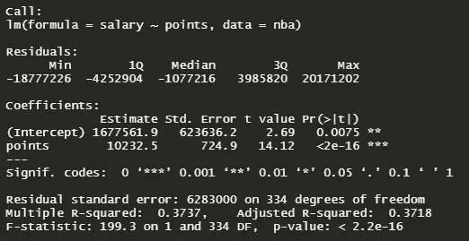

现在我们有了模型和输出，让我们一步一步地浏览这个输出，这样我们可以更好地理解每个部分，以及它如何帮助我们确定模型的有效性。

# 打电话

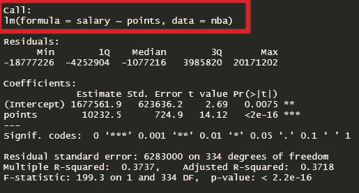

call 部分向我们展示了 R 用来拟合回归模型的公式。*薪水*是我们的因变量，我们使用来自 NBA 数据集的*点数*作为预测值(自变量)。

# 残差

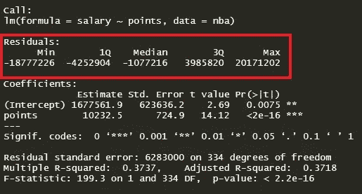

残差是实际值和预测值之间的差值。我们可以通过获取*薪金*的实际值并将其从模型的预测值中减去来生成这些相同的值:

```
summary(nba$salary - model$fitted.values)
```

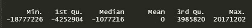

那么我们该如何解读这一点呢？嗯，仔细想想，我们肯定希望我们的中值以零为中心，因为这将告诉我们，我们的残差在某种程度上是对称的，并且我们的模型在数据集的高端和低端都进行了均匀的预测。看看上面的输出，看起来我们的分布并不完全对称，并且稍微向右倾斜。这告诉我们，我们的模型在高工资范围的预测不如在低工资范围的预测好。我们可以用分位数-分位数图来形象化这一点。看下面的图表，你可以看到图表两端都有异常值，但是上端的异常值比下端的异常值更严重。总体而言，残差看起来具有相当正态的分布。

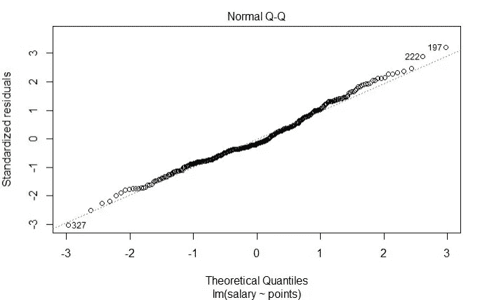

# 系数

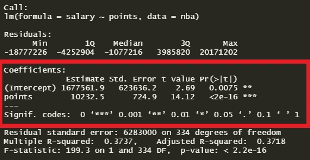

为了理解系数是什么，我们需要回到我们在建立线性模型时实际尝试做的事情。我们希望以 *y=mx+b* 的形式建立一个通用模型，其中 *b* 是截距， *m* 是直线的斜率。因为我们通常没有足够的信息或数据来知道实际存在的确切方程，所以我们必须通过对斜率和截距进行估计来建立这个方程。这些估计值通常是通过普通的最小二乘法生成的，这是一种奇特的说法，即回归模型以这样一种方式找到拟合这些点的直线，即最小化每个点和直线之间的距离(最小化实际值和预测值之间的平方差总和)。

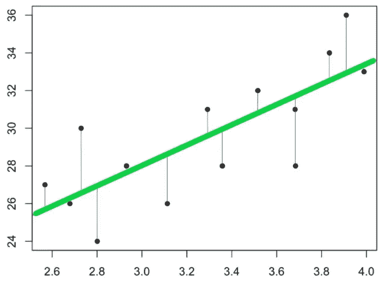

**系数—估计值**

我们就是从上面这条线得到系数的。直线与 y 轴相交的地方是我们的截距( *b* )，直线的斜率是我们的 *m* 。使用我们到目前为止获得的理解，以及上面输出中提供的系数估计，我们现在可以为我们的模型建立方程。我们将用*点*代替 *m* ，用*(截距)*代替 *b:*

*y = 10，232.50 美元(x)+1，677，561.90 美元*

现在我们有了这个等式，它告诉了我们什么？嗯，作为一个基线，如果一个 NBA 球员在一个赛季中得分为零，那么这个球员的平均收入是 1，677，561.90 美元。然后，他们在赛季中每获得一个额外的分数，他们将获得 10，232.50 美元。

让我们将此应用于数据集中的一个数据点。詹姆斯·哈登是我们数据集中的第一名球员，得到了 2376 分。使用我们的公式，我们得到一个估计值:

$10,232.50(2,376)+$1,677,561.90 = $25,989,981.90

詹姆斯·哈登实际上赚了 2830 万美元，但你可以看到，通过使用模型中的系数估计，我们在这里的方向是准确的。

**系数—标准。错误**

系数的标准误差是系数的标准偏差的估计值。实际上，它告诉我们，系数有多少不确定性。标准误差通常用于创建置信区间。例如，我们可以在斜率周围设定 95%的置信区间，*点:*

$10,232.50 ± 1.96($724.90) =($8,811.70,$11,653.30)

查看置信区间，我们可以说我们 95%确信实际斜率在$8，811.70 和$11，653.30 之间。

除了有助于计算置信区间和 t 值之外，它还是检查系数对模型是否重要的快速方法。如果该系数与标准误差相比很大，那么从统计上看，该系数最有可能**而不是**为零。

**系数— t 值**

t 统计量就是系数除以标准误差。一般来说，我们希望我们的系数具有较大的 t 统计量，因为这表明我们的标准误差与我们的系数相比较小。简而言之，我们说系数是远离零的 *X* 标准误差(在我们的示例中，*点*系数是远离零的 14.12 个标准误差，从统计上看，这相当远)。我们的 t 统计量越大，我们就越能确定系数是**而不是**零。然后使用 t 统计量来查找 p 值。

**系数— Pr( > |t|)和 Signif。代码**

p 值是使用 t 分布的 T 统计量计算的。p 值与 t 统计量相关联，有助于我们理解我们的系数对模型的重要性。实际上，任何低于 0.05 的 p 值通常被认为是*显著的*。当我们说重要时，我们的意思是什么？这意味着我们确信该系数是**而不是**零，这意味着该系数实际上通过帮助解释因变量内的方差而增加了模型的价值。在我们的模型中，我们可以看到 I*n cept*和*点*的 p 值非常小。这让我们得出结论，有强有力的证据表明这个模型中的系数是**而不是**零。

系数代码为我们提供了一种快速的方式来直观地查看哪些系数对模型是重要的。在 p 值的右侧，您会看到几个星号(如果系数对模型不重要，则没有星号)。星号的数量对应于系数部分下图例中所述的系数的重要性。星号越多，意义越大。

# 剩余标准误差

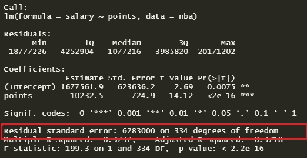

残差标准误差是模型与数据拟合程度的度量。让我们回到上一节中显示的示例:


如果我们查看最小二乘回归线，我们会注意到该线并没有完全穿过每个点，并且在点和线之间存在“残差”(显示为蓝色线)。残差标准差告诉我们 Y 的实际值(点)与 Y 单位的预测值(线)之间的*平均值*。通常，我们希望残差标准差尽可能最小，因为这意味着我们模型的预测线平均起来非常接近实际值。

对于我们当前的模型，我们可以看到，平均而言，实际值与预测值(回归线)相差 630 万美元。现在，了解我们的数据集，知道最大的工资是 2830 万美元，让我们所有的预测平均相差 630 万美元不会产生一个非常准确的模型。

# 多重 R 平方和调整 R 平方

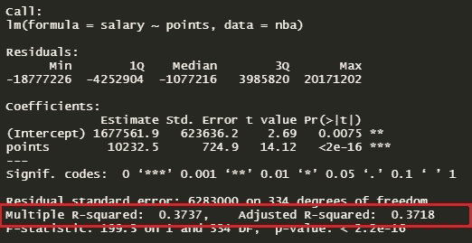

多重 R 平方值最常用于简单线性回归(一个预测值)。它告诉我们自变量在因变量中解释了多大比例的变化。换句话说，这是确定我们的模型与数据拟合程度的另一种方法。在上面的例子中，点数解释了我们的因变量——薪金中约 37.37%的变化。这意味着点数有助于解释工资的一些变化，但没有我们希望的那么多。最终，我们的模型并没有很好地拟合数据(我们在研究残差标准误差时看到了这一点)。

运行多元线性回归时会使用调整后的 R 平方值，从概念上来说，可以用我们描述多元 R 平方的相同方式来考虑。调整后的 R 平方值显示了所有预测因子解释的因变量中的变异百分比。这两个指标之间的差异是计算中的细微差别，我们通过添加多个变量来调整方差。

需要注意的是，R 值(倍数或调整值)并不简单，不应该仅仅根据值的计算方式来单独使用。例如，当您添加额外的预测值时，调整后的 R 平方值可能会增加，即使它们与您的因变量没有任何关系。

# f 统计量和 p 值

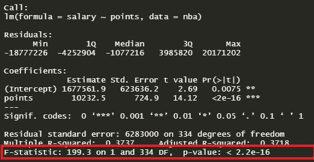

当运行简单或多重回归模型时，假设检验正在全局模型上运行。零假设是因变量和自变量之间没有关系，另一个假设是有关系。换句话说，零假设是模型中所有变量的系数都为零。另一个假设是，它们中至少有一个是**而不是**零。F 统计量和总体 p 值帮助我们确定该测试的结果。根据测试中有多少变量，只看 F 统计量可能会有一点误导。如果有许多独立变量，那么 F 统计量接近于 1，但仍然产生 p 值(我们会拒绝零假设)是很常见的。然而，对于较小的模型，较大的 F-统计量通常表明应该拒绝零假设。更好的方法是利用与 F 统计量相关的 p 值。同样，在实践中，p 值低于 0.05 通常表示模型中至少有一个非零系数。

从我们的模型中可以看出，F 统计量非常大，而 p 值非常小，基本上为零。这将导致我们拒绝零假设，并得出结论，有强有力的证据表明，工资和积分之间确实存在关系。

# 结论

虽然在试图预测一名 NBA 球员的*薪水*时，在一个赛季中获得的*积分*是有用的信息，但我们可以得出结论，单凭这一点还不足以做出准确的预测。

已经完成了 R 中线性回归模型输出的每一部分，您现在已经准备好自信地投入到任何回归分析中。祝你好运！

# 谢谢大家的支持！

感谢您阅读本文！如果你觉得有帮助，请给我一两下掌声:)

# 参考

*   [解释回归输出](https://dss.princeton.edu/online_help/analysis/interpreting_regression.htm)
*   [解读线性回归输出的标准误差](https://stats.stackexchange.com/questions/287862/interpreting-the-standard-error-of-linear-regression-output)
*   [解释 R 中的 lm 摘要](http://www.learnbymarketing.com/tutorials/explaining-the-lm-summary-in-r/)
*   [解释 R 中的模型输出](https://feliperego.github.io/blog/2015/10/23/Interpreting-Model-Output-In-R)
*   [残差标准差/误差:初学者指南](https://quantifyinghealth.com/residual-standard-deviation-error/)