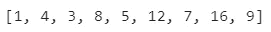

# 理解 Python 中的列表理解

> 原文：<https://towardsdatascience.com/understanding-list-comprehensions-in-python-6de57e26631c?source=collection_archive---------16----------------------->

## 本文讨论了 Python 中的列表理解，以及如何使用它们来提高代码的效率和 Python 性。


图片由[克里斯里德](https://unsplash.com/@cdr6934?utm_source=medium&utm_medium=referral)在 [Unsplash](https://unsplash.com/?utm_source=medium&utm_medium=referral) 上拍摄

列表理解帮助你用最少的代码(通常只有一行代码)执行基本的列表操作。这使得您的代码高效且 Pythonic 化。让我们看一个例子来使列表理解的概念更清楚。

让我们创建一个从 0 到 9 的整数列表，并将列表中的每个元素乘以 2。这可以通过使用 for 循环遍历列表中的每个元素并将其乘以 2 并将其追加到一个空列表中来实现。

```
x = list(range(10))
x
```


作者图片

```
x_doubled = []for i in x:
    x_doubled.append(i * 2)

x_doubled
```


作者图片

让我们尝试将变量‘x’乘以 2，就像我们处理 Numpy 数组和 Pandas 系列一样。将 Numpy 数组或 Pandas 系列乘以一个数字，再将它们的每个元素乘以该数字。

```
x_arr = np.array(x)
list(x_arr * 2)
```


作者图片

如上所述，将数组乘以 2 等于将数组的每个元素乘以 2。但是列表不会发生这种情况，因为数组和序列的行为类似于向量。让我们将列表乘以 2，看看会发生什么。

```
x * 2
```


作者图片

将列表乘以 2 没有得到预期的结果。它通过将列表“x”追加到自身来扩展它。这和 x + x 是一样的。让我们用一行代码来执行这个操作。

```
[i * 2 for i in x]
```


作者图片

使用 list comprehension 已经用一行代码执行了所需的操作。让我们看看每个方法执行所花费的时间。我们可以使用“timeit”魔法命令来实现。

```
%%timeit
x_doubled = []for i in x:
    x_doubled.append(i * 2)
```


作者图片

```
%%timeit
[i * 2 for i in x]
```


作者图片

```
%%timeit
x_arr = np.array(x)
x_doubled = list(x_arr * 2)
```


作者图片

我们可以看到，与其他两种方法相比，列表理解减少了代码行数和执行时间。让我们更深入地理解列表，看看一些高级操作。

在下面的例子中，我们将尝试只将偶数乘以 2 并返回它们。我们将看到如何使用 for 循环和列表理解来实现这一点。

```
x_even_doubled = []for i in x:
    if i % 2 == 0:
        x_even_doubled.append(i * 2)

x_even_doubled
```


使用 for 循环输出

```
[i * 2 for i in x if i % 2 == 0]
```


使用列表理解输出

让我们试着把偶数乘以 2，奇数原样返回。我们将看到如何使用 for 循环和列表理解来实现这一点。我们将在 list comprehension 中使用三元运算符来执行这个操作。

```
x_new = []for i in x:
    if i % 2 == 0:
        x_new.append(i * 2)
    else:
        x_new.append(i)

x_new
```


使用 for 循环输出

```
[i * 2 if i % 2 == 0 else i for i in x]
```


使用列表理解输出

我们试着把偶数乘以 2，奇数原样返回，去掉 0。我们将看到如何使用 for 循环和列表理解来实现这一点。

```
x_new = []for i in x:
    if i % 2 == 0:
        x_new.append(i * 2)
    else:
        x_new.append(i)

x_new.remove(0)x_new
```



使用 for 循环输出

```
[i * 2 if i % 2 == 0 else i for i in x if i != 0]
```


使用列表理解输出

让我们看看嵌套列表的理解。我们将尝试将列表中的偶数乘以 2，并保留奇数。然后，我们将偶数除以 2，得到原始列表。

```
[int(i / 2) if i % 2 == 0 else i for i in 
 [i * 2 if i % 2 == 0 else i for i in x]]
```


嵌套列表理解的输出

让我们试着将两个列表组合成如下所示的嵌套列表。我们将看到如何使用 for 循环、zip 函数和 list comprehension 来实现这一点。

```
# Method 1: Using for loop
nested_list = []for i in x:
    nested_list.append([i,i])

nested_list
```


使用 for 循环输出

```
# Method 2: Using zip function
list(zip(x, x))
```


使用 zip 函数输出

```
# Method 3: List comprehension
[[i,i] for i in x]
```


使用列表理解输出

我们可以看到 for 循环和 list comprehension 返回的是列表的列表，而 zip 函数返回的是元组的列表。让我们尝试使用 for 循环和列表理解来创建列表元素的排列。

```
x = list(range(3))
x
```


作者图片

```
perm_list = []for i in x:
    for j in x:
        perm_list.append([i, j])

perm_list
```


使用 for 循环输出

```
[[i,j] for i in x for j in x]
```


使用列表理解输出

我个人在从网上搜集数据时使用列表理解。让我们尝试从网页中提取 URL 及其文本。我们将创建一个名为“html”的变量来存储一小段 html 代码，并从“HTML”变量中提取 URL 及其文本，然后将它们存储在一个以文本为键、以 URL 为值的字典中。

```
from bs4 import BeautifulSoup# Variable storing a small HTML code snippet
html = '''
<html>
<head>head</head>
<body>
<a href="[https://www.abc.com](https://www.abc.com)">abc.com</a>
<a href="[https://www.xyz.com](https://www.xyz.com)">xyz.com</a>
<a href="[https://www.qwerty.net](https://www.qwerty.net)">qwerty.com</a>
</body>
</html>
'''bs = BeautifulSoup(html)# Finding the 'a' tags
a = bs.find_all('a')# Using list comprehension to extract 'href'
url = [i.get('href') for i in a]# Using list comprehension to extract text
txt = [i.text for i in a]# Using dictionary comprehension to store output
{i: j for i,j in zip(txt, url)}
```


作者图片

这些是列表理解的一些应用。与 for 循环相比，它们效率更高，并且还减少了执行操作所需的代码行数。