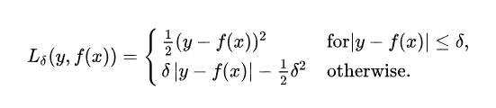
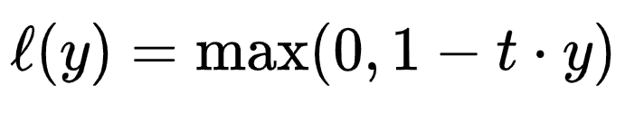

# 聪明地理解损失函数

> 原文：<https://towardsdatascience.com/understanding-loss-functions-the-smart-way-904266e9393?source=collection_archive---------16----------------------->

## 了解损失函数如何用于理解模型的性能及其在 Python 中回归和分类问题中的实现。

弗朗西斯科·卡里法诺在 [Unsplash](https://unsplash.com?utm_source=medium&utm_medium=referral) 上拍摄的照片

在这篇文章中，我们将深入探讨用于提高机器学习算法性能的不同类型的损失函数。任何经典机器学习问题的主要动机都只是这两件事:

1.  **提高模型的精确度**以及
2.  **减少与此相关的损失**。

> 我们可以说**损失**是你为你的模型**坏预测**付出的**代价**。

在这一系列的三篇文章中，我们将讨论什么是损失函数，以及如何使用各种类型的损失函数来优化我们模型的性能。在第 2 部分，我们将研究回归损失函数，在第 3 部分，我们将探索分类函数。

本系列充满了 Python3 中的实际操作代码块，给你一个很好的实践经验，告诉你如何用 Python 实现它们。

## 要跳到任何部分:

1.  第 1 部分:**了解损失函数**。
2.  第二部分:**回归损失函数**。
3.  第三部分:**分类损失函数**。

## 什么是损失函数？

准确地说，如果你的模型预测完美，那么你的损失会很少，否则损失会很大。不管问题陈述如何，通过将 ***预测值*** 与 ***实际值*** 进行比较，总会有**性能评估**。这就是损失函数发挥作用的地方。

损失函数的真正应用不仅仅是它的**内在** **值**，而是它如何被用来改善模型的性能，因此使用了成本函数。损失函数将在每个训练示例中计算，而**成本函数**将是损失函数的平均值。因此，在单个训练数据集中，损失函数将被计算多次，而成本函数将仅被计算一次。

## 我们如何利用损失函数的力量？

所以我们的最终目标是最小化成本函数。让我们用一个简单的实时例子来理解它。想象一下，在一个黑暗的夜晚，你站在一座山脉的顶峰。当你完成了一整天的徒步旅行，现在想下去，但外面很黑，你会怎么做？你肯定会试图用最少的能量下山，而你想到的第一件事就是环顾四周，试图用你的脚找到最短的路径。你不可能上山，因为你的目标是下山，所以唯一的选择是选择**下山**的路。所以这就是你估计的计算，如果你走下坡路，将会花费**少得多的能量**和**努力**，这正是损失函数所做的。因此，我们的目标是“**找到模型的权重和偏差，使损失最小**。”

> 在自然界中，我们看到许多遵循这种方法的例子。

> 不管路上遇到什么，一条河总是走最短的下坡路。

## 分类和回归的损失函数:

现在，既然我们知道有两种类型的**监督的**机器学习问题:**回归(连续目标值)**和**分类(离散目标值)**，那么让我们来探究它们中的每一个，看看所有类型的损失函数用于它们中的每一个，并基于它们对于提高机器学习[模型的性能](/how-to-evaluate-machine-learning-model-performance-in-python-135b4ae27f7e)的效率来比较它们。要了解更多关于您可以使用一些技术来测量性能的信息，请在完成这篇文章后访问这篇文章以了解更多信息。

 [## 如何评价 Python 中机器学习模型性能？

### 一个实用的方法来计算模型的性能和在 Python 中的实现，涵盖了所有数学…

towardsdatascience.com](/how-to-evaluate-machine-learning-model-performance-in-python-135b4ae27f7e) 

# 回归中使用的损失函数:

回归或回归分析是一种**监督** **学习** **技术**，可以定义为统计技术，用于对因变量实数变量 **y** 和自变量**【Xi】之间的关系进行建模。根据不同的场景及其重要性，我们使用不同类型的*回归方法。*让我们来了解各种可能的损失函数，这些函数可用于改进回归分析中的性能评估。**

## 1.均方差/L2 损耗:

这是最常用的损失函数，因为它非常容易理解和实现。它适用于几乎所有的回归问题。顾名思义，****均方差就是平方误差的平均值**。这里的误差是模型预测值“ **y_hat** 与实际值“ **y_real** 之差。**

****

**[了解实际值和预测值之间的误差](https://lh4.googleusercontent.com/YpZaHy2Nyz4pP01Sb51iYKSHuDLuvxh1BDgWho4jk3WlBuWNDUd5AdmA3rPD_8jVZ430cjuwGZbhBAE2hAoNITazepO2hxudbyAHbMrKkf0jIGEuVUvJfkjtkElV4SNLMLkLcrIJsKfnVm7Lxw)**

**在上图中，小圆圈是不同的 **y** 的 **x** 的实际值。这条线代表我们通过模型**预测**的**最佳拟合**。因此，这里的虚线是误差， **MSE** 是所有误差的平方平均值。**

> **平方是为了放大大的误差，也是为了观察我们损失的方差。**

****

**均方误差/L2 损耗**

**Python3 中 MSE 丢失的代码实现**

## **2.平均绝对误差/ L1 损耗:**

**平均绝对误差是**模型预测值和实际值之间的绝对差值的平均值**。 ***平均绝对误差在异常值的情况下更稳健*** 因为不适合求差的平方，因为差太大了。**

**不管误差的方向是正还是负，因为它们可能会相互抵消，从而不会产生误差，在这种情况下，我们只考虑其**大小**。**

****

**平均绝对误差/ L1 损耗**

**Python3 中 MAE 丢失的代码实现**

## **3.均方根误差:**

**均方根误差是均方差的**平方根。当我们将平方根应用于 MSE 时，RMSE 归结为与目标变量相同的单位。RMSE 的损失函数与 MSE 完全相同，我们只是将阶数从 2 降低到 1，这样就可以轻松地进行相关运算。MSE 中的相关性变得困难，因为它**严重惩罚大误差。******

****

**均方根误差**

**Python3 中 RMS 损耗的代码实现**

## **4.平均偏差误差:**

**平均偏差误差是预测值和实际值 **之间的精确**差，没有应用任何数学函数，如绝对值或平方根**。*MBE 的主要局限是正负误差有机会* ***抵消****。这就是为什么这是很少使用和不太流行的损失函数。*****

******

***平均偏差误差***

***Python3 中均值偏差损失的代码实现***

## ***5.胡伯损失:***

***正如我们已经讨论过的， ***MSE*** *和* ***MAE*** 都有缺点，所以这就是胡贝尔的损失所在。**它只从 MSE 和 MAE 中提取有益的东西，并将它们纳入一个损失函数。*****

******

***使用 MSE 和 MAE 的 Huber 损失***

***所以简而言之， ***Huber 损失对于小误差接近 MSE，对于异常值接近 MAE***。***

******

***胡伯损失***

***Python3 中 Huber 丢失的代码实现***

# ***二元分类损失函数；***

## ***1.二元交叉熵损失；***

***顾名思义，二元分类是指**将一个物体分为两类**中的任何一类。例如，将电子邮件分类为垃圾邮件或非垃圾邮件。 ***熵基本上是不确定性的度量。*** 交叉熵是 ***两个随机变量*** 的不确定性之差。***

***所以， ***如果实际类与预测概率的差异越多，那么交叉熵损失就越多。*** 例如，我们假设一个数据样本的**实际类别为 1，**，**预测概率为 0.2** 。这导致**高损耗值**。***

******

***二元交叉熵损失***

***Python3 中二值交叉熵损失的代码实现***

## ***2.铰链损耗:***

***铰链损耗主要用于**支持向量机**。任何分类问题中的最佳可能行都会尽可能少地犯分类错误。为了通过计算来表达这一思想，**铰链损失惩罚每一个不正确的分类。*****

***例如，假设**的实际值是 1** ，而**的预测值是-1** ，那么“ **l(y)** 就变成了 **2** ，这是一个更高的损失。而如果预测值和实际值都是 1 并且匹配，那么“ **l(y)** 就变成了 **0** 也就是没有损失。***

******

***铰链损耗***

> ****铰链损失在[-1，1]值范围内工作良好，有时甚至比二元熵损失更好。****

***Python3 中铰链损耗的代码实现***

## ***3.平方铰链损耗:***

***铰链损耗的平方就是铰链损耗的**平方。I ***f 你想惩罚这个大错误，平方铰链损失进入画面*** 。除了**输出将被平方**之外，最大值功能将是相同的。铰链损耗的平方**与误差的平方**成正比。*****

******

***平方铰链损耗***

***Python3 中平方铰链损耗的代码实现***

# ***多项式分类损失函数；***

## ***1.分类交叉熵损失:***

***这是 ***最常用的损失函数*** ，因为它非常容易理解和实现。它几乎适用于所有的分类问题。**分类交叉熵损失可以认为是二元交叉熵损失的推广。** ***当班级数量超过 2 个*** 时使用。为了计算分类交叉熵损失，最佳实践是对**分类进行一次性编码**。需要为每个观察的每个类别标签计算损失，并对结果 求和 ***。******

******

***Python3 中分类交叉熵损失的代码实现***

## ***2.KL (Kullback-Leibler)散度:***

***KL 散度衡量任意两个分布之间的差异。它帮助我们理解，“ ***当我们追求一个近似值*** ”时，我们丢失了多少信息。***

***是对**熵**的轻微修改。除了我们的概率分布，我们还添加了一个近似分布，并计算两个分布之间的差异。***

***通过这种方式，我们可以追踪我们因近似而丢失的信息。***

******

***KL(库尔巴克-莱布勒)散度***

***Python3 中 KL 发散损失的代码实现***

***希望你喜欢阅读！***

***你可以在这里阅读更多我的文章:***

*** [## Q-Q 图解释

### 探索 Q-Q 图的力量。

towardsdatascience.com](/q-q-plots-explained-5aa8495426c0)  [## 如何在短短 1 年内把数据科学从初学者学到大师(我的亲身经历)

### 随着时间的推移，我的从初学者到大师学习数据科学的清单的完整汇编只需要一年时间…

towardsdatascience.com](/how-to-learn-data-science-from-beginners-to-masters-in-just-1-year-my-personal-experience-6152bedd8157)  [## 我成为 Kaggle 大师的旅程

### 先说说我成为三大类 Kaggle 专家，后来成为笔记本高手的故事。还有…

towardsdatascience.com](/how-i-became-kaggle-3x-expert-in-just-1-month-b63b37b53865) 

**谢谢**！***