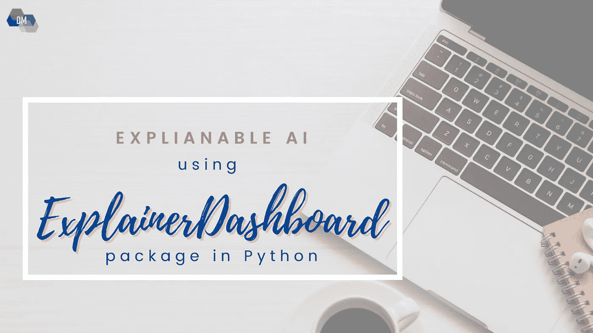
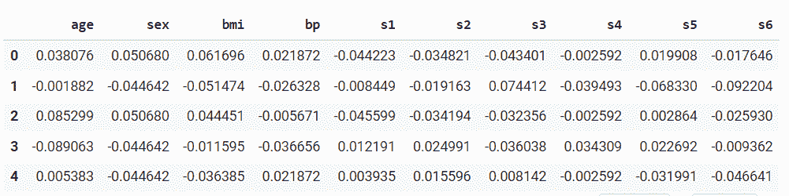
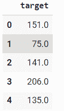
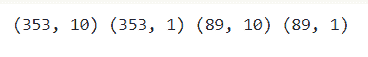
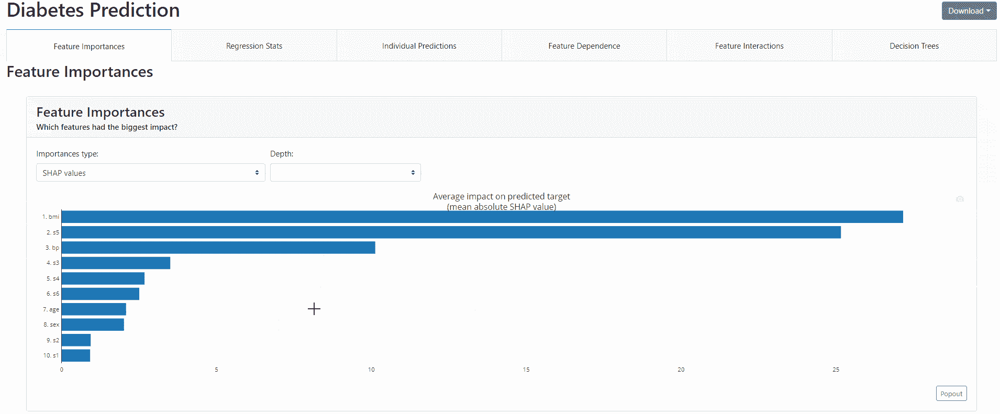

# 用可解释的人工智能更好地理解机器学习模型

> 原文：<https://towardsdatascience.com/understanding-machine-learning-models-better-with-explainable-ai-bea6d28f5094?source=collection_archive---------20----------------------->

## 使用 ExplainerDashboard 用几行代码构建一个交互式仪表板



图片来源:作者(Canva 设计)

通过基于网络的仪表板来解读机器学习的工作是很有趣的。想象一下，访问显示模型性能、特征重要性以及假设分析信息的交互式图表。令人兴奋的是，构建这样一个信息丰富的仪表板不需要任何 web 开发专业知识，但简单的几行 python 代码就足以生成一个令人惊叹的交互式机器学习仪表板。这可以通过使用一个名为“解释器仪表板”的库来实现。

ExplainerDashboard 是一个 python 包，它生成交互式仪表板，允许用户理解并解释模型如何工作以及它如何决定结果。没有这样的工具，机器学习模型就是“黑盒模型”。因此，很难解释模型做出决策背后的原因，以及哪些因素影响了模型的决策。使用 Python 中的这个包，我们可以在 Jupyter 或 Colab 笔记本中轻松地将仪表板部署为 web 应用程序。这个 web 应用程序提供了几个交互式图表来解释它所应用的机器学习模型的工作原理。这些模型可以基于 Scikit-learn、XGBoost、CatBoost、LightGBM 和其他一些模型。仪表板通过各种交互式
图提供对模型性能的洞察，如用于理解特征相关性的 SHAP 值图、用于特征交互的
SHAP 交互图、用于选定特征影响的部分相关性图(PDP)以及通过决策树可视化决策路径等。还可以通过“假设”分析来评估改变特征值对模型性能的影响。此外，高级用户也可以使用一些额外的代码来定制这些仪表板。对于本教程，我们将只探索该包的功能，我将带您一步一步地用 Python 创建您自己的机器学习模型仪表板，只需几行代码。在教程的最后，我们将看到我们可以从这个机器学习仪表板中收集到什么样的见解。

# 解释器仪表板库

这个 Python 包为机器学习模型构建了一个基于 web 应用程序或内嵌笔记本的可解释仪表板。仪表板的默认组件是不言自明的，不需要额外的定义函数。这些图表或仪表板的交互组件基于另一个名为 Dash 的库，该库以网络应用和图表而闻名，使用了一个名为“Plotly”的库。最后，整个仪表板实际上是一个使用 flask server 在本地机器上运行的 web 应用程序。你可以在这里找到所有官方文档。

让我们从 ExplainerDashboard 库的 pip 安装开始本教程

```
pip install explainerdashboard
```

您可以在 Colab 或 Kaggle 笔记本中直接使用该命令。然而，如果使用在本地机器上运行的 Jupyter 笔记本，使用虚拟环境可能是一个更好的选择，以避免由于包依赖性而导致的任何冲突。

方法:

*   导入库和样本数据集
*   从数据集创建 DataFrame(本演示教程不需要数据预处理)
*   拆分数据并训练模型
*   在本地端口上部署仪表板

# 回归示例机器学习仪表板

对于本教程，让我们使用 sklearn 库中的样本[玩具数据集](https://scikit-learn.org/stable/datasets/toy_dataset.html)“糖尿病”数据集来构建回归问题的机器学习仪表板。

# 导入库

```
#Importing Libraries & Packagesimport pandas as pd
from sklearn.ensemble import RandomForestRegressor
from sklearn.model_selection import train_test_split
from explainerdashboard import RegressionExplainer, ExplainerDashboard
```

我们需要 Pandas 库用于数据框架，而 ExplainerDashboard 和 Dash Bootstrap 库用于构建仪表板。sklearn 库将用于获取玩具数据集，分割它并导入 RandomForestRegressor 来为这个回归示例训练模型。

# 导入数据集

```
#Import the Diabetes Dataset
from sklearn.datasets import load_diabetesdata= load_diabetes()#print the dataset
data
```

# 加载数据集

我们需要将数据集加载到 X 和 y 变量上，以创建熊猫数据框架。x 将保存要素，y 将保存目标值。

```
#create a DataFrame from the dataset
X=pd.DataFrame(data.data,columns=data.feature_names)#Printing first five rows of the DataFrame
X.head()
```



```
#Load target values in y
y=pd.DataFrame(data.target,columns=[“target”])
y.head()
```



现在我们的数据准备好了，我们可以使用 RandomForestRegressor 来训练模型。

# 分割数据集

让我们使用 sklearn 的 train-test split 函数将数据集按 80–20 的比例拆分。

```
#Splitting the Dataset
X_train, X_test, y_train, y_test = train_test_split(X, y, test_size=0.2, random_state=1)
print(X_train.shape,y_train.shape,X_test.shape,y_test.shape)
```



# 训练模型

我们现在可以用随机选择的估计值的 RandomForestRegressor 来训练模型。您也可以尝试使用不同的值或使用 XGBoost 来训练模型并进行比较。

```
#Training the model
model = RandomForestRegressor(n_estimators=50, max_depth=5)model.fit(X_train, y_train.values.ravel())
```

注意:在这一步中，我们使用推荐的命令“ravel()”将“y_train”转换为一维数组。这种对列向量 y 的整形将避免由 RandomForestRegressor 生成的 DataConversionWarning。

# 使用训练模型设置仪表板实例

```
explainer = RegressionExplainer(model, X_test, y_test)#Start the Dashboard
db = ExplainerDashboard(explainer,title=”Diabetes Prediction”,whatif=False)#Running the app on a local port 3050
db.run(port=3050)
```

该仪表板将在端口为 3050 的本地服务器上运行(如果您选择另一个端口号，比如 8080 或 3000，那么您的情况可能会有所不同)

单击该链接将在 web 浏览器的单独选项卡中打开仪表板。

您的完全交互式机器学习仪表板已经准备好了！

你可以在我的 [GitHub 库](https://github.com/Devashree21/ExplainerDashboard)上找到这个笔记本的完整代码。



按作者分类的仪表板 GIF

## 仪表板中的见解

有了这个仪表板，我们可以得到一些见解，比如-

*   Shap 值表示每个单独的特征如何影响预测
*   置换重要性，它允许我们更深入地挖掘，以可视化模型性能如何随着特征的改变而恶化
*   在使用类似于本教程的 XGBoost 或 RandomForestRegressor 的回归模型的情况下，我们可以可视化单个决策树，而在分类器模型的情况下，我们可以获得混淆矩阵、ROC-AUC 曲线等。更好地理解模型的决策。
*   假设分析(在启动仪表板时打开的情况下)有助于了解在我们修改特征或部分数据时模型行为的变化。它还允许我们比较不同的模型。

然而，对上面的图和它们包括的参数有一些基本的理解对于理解来自这样的机器学习仪表板的洞察力也是有帮助的。对于任何寻找本教程主题的理论详细信息的人，我建议阅读克里斯托夫·莫尔纳尔的书'[可解释的机器学习](https://christophm.github.io/interpretable-ml-book/shap.html)。

本教程到此为止。希望作为读者的你能学到一些新的有趣的东西。

直到下一篇文章，快乐阅读！