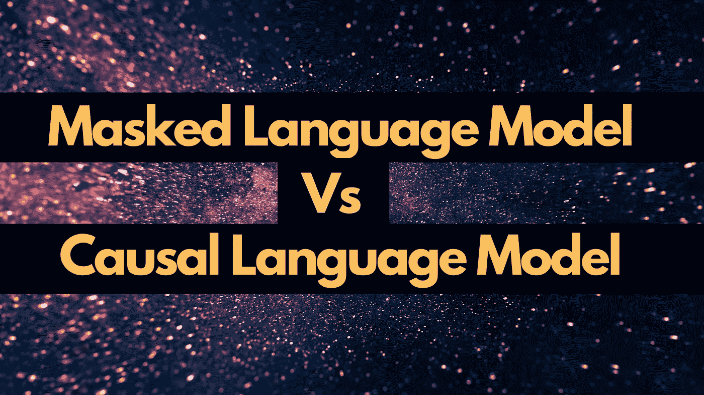
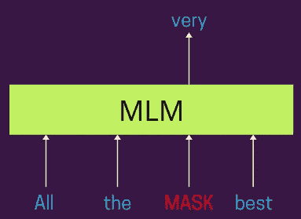
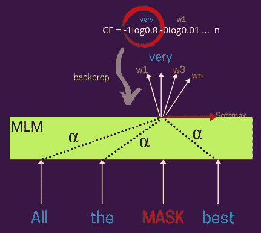
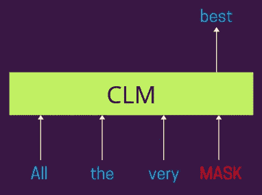
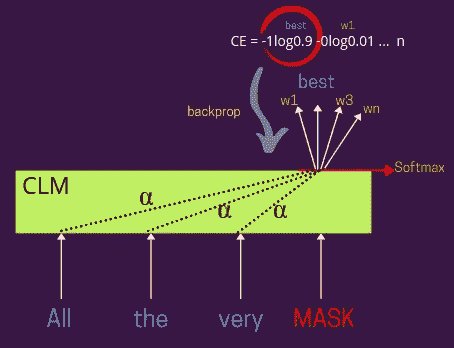

# 理解自然语言处理中的掩蔽语言模型(MLM)和因果语言模型(CLM)

> 原文：<https://towardsdatascience.com/understanding-masked-language-models-mlm-and-causal-language-models-clm-in-nlp-194c15f56a5?source=collection_archive---------2----------------------->

## 自然语言处理中的语言模型(视觉和例子)

来自[源](https://unsplash.com/photos/W8KTS-mhFUE)的修改图像

大多数现代 NLP 系统都遵循一个非常标准的方法来训练各种用例的新模型，即 ***首先预训练，然后微调*** *。*这里，预训练的目标是利用大量的未标记文本，建立一个语言理解的通用模型，然后在机器翻译、文本摘要等各种特定的 NLP 任务上进行微调。

> 在这篇博客中，我们将讨论两种流行的预训练方案，即**掩蔽语言建模** (MLM)和**因果语言建模** (CLM)。

*没时间看完整个博客？然后看这个快速的< 60 秒的 YouTube 短片—*

## **屏蔽语言模型解释**

在屏蔽语言建模下，我们通常屏蔽给定句子中的某个百分比的单词，并且该模型被期望**基于该句子中的其他单词来预测那些被屏蔽的单词**。这样的训练方案使得这个**模型在本质上是双向的**，因为屏蔽单词的表示是基于出现在它左右的单词而学习的**。*你也可以把这想象成* ***一种填空题式的问题陈述*** *。***

*下图显示了同样的—*

蒙版语言模型|作者图片

*下图显示了损失计算步骤的更详细视图—*

有损失的掩蔽语言模型|作者图片

这里，屏蔽词的表示可以是基于注意力的，如 **BERT** 及其变体，或者你也可以设计成没有注意力。基于 **Alpha** *(注意力权重)*的分布，您可以对每一个其他输入单词的表示进行加权，以学习被屏蔽单词的表示，例如*—Alpha = 1 将对周围的单词给予相等的权重(这意味着每个单词在屏蔽表示中具有相等的贡献)。*

# 因果语言模型解释

在因果语言模型下，这里的想法仍然是**预测给定句子中的屏蔽标记**，但与 MLM 不同，该模型被允许只**考虑出现在它左边的单词**来做同样的事情*(理想情况下，这可能只是左边或右边，想法是使它单向)*。这样的训练方案使得这个模型**本质上是单向的**。

*正如您在下图*中看到的，该模型预计会根据出现在句子左侧的单词来预测出现在句子中的掩码标记。并且基于模型对实际标签所做的预测，我们计算交叉熵损失并将其反向传播以训练模型参数。

因果语言模型|作者图片

*下图显示了损失计算步骤的更详细视图—*

带有损失的因果语言模型|作者图片

在这里，屏蔽词的表达可以是基于注意力的，就像在 **GPT** 和变体中一样，或者你也可以设计成没有注意力，就像我们过去在 LSTM 时代那样。基于 **Alpha** *(见图)*的分布，您可以对每隔一个输入单词的表示进行加权，以学习屏蔽单词的表示，例如*—Alpha = 1 将对周围的单词给予相等的权重(意味着每个单词将对学习的屏蔽表示具有相等的贡献)。*

这些系统也被称为仅解码器模型，因为在典型的编码器-解码器架构中，如在机器翻译、文本摘要等中，解码器*(文本生成器)*的工作方式类似。

# 什么时候用什么？

当目标是学习输入文档的良好表示时，MLM 损失是优选的，而当我们希望学习生成流畅文本的系统时，CLM 是最优选的。此外，直觉上这是有意义的，因为当学习每个单词的良好输入表示时，你会想知道它出现的单词是左还是右，而当你想学习一个生成文本的系统时，你只能看到你到目前为止生成的所有内容*(就像人类如何书写一样)*。因此，制造一个在生成文本的同时也能窥视另一面的系统会引入偏见，限制模型的创造能力。

虽然在训练包含编码器和解码器的整个架构时，您会经常发现 MLM 和 CLM 损失。两者都有各自的优点和局限性，*一种叫做* [*XLNet*](https://arxiv.org/abs/1906.08237) *的新模式使用了一种置换技术来利用两者的优点(MLM 和 CLM)。*

我希望你喜欢读这篇文章。如果你愿意支持我成为一名作家，可以考虑注册[成为](https://prakhar-mishra.medium.com/membership)中的一员。每月只需 5 美元，你就可以无限制地使用 Medium

我希望你喜欢阅读这篇博客。谢谢大家！