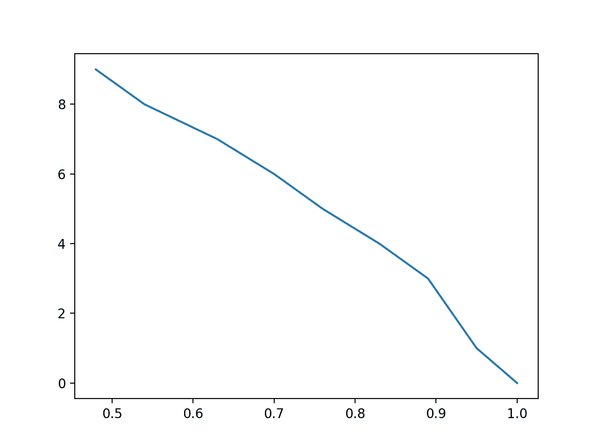
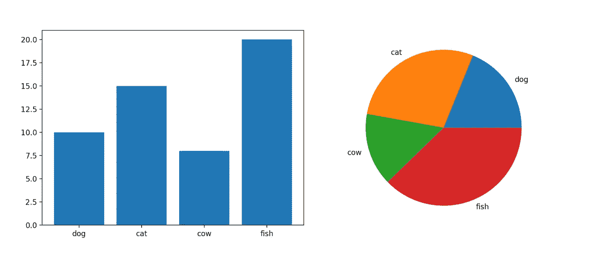
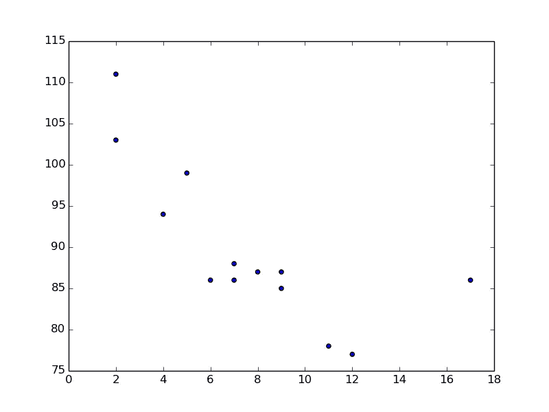
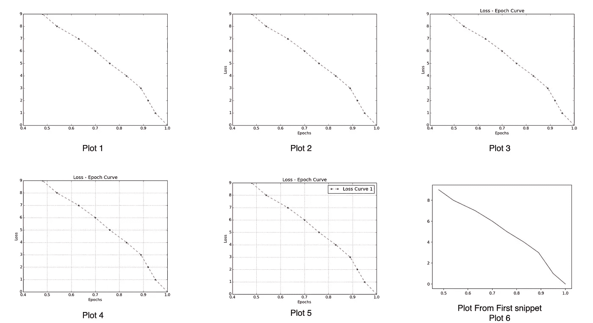
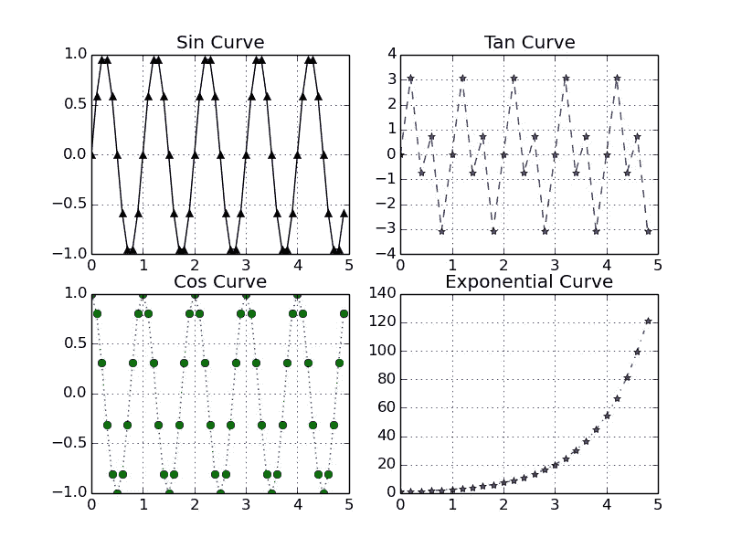
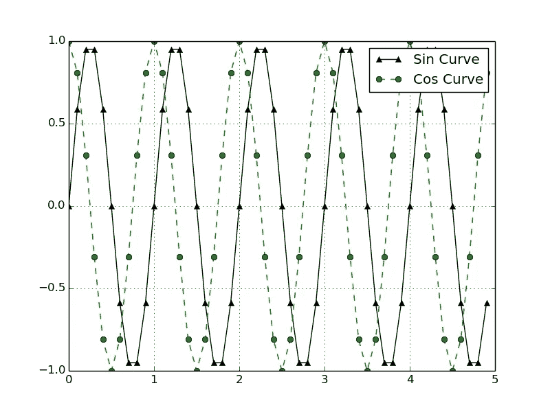

# 用 6 个代码片段理解 Matplotlib

> 原文：<https://towardsdatascience.com/understanding-matplotlib-in-6-code-snippets-63e5b8be2c8?source=collection_archive---------15----------------------->

## Matplotlib 是 python 中用于数据可视化的常用库。你探索过这个库提供的所有功能了吗？如果没有，我来帮你！


在 [Unsplash](https://unsplash.com?utm_source=medium&utm_medium=referral) 上由 [Adeolu Eletu](https://unsplash.com/@adeolueletu?utm_source=medium&utm_medium=referral) 拍摄的照片

我是亚马逊的一名应用科学家。信不信由你，我不记得有哪一周我没有在工作中使用过这个图书馆。有时我们需要可视化数据以便理解，有时在演示文稿/文档中需要可视化。因此，根据需要，我们也必须担心视觉化的直觉和美化。现在，我的朋友们，matplotlib 是我所有这些任务的首选库。在这篇博客中，我们将了解如何使用 matplotlib 来绘制以下变体:

*   用一组连续数据绘制一个正态图
*   绘图分类变量
*   使用散点图绘制图形，找出两个变量之间的关系
*   用不同的格式样式绘制图形
*   创建由多个图形组成的图形—一个图形有多条曲线，或者不同的图形有不同的曲线
*   使用图形中的文本注释。

以上并不是一个详尽的列表，但是它们应该足以理解这个库。开始吧！！！

## 具有连续数据数组的正常图

最直接的用例之一是在训练机器学习模型时，理解随着时期/迭代的损失行为。

```
import matplotlib.pyplot as plt
import numpy as nploss = np.array([1, 0.95, 0.92, 0.89, 0.83, 0.76, 0.70, 0.63, 0.54, 0.48])
epochs = np.array(list(range(10)))plt.plot(loss, epochs)
plt.show()
```



作者图片

是的，我知道上面的图表看起来很标准。别担心，我们会在“格式样式”部分美化它。

## 绘制分类变量/数据

首先，什么是分类变量？这些变量占用离散和有限数量的值。例如，在分类任务中，描述类的变量是分类变量。一个具体的例子是考虑一个图像分类问题，其中我们必须分类图像是否有狗(1)或没有(0)。那么这个代表有或没有狗出现的图像数量的变量就是一个分类变量。这些变量可以用柱状图或饼状图来表示。

**条形图-:**

```
import matplotlib.pyplot as plt
import numpy as np
class_variable = ["dog", "cat", "cow", "fish"]
number_of_image = [10, 15, 8, 20]
plt.bar(class_variable, number_of_image)
plt.show()
```

**饼状图-:**

```
import matplotlib.pyplot as plt
import numpy as np
class_variable = ["dog", "cat", "cow", "fish"]
number_of_image = [10, 15, 8, 20]
plt.pie(number_of_image, labels = class_variable)
plt.show()
```



以上两个片段的可视化(图片由作者提供)

## **使用散点图绘制图形，找出两个变量之间的关系**

正如你可能已经猜到的，散点图是用来找出两个变量之间的关系。在这里，我们设想一个变量的变化如何影响另一个变量，或者换句话说，我们试图理解两个变量之间的相关性。

```
import matplotlib.pyplot as plt
import numpy as np
variable_a = np.array([5,7,8,7,2,17,2,9,4,11,12,9,6])
variable_b = np.array([99,86,87,88,111,86,103,87,94,78,77,85,86])plt.scatter(variable_a, variable_b)
plt.show()
```



作者图片

从上图我们可以得出，当*变量 _a* 增加时，*变量 _b* 减少。

## 绘图的格式样式

这是其中重要的一条。在这里，我们将看到我们可以添加到一个情节的各种美化。我们将在这里看到如何添加以下内容:

*   轴标签-有助于描述 x 轴和 y 轴在图上代表的内容。
*   图例-当我们在图形中绘制多个图时非常有用。它告诉我们哪种颜色代表图中的哪种数据。
*   标题-图的标题
*   网格—在图形中添加网格有助于获得更好的推断
*   颜色-根据您的要求设置曲线的颜色。
*   虚线-设置曲线是实线还是虚线
*   标记-设置如何表示每个数据点

因此，许多新功能正在被引入。为了理解每一个的效果，我在不同的代码行上绘制了多个图，如下面的代码片段所示。

**注意—** 为了便于说明，我只使用了一种标记或一种颜色。您可以查看每种类型的其他可用选项。

```
import matplotlib.pyplot as plt
import numpy as np
loss = np.array([1, 0.95, 0.92, 0.89, 0.83, 0.76, 0.70, 0.63, 0.54, 0.48])
epochs = np.array(list(range(10)))
plt.plot(loss, epochs, label="Loss Curve 1", linestyle="dashed", marker='*', color='red')#Plot 1
plt.xlabel("Epochs")
plt.ylabel("Loss") #Plot 2
plt.title("Loss - Epoch Curve")#Plot 3
plt.grid("on") #Plot 4
plt.legend()#Plot 5
plt.show()
```



作者图片

为了比较，我还展示了第一个片段中的一个图(图 6)。现在，就我们的理解而言，图 6 就足够了，因为我们只需要看到损耗如何随着每个时期而变化。尽管如此，对于新手来说，Plot 5 更适合表示所有必要的信息。

## 创建由多个图形组成的图形

当我们需要绘制多个支线剧情时，我们可以使用下面的片段。我还添加了不同格式样式的例子，这样你就可以更清楚地理解了。

```
import matplotlib.pyplot as plt
import numpy as npt1 = np.arange(0.0, 5.0, 0.1)
t2 = np.arange(0.0, 5.0, 0.2)plt.figure()
plt.subplot(2,2,1)
plt.plot(t1, np.sin(2*np.pi*t1), color = 'black', marker='^', linestyle='solid')
plt.title("Sin Curve")
plt.grid("on")plt.subplot(2,2,2)
plt.plot(t2, np.tan(2*np.pi*t2), color = 'blue', marker='*', linestyle='dashed')
plt.title("Tan Curve")
plt.grid("on")plt.subplot(2,2,3)
plt.plot(t1, np.cos(2*np.pi*t1), color = 'green', marker='o', linestyle='dotted')
plt.title("Cos Curve")
plt.grid("on")plt.subplot(2,2,4)
plt.plot(t2, np.exp(t2), color = 'red', marker='*', linestyle='dashdot')
plt.title("Exponential Curve")
plt.grid("on")
plt.show()
```



作者图片

当在同一个图中需要多条曲线时，我们可以使用下面的代码片段。

```
import matplotlib.pyplot as plt
import numpy as npt1 = np.arange(0.0, 5.0, 0.1)
t2 = np.arange(0.0, 5.0, 0.2)plt.plot(t1, np.sin(2*np.pi*t1), color = 'black', marker='^', linestyle='solid', label = "Sin Curve")
plt.plot(t1, np.cos(2*np.pi*t1), color = 'green', marker='o', linestyle='dashed', label="Cos Curve")
plt.legend()
plt.grid("on")
plt.show()
```



作者图片

正如我们在这里看到的，图例有助于直观显示哪条曲线对应于哪种函数，即 sin 或 cos。

## **使用图形中的文本注释。**

我们可以使用测试注释来指出图中的特定点，并描述该点的含义。例如，我在下面的代码中注释了正弦曲线和余弦曲线的最大值。

```
import matplotlib.pyplot as plt
import numpy as npt1 = np.arange(0.0, 5.0, 0.1)
t2 = np.arange(0.0, 5.0, 0.2)plt.plot(t1, np.sin(2*np.pi*t1), color = 'blue', marker='^', linestyle='solid', label = "Sin Curve")
plt.plot(t1, np.cos(2*np.pi*t1), color = 'green', marker='o', linestyle='dashed', label="Cos Curve")
plt.annotate('Sin max', xy=(1.25, 1), xytext=(1.5, 1.15),
             arrowprops=dict(facecolor='black', shrink=0.05),
             )
plt.annotate('Cos max', xy=(2, 1), xytext=(2.25, 1.15),
             arrowprops=dict(facecolor='black', shrink=0.05),
             )
plt.ylim([-1.5, 1.5])
plt.legend()
plt.grid("on")
plt.show()
```


我在这里增加的另一件事是定义 y 轴的极限。同样，您可以更改 x 轴的限制。

# 结论

以上只是几个例子，我试图尽可能地涵盖更多的内容。现在，您可以使用多种工具来创建一个伟大的可视化。如果我错过了任何重要的例子，请让我知道，以便我可以在这里添加它们。

谢谢你的来访！

关注我们的 [medium](https://medium.com/@AnveeNaik) 了解更多此类内容。

*成为* [*介质会员*](https://medium.com/@AnveeNaik/membership) *解锁并阅读介质上的许多其他故事。*