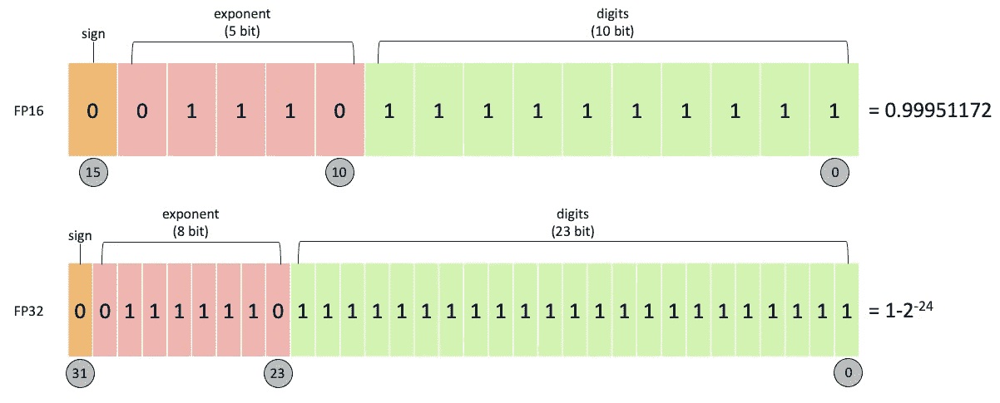
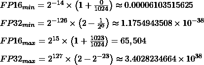
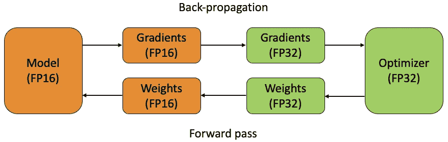
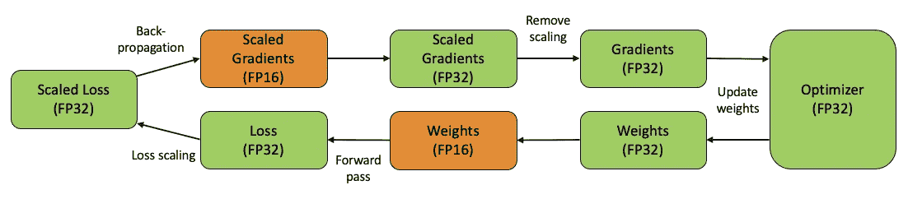

# 了解混合精度训练

> 原文：<https://towardsdatascience.com/understanding-mixed-precision-training-4b246679c7c4?source=collection_archive---------5----------------------->

## 训练神经网络的混合精度可以在不影响模型性能的情况下减少训练时间和内存需求


帕特丽夏·塞尔纳在 [Unsplash](https://unsplash.com?utm_source=medium&utm_medium=referral) 上的照片

随着深度学习方法的发展，人们普遍认为增加神经网络的规模可以提高性能。但是，这是以内存和计算需求为代价的，这些需求也需要增加以训练模型。

这可以通过比较谷歌预先训练的语言模型 [BERT](https://github.com/google-research/bert) 在不同架构规模下的性能来理解。在最初的[论文](https://arxiv.org/pdf/1810.04805.pdf)中，谷歌的研究人员报告称，BERT-Base 的平均得分为 79.6，BERT-Large 的平均得分为 82.1。2.5 的小幅增加带来了额外的 2.3 亿个参数(110 亿对 340 亿)！

粗略计算一下，如果每个参数都以单精度存储(下面更详细)，也就是 32 位信息，那么 230M 个参数相当于内存 0.92Gb。这本身看起来并不大，但是考虑到在每个训练迭代期间，这些参数每个都经过一系列矩阵运算，每个都具有额外的相关值，例如梯度。所有这些额外的价值会很快变得难以管理。

2017 年，英伟达的一组研究人员发布了一篇[论文](https://arxiv.org/pdf/1710.03740.pdf)，详细介绍了如何降低训练神经网络的内存需求，使用了一种叫做*混合精度训练的技术:*

> 我们介绍了使用半精度浮点数训练深度神经网络的方法，而不会损失模型精度或必须修改超参数。这几乎将内存需求减半，并且在最新的 GPU 上加快了运算速度。

在本文中，我们将探索混合精度训练，了解它如何适应深度学习的标准算法框架，以及它如何能够在不影响模型性能的情况下减少计算需求。

## 浮点精度

用于以二进制格式表示浮点数的技术标准是 [IEEE 754](https://en.wikipedia.org/wiki/IEEE_754) ，由电气和电子工程协会于 1985 年制定。

如 IEEE 754 中所述，浮点精度有各种级别，从二进制 16(半精度)到二进制 256(八倍精度)，其中“二进制”后的数字等于可用于表示浮点值的位数。

与整数值不同，在整数值中，位只是表示数字的二进制形式，可能只有一位保留给符号，浮点值也需要考虑指数。因此，这些数字的二进制表示形式更加微妙，会显著影响精度。

历史上，深度学习一直使用单精度(binary32，或 FP32)来表示参数。在这种格式中，1 位保留给符号，8 位保留给指数(-126 到+127)，23 位保留给数字。另一方面，半精度(FP16)为符号保留 1 位，为指数(-14 到+14)保留 5 位，为数字保留 10 位。



FP16(上)和 FP32(下)浮点数格式的比较。出于说明的目的，所示的数字是每种格式可以表示的小于 1 的最大数字。作者插图。

然而，这是有代价的。每个的最小和最大正正常值如下:



除此之外，可以表示更小的非规格化数，其中所有的指数位都设置为零。对于 FP16，绝对极限是 2^(-24)然而，随着非规格化数变小，精度也会降低。

在本文中，我们不会进一步深入理解不同浮点精度的定量限制，但是 IEEE 提供了全面的[文档](https://standards.ieee.org/standard/754-2019.html)供进一步研究。

## 混合精确训练

在神经网络 FP32 的标准训练期间，以增加存储器需求为代价来表示模型参数。在混合精度训练中，FP16 用于存储训练迭代期间的权重、激活和梯度。

然而，正如我们在上面看到的，这产生了一个问题，因为 FP16 可以存储的值的范围小于 FP32，并且随着数量变得非常小，精度也会降低。这样做的结果将会降低模型的准确性，与计算出的浮点值的精度一致。

为了解决这个问题，在 FP32 中存储了重量的主副本。这在每个训练迭代(一次正向传递、反向传播和权重更新)的一部分期间被转换成 FP16。在迭代结束时，权重梯度用于在优化器步骤期间更新主权重。



混合精度训练将权重转换为 FP16 并计算梯度，然后将它们转换回 FP32，再乘以学习率并在优化器中更新权重。作者插图。

在这里，我们可以看到保留权重的 FP32 副本的好处。由于学习率通常很小，当乘以权重梯度时，它们通常是很小的值。对于 FP16，幅度小于 2^(-24 的任何数字)将被视为零，因为它不能被表示(这是 FP16 的反规格化极限)。因此，通过完成 FP32 中的更新，可以保留这些更新值。

FP16 和 FP32 的使用是这种技术被称为*混合*-精确训练的原因。

## 损耗缩放

虽然混合精度训练在很大程度上解决了保持精度的问题，但实验表明，即使在乘以学习率之前，也会出现小梯度值的情况。

NVIDIA 团队表明，尽管低于 2^-27 的值基本上与训练无关，但在[2^-27，2^-24]范围内有一些值得保留的值，但在 FP16 的限制之外，在训练迭代期间将它们等同于零。由于精度限制，梯度等于零，这个问题称为下溢。

因此，他们建议进行损耗缩放，即在正向传递完成之后、反向传播之前，损耗值乘以一个比例因子。[链规则](https://en.wikipedia.org/wiki/Chain_rule)规定所有的梯度随后被相同的因子缩放，这使得它们在 FP16 的范围内移动。

一旦计算出梯度，它们就可以除以相同的比例因子，然后用于更新 FP32 中的主权重，如前一节所述。



在损耗调整过程中，在正向传递之后，损耗会按预定义的因子进行调整，以确保它在可表示的 FP16 值范围内。由于链规则，这通过相同的因子来缩放梯度，因此实际的梯度可以在反向传播之后被检索。作者插图。

在 NVIDIA“深度学习性能”[文档](https://docs.nvidia.com/deeplearning/performance/mixed-precision-training/index.html#scalefactor)中，讨论了比例因子的选择。理论上，选择一个大的缩放因子没有坏处，除非它大到足以导致溢出。

当梯度乘以比例因子超过 FP16 的最大限值时，就会发生溢出。出现这种情况时，梯度变得无限大，并设置为 NaN。在神经网络训练的早期，通常会看到以下消息:

```
Gradient overflow. Skipping step, loss scaler 0 reducing loss scale to…
```

在这种情况下，该步骤被跳过，因为权重更新不能使用无限梯度来计算，并且损失比例对于未来的迭代被减小。

## 自动混合精度

2018 年，NVIDIA 发布了一个名为 [Apex](https://github.com/NVIDIA/apex) 的 [PyTorch](https://pytorch.org/) 扩展，其中包含 AMP(自动混合精度)能力。这为在 PyTorch 中使用混合精度训练提供了一个简化的解决方案。

只需几行代码，训练就可以从 FP32 转移到 GPU 上的混合精度。这给[带来了两个关键的好处](https://pytorch.org/blog/accelerating-training-on-nvidia-gpus-with-pytorch-automatic-mixed-precision/):

*   **减少训练时间** —训练时间减少了 1.5 倍到 5.5 倍，模型性能没有显著降低。
*   **减少内存需求** —这释放了内存以增加其他模型元素，如架构大小、批量大小和输入数据大小。


[阿格巴洛斯](https://unsplash.com/@agebarros?utm_source=medium&utm_medium=referral)在 [Unsplash](https://unsplash.com?utm_source=medium&utm_medium=referral) 上拍摄的照片

从 PyTorch 1.6 开始，NVIDIA 和脸书(PyTorch 的创造者)将这一功能转移到 PyTorch 的核心代码中，命名为 *torch.cuda.amp* 。这解决了围绕 Apex 包的几个痛点，例如版本兼容性和构建扩展的困难。

虽然本文不会进一步深入 AMP 的代码实现，但是可以在 PyTorch [文档](https://pytorch.org/docs/stable/amp.html)中看到示例。

## 结论

虽然浮点精度经常被忽视，但它在深度学习模型的训练中起着关键作用，在深度学习模型中，小梯度和学习速率相乘，以创建需要更多位来精确表示的梯度更新。

然而，随着最先进的深度学习模型在任务性能方面突破界限，架构不断发展，精度必须与训练时间、内存要求和可用计算相平衡。

因此，混合精度训练在保持性能的同时基本上将内存使用减半的能力是深度学习的一个重大进步！