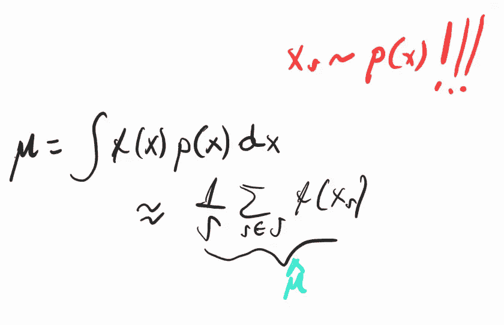
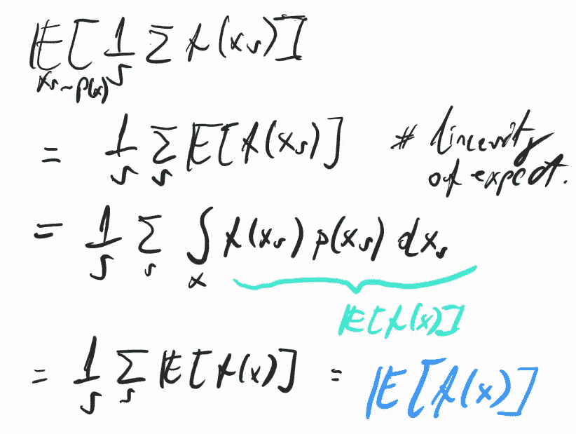
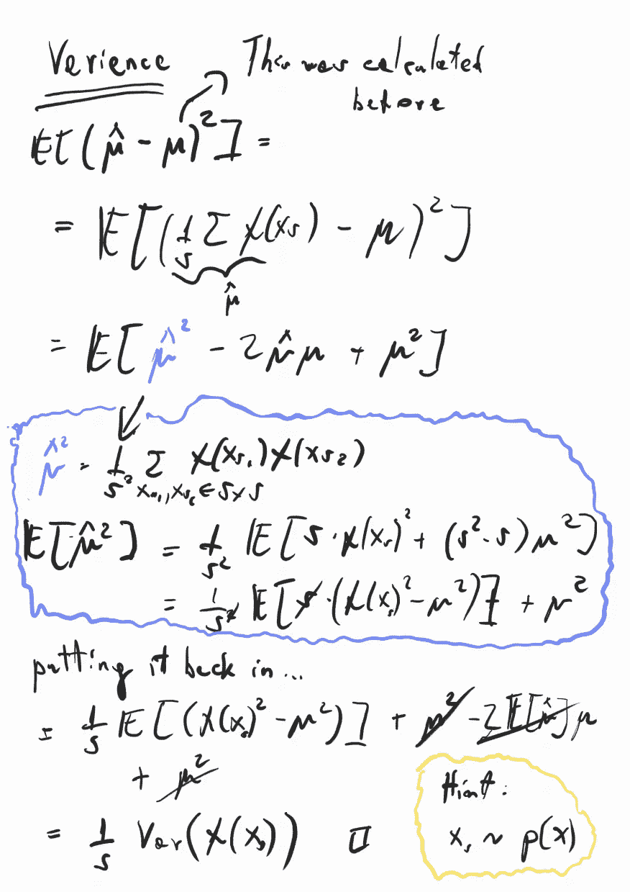
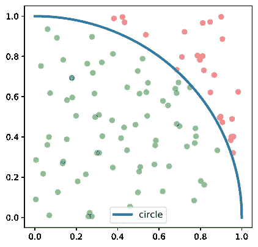
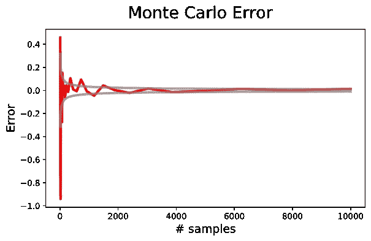
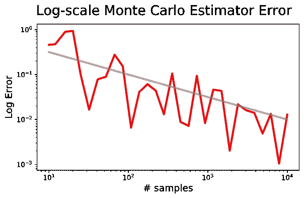

# 理解蒙特卡罗估计

> 原文：<https://towardsdatascience.com/understanding-monte-carlo-estimation-5409d85c4c85?source=collection_archive---------13----------------------->

阿曼达·琼斯在 [Unsplash](https://unsplash.com?utm_source=medium&utm_medium=referral) 上的照片

## [实践教程](https://towardsdatascience.com/tagged/hands-on-tutorials)

## 蒙特卡罗估计是机器学习工程师工具箱的重要组成部分。在这里，我们直观地深入研究它，以了解它的用例、性能以及一般使用时需要记住的事项。

像任何其他好的算法介绍一样，我们从一个关于我们试图解决的问题设置的故事开始。该设置是对积分的估计。

假设我给你一个函数 **f** ，那真的很复杂。我告诉你你可以对 **f** 求值，但是我对这个函数的积分感兴趣。不幸的是，你不能解析地计算这个函数的积分——也许这是不可能的，或者你的数学水平不够高。此外，函数 **f** 可能不会显式给出，这可能是某种模拟，您需要运行它来计算 **f** 的某个值。你可以做的一个选择是积分的蒙特卡罗估计。

> 我们正在处理估计积分的问题，因为函数 **f** 可能太复杂，不允许对解进行解析计算。

事实上，正如你可能从名字上怀疑的那样，这种算法起源于赌博游戏，作为一种计算预期赢款的方法，或者基于样本计算你在赌博游戏中可以赢的预期金额。显然，反复赌博以获得更多的样本来提高你的估计是不明智的，但这是计算你的预期赢(输)的有效方法。

> 在概率中，期望被定义为连续情况下的积分。

所以，我们来深究一下。在蒙特卡罗抽样中，我们从函数 **f** 的域中抽样，我们只取样本的平均值来估计函数的期望值。为什么这是一种有效的方法？TLDR；这一切都可以归结为查看估计量的前两个矩，即均值和方差。让我们来看看数学。我们可以非常粗略地将期望值的蒙特卡罗估计定义如下:

注意上面红色加粗的部分。我想让你记住，所有的样本都是从分布中抽取的，即根据密度 **p(x)** 来确定**目标**期望值。这将允许我们在推导估计量的期望值时，操纵期望值。因此，不再拖延，让我们开始推导期望值。看看下面的推导，稍微调解一下:

事实上，我们对随机变量 **f(x)** 的估计均值(我们用 **μ-hat** 来表示)具有真正的\mu 作为期望值。为什么我们会得出这个结论？因为来自分布 **p(x)** 的样本是独立同分布的——简称 i.i.d .剩下的就是线性的期望了。这也意味着我们对真实均值的估计是**无偏的**，这是一种有趣的说法，即在期望中，它渐近地收敛于真实均值。

> 无偏性意味着估计量收敛于真实均值

现在你可能会问这种估计量是不是“好的”，可以说你肯定会说，它是好的，因为它收敛于真实均值，而且是无偏的。还有一点你可能需要考虑的是样本数量的收敛速度。为此，我们想看看它的方差，即到其均值(二阶(中心)矩)的期望平方距离。我们得出以下结论:

最后我们得到函数 **f** 除以估计量的样本数 **S** 的方差。这是什么意思？这意味着估计器的平方误差随着因子 **O(1/S)** 而下降。如果我们想看看绝对误差，取该项的平方根，我们将得到 **O(1/sqrt(S))。**

# 估计π

这样收敛速度好吗？让我们来看一个例子，估算数字 **π** 。假设我们不知道圆周率的前 N 位，我们想估计它们。首先，我们可能注意到，单位圆的面积定义为π。如果我们看一下单位圆的四分之一面积，我们也许能够通过从单位分布中抽取一些点来估计它。

看看下图，我们看到的是包含单位圆四分之一面积的正方形。我们可以注意到，当对它们进行均匀采样(x，y 在 0 和 1 之间)时，一个点落入圆中的概率是π / 4，即圆的该部分的面积除以正方形的面积。我们可以通过采样点并根据它们是否落在圆内来标记它们来估计这一点，本质上，我们正在推断伯努利分布参数θ的值，该值应收敛到π / 4(其期望-落在圆内的概率)。

我在 JAX 编写了这个方法的简单实现，因为 JAX 很有趣，我推荐你去看看，但是等价的代码也可以用 Numpy 编写。如您所见，这在概念上非常简单，它涉及我们从均匀分布中抽取样本，标记落在圆内的样本(第 5 行)，然后计算并返回π的估计值(第 6 行)。

下图说明了随着样本数量的增加，估计量的误差是怎样的。正如所料，误差大致按照我们之前推导的 **S** 定律 O(1/sqrt(S))的平方根倒数发展。重要的是要记住，我们已经得出了估计量的预期误差，这意味着逐点估计它可能会在预期之外波动，如图所示。

此外，如果我们以对数标度绘制前面的图，查看**绝对**误差，我们会注意到，当样本大小增加一个数量级时，误差会下降一个数量级。

现在我们回到这个估计量是否好的问题上来。1/sqrt(S)收敛速度对于精确计算来说不是那么好，我会告诉你为什么。以π为例。为了在数字π的第二位上大致平均精确(我说大致是因为这是基于样本的随机算法)，我们需要 4 个数量级的样本(10k 个样本)。类似地，如果我们想要大致精确到第三位数，我们将需要一百万个样本。这是相当多的样本来估计只有前 3 位数的π！幸运的是，有更好的方法可以实现更快的计算速度。

## 外卖食品

*   蒙特卡罗算法是一种允许我们计算期望值的基于样本的估计的算法，即计算积分的估计。
*   蒙特卡洛情况下的估计误差以 **O(1/sqrt(S))** 的速率下降
*   这个收敛速度没那么好。
*   但是这种算法实现起来很简单，并且在进入更好的方法之前，它可以作为估计某个量的第一次尝试。
*   不要拿它去赌博！

## 值得思考的事情

*   在这个算法中，我们可能只是不负责任地忽略了一个事实，即我们假设我们可以从分布 **p(x)** 中采样，如果我们不能从这个分布中有效地采样，会发生什么呢？
*   如果从 **p(x)** 取样很贵怎么办？

照片由[迪伦·克利夫顿](https://unsplash.com/@originspoker?utm_source=medium&utm_medium=referral)在 [Unsplash](https://unsplash.com?utm_source=medium&utm_medium=referral) 上拍摄