# 理解神经网络和反向传播-第一部分

> 原文：<https://towardsdatascience.com/understanding-neural-networks-and-backpropagation-part-i-89c2c12d72cb?source=collection_archive---------41----------------------->

## relu 非线性神经网络的训练

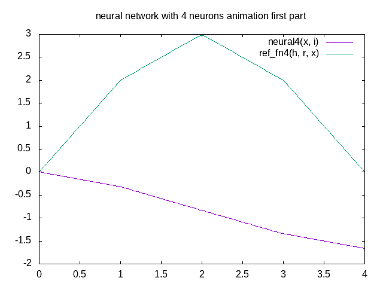

图 1:(图片由作者提供)具有四个神经元的神经网络使用反向传播来训练，以匹配具有四个斜率的参考函数。

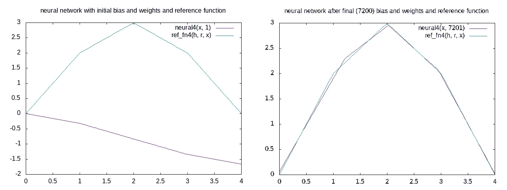

图 2a(图片由作者提供)(左)具有初始权重和参考函数的神经网络(右)具有最终权重和参考函数的神经网络

上面图 1 中的动画显示了使用反向传播算法训练四个神经元的神经网络。参考函数是一个形状为倒 V 形的图，每边都有一个弯曲。这是一个范围为[0，4]的图，有四个斜率。图 2a(左)显示了具有初始权重的参考函数和神经网络。图 2a(右)显示了参考函数和在 7200 次反向传播迭代后收敛到参考函数的神经网络。

本文的目的是帮助读者理解神经网络和训练中使用的反向传播算法。训练神经网络在计算上非常昂贵。反向传播算法有时会给出局部而非全局最优的解决方案。因此，对于那些部署神经网络来解决他们的问题的人来说，彻底理解该算法的基础是有用的。

本文分为三个部分，涵盖以下主题:(1)概述了监督学习的基本概念和神经网络正向计算和反向传播所涉及的数学方程。(b)将这些方程转化为将重量更新描述为视觉运动的陈述。这些运动是斜率的增大或减小，或者是斜率原点的移动。(c)提出了一组使用各种神经网络的例子。这些显示了反向传播算法的操作。python 程序用于计算和生成图形和动画，直观地显示计算过程，最后，给出一个注释，解释结果图形如何与(b)中所述的规则相联系。我希望可视化和解释将帮助用户更好地理解神经网络和反向传播。

*监督学习*:监督学习使用一种叫做神经网络的特殊功能来模拟测试数据集中输入和输出值之间的关系。测试数据集由一系列输入和输出值组成。神经网络具有权重参数，其值最初是猜测的。训练过程使用数据集来比较由模型预测的输出值，并修改权重，使得预测值和实际值之间的误差减小。一旦这个训练过程完成，神经网络就被用来预测新输入的输出值。

*神经元*:神经元是将 n 个输入向量映射到单个值的函数。它是线性和非线性操作的级联，如下所示。

```
N(w, x) = nl(x0*w0 + x1*w1+...+xn*wn + b)
   where w = {w0, w1, ..., wn} is the weight parameter of size n,
         x = {x0, x1, ..., xn} is the input vector of size n , 
         b is a bias       
     and nl is a non-linear function,
```

线性运算是输入向量与相同大小的权重向量加上标量偏差值的点积。非线性函数是定义在单个变量上的函数。使用的典型非线性函数是 relu，其被定义为 relu(x) = x，其中 x > 0，否则为 0。在本文中，我们使用大小为 1 的输入向量，并选择 relu 作为非线性函数。因此，神经元的方程式是

N(x) = relu(w*x+b)其中 w 是权重，b 是偏差。

如果 w > 0，那么当 x > -b/w 时，N(x) > 0。我们将把-b/w 称为神经元的起源。

*神经网络:*神经网络是由神经元组成的计算图。在输入层中具有 n 个单输入神经元并且在输出层中具有一个 n 输入神经元的神经网络由以下等式指定

NN(x)= w0 * relu(iw0 * x+B0)+w1 * relu(iw1 * x+B1)+..+wn*relu(iwn*x+bn)。

在单输入的情况下，我们可以将输入权重设置为 1(以消除冗余并提高反向传播搜索效率)。因此，神经网络方程为

NN(x)= w0 * relu(x+B0)+w1 * relu(x+B1)+..+wn*relu(x+bn)

一个关键的有用观察是(a)神经元 ni (wi *relu(x+bi))仅在 x > -bi 时对总和有贡献，即，神经元仅在 x > -bi 时是活动的。B1 点被称为神经元的起点。(b)如果神经元 ni 是活动的，斜率增加 wi。需要注意的重要一点是，n 个神经元的神经网络(具有相对非线性)表示具有 n 个斜率的连续图形。当 x > bi 时，每个神经元对神经网络的斜率有贡献，其中 bi 是神经元的偏差。

*例 1* ( *一个有四个斜率的神经网络*):下图 3a 所示为单输入单输出神经网络。输入层有 4 个神经元，每个神经元对大小为 1 的向量进行操作。每个神经元的权重和偏差分别为{1，1，1，1}和{0，-1，-2，-3}。所建模的函数具有单个输出，因此输出层具有 4 个输入的 1 个神经元。输出图层没有非线性，权重为{2，-1，-2，-1}。图 3b 示出了由该神经网络表示的曲线。该图表示具有四个斜率{2，1，-1，-2}的连续函数，其中斜率在位置{0，1，2，3}处变化。

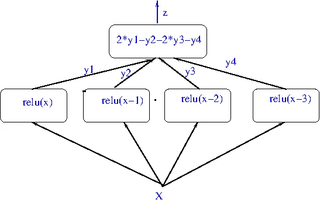

图 3a(图片由作者提供):宽度为 4 的神经网络。

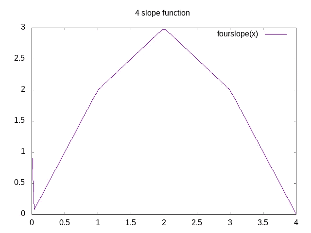

图 3b(作者提供的图片):由输入层中具有偏置{0，-1，-2，-3}和权重{1，1，1，1}的四个神经元以及输出层中具有权重{2，-1，-2，-1}和偏置 0 的一个四个输入神经元的神经网络建模的函数。

*反向传播*:反向传播是用来减少测试数据和神经网络预测值之间误差的算法。该算法反复修改最初猜测的偏差和权重，直到测试数据和神经网络预测值之间的误差在可接受的范围内。参考函数 ref_f(x)和神经网络之间的差值δ(x)和误差 e(x)由下式给出

```
delta(x) = (ref_f(x) - Σ wi*relu(x+bi) + b)
e(x) = delta(x)**2
where n > i ≥ 0,  n 
is the number of neurons in the input layer.
```

相对于权重和偏差的梯度被表示为相对于权重和偏差的偏导数。

```
grad = Σ ∂e/∂wi*Δwi + ∂e/∂bi*Δbi + ∂e/∂bi*Δb where∂e/∂wi = -2 * delta(x) * relu(x+bi)∂e/∂bi = -2 * delta(x) * (x+bi > 0) ? wi : 0) and∂e/∂b =  2 * delta(x)
```

权重更新的公式如下

```
wi = wi — lr*∂e/∂wi = wi + 2*lr*delta(x) * relu(x+bi) --- equation 1bi = bi — lr*∂e/∂bi = bi + 2*lr* delta(x) *(x+bi > 0) ? wi: 0)                              ---- equation 2b = b — lr*∂e/∂b = bi + 2*lr* delta(x) where lr is learning rate                                  ----- equation 3
```

在前向路径中的每次迭代期间，我们计算输出 NN(x)=σwi * relu(x+bi)、误差函数 e(x ),并且在反向路径中，我们更新权重和偏差。

权重更新规则是:

如果 NN(x) < ref_f(x) i.e, delta(x) >为 0(神经网络输出小于参考值)则:

```
For each neuron x > -bi (active neuron)
 weight increases (slope increases)
 if wi > 0 bias is increased, (neuron (slope) moves left ) -- rule 1
 if wi < 0 bias is decreased, (neuron (slope) moves right) -- rule 2
Here the magnitude of weight increase is proportional to delta(x) and the distance x + bi from the origin -bi. 
The magnitude of change in bi is proportional to delta(x) and the value of weight wi.
```

如果 NN(x) > ref_f(x)，即δ(x)< 0, ( Neural network output is greater than the reference value) then:

```
For each neuron x > -bi (active neuron)
 weight decreases (slope decreases)
if wi > 0 bias is decreased, (neuron (slope) moves right) -- rule 3
if wi < 0 bias is increased, (neuron (slope) moves left)  -- rule 4
Here the magnitude of weight decrease is proportional to delta(x) and the distance x + bi from the origin -bi.
The magnitude of change in bi is proportional to delta(x) and the value of weight wi.
```

In the next section, I present a few examples to illustrate the operation of the backpropagation algorithm. A random number generator generates 400 numbers in the range [0, 4]. A reference function generates the corresponding output. The reference function used in the examples are neural networks with fixed biases and weights. A training neural network with*n*神经元被选择。猜测训练神经网络的初始偏差和权重。反向传播算法更新权重和偏差，使得训练神经网络和参考函数之间的误差减小。对于神经网络的训练，使用 400 个数字的数据集一次或多次，直到误差减少到期望的限度内或者我们达到运行时间的上限。训练所需的时间将取决于权重和偏差的初始值。

本节中的示例附有情节和动画。每个例子具有(I)将具有初始偏差和权重的训练神经网络与参考函数进行比较的图，(ii)将具有最终偏差和权重的训练神经网络与参考函数进行比较的图，(iii)显示随着反向传播进行的每个神经元的偏差的图，(iv)显示随着反向传播进行的每个神经元的权重的图，(v)显示随着反向传播进行的神经网络和参考函数的图的动画，以及(vi)可选地，一些例子可以具有随着反向传播更新偏差和权重的单个神经元的图的动画。

*示例 2* :让我们使用由等式 ref_fn1(x) =2 * relu(x-1.0)指定的单个神经元参考函数，其中 x 被定义在区间[0，4]上。对于训练，我们将使用一个神经元的神经网络，初始偏差为 0，初始权重(斜率)为-0.6。选择 0 的偏置，使得*神经元在区间[0，4]上定义的整个数据集*上是活动的。神经网络和参考函数的方程是:

```
neural(x) = wt*relu(x+b) where wt = -0.6 and b = 0.
ref_fn1(x) = 2* relu(x-1).
```

这个例子将说明单个神经元神经网络对参考函数的收敛。这里，反向传播算法将神经元从 0 向右移动到 1，并将其斜率从-0.6 增加到 2。让我们看看它是如何做到的。

下面的图 4a 是显示神经网络在 800 次迭代中收敛到参考函数的动画。图 4b 示出了随着反向传播的进行，神经元的偏差和权重的变化。图 4c 示出了神经网络的初始和最终图以及参考函数。

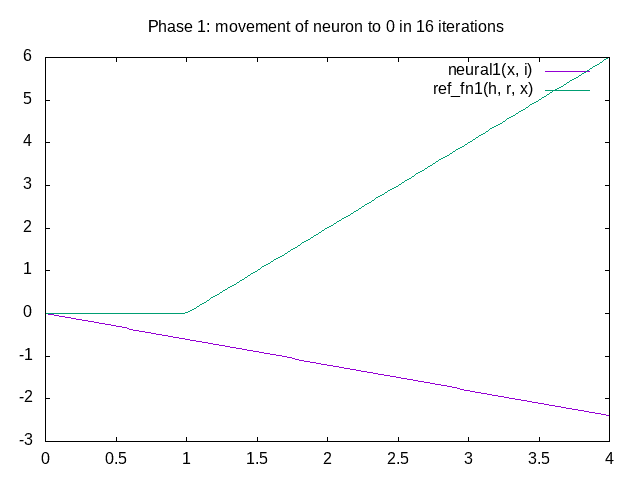

图 4a(作者的动画) :显示在反向传播算法的 800 次迭代中一个神经元神经网络收敛到参考函数的动画图

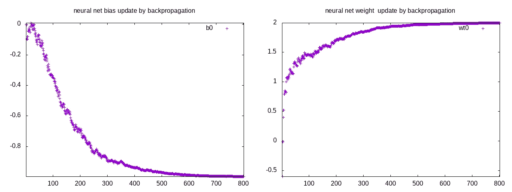

图 4b(作者提供的图像):(左)在 800 次迭代的反向传播期间神经元的偏差更新和(右)神经元的权重更新

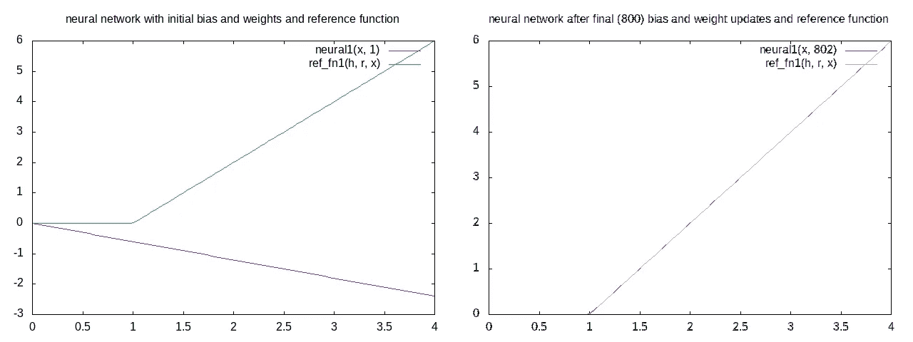

图 4c(图片由作者提供):(左)neural1(x)和 ref_fn1(x)标绘初始偏差(0)和权重(-0.6)，(右)neural1(x)和 ref_fn1(x)在 800 次反向传播权重和偏差更新后。

上面图 4a 中动画所示的收敛有三个阶段。这些阶段是:

阶段 1:最初，神经网络输出小于参考函数(如图 4c(左)所示)。因此*斜率在 4 次迭代中从-0.6 增加到 0*，并且神经元向右移动(对负斜率和正δ应用规则 2)。在接下来的 12 次迭代中，*斜率继续从 0 增加*到 1，但是*神经元现在向左移动*，因为斜率是正的(对正斜率和正增量应用规则 1)。

阶段 2:在该阶段，当δ为正时，斜率增加，神经元向左移动(规则 1)，当δ为负时，斜率减小，神经元向右移动(规则 3)。然而，在 300 次迭代中，移动是这样的，即*总斜率从 1.0 增加到 1.84(图 4b(右))，并且*总神经元从 0 向右移动*(图 4a(左))。*

阶段 3:在该阶段中，*斜率继续从 1.84 上升*到 2.0，并且在剩余的 500 次迭代中*神经元从 0.9 向右移动*到 1.0。在此阶段*斜率和神经元的移动较慢*，因为每次迭代中的误差较小。

结论:这个例子显示了反向传播算法更新单神经元神经网络的偏差和权重的能力，使得它收敛于参考函数。

在下一个例子中，我们使用双神经元神经网络作为参考函数。

*例 3* :参考函数由定义在范围[0，4]上的等式 ref _ fn2(x)= 2 * relu(x)-4 * relu(x-2)指定。为了训练，我们使用一个在输入层有 2 个神经元的神经网络。初始偏差为{0，-0.2}，初始权重为{0。, 0.08}.选择偏置使得神经元的原点尽可能接近 0。这确保了*两个神经元在输入范围[0，4]上定义的大部分数据集上都是活跃的*。每个*神经元的*初始偏置*值不同*。权重的更新取决于(x+bi)的值，其中 bi 是第 I 个神经元的偏差。通过选择不同的偏置，每个神经元的权重更新和偏置更新的轨迹将是不同的。从这个例子中可以看出这种差异的影响。具有初始偏差和权重的神经网络函数为

```
neural2(x) = wt0*relu(x -b0)+wt1*relu(x-b1) where b0=0, b1=-0.2, wt0 = 0, wt1 = 0.08
```

图 5a(左)示出了神经元的偏差和(右)权重的轨迹，它们被反向传播算法更新。neuron2 的偏差仅增加到 0.14，然后开始移动到-2.16，而 neuron1 的偏差增加到 1.25，然后回到 0，如图 5a 和下面的动画图 5b 所示。

让我们看看轨迹不同的原因。

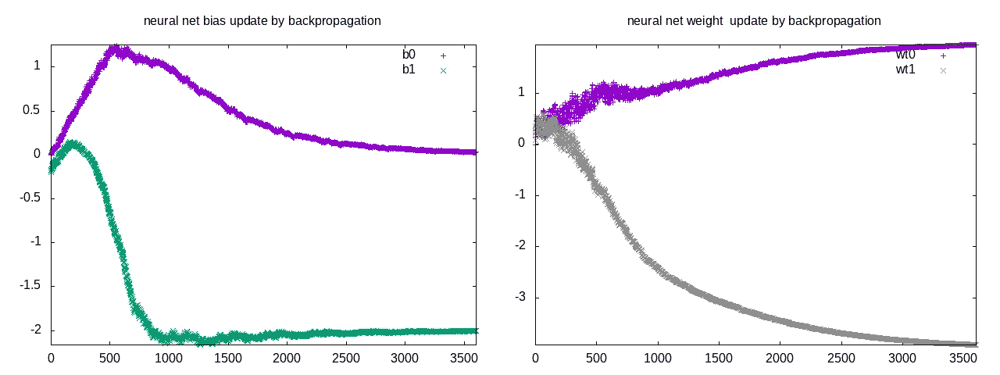

图 5a(作者提供的图像):(左)图显示了随着反向传播的进行，两个神经元的偏差和(右)权重

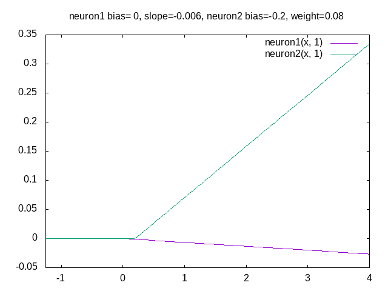

图 5b(作者的动画)是两个神经元的图，它们的偏差和权重被反向传播算法更新

两个神经元轨迹不同的原因是:

原因 1 *:偏差不同导致权重更新不同*:neuron 1 初始偏差为 0，neuron2 初始偏差为-0.2。因此，neuron1 的原点为 0，neuron2 的原点为 0.2。权重更新(来自等式 1)与 neuron1 的 delta(x)*x 和 neuron2 的 delta(x) * (x-0.2)成比例。因此，当 x > 0.2 时，两个神经元的权重都增加，其中神经 1 的权重增加的量更大。

原因 2: *权重的差异导致偏差更新的差异*:偏差的更新(来自等式 2)与 delta(x)和神经元的权重值成比例。由于 neuron1 的重量较大，它比 neuron2 移动得更远。此外，当 delta 为负且权重降低时，由于 neuron2 的权重较小，因此其变为负(而 neuron1 的权重仍为正)。这导致 neuron2 向右移动，而 neuron1 仍然向左移动。这是神经元 1 和神经元 2 起源分离增加的两个原因。

原因 3: *当一个神经元活动而另一个神经元不活动时，偏差和权重出现差异*:随着 neuron2 进一步向右移动，其原点越过 0，则当 x < -b1 时，它不活动(其权重不更新)。这就是为什么 neuron1 的斜率增加而 neuron2 的斜率减少的原因，如上面的图 5a(右)所示。这是两个神经元的偏差和权重轨迹不同的三个原因。

下面的图 5c 显示了神经网络收敛到参考函数时的动画图。图 5d(左)示出了具有初始偏差和权重的神经网络的图，图 5d(右)示出了具有最终偏差和权重的反向传播 3601 次迭代之后的图。动画有三个阶段。在第一阶段，两个神经元都向左移动，神经元 1 以更高的斜率进一步向左移动。在第二阶段，神经元 2 开始向右移动，而神经元 1 向左移动。在最后阶段，两个神经元都移动到它们的最终位置 0 和 2，并且斜率收敛到最终值 2 和-4。

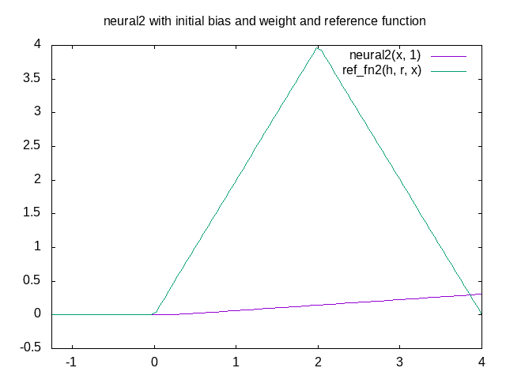

图 5c(作者的动画)显示了神经网络在 3601 次迭代中收敛到参考函数的动画图

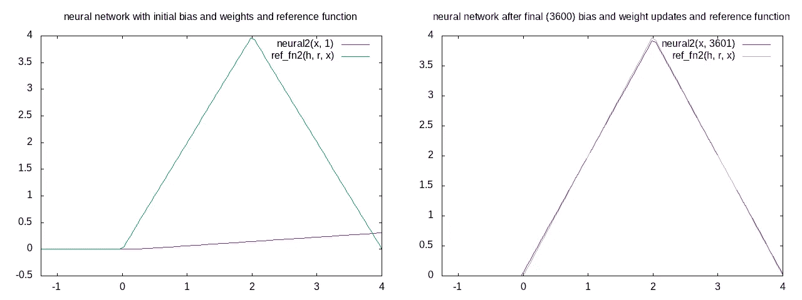

图 5d(作者的图像)(左)具有初始偏差和权重的参考函数和神经网络的图，以及(右)具有最终偏差和权重的参考函数和神经网络的图。

*结论*:因此我们看到反向传播算法更新了两个神经元，使得它们遵循不同的轨迹。这允许两个神经元的神经网络在 3601 次迭代中收敛到参考函数。

接下来让我们考虑一个具有四个神经元的参考函数的例子。

*例 4* :参考函数由定义在 0 ≤ x ≤4 范围内的方程 ref _ fn(x)= 2 * relu(x)-relu(x-1)-2 * relu(x-2)-relu(x-3)指定。为了训练，我们将使用四个神经元的神经网络。初始偏差为{-0.002，-0.5，-1.0，-1.5}，权重为{0.001，0.04，0.07，0.1}。与前面的例子相似，我们选择了不同的偏差。

图 6a(左)显示了具有初始偏差和权重的神经网络图，以及(右)具有最终偏差和权重的神经网络图。然而，在 20000 次迭代之后，该网络不收敛于参考函数。

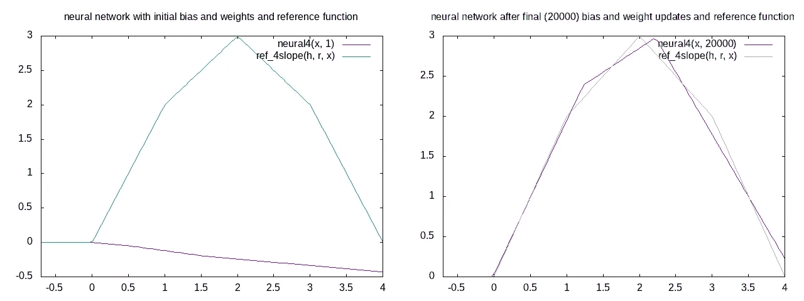

图 6a(作者提供的图像)具有四个神经元的神经网络图，具有初始偏差和权重(左)以及最终偏差和权重(右)

为了理解它不收敛的原因，让我们看看图 6b 中所示的四个神经元的偏差和权重的轨迹，以及图 6c 中显示四个神经元的运动的动画。

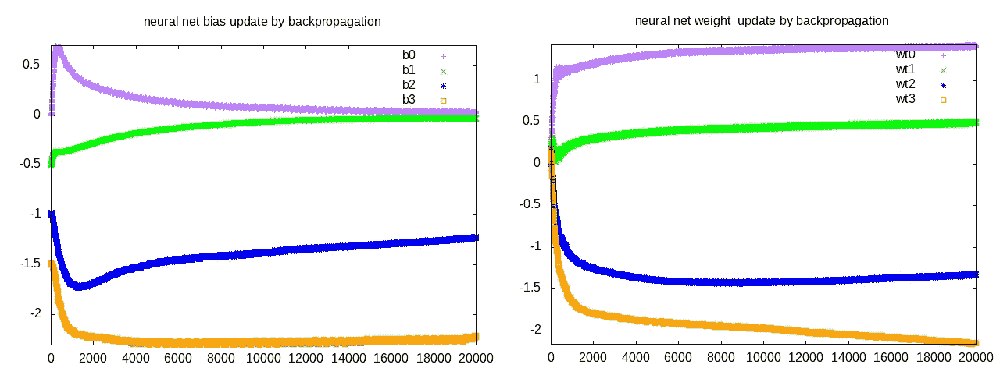

图(作者提供的图像)6b(左)四个神经元的偏差图，(右)四个神经元的权重(斜率)图

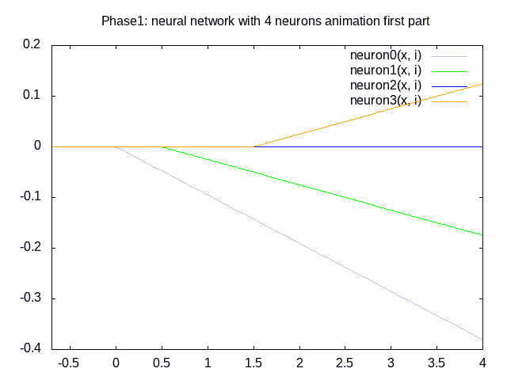

图 6c(作者的动画)显示了随着反向传播的进行，四个神经元的位置和斜率的动画。

全局最优要求四个神经元以斜率{2，-1，-2，-1}移动到位置{0，1，2，3}。相反，如图 6b 所示，四个神经元{紫色、绿色、蓝色、橙色}以斜率{1.42，0.5，-1.33，-2.1}移动到位置{0，0，1.22，2.22}。因此，neuron1 和 neuron2 都收敛于位置 0。这导致两个神经元在位置 0 合并成一个神经元，组合斜率为 1.42+0.5 = 1.92。

从图 6b 中我们可以看到，neuron1 和 neuron2 的斜率是正的并且在上升。当 delta(x) > 0 且 x > -b2 时，neuron1 和 neuron2 都向左移动。当 delta(x) < 0 and x < -b2 (i.e., neuron2 is inactive) neuron1 will move to the right and neuron2 will not be updated as it is not active when x < -b2\. Overall neuron1 moves right as the movement to the right is larger, while neuron2 moves left. This is the reason for coalescing of these two neurons. Thus effectively we have a neural network of three neurons with bias {0, -1.22, -2.22} and weights {1.92, -1.33, -2.1}. This is the reason for reaching a local optimum and not a global optimum.

There are two solutions to this problem.

*Solution1* :一个是改变 bias 的初始值，使神经元更向右展开。让我们选择以下初始偏差{0，-0.75，-1.5，-2.24}和权重{0，0.02，0.05，0.08}。图 7a 显示这导致 19200 次反向传播迭代的收敛。图 7b 示出了偏置和权重的轨迹。我们看到三个神经元向右移动，斜率为负。由于 neuron2 向右移动并具有负斜率，它避免了与 neuron1 合并的问题。最终偏差为{0，-1.0，-1.97，-2.93}，最终权重为{1.96，-0.99，-1.82，-1.15}。图 7c 是显示神经网络在 19200 次迭代中收敛到参考函数的动画图。

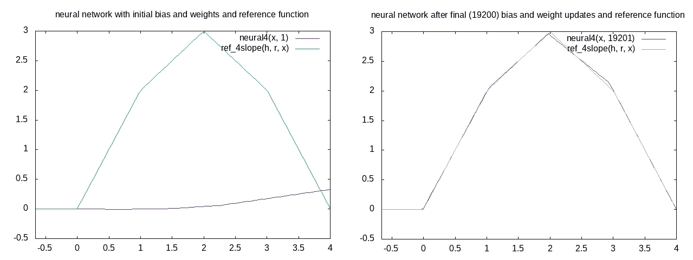

图 7a(作者提供的图像)(左)具有初始位置{0，0.75，1.5，2.24}的参考函数和神经网络的图，以及(右)具有最终位置{0，1.0，1.97，2.93}的参考函数和神经网络的图

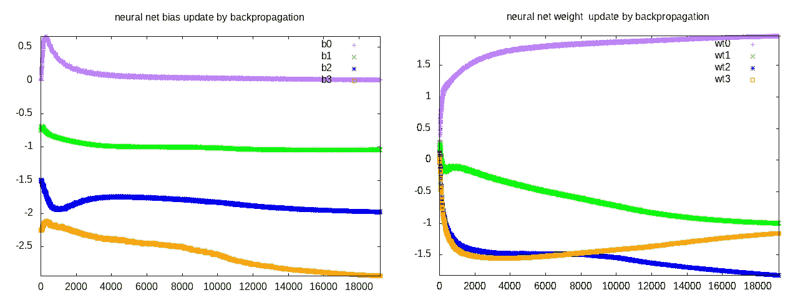

图 7b(作者提供的图像)(左)随着反向传播的进行，四个神经元的偏差图和(右)权重图。

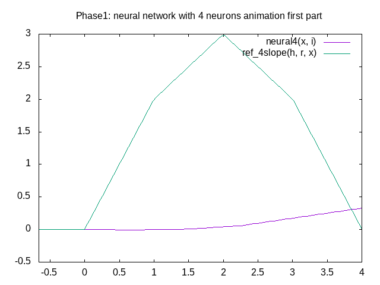

图 7c(作者提供的图像)在 19200 次迭代中，初始神经元位置在{0，0.75，1.5，2.24}处收敛到参考函数的神经网络的动画图

第二种解决方案是使用具有五个神经元的神经网络。

*解 2* :我们用一个五个神经元的神经网络，初始偏差为{0，-0.4，-0.8，-1.2，-1.6}，权重为{-0.08，-0.06，-0.02，0.02，0.06}进行训练。图 8a(左)是将参考函数与具有初始偏差和权重的神经网络进行比较的图。图 8a(右)显示了在 20000 次迭代后收敛到参考函数的具有最终偏差和权重的神经网络的图。

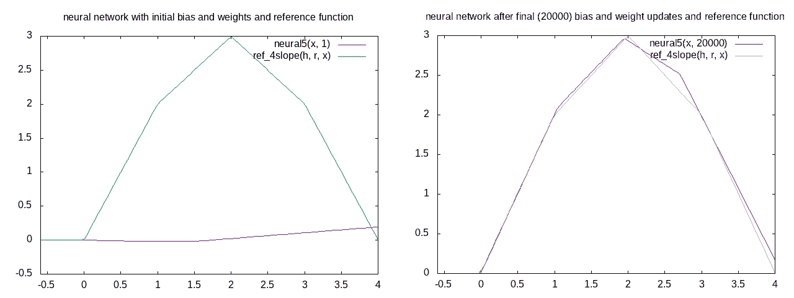

图 8a(图片由作者提供)(左)具有初始偏差和权重的参考函数和神经网络的图，以及(右)具有最终偏差和权重的参考函数和神经网络的图。

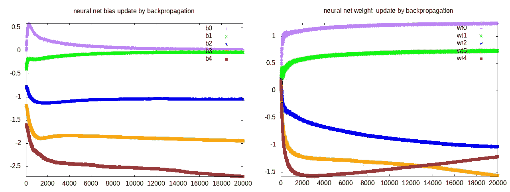

图 8b(作者提供的图像)(左)图示出了随着反向传播的进行，五个神经元的偏差和权重(右)的轨迹。


图 8c(作者的动画)显示了在 20000 次反向传播迭代中五神经元神经网络收敛到参考函数的动画图

图 8b 示出了五个神经元的偏差和权重的轨迹。我们看到 neuron1 和 neuron2 仍然以 0 的偏差结合在一起。其他三个神经元的偏差收敛于{-1，-2，-2.89}。权重收敛到{1.24，0.72，-1.05，-1.67，-1.25}。因此，收敛性比先前的四个神经元的网络好得多。

下一个解决方案结合了解决方案 1 和解决方案 2。这里，我们使用五个神经元，它们的初始偏置如解决方案 1 中一样向右移动。

*解 3* :我们用一个五个神经元的神经网络，初始偏差{0，-0.6，-1.2，-1.8，-2.4，}，初始权重{-0.06，-0.04，-0.02，0.02，0.06，}。图 9a(左)示出了将具有初始偏差和权重的五个神经元的神经网络与参考函数进行比较的图，图 9a(右)示出了在 12，400 次迭代之后具有最终偏差和权重的五个神经元的神经网络进行比较的图。图 9b 示出了具有五个神经元的神经网络的偏差和权重的轨迹，而图 9c 是示出了神经网络在 12，400 次迭代中收敛到参考函数的动画。最终偏差为{0.022，-0.04，-1.08，-1.99，-2.89}，最终权重为{1.43，0.54，-1.1，-1.69，-1.16}。

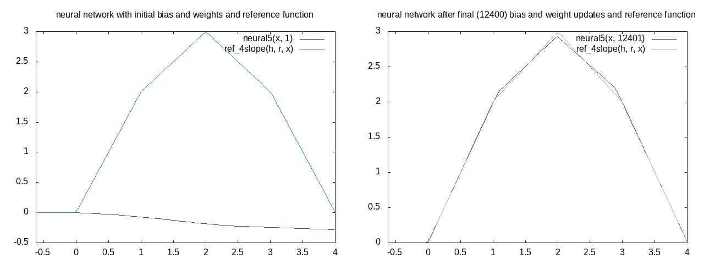

图 9a(作者的图像)(左)具有初始权重的参考函数和具有五个神经元的神经网络的图，(右)具有最终偏差和权重的参考函数和具有五个神经元的神经网络的图。

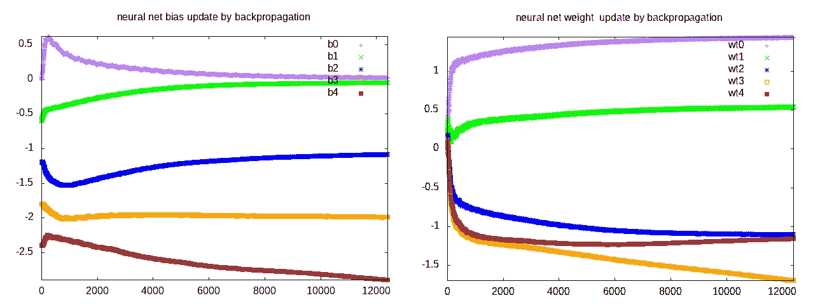

图 9b(作者提供的图像)(左)随着反向传播的进行，神经网络的偏差和(右)权重的轨迹图。

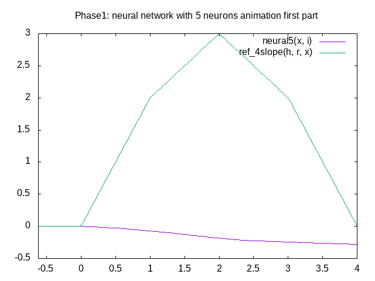

图 9c(作者的动画)显示了在 12，400 次迭代中五神经元神经网络向参考函数的收敛的动画图。

*结论*:神经网络的监督训练非常耗时。反向传播算法使用最速下降算法移动神经元并调整权重。将初始偏差分配给输入数据范围内的值非常重要。最好给每个神经元分配不同的偏置值。这是很好的传播偏见，以避免合并神经元。