# 理解正态分布

> 原文：<https://towardsdatascience.com/understanding-normal-distribution-a40701efb134?source=collection_archive---------29----------------------->

在本帖中，我们将介绍正态分布的基本概念、属性和实际值。如果你想讨论什么或者发现错误，请发邮件到[Lvqingchuan@gmail.com](mailto:Lvqingchuan@gmail.com):)给我

## 热身

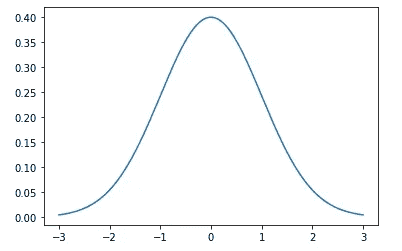

来自标准正态分布 N(0，1)的 10，000 个样本的密度

在开始之前，我想让你仔细看看上面的图表。这描绘了从标准正态分布 N(0，1)抽取的 10，000 个随机样本的密度。你在这里看到了什么？这是一个相当对称的图表，大多数数据点都以平均值 0 为中心。离平均值越远，数据点就越少。距离平均值两倍方差以内的数据点几乎覆盖了所有数据。

在这篇文章的后面，我们将会看到钟形和距离平均值的距离导致了一般的正态分布的重要性质。

**侧栏**

在本文中，我们将使用术语“随机变量”和“标准差”。这里有一个简短的回顾:

*   随机变量是同分布和独立分布的
*   标准差σ是方差的平方根。标准误差 s 是标准偏差除以样本大小的平方根，σ/sqrt(n)。

## 基本概念

数学和统计考试中经常给出正态分布的公式。我从来不喜欢背公式，但这个公式确实不难理解。对于独立同分布的变量 x，我们说 x 服从正态分布，如果概率密度函数(pdf。)的 x 可以写成:

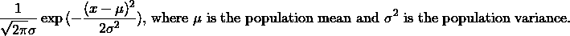

忘记左边的第一个分数。它只是确保这个概率密度函数的积分等于 1。这是概率函数的基本属性之一。观察指数函数中的分数，你会发现它实际上是:

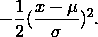

还是那句话，忘记左边 1/2 的分数。当你对上面的表达式求一阶导数时，它只是确保了右边部分的平方会被抵消掉(还记得吗？exp(f(x))的导数是 f’(x)exp(f(x))。我们为什么要求导？因为我们想找到局部极大值！为了确保局部/全局最大值处于总体均值，我们在分子上有(x 减去总体均值);为了确保 x 的分布曲线是钟形的(先增加，然后减少)，我们在 1/2 前面有负号。此外，再想想什么是平方和相关的分布，你会发现(更多在属性部分):

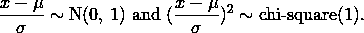

1 度卡方分布和这里有什么关系？还记得卡方图(1)吗:

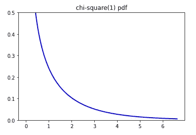

自由度 1 的卡方分布中 10，000 个随机样本的概率密度。

卡方(1)在这里是方便的，因为这种分布确保概率密度函数的增加/减少速率更小，因为 x 与总体均值的差异更大——再次是钟形曲线(BAM！).

## 性能

*   线性组合。将两个正态分布的随机变量组合在一起，您将再次得到一个正态分布的随机变量，尽管参数不同:

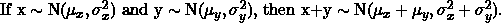

用一个“微妙”的概率密度函数来证明上述说法，将是一件痛苦的事情。然而，你可以用特征函数来攻击它。自己试试，然后查看维基百科页面寻找答案。一旦两个随机变量的情况清楚了，我们就可以通过归纳把它推广到多个(k 个)随机变量的情况。

*   线性变换。正态分布随机变量的线性变换仍然是正态分布随机变量:

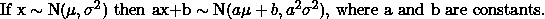

这种说法的证明又是通过特征函数。我给出一维情形的证明如下。你可以自己升级到矩阵版本。

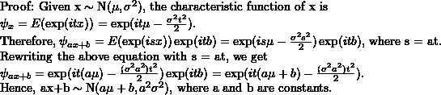

上述证明中唯一的技巧是让 s = at。

*   68–95–99.7 规则。这不是正态分布标准偏差的准确描述。然而，它在实际估算中工作得相当好。它说当 x~N(μ，σ):

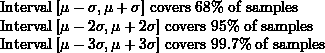

这只是通过查看正态分布的累积函数值(z 得分)得出的近似值。这里有一个图表说明:

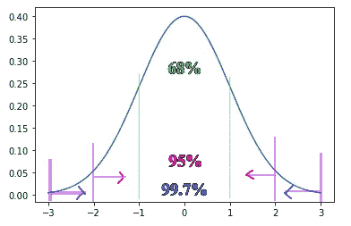

68–95–99.7 用标准正态分布说明的规则

## 实用价值

*   **中心极限定理**。这个著名的定理告诉您总体均值μ和方差σ为 N(μ，σ /n)的足够大样本的样本均值的分布，无论总体的分布是什么:

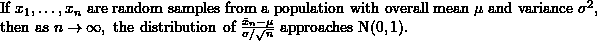

换句话说，当您重复抽取几乎无限多的替换样本时，每批样本的样本均值将遵循正态分布。̶i̶̶d̶o̶n̶'̶t̶̶h̶a̶v̶e̶̶a̶n̶̶i̶n̶t̶u̶i̶t̶i̶v̶e̶̶e̶x̶p̶l̶a̶n̶a̶t̶i̶o̶n̶̶a̶b̶o̶u̶t̶̶i̶t̶̶(̶n̶o̶r̶m̶a̶l̶̶d̶i̶s̶t̶r̶i̶b̶u̶t̶i̶o̶n̶̶i̶s̶̶t̶h̶e̶̶o̶n̶e̶̶m̶a̶g̶i̶c̶a̶l̶̶u̶n̶d̶e̶r̶l̶y̶i̶n̶g̶̶p̶o̶w̶e̶r̶？̶ ̶)̶、̶a̶l̶t̶h̶o̶u̶g̶h̶这个定理可以用特征函数和泰勒定理从理论上证明(参见[本维基百科第](https://en.wikipedia.org/wiki/Central_limit_theorem)页供参考)。**更新 20220604** :一个直观的解释就是扔骰子。当你连续投掷两个骰子(每边 1-6)多次，并计算每次两个骰子的总和，你将得到比最大值 12 或最小值 2 多得多的 6-9。这是因为更容易得到中间值，如 1+6、2+5、3+4，然后得到极值，如 6+6。

中心极限定理有助于在足够大的样本量下满足关于正态分布的假设。两个常见的例子:

a)。t 检验和 z 检验。这些测试在假设检验和 AB 测试中非常流行。在最简单的情况下，他们根据样本统计比较两个总体均值。一个必要条件是每组样本均值的正态分布。另一个必要条件是用于计算每组标准误差的观察值的正态分布。有了这两个条件，我们将能够构造一个遵循 t 分布或标准正态分布的检验统计量。只要你有一个非常大的样本量，中心极限定理通过满足这两个条件使你的生活变得容易。

另一方面，几乎所有的 t-统计量的应用，如构造总体均值的置信区间，都需要相当大的样本量，因为中心极限定理保证了样本均值在每组中的正态分布。

b)。线性回归。根据高斯-马尔可夫定理，如果你想要方差最小的无偏系数估计量，你需要残差项服从正态分布。然而，这并不是获得无偏系数估计量的必备假设。之前写过一个帖子解释线性回归的不同假设:[了解线性回归假设](https://medium.com/analytics-vidhya/understanding-linear-regression-assumptions-10eee3bc43de)。

*   **日志转换**。如果您计划使用线性回归模型，并且您的标注是对数正态形状(右偏)，您可能希望对数据应用对数变换。下面是在我的[爱荷华房屋预测项目](https://github.com/QingchuanLyu/Predicting-House-Prices)中转换前后标签的可视化:

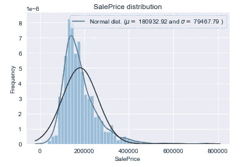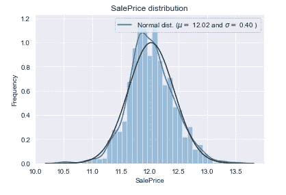

左:原始数据；右图:对数转换数据

使用对数转换有两个目的:

a)。提高对偏斜度敏感的模型的性能，如回归随机森林和线性回归。回归随机森林使用所有树的平均输出，当标签中有异常值时，可能会相差很远。同样，线性回归确实是预测标签的条件期望。我之前写过[实现随机森林](/implementing-random-forest-26dd3e4f55c3)和[理解线性回归假设](https://medium.com/analytics-vidhya/understanding-linear-regression-assumptions-10eee3bc43de)。

b)。获取此转换变量的正态分布属性，如可加性(属性部分中的线性组合)和线性(属性部分中的线性转换)。换句话说，如果您在原始尺度上增加了百分比(2%)，那么转换后的数据将增加 20 美元。当原始数据的规模变化很大时，这尤其有用——100 美元的 2%增长与 100 万美元的 2%增长截然不同。通过日志转换，您可以更直观地查看数据。

您可能已经意识到，日志转换是有代价的。当你只想减少线性模型中的右偏时，你不得不承认对系数的解释从多重性(2%)变成了可加性(20 美元)。这种变化并不是在所有情况下都有意义，尤其是当您的原始数据确实在使用加法标度时。

此外，如果对因变量进行变换，假设检验中的 t 统计量和 p 值也会发生变化。这不难理解。对数变换会改变数据的标准差，从而影响 t 统计量和 p 值，但没有特定的模式(可能是膨胀或收缩)。那么，当数据进行对数转换时，我们应该使用检验统计量和 p 值吗？**多半是的**！只要您的目的是使数据更正常(更少偏斜),并且您的对数变换实现了这一目的，就没有理由怀疑测试统计或 p 值的有效性，尽管它们可能与您从未经变换的数据中获得的结果不同。但是，当您执行对数转换只是为了使建模结果更容易理解时，您不希望在没有检查转换数据分布的情况下搞砸假设检验。在极端情况下，当原始数据左偏时，执行对数变换将使数据更加左偏。这使得样本均值服从正态分布的 t 检验假设之一难以满足。因此，这种情况下的检验统计量和 p 值可能有偏差。