# 了解对象检测

> 原文：<https://towardsdatascience.com/understanding-object-detection-1d810164b8a6?source=collection_archive---------13----------------------->

## 数据科学家和 ML 工程师的学习材料

## 利用深度学习检测图像对象(R-CNN、SSD、YOLO)


来源 [Unsplash](https://unsplash.com/photos/qcqmS0JG58Q)

> *想象一下谷歌照片:对于你所有的照片，你如何用物体来标记它们。要不要一个一个贴标签？*
> 
> *自动驾驶汽车怎么样？它们如何检测行人、汽车、交通灯和即将出现的障碍物？*
> 
> *输入物体检测算法*

# 从图像分类到物体检测

近年来，图像分类获得了巨大的吸引力，特别是在 CNN 和破坏性应用程序(例如:自动驾驶汽车)中。2015 年，ImageNet 竞赛产生了比人类表现更好的 RESNet。

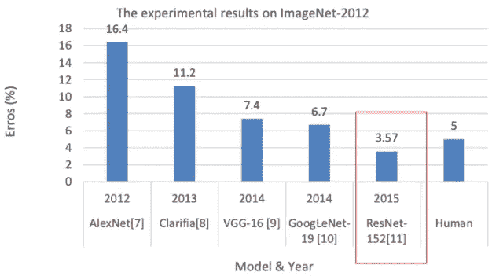

ResNet 表现优于人类(作者注释)

虽然图像分类(例如:CNN 堆栈)在对图像进行分类方面非常有效，但它在检测图像中的多个感兴趣对象以及了解它们在图像中的位置方面仍然存在局限性。

物体检测比图像分类更进了一步，画出了一个或多个感兴趣物体的边界框。

在本教程中，我们将学习使用 R-CNN 和 YOLO 快速检测物体的方法。

</understanding-cnn-convolutional-neural-network-69fd626ee7d4>  

# 物体检测的一般步骤是什么？

## 1.对象定位

> **哪里的**是对象？

**要定位对象，我们需要识别兴趣对象的焦点锚点。**这来自区域提案，用于定制水平/垂直细长框。每个位置都有一个锚点。

我们创建一个模型来生成标记感兴趣区域的区域提议。我们指定边界框并注释代表这些特定区域提议的图片片段。这包括多种方法，例如:滑动窗口(强力)、选择性搜索(聚类)和区域提议网络(深度学习)。

## 2.对象分类

> **图像中的是什么** *？*

我们将所有视觉特征提取到包围盒中，并在区域提议上评估每个包围盒。这包括核函数和直方图函数。

对于每一个形状，我们将计算回归量，以检查锚如何偏离地面真相。我们还讨论了**区域提议**，它维护了由主干架构表示的兴趣对象(例如:CNN/VGG16/etc)

## 3.非最大抑制

我们寻找可能的包围盒，其捕获并集上的交集(IOU)内的锚。这允许我们将所有重叠的框减少到单个有代表性的边界框。

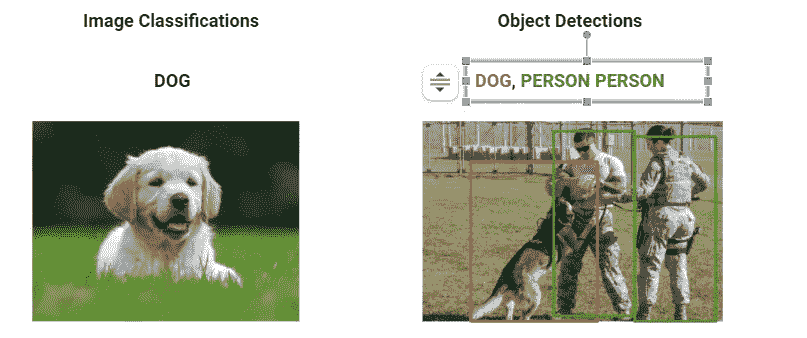

图像分类和对象检测(来源于作者)

# **现有的物体检测操作有哪些？**

## **美国有线电视新闻网**

R-CNN 通过提出[选择性搜索](https://ivi.fnwi.uva.nl/isis/publications/2013/UijlingsIJCV2013/UijlingsIJCV2013.pdf)从图像中提取区域(又名。区域提案)。选择搜索将 1)生成子分割以生成候选区域，2)使用贪婪算法来组合相似区域，以及 3)使用生成的区域和最终候选区域。

扭曲区域被馈送到 CNN 分类器，CNN 分类器提取特征图以馈送到支持向量机( [SVM](/support-vector-machine-introduction-to-machine-learning-algorithms-934a444fca47) )。如果对象存在于扭曲区域内，SVM 进行分类。然后回归器将调整并设置边界框来表示区域建议。

**尽管 R-CNN 在确定代表性区域方面很有效，但它仍然效率低下，因为它需要花费大量时间来训练所有 2000 个扭曲区域。选择性算法也可能导致一代又一代的不良候选人，从而减慢整个过程。**

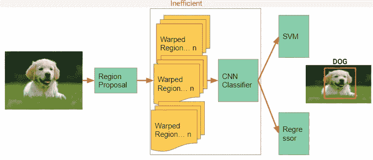

美国有线电视新闻网(来源于作者)

## **快速 R-CNN(双摄)**

你需要有多个 CNN 分类器。在 2014 年的论文中。这使用更快的选择搜索。快速 R-CNN 也被称为双镜头，因为它直接运行地区提案和 CNN。

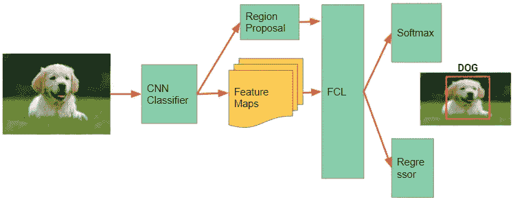

快速 R-CNN(来源于作者)

## **更快的 RCNN**

由于快速 RNN 地区的建议可能是浪费，我们实际上可以运行地区的建议，使用要素地图作为输入。这更快也更直接，因为要素地图已经包含了感兴趣的对象。

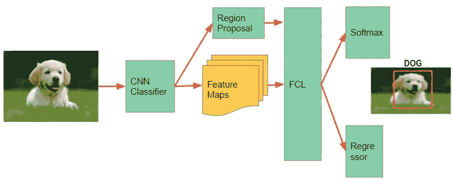

更快的 R-CNN(来源于作者)

## 单发探测器(SSD)

SSD 通过从每个卷积层计算包围盒和图像分类来关注速度。SSD 用的是 VGG19，主干架构，想用什么架构就用什么架构。我们可以使用 RESnet，但由于它的复杂性，它违背了目的，因为它意味着速度。另一种选择是 MobileNet，用于小物体检测程序。

你可以看一下 [tf2_detection_zoo](https://github.com/tensorflow/models/blob/master/research/object_detection/g3doc/tf2_detection_zoo.md) 中完整的开源算法列表。

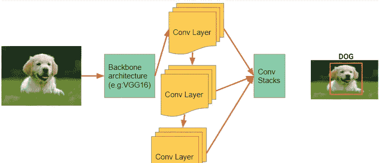

固态硬盘(来源于作者)

## 其他技术

*   **你只看一次(YOLO)** 类似于 SSD，但不是通过特征地图计算边界框，YOLO 使用暗网作为 CNN 堆栈主干，并聚合最后三层 YOLO 使用暗网作为主干。
*   **基于变压器的探测器(脸书)。**也用于检测图像中的物体。
*   **面具 RCNN 怎么样？蒙版**是图像分割。这是目标检测的另一个应用。这显示了细分的确切含义。

# 练习物体探测

本教程展示了如何用图像对对象进行分类。你将获得一些实践经验，并对以下概念形成直觉:

*   使用来自 [Tensorflow 对象检测库](https://github.com/tensorflow/models/tree/master/research/object_detection)的预训练模型和 [MSCoco 数据集](https://cocodataset.org/#home)进行开箱检测
*   通过用新的开箱即用检测之外的类修改现有的对象检测体系结构来转移学习。本培训将在急切模式下进行(TF2)

用 GPU 运行这个 colab 大概需要 1 个小时。请随意打开下面的 colab 并开始使用:)

  

## 图书馆

我们使用 TensorFlow 对象检测 API (ODAPI)库，通过 TF 后端迭代不同的对象检测配置。

*   TF-Slim 是一个轻量级的库，用来定义、训练和评估 TF 模型。这个库是由谷歌人工智能大脑团队开发的，目前仍在开发中，因此使用它需要自担风险(可能会很快被弃用)。
*   [pycocotools](https://github.com/cocodataset/cocoapi) 为对象检测和图像分割提供了庞大的图像数据集。 [COCO 数据集](https://cocodataset.org/#home)

```
!pip install tf_slim
!pip install pycocotools
```

## 基于 COCO 数据集安装现成模型

我们将使用“MobileNet SSD”([模型动物园](https://github.com/tensorflow/models/blob/master/research/object_detection/g3doc/tf2_detection_zoo.md))来尝试我们的开箱即用模型。

使用`export_inference_graph.py`工具导出的任何模型都可以通过指定模型名称和路径来加载。

```
model_name = ‘ssd_mobilenet_v1_coco_2017_11_17’
detection_model = load_model(model_name) # a helper function to access http://download.tensorflow.org/models/object_detection
```

## 创建推理

*   给模特打电话
*   生成带遮罩的边界框(批注的形状)

```
model_fn = model.signatures[‘serving_default’]
output_dict = model_fn(input_tensor)if 'detection_masks' in output_dict:# Reframe the the bbox mask to the image size.detection_masks_reframed = utils_ops.reframe_box_masks_to_image_masks(output_dict['detection_masks'], output_dict['detection_boxes'],image.shape[0], image.shape[1])
detection_masks_reframed = tf.cast(detection_masks_reframed > 0.5, tf.uint8)
output_dict['detection_masks_reframed'] = detection_masks_reframed.numpy()
```

使用 IPyImage `display` 功能显示图像:

```
display(IPyImage(open(anim_file, ‘rb’).read()))
```

注意，注释称浣熊为猫/狗/鸟/棒球手套。这意味着在 coco 数据集上训练的模型不知道如何识别浣熊。

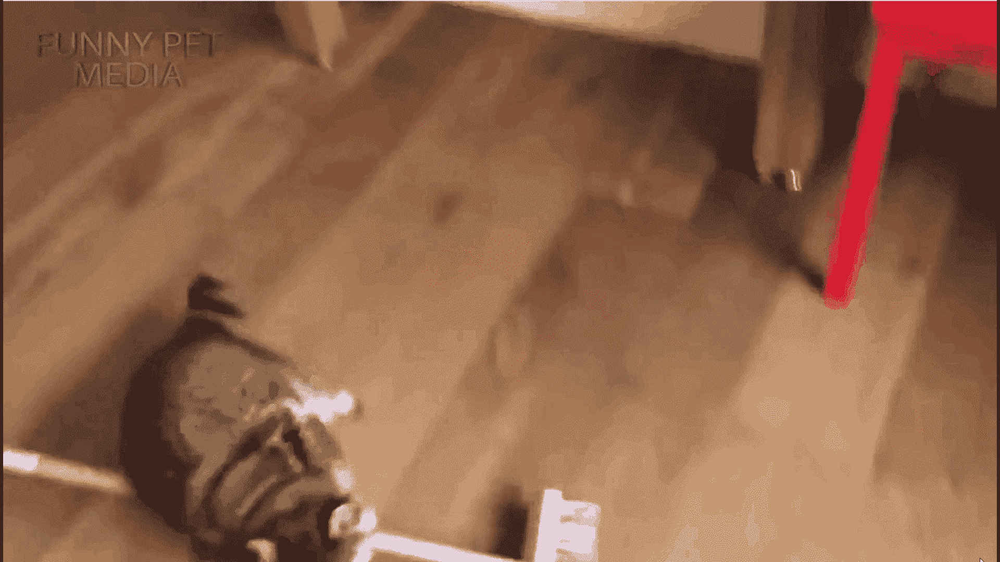

浣熊与可可数据集(来源于作者)

## 训练和注释数据

我们可以使用我们准备好的训练集来训练我们的模型识别浣熊。一个简单的方法是使用`object_detection.utils`中的`colab_utils`工具进行注释。

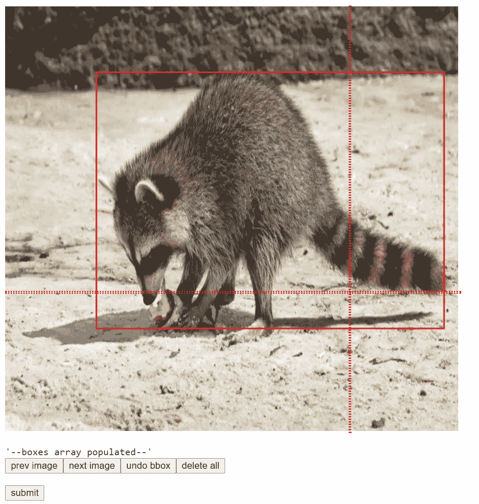

使用 colab_utils 进行手动注释(来源于作者)

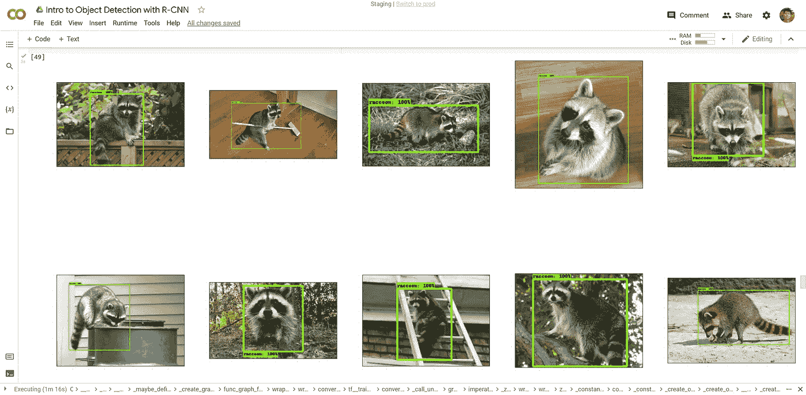

自我注释后的浣熊图像(来源于作者)

# 利用 RetinaNet 进行迁移学习

我们可以使用预先训练好的模型根据新的类别进行微调。在这种情况下，我们将使用 RetinaNet 架构，避免在实验和微调过程中浪费时间。Tensorflow 在[tensor flow/models/research/object _ detection](https://github.com/tensorflow/models/tree/master/research/object_detection)下有物体检测。

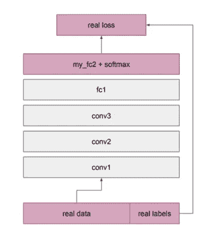

在此单元中，我们构建了一个单阶段检测架构(RetinaNet ),并恢复了除顶部分类层(将自动随机初始化)之外的所有层。

目标是加载管道配置并构建检测模型。因为我们是在一个默认情况下预测 90 个类槽的 COCO 架构下工作，所以我们在这里重写了“num_classes”字段，使其只有一个。

假设我们只注释了 10 幅图像。我们不需要创建批量输入，只需通过测试映像运行模型。

```
#more code in the colab.image, shapes = detection_model.preprocess(tf.zeros([1, 640, 640, 3]))
prediction_dict = detection_model.predict(image, shapes)
_ = detection_model.postprocess(prediction_dict, shapes)
print(‘Weights restored!’)optimizer = tf.keras.optimizers.SGD(learning_rate=learning_rate, momentum=0.9)
train_step_fn = get_model_train_step_function(
detection_model, optimizer, to_fine_tune)
```

# 最终结果

使用正确的模型和正确的注释进行训练。这 10 个图像应该足以将图像标记为浣熊

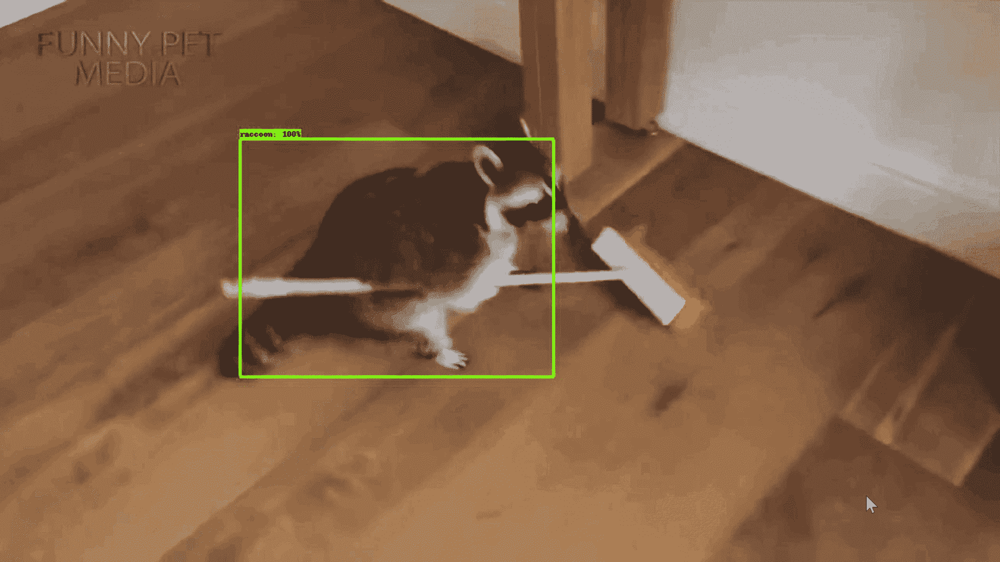

浣熊在 RetinaNet 迁移学习后，使用手动注释和 COCO 数据集(来源于作者)

# 常见问题

## 还有哪些工具可以帮助图像注释？

在微软 coco 中，大约有 1000 张图片和 80 个对象。但是有时我们想在不存在的物体上训练模型。

我个人认为由亚马逊工程师开源的[标签是最有用的标签工具。但是如果你不想使用它，我们总是有 Tensorflow 助手函数来帮助你标记和注释。](https://github.com/tzutalin/labelImg)

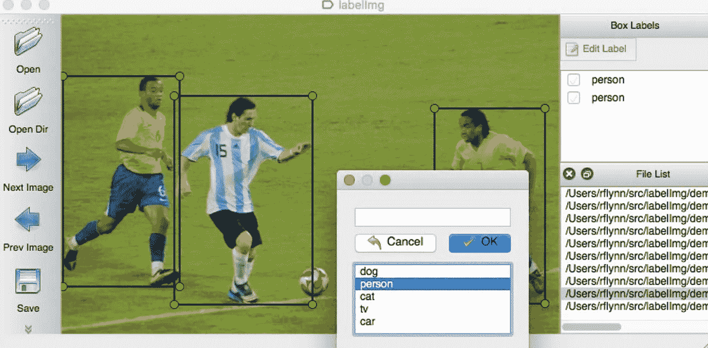

来源于 [Github](https://github.com/tzutalin/labelImg)

## 我们需要多少数据？

使用迁移学习，你不需要太多的数据，在我的教程中，你可以在 12 幅图像内运行它。但是当然这取决于用例。如果您需要在晚上运行 SSD，并使用深色图像，那么您可能也需要在上面上传许多图像。

你拥有的数据越多越好，然而随着更多数据的输入，你会发现收益递减。最重要的是拥有代表您需要的数据。这是连体网络的情况，其中具有相同参数和权重的相同配置适用于多个标签。

## 我们怎么知道生产哪一个？

很多时候，我们会用微服务来投放。这意味着我们将安装一台服务器，提供 API 网关来连接其他服务，并在请求到来时给出结果。对于模型的类型，这真的取决于你是优先考虑准确性(R-CNN)还是速度(SSD)。[这里我提到了一篇非常酷的论文](https://arxiv.org/abs/1611.10012)

# 参考资料:

## 博客

*   [R-CNN，快速 R-CNN，快速 R-CNN，YOLO](/r-cnn-fast-r-cnn-faster-r-cnn-yolo-object-detection-algorithms-36d53571365e)
*   [MLSS 教程为基础代码](https://github.com/ronygustam/MLSS-INDONESIA-2020)归功于罗尼·卡尔法里西

## 报纸

<https://arxiv.org/abs/1611.10012>  

# 关于作者

文森特用 ML @ Google 对抗网络滥用。文森特使用高级数据分析、机器学习和软件工程来保护 Chrome 和 Gmail 用户。

除了在谷歌的工作，文森特还是乔治亚理工学院计算机科学硕士校友，三项全能运动员和数据科学媒体的特约作家，该媒体在全球拥有超过 100 万的观众。

最后，请通过[**LinkedIn**](http://www.linkedin.com/in/vincenttatan/?source=post_page---------------------------)**、**[**Medium**](https://medium.com/@vincentkernn?source=post_page---------------------------)**或** [**Youtube 频道**](https://www.youtube.com/user/vincelance1/videos?source=post_page---------------------------) 联系文森特