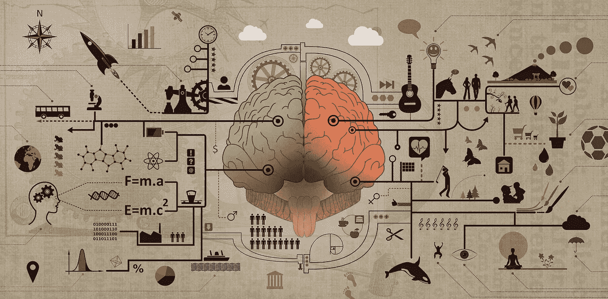
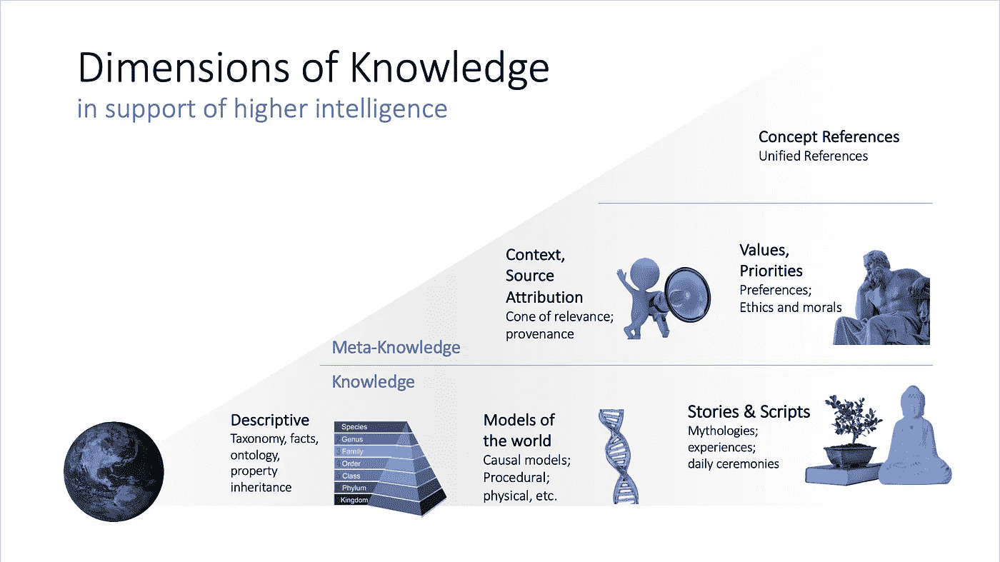

# 深刻的知识的理解

> 原文：<https://towardsdatascience.com/understanding-of-and-by-deep-knowledge-aac5ede75169?source=collection_archive---------9----------------------->

## [思想和理论](https://towardsdatascience.com/tagged/thoughts-and-theory)

## 知识结构如何将人工智能从表面相关性转化为对世界的理解

鸣谢:[学习与教育——大脑功能开发理念 by Imagens Livres](https://www.flickr.com/photos/142126305@N05/26272258730/) 授权:【https://creativecommons.org/licenses/by/2.0/】T4

哪些知识让你变得聪明？你的认知用来理解世界、解读新体验、做出深思熟虑的选择的构念是什么？定义一个框架，阐明使人类或人工智能(AI)能够理解和更高认知的各种知识，将有助于就如何有效实现这些结构进行结构化讨论，并绘制出一条通往更智能机器的道路。

允许人工智能系统组织其世界观、理解意义并展示对事件和任务的理解的知识结构将可能处于更高水平的机器智能的中心。机器认知将扩展到锚定在知识结构中的数据之外，包括描述性知识、世界动态模型和出处等维度。

[学习语言时，我们区分*形式*和*意义*](https://web.stanford.edu/group/cslipublications/cslipublications/site/1575862867.shtml) *:* *形式*是指用来表示*意义*的符号——表面表达。每种形式在特定的上下文中都有特定的含义，并且形式在不同的上下文中可以有不同的含义。[正如 schlkopf、Bengio 等人](https://arxiv.org/pdf/2102.11107.pdf)在一篇文章中总结的那样，“当前大多数成功的机器学习可以归结为对适当收集的独立同分布(i.i.d .)数据的大规模模式识别。”系统摄取可观察的元素，如文本字符、声音信号和图像像素，并建立模式和随机相关性，同时为基于识别的任务产生出色的结果。

越来越多的人同意，算法必须超越表面相关性，进入*的含义*和理解，以实现更高水平的机器智能。这种明确的转变将实现所谓的[系统 2](https://slideslive.com/38922304/from-system-1-deep-learning-to-system-2-deep-learning) 、[第三波](https://www.darpa.mil/about-us/darpa-perspective-on-ai)或[广义/灵活人工智能](https://www.youtube.com/watch?v=GpWLZUbPhr0)。正如我在核心博客 [' *认知人工智能的崛起*](/the-rise-of-cognitive-ai-a29d2b724ccc) *，*中概述的那样，机器智能的下一个级别需要深层的知识结构，这些知识结构可以将人工智能从表面相关性转变为对世界的理解，代表抽象、关系、学到的经验、见解、模型和其他类型的结构化信息。

[DARPA 的 John Launchbury 指出人工智能的各个方面](https://www.darpa.mil/attachments/AIFull.pdf)将在第三波人工智能中看到抽象(即创造新的意义)和推理(规划和决策)的转型改进。第三次浪潮本身的特点是背景适应，其中系统为现实世界的现象类别构建背景解释模型。这里提出的框架提供了一个关于知识结构如何促进这种飞跃的视角。

其中两个知识维度反映了对世界的看法——***描述性*** 维度及其对世界的概念抽象，以及真实世界 及其现象的动态 ***模型。 ***故事*** 增加了人类理解和交流基于共同信仰和神话的复杂故事的能力。 ***上下文和源属性*** 以及 ***值和优先级*** 是元知识维度，其提供了有效性和关于知识的知识的基于条件的覆盖。最后， ***概念引用*** 是结构支撑，跨维度、模态、引用绑定。总之，这六个知识维度可以带来超越事件相关性的额外深度，通过假设持久的潜在概念，可以解释和预测过去和未来的事件，允许规划和干预，并考虑反事实现实，因此使用术语“深度知识”***

阐明和描述机器智能所需的各种知识结构有助于确定实现它们的最佳方式，从而实现下一级机器智能。这个博客的目标是建立被认为与下一级人工智能认知能力的发展相关的知识结构的基本类别。

**支持高智能的知识维度**

对于人工智能系统，实现人类理解和交流中观察到的知识结构可以为智能提供实质性的价值。当所有的知识类型都得到支持和结合时，这种价值就会大大增加。

*支持高等智力的知识维度。鸣谢:Gadi Singer/英特尔实验室。*

**1。** **描述性知识:层次、分类和属性继承**

[描述性知识](https://en.wikipedia.org/wiki/Descriptive_knowledge)(即概念性、命题性或陈述性知识)描述事物、事件、它们的属性以及它们彼此之间的关系。深度描述知识的概念扩展了这个定义，假设使用(适当的)类或概念的层次分层。这类知识可以包括事实和记录系统。与特定用例及环境相关的事实和信息可以作为分层知识来组织、利用和更新。

在单个 AI 系统中使用的底层[本体](https://en.wikipedia.org/wiki/Ontology)可以用来自管理系统的任务相关类和实体来播种(例如 [OpenCyc 本体](https://www.qrg.northwestern.edu/nextkb/IntroOpenCycOnt.pdf)或 [AMR 命名实体类型](https://amr.isi.edu/doc/ne-types.html))。它应该可以用神经网络/机器学习技术来扩展——新知识的获取将贡献新的实体、关系和类。

**2。** **世界车型**

世界中的现象模型使人工智能系统能够理解情况，解释输入/事件，预测潜在的未来结果并采取行动。这些模型是抽象/概括，可以分为正式模型和近似(非正式)现实世界模型；它们允许变量的使用和在特殊情况下对实例的应用，并支持特殊实例或更一般化的类的[符号操作](https://onlinelibrary.wiley.com/doi/abs/10.1207/s15516709cog0402_2)。

形式模型的例子包括逻辑、数学/代数和物理。与正式的模型相反，现实世界的模型通常是经验的、实验的，有时是混乱的。它们既包括物理模型，也包括心理和社会学模型。程序模型(“诀窍”)包含在本课程中。

因果模型是可以帮助人工智能系统发展到下一个机器智能水平的模型类型的主要例子。在背景发生变化的情况下，如果与因果关系等知识模型相结合，并与对主导原因的背景的理解和考虑反事实的能力相结合，过去的统计数据只能有效地应用于现在来预测未来。[这些模型有助于从引发情况或事件的条件和可能因素的角度来理解情况或事件](http://bayes.cs.ucla.edu/WHY/)。因果推理是人类思维不可或缺的组成部分，可以形式化为实现人类水平的机器智能。

**3。** **故事和剧本**

正如历史学家尤瓦尔·赫拉利所说，故事是个人和社会的文化和世界观的重要组成部分。故事的概念是完全理解和解释人类行为和交流所必需的。故事是复杂的，可能包括多个事件和一个关联叙述中的各种信息。它们不仅仅是事实和事件的集合。相反，它们包含了关键的信息，有助于开发理解和归纳超越了提出的数据。不同于世界模型，世界模型被期望提供一个世界的可操作的表现和一个人如何与它互动，故事可以被看作是历史的，参考的或精神的。故事可以代表价值观和经验，并告知人们的信仰和行动。例子包括宗教或民族故事，神话，以及任何层次的群体分享的故事。

**4。** **上下文和来源归属**

上下文可以定义为[围绕事件或其他信息的框架，并为其适当的解释提供资源](https://en.wikipedia.org/wiki/Context_(language_use))。它可以被看作是一个覆盖的知识结构，调整它所包含的知识。上下文可以是持久的，也可以是短暂的。

持续的背景[可以是持久的](https://ris.utwente.nl/ws/files/6401593/types.pdf)(如从西方与东方哲学的角度获取的知识)或者它可以基于新的材料学习随时间而改变。它不会因任务而改变。

在特定的本地上下文很重要的情况下，瞬态上下文是相关的。单词在其周围的句子或段落的本地上下文中被解释。图像中的感兴趣区域通常在整个图像或视频的上下文中解释。

持久的和短暂的背景相结合可以提供完整的环境来解释和操作知识。

知识的另一个相关方面是[数据起源](https://en.wikipedia.org/wiki/Data_lineage)(又名数据血统)，它包括数据起源、数据发生了什么以及数据随时间移动到哪里。人工智能系统不能假设所有摄取的信息通常都是正确或可信的，特别是关于被称为[后真相时代](https://dictionary.cambridge.org/us/dictionary/english/post-truth)的信息。将信息与其来源联系起来可能是建立可信度、可认证性和可追溯性所必需的

**5。** **【价值和优先权(包括善良/威胁和道德)】**

知识的所有方面(例如，对象、概念或过程)都可以在判断范围内具有相关的价值——从最大的善到最大的恶。可以假设人类智力的进化包括对回报的追求和对风险的规避(获取午餐；避免成为午餐)。这种风险/回报关联与对事物的认识紧密相连。潜在的得与失具有功利价值；对于正在考虑的实体或潜在的未来状态，也有基于伦理的价值。这可以反映出这样的伦理价值观，即赋予“善”不是基于潜在的有形回报或威胁，而是基于对什么是正确的潜在信念。

价值和优先级是元知识，反映了人工智能系统对知识、行动和结果的相关方面的主观断言。它建立了问责制的基础，应该由负责特定人工智能系统的人小心处理。当人工智能系统与人类互动并做出影响人类福祉的选择时，潜在的价值和优先化系统很重要。

6.**概念引用:消歧、统一和跨模态**

知识是以概念为基础的。例如，“狗”是一个抽象概念，具有多个名称(例如，在各种语言中)、一些视觉特征、声音联想等等。然而，无论其表现形式和用法如何，基本概念“狗”是独特的。它映射到英语单词“dog”，也映射到法语单词“chien”它也是属于的财产

以及狗吠声的可能来源。

概念引用(或简称 ConceptRef)是与给定概念相关的所有事物的标识符和引用集。ConceptRefs 本身实际上并不包含任何知识——知识存在于上述维度中。概念参考是多维知识库的关键；因为它们融合了这个概念的所有表象。

[Wikidata](https://www.wikidata.org/wiki/Wikidata:Main_Page) 是集中存储结构化数据的知识库的一个很好的例子。在维基数据中，[条目](https://www.wikidata.org/wiki/Wikidata:Glossary#Item)代表人类知识中的所有*事物*，包括主题、概念和对象。Wikidata 的条目类似于这个框架中 ConceptRef 的定义——只有一个关键区别。在 Wikidata 中，术语“项目”指的是给定的标识符以及关于它的信息。ConceptRefs 只是指向知识库的标识符。关于概念的信息填充在前面章节中描述的各种视图中(例如与概念相关的描述性或程序性知识)。

**常识性知识**

[常识知识由隐性信息组成](https://www.quantamagazine.org/common-sense-comes-to-computers-20200430/)——人类自动应用来理解世界的一组广泛(且广泛共享)的未写假设。将常识应用于各种情况对于理解和更高层次的认知是必不可少的。在这个框架中，常识知识被认为是上述六种知识类型的子集。

**理解与知识类型的关系**

理解是智力的基础。即将向更高的机器智能过渡引发了一场关于“理解”的讨论。Yoshua Bengio [描述了人类水平的人工智能理解如下](https://medium.com/syncedreview/yoshua-bengio-team-proposes-causal-learning-to-solve-the-ml-model-generalization-problem-762c31b51e04):捕捉因果关系和世界如何运转；理解抽象的行动以及如何使用它们来控制、推理和计划，即使是在新奇的场景中；解释发生了什么(推论，学分分配)；和非分布发电。

考虑以下*以知识为中心的*理解的定义:创造用丰富的知识表征表达的世界观的能力；获取和解释新信息以增强世界观的能力；以及对现有知识和新信息进行有效推理、决策和解释的能力。

四个功能是这种理解观的先决条件:表示丰富的知识、获取新知识、跨实体和关系链接知识的实例以及对知识进行推理。自然，理解不是二元属性，而是因类型和程度而异。这一观点的核心是知识的本质及其表现形式——知识结构和模型的表达能力可以促进理解和推理能力的分类差异。

**想象所有的人[和机器]**

正如阿尔伯特·爱因斯坦所观察到的，“智慧的真正标志不是知识，而是想象力。”要真正理解，机器智能必须超越数据、事实和故事的知识。想象力对于重建、发现和发明一个可观察属性和事件背后的宇宙模型是必要的。从人工智能系统的角度来看，想象力是通过创造性推理实现的:进行归纳、演绎或溯因推理，并产生新的结果，而不是由以前的经验和输入输出的相关性严格规定的。

[知识表示和推理](https://www.elsevier.com/books/knowledge-representation-and-reasoning/brachman/978-1-55860-932-7)是人工智能的一个成熟领域，致力于世界信息的表示，因此计算机系统可以解决复杂的任务。知识和推理不一定是截然不同的，而是代表了从已知到推断(可以成为新的已知)的光谱。机器理解将通过构建知识的能力来实现，辅之以高级和更新的关联推理(例如，概率和似是而非的推理、溯因推理、类比推理、默认推理等)。).

**建立在深厚知识基础上的神经符号人工智能**

我对更具认知性、基于知识的人工智能方法的欣赏出现在 2010 年代中期，当时我正在英特尔研究深度学习硬件和软件解决方案。加里·马库斯的优秀论文[人工智能的下一个十年:迈向强大人工智能的四个步骤](https://arxiv.org/ftp/arxiv/papers/2002/2002.06177.pdf)提供了类似的观点。

在让人工智能更有效、更负责、更高效地支持人类的过程中，目标是让人工智能系统更强大，同时也推动它们进入下一个认知和理解水平。在操纵数据、识别模式和寻找最短暂的相关性方面已经取得了长足的进步。但是，仍然有必要考虑将使人工智能系统具备建模和理解它所操作的世界的能力的知识类型。

是时候就更具认知力的人工智能所需的知识种类展开对话了。本博客中讨论的知识表示的构造类型可以以各种形式实现，最终的系统将在神经网络能力和符号知识(无论以何种表示)实现人工智能下一阶段目标的方式上有所不同。后续的博客将更详细地介绍这个框架中引入的不同知识维度。随着我们对高级认知所需的知识结构类型建立了更深入的理解，我们可以继续构建这些深层知识，使机器能够理解世界。

**参考文献**

查尔斯·菲尔莫。《语言中的形式和意义》。CSLI 出版物，2002 年。[https://web . Stanford . edu/group/csli publications/csli publications/site/1575862867 . shtml](https://web.stanford.edu/group/cslipublications/cslipublications/site/1575862867.shtml)(2021 年 5 月 4 日访问)

schlkopf，b .等人，“走向因果表征学习”。[https://arxiv.org/abs/2102.11107](https://arxiv.org/abs/2102.11107)

本吉奥。约舒厄。“从系统 1 深度学习到系统 2 深度学习”。NIPS 2019，[https://slides live . com/38922304/from-system-1-deep-learning-to-system-2-deep-learning](https://slideslive.com/38922304/from-system-1-deep-learning-to-system-2-deep-learning)

约翰·朗什伯里。“DARPA 对人工智能的看法”。DARPA，[https://www.darpa.mil/attachments/AIFull.pdf](https://www.darpa.mil/attachments/AIFull.pdf)(2021 年 3 月 23 日访问)

弗朗索瓦·乔莱。“人工智能的未来是怎样的？”，[https://www.youtube.com/watch?v=GpWLZUbPhr0](https://www.youtube.com/watch?v=GpWLZUbPhr0)

歌手，加迪。《认知 AI 的崛起》。走向数据科学，2021 年 4 月。[https://towards data science . com/the-rise-of-cognitive-ai-a 29 D2 b 724 CCC](/the-rise-of-cognitive-ai-a29d2b724ccc)

禁止，肯尼斯。《OpenCyc 本体简介》。https://www.qrg.northwestern.edu/nextkb/IntroOpenCycOnt.pdf(2021 年 5 月 4 日访问)

艾伦·纽维尔。“物理符号系统”，认知科学，1980 年 4 月。[https://online library . Wiley . com/doi/ABS/10.1207/s 15516709 cog 0402 _ 2](https://onlinelibrary.wiley.com/doi/abs/10.1207/s15516709cog0402_2)

珀尔朱迪亚。《为什么之书》。纽约，基础图书，2018 年 5 月。[http://bayes.cs.ucla.edu/WHY/](http://bayes.cs.ucla.edu/WHY/)

尤瓦尔·诺亚·哈拉里。《智人，人类简史》。哈维·塞克，2014 年。

德容，汤姆和弗格森-赫斯勒，莫妮卡。“知识的类型和质量”。教育心理学，1996 年。

帕夫勒斯，约翰。“常识更接近计算机”。Quantamagazine，2020 年 4 月。[https://www . quanta magazine . org/common-sense-comes-to-computers-2020 04 30/](https://www.quantamagazine.org/common-sense-comes-to-computers-20200430/)

马库斯加里。“人工智能的下一个十年:迈向强大人工智能的四个步骤”。乐百氏人工智能，2020 年 2 月，[https://arxiv.org/ftp/arxiv/papers/2002/2002.06177.pdf](https://arxiv.org/ftp/arxiv/papers/2002/2002.06177.pdf)

本文建立在之前文章中的观点的基础上:

[**认知 AI 的兴起**](/the-rise-of-cognitive-ai-a29d2b724ccc)

以及之前在 LinkedIn 上发表的一系列文章:

知识时代来临:

第一部分:接下来，机器变得更聪明

[**第二部分:效率、可扩展性和认知:绘制前沿地图**](https://www.linkedin.com/pulse/efficiency-extensibility-cognition-charting-frontiers-gadi-singer/)

[**第三部分:深度知识是高等机器智能的关键**](https://www.linkedin.com/pulse/deep-knowledge-key-higher-machine-intelligence-gadi-singer/)

[**认知计算研究:从深度学习到高等机器智能**](https://www.intel.com/content/www/us/en/research/blogs/cognitive-computing-research.html)

*Gadi Singer 是英特尔实验室副总裁，认知计算研究总监。*