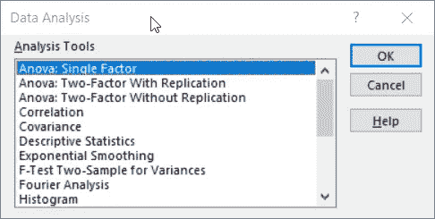
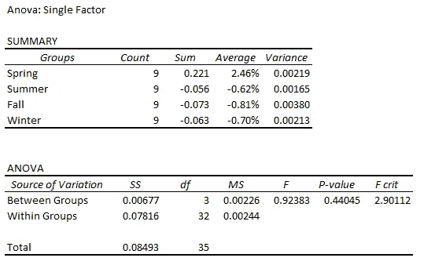
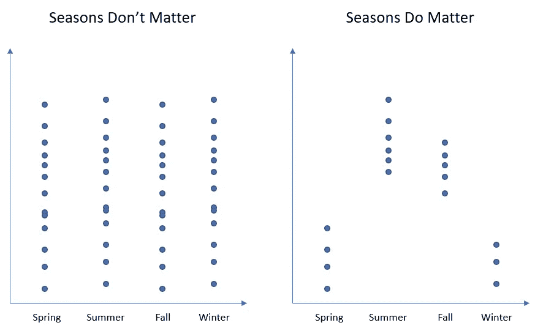
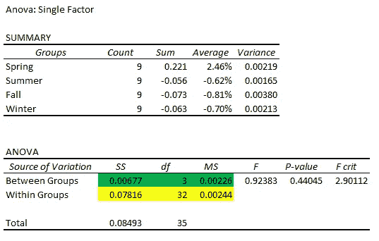
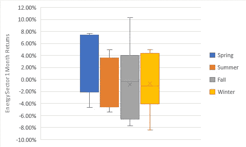

# 了解单因素方差分析

> 原文：<https://towardsdatascience.com/understanding-one-way-anova-df44f02922fe?source=collection_archive---------23----------------------->


由[卡洛斯·穆扎](https://unsplash.com/@kmuza?utm_source=medium&utm_medium=referral)在 [Unsplash](https://unsplash.com?utm_source=medium&utm_medium=referral) 上拍摄的照片

## 理解差异驱动因素的真正有用的工具

今天，我们将在 Excel 中进行一些数据科学研究！是的，与一些人的想法相反，在 Excel 中进行合理的分析是可能的。

Sure statsmodels 也有一个 ANOVA(方差分析)库，但我第一次在 Excel 中看到它是在很多年前，当时就想“这是什么？”。



Excel 方差分析(来源:微软)

方差分析是比较因素和分解方差的非常有用的工具。它与聚类也有很多相似之处。让我们进入我们的例子。

# 财务数据的方差分析示例

这里有一些标签命名的数据，你可以复制并直接粘贴到 Excel 中。它是能源股每个季度的月度回报——假设我们有一个假设，即季节性是能源股回报的一个重要决定因素。

*(需要以这种方式组织，以便正确运行 ANOVA 分析。)*

```
Spring   Summer   Fall   Winter       
2.13%   4.40%   -6.20%   -5.35%       
4.94%   -2.90%   -4.45%   4.93%       
1.33%   2.74%   -7.73%   -1.12%       
-2.50%   -3.80%   -7.09%   -2.70%       
7.67%   -5.41%   10.32%   4.91%       
-4.62%   -5.35%   -0.31%   -8.38%       
7.44%   4.95%   2.76%   -2.09%       
7.36%   -1.38%   0.21%   -0.31%       
-1.66%   1.18%   5.21%   3.84%
```

我们将使用 Excel 的数据分析工具对其进行方差分析(如上图所示)。请耐心听我说一会儿——我马上会解释什么是方差分析。举个例子就简单多了。

输出如下所示:



方差分析输出(来源:作者)

汇总表非常简单。它只提供基本的汇总统计数据，例如每个变量的平均值和方差。有趣的是，我们可以看到，在分析期间，能源股的平均回报率仅在春季(我定义为 3 月、4 月、5 月)为正，而能源股在秋季表现出最大的波动性。

第二个表格是 ANOVA，是行动所在的地方。SS 代表平方和。一旦你花了一些时间在统计上，你就会意识到这一切都与方差有关——测量它，解释它，分解它。在统计领域，方差是对不确定性的估计；所以统计学家和数据科学家总是试图建模和解释它。

```
The equation for variance is:**Sample Variance = sum(Xi - mean(X))^2/(n-1)**
```

分子`sum(Xi — mean(X))^2`就是我们所说的离差平方和或简称平方和(SS)。它只是每个观察值和平均值之间的平方差之和。例如，要计算能源股回报的总 SS(不按季节分时段)，我们将:

1.  计算能源指数的月平均回报。
2.  取我们刚刚计算的平均值，从能源指数的每个月收益中减去它。
3.  对步骤 2 中的每个值求平方。
4.  将步骤 3 中的所有值相加。

## 那又怎样？

因为离差平方和(在本文中我称之为 SS)是方差方程中的分子，它与方差高度相关。保持观察次数不变，SS 越高，变量的方差越高。

## 现在让我们回到方差分析

ANOVA 为什么叫方差分析？这是因为方差分析是一个试图将方差分解为其来源的过程。

记得我们从一个假设开始——什么季节对能源股的表现有影响。让我们想想如何测试这一点。

**如果季节很重要，我们会期望数据看起来像什么？**一旦我们按季节将数据分类成桶，我们预计每个季节桶内的回报变化将非常小，而跨季节桶的变化将非常大。换句话说，**我们期望跨季节时段的高 SS 和每个季节时段内的低 SS***(无意中，一些聚类算法通过最大化跨类方差同时最小化类内方差来工作)。*这在右边的图中有直观的描述。

如果季节不重要，我们还能期待什么？这将与我们刚才描述的相反。我们应该期望看到跨季节时段的低 ss(低变化)和每个时段内的高 SS(高变化)。换句话说，排序前和排序后的变化看起来差不多(左图)。



不同状态下的分布情况(来源:作者)

这听起来越来越像假设测试了。基本上，方差分析就是这样的:

> 方差分析是检验不同组的均值是否显著不同的一种方法。

# 解释我们的方差分析结果

但我喜欢 ANOVA 的是它分解变异来源的方式(解释变异基本上就是解释方差)。



变异的来源(来源:作者)

这是我之前展示的同一个 ANOVA 输出——绿色数字是各组之间的**差异的统计数据(通过将各组的平均值与总体平均值进行比较来衡量，即夏季的平均值或冬季的平均值是否与总体平均值有很大差异？)**而黄色数字是一个群体内**变化的统计数据(仅在冬季期间能量回报就有多少变化)**？总变化只是所有能量观测的总 SS，与季节无关。

```
So ANOVA breaks out variation as follows:Total SS = Between Groups SS + Within Groups SSWhere SS is an estimate for variation
```

现在我们可以检查我们上面描述的情况:

*   如果组间变异高于组内变异，那么季节一定很重要。
*   如果组间差异相对于组内差异不是很大，那么季节就无关紧要了。

我们用来定量测试我刚才描述的内容的 F 统计量是从绿色和黄色的数字中计算出来的，如下所示:

```
F = (SS_between/df_between) / (SS_within/df_within)
= (0.00677/3) / (0.07816/32) = 0.924The intuition around why we divide SS by df (degrees of freedom) is that we need to do so in order to normalize it. The more observations there are, the higher the SS - so in order to compare variables with unequal numbers of observations we need to normalize SS by dividing it by df.
```

这是我们的测试统计。如果您需要复习假设检验，我在这里介绍了一些基础知识:

[](/data-science-fundamentals-a-b-testing-cb371ceecc27) [## 数据科学基础— A/B 测试

### 我们用一个简单的例子来探究 A/B 测试的来龙去脉

towardsdatascience.com](/data-science-fundamentals-a-b-testing-cb371ceecc27) 

但是在高水平上，F-统计量越大，我们观察到由于随机机会而观察到的情况的可能性就越小。在这种情况下，我们的零假设是均值在统计上没有差异——或者组内的差异胜过组间的差异。

在我们的例子中，要达到 5%的显著水平，我们需要看到 F 统计值为 2.90 或更高。由于我们的 F 统计量仅为 0.924，我们无法拒绝零假设。思考我们的结论的一种更直观的方式是查看 0.44 的 p 值(这是从 F 统计得出的)——**0.44 的 p 值意味着有 44%的机会观察到我们由于随机机会而做的事情**。那是相当高的！难怪我们没能拒绝零假设。

## 理解变异的来源

现在我们已经解决了技术问题，让我们稍微关注一下直觉。划分`SS_between/SS_total = 0.00677/0.08493 = 8%`。这意味着只有 8%的变化是由季节引起的。因此，季节不是能源股回报的主要驱动因素。

一个很好的问题是“SS_between 相对于 SS_total(不变)有多高，均值的差异才具有统计显著性？这在解释变异时意味着什么？

要达到 2.90 的 F 统计值，SS_between 需要达到 0.0182，几乎是原来的 3 倍。在这种情况下，季节可以解释总变异的 21.4%。因此，即使发现均值在统计上不同，每个时段内仍可能存在显著差异。

# 结论

让我们用一个方框图来结束吧，这是我最喜欢的一种方法，可以形象化不同类别之间的差异。



能量回报的箱线图(来源:作者)

我们可以看到，虽然春季回报率较高，但所有季节的总体分布或多或少都是相互叠加的——正如我们在未能拒绝零假设时发现的那样。

方差分析是一个很好的工具，可以帮助你理解观察到的差异的驱动因素。例如，如果您试图了解是什么导致了购物者花费的差异，您可以将购物者分类，并使用 ANOVA 测试分类的质量。这就像一个反向聚类分析。在聚类中，首先进行排序，然后试图找出这些聚类的含义。通过方差分析，你假设某个分类很重要，然后你测试自己是否正确。

这可能会有点乏味，但得出的结果肯定更容易理解(也更容易向你的老板解释)。干杯！