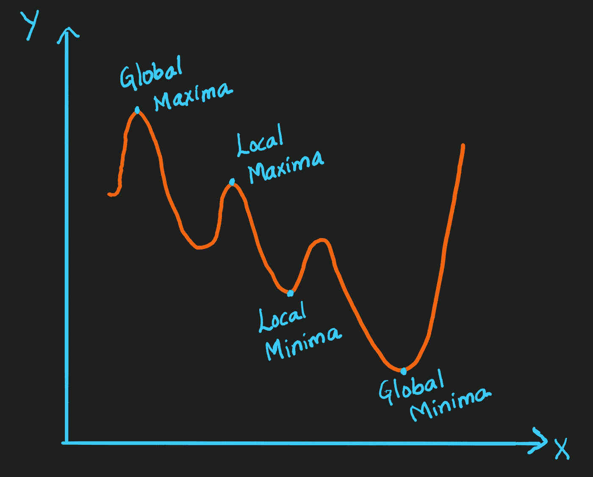
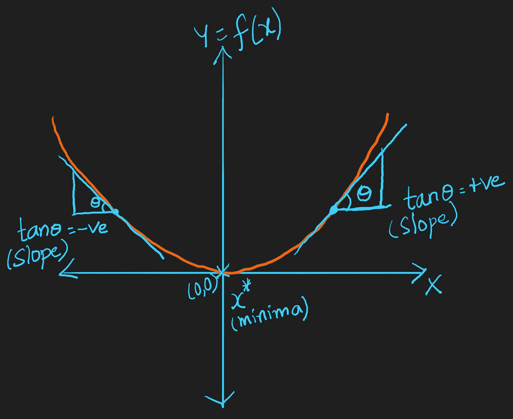
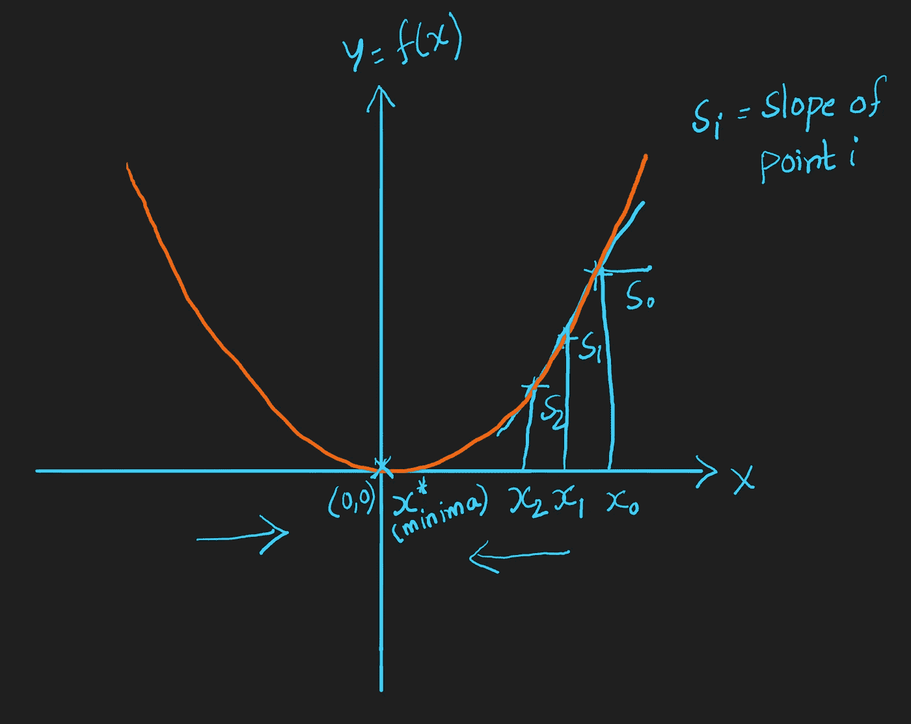
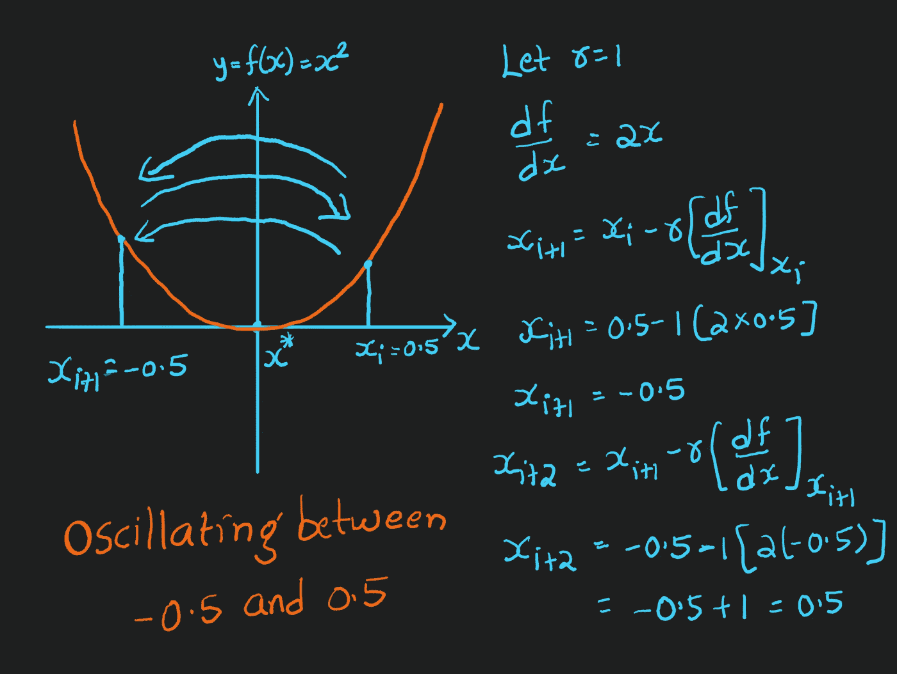
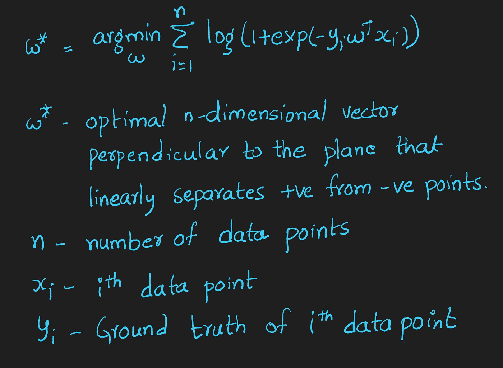
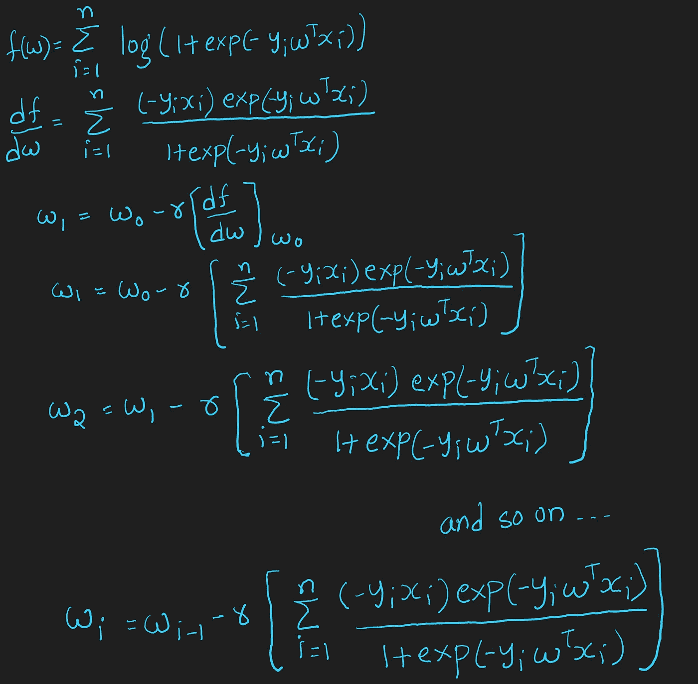
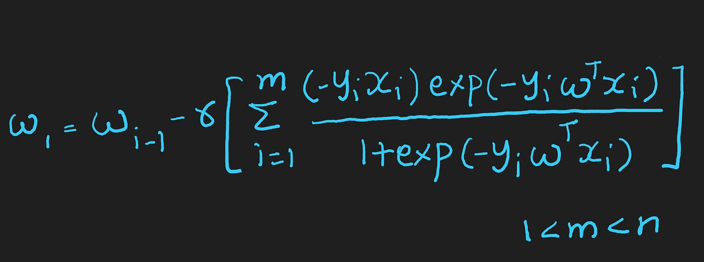

# 理解机器学习中的优化算法

> 原文：<https://towardsdatascience.com/understanding-optimization-algorithms-in-machine-learning-edfdb4df766b?source=collection_archive---------5----------------------->

机器学习中两种重要优化技术背后的数学

# **目录:**

1.  [简介](#c601)
2.  [最大值和最小值](#a4db)
3.  [梯度下降](#c06b)
4.  [学习率](#414b)
5.  [逻辑回归中的梯度下降](#b0a7)
6.  [随机梯度下降](#88aa)
7.  [结论](#3598)
8.  [参考文献](#7c1a)

作者图片

1.  **简介**

优化是我们迭代地训练模型的过程，其结果是最大和最小的函数评估。获得更好的结果是机器学习中最重要的现象之一。

我们为什么要优化我们的机器学习模型？我们通过改变每一步中的超参数来比较每一次迭代的结果，直到我们达到最佳结果。我们创建了一个错误率更低的精确模型。我们可以使用不同的方法来优化模型。在本文中，我们来讨论两个重要的优化算法:**梯度下降和随机梯度下降算法**；它们是如何在机器学习模型中使用的，以及它们背后的数学。

**2。最大值和最小值**

最大值是给定范围内函数的最大值，最小值是最小值。我们将它们表示如下:

最小值和最大值(图片由作者提供)

*全局最大值和最小值*:分别是函数在整个定义域上的最大值和最小值

*局部最大值和最小值*:分别是函数在给定范围内的最大值和最小值。

只能有一个全局最小值和最大值，但是可以有多个局部最小值和最大值。

**3。梯度下降**

梯度下降是一种优化算法，它能找出可微函数的局部极小值。它是最小化给定函数的最小化算法。

让我们看看梯度下降的几何直观:

Y=X 的斜率(图片作者提供)

让我们举一个抛物线的例子，Y=X

这里，最小值是原点(0，0)。这里的斜率是 Tanθ。因此，当 0

点向最小值移动的斜率(图片由作者提供)

图中的一个重要观察结果是斜率在最小值时从正变到负。当我们越接近最小值，斜率越小。

那么，梯度下降算法是如何工作的呢？

目的:计算函数 Y=X 的 X*-局部最小值。

*   随机选取一个初始点 X₀
*   在 X₀.计算 X₁ = X₀-r[df/dx]r 是学习率(我们将在[学习率](#414b)部分讨论 *r* )。让我们取 r=1。这里，df/dx 只不过是*梯度。*
*   在 X₁.计算 X₂ = X₁-r[df/dx]
*   计算所有的分数:X₁，X₂，X₃，…。xᵢxᵢ-₁
*   计算局部最小值的一般公式:Xᵢ = (Xᵢ-₁)-r[df/dx)在 Xᵢ-₁
*   当(Xᵢ — Xᵢ-₁)很小时，即当 Xᵢ-₁、Xᵢ收敛时，我们停止迭代并宣布 X* = Xᵢ

**4。学习率**

学习率是一个超参数或调谐参数，它决定了在函数中向最小值移动时每次迭代的步长。比如初始步 r = 0.1，下一步就可以取 r=0.01。同样，当我们进一步迭代时，它可以按指数规律减少。在深度学习中使用更有效。

如果我们保持 r 值不变，会发生什么:

振荡问题(图片由作者提供)

在上面的例子中，我们取 r=1。当我们计算 Xᵢ，Xᵢ+₁，Xᵢ+₂,….求局部最小值 X*，我们可以看到它在 X = -0.5 和 X = 0.5 之间振荡。

当我们保持 r 不变时，我们最终会遇到一个*振荡问题*。因此，我们必须在每次迭代中减少“r”值。随着迭代步长的增加，减小 *r* 的值。

**重要提示:**超参数决定偏差-方差权衡。当 *r* 值较低时，可能会使模型过拟合并导致高方差。当 *r* 值较高时，可能会使模型欠拟合并导致高偏差。我们可以用*交叉验证*技术找到正确的 *r* 值。用不同的学习率绘制图表，检查每个值的训练损失，选择损失最小的一个。

**5。逻辑回归中的梯度下降**

应用 sigmoid 函数后，逻辑回归中最佳平面的公式为:

最优平面—逻辑回归(图片由作者提供)

对逻辑回归应用梯度下降算法:

逻辑回归中的梯度下降(图片由作者提供)

我们将计算 W₀、W₁、w₂……、Wᵢ-₁、Wᵢ去找 W*。当(Wᵢ-₁-Wᵢ)很小时，即当 wᵢ-₁、wᵢ收敛时，我们宣布 W* = Wᵢ

梯度下降的**缺点**:

当 n(数据点的数量)很大时， *k* 次迭代计算最佳向量所花费的时间变得非常长。

时间复杂度:O(kn)

这个问题用随机梯度下降法解决，在下一节讨论。

**5。随机梯度下降(SGD)**

在 SGD 中，我们不使用所有的数据点，而是使用它的一个样本来计算函数的局部最小值。随机基本上就是概率的意思。所以我们从人群中随机选择点。

*   **逻辑回归中的 SGD**

逻辑回归中的随机梯度下降(图片由作者提供)

这里， *m* 是从总体中随机选取的数据样本， *n*

时间复杂度:O(km)。m 远小于 n。因此，与梯度下降法相比，计算时间更短。

**6。结论**

在本文中，我们讨论了优化算法，如梯度下降和随机梯度下降及其在逻辑回归中的应用。SGD 是机器学习中最重要的优化算法。它主要用于逻辑回归和线性回归。它在深度学习中被扩展为 Adam，Adagrad。

**7。参考文献**

[1]最大值和最小值:[https://en.wikipedia.org/wiki/Maxima_and_minima](https://en.wikipedia.org/wiki/Maxima_and_minima)

[2]梯度下降:[https://en.wikipedia.org/wiki/Gradient_descent](https://en.wikipedia.org/wiki/Gradient_descent)