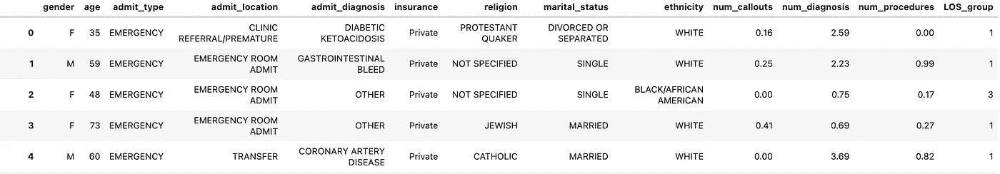
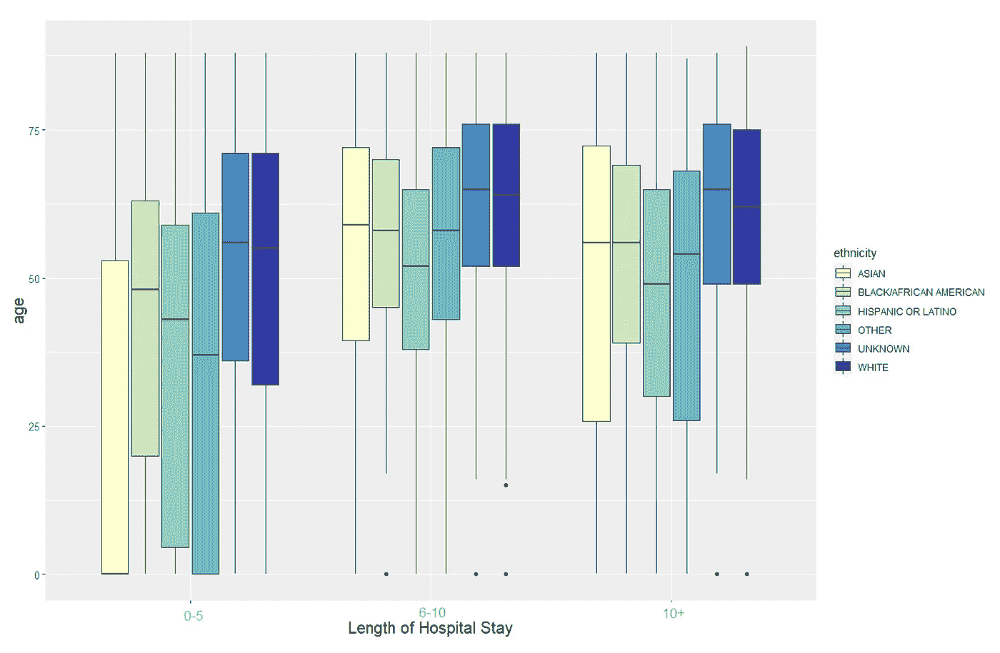
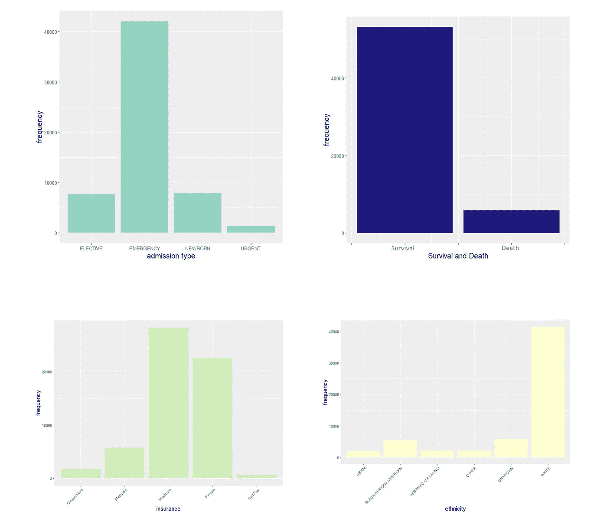
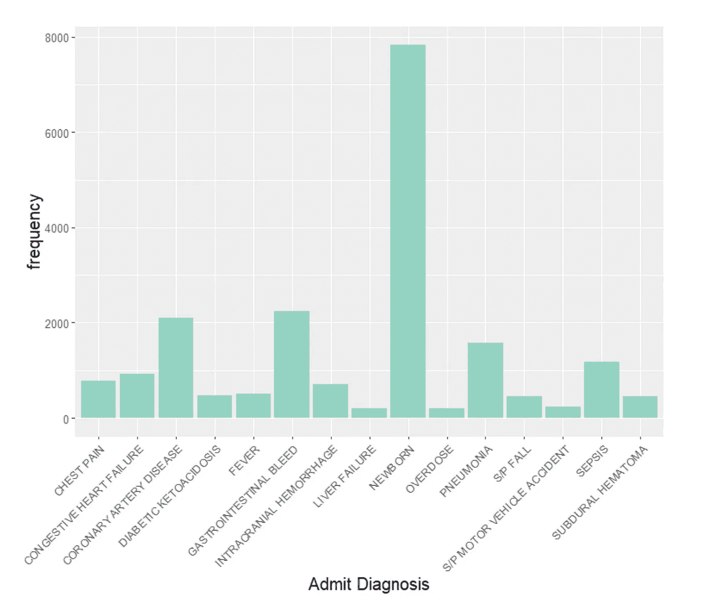
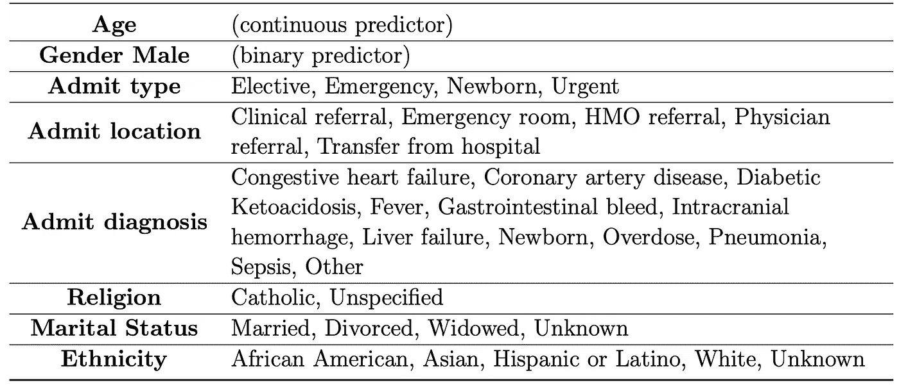
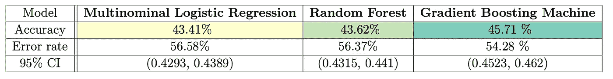
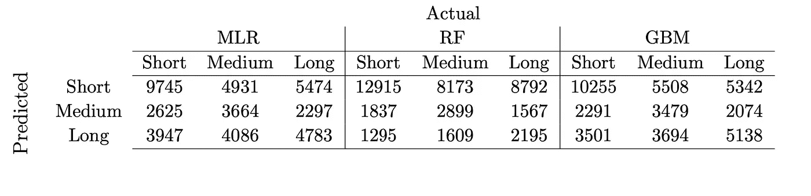
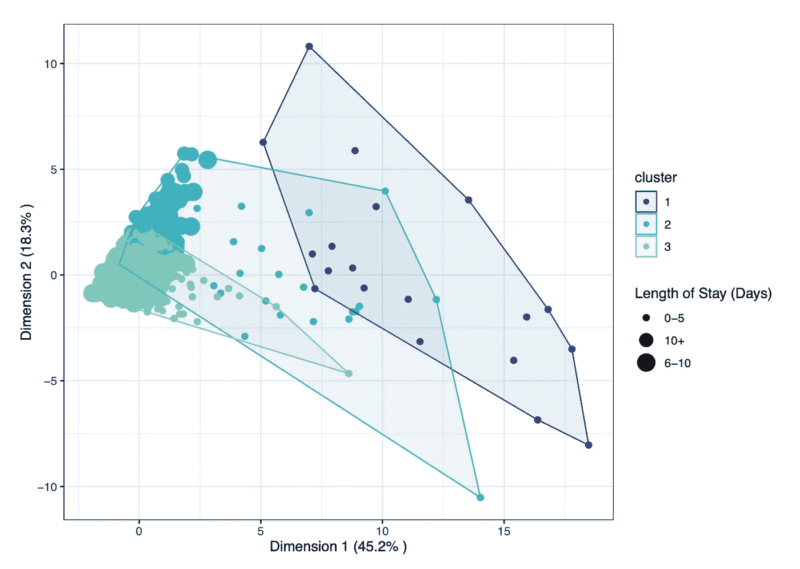
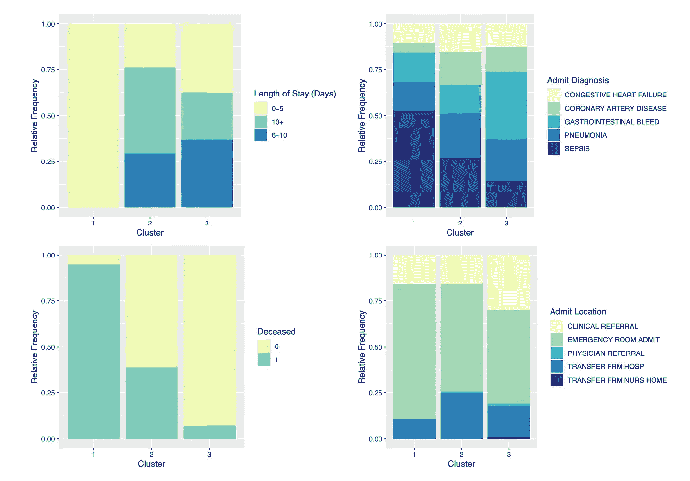

# 了解病人住院时间:在 R

> 原文：<https://towardsdatascience.com/understanding-patient-hospital-stays-a-classification-and-clustering-analysis-in-r-bba200c9323?source=collection_archive---------17----------------------->

## 机器学习方法在病人住院记录中的应用

合著者:[索菲·考特曼斯-马特尔](https://medium.com/u/cb27d9879fcd?source=post_page-----bba200c9323--------------------------------)

由[卡米洛·希门尼斯](https://unsplash.com/@camstejim?utm_source=medium&utm_medium=referral)在 [Unsplash](https://unsplash.com?utm_source=medium&utm_medium=referral) 上拍摄的照片

有效管理患者住院时间是现代医疗保健系统中最具挑战性也是最重要的任务之一。据目前估计，美国每年管理患者入院和住院的费用超过 3775 亿美元[1]，长期住院的风险使能力和患者资源有限的医院不堪重负。研究表明，更长时间的住院会增加医院获得性疾病和感染的可能性[2]，而缩短患者的住院时间(LOS)可以更有效地分配医院的资源消耗，并减少患者承担的社会和经济负担。

机器学习和数据挖掘技术已经越来越多地用于从医疗保健数据中获取洞察力，这可以帮助公共卫生机构和医院管理人力和财务资源。因此，能够将高级分析技术应用于患者医院记录具有重要价值，例如使用患者数据来预测住院时间，或者更好地了解不同患者群体对医院资源的利用情况。

# **目标**

[重症监护医疗信息集市(MIMIC)](https://mimic.physionet.org/gettingstarted/access/) 数据库是患者数据的来源之一，它提供了全面的患者住院记录流，这些记录在过去的描述性、预测性和假设驱动的研究中被证明是有用的。该数据库由麻省理工学院计算生理学实验室开发，包含位于马萨诸塞州波士顿的哈佛大学教学医院贝丝以色列女执事医疗中心约 60，000 名重症监护病房住院患者的匿名条目。

在此分析中，我们使用从 MIMIC 数据库中提取的数据构建了两个模型，以生成关于患者住院时间的预测性和探索性洞察。我们首先建立了一个机器学习分类模型，以预测患者住院时间的分类长度，给定患者入院时的可观察特征。然后，我们使用无监督学习技术，根据各种患者-护理人员互动的数量(如程序、输入和处方药物)对患者进行聚类，这可以量化患者在住院期间使用的人力或物力资源的数量。

> **通过结合这些模型，我们的目标是探索患者入院时的背景和状况的固有特征，以及与患者治疗过程和资源消耗相关的属性。这些指标可用于衡量和提高医疗服务提供的有效性，实现关键医疗资源的主动分配，并可能减少不必要的住院时间。**

# 内容

*   [**数据描述**](https://medium.com/p/bba200c9323#db16)
*   [**模型构建**](https://medium.com/p/bba200c9323#a2b5)
*   [**按住院时间对患者进行分类**](https://medium.com/p/bba200c9323#0854)
*   [**通过患者-看护者互动对患者进行聚类**](https://medium.com/p/bba200c9323#dd13)
*   [**局限性**](https://medium.com/p/bba200c9323#762e)
*   [**最终想法**](https://medium.com/p/bba200c9323#d811)

注意，模型是用 R 构建的，你可以在这里 参考完整代码 [**。**](https://github.com/duncan-wang/LOS-prediction)

# 数据描述

MIMIC III 数据库包含 2001 年 6 月至 2012 年 10 月期间记录的 50，000 多名成人患者和 8，000 名新生儿患者的住院记录。

出于分析的目的，我们利用了来自医师 Alexander Scarlat 博士编制的 MIMIC III 数据库的属性的[子集。该数据集包含关于患者人口统计、入院详情、患者状况的信息，以及关于各种患者-护理人员互动的平均每日次数的信息。此外，数据还包括患者住院的总时间以及患者是否在住院期间去世。](https://www.kaggle.com/drscarlat/mimic3d)

以下是属性的子集:

## **查看数据**

即使从 MIMIC III 数据库提取的预先准备的数据集相对干净，我们仍然发现有必要执行进一步的预处理以促进分析。同一类别的类变量(如“GI”与“胃肠”)被重新分组到同一个类中，几个高基数分类变量被重新分类以减少类的数量。我们感兴趣的关键变量——患者住院时间(LOS) —范围为 0-294 天。为了对分类任务的目标进行分类，我们将 LOS 重新分组为三类，每类中的观察值数量相当:

*   短期停留:0-5 天
*   中等停留时间:6-10 天
*   长期停留:超过 10 天

通过观察患者的各种属性，我们在下文中看到，老年患者更经常经历中等至长期住院，而年轻患者的住院时间最短。虽然患者之间存在相当大的差异，但与所有其他种族相比，白人患者总体上似乎更老。

不同种族患者按年龄划分的住院时间(LOS)。作者提供的数字。

我们还发现，大多数患者都被医疗保险或私人保险覆盖，而且大多数患者是白人。最常见的入院诊断是分娩，这可能是急诊入院人数多但死亡率低的原因。

各种患者特征的分布。作者提供的数字。

按入院诊断划分的患者入院频率。作者提供的数字。

# 模型结构

## 分类模型

在数据准备之后，我们的第一项任务是预测患者的住院时间——短期(0-5 天)、中期(6-10 天)或长期(10 天以上)。

**功能选择**

在排除无效预测因素(即只有在患者入院后才能观察到的变量)后，除了年龄，我们只剩下分类变量。为了进行特征选择，我们进行了卡方独立性检验，这是一种假设检验，用于确定两个分类变量之间存在显著关系。然后，对于被确定为与 LOS 显著相关的特征，我们使用 Bonferroni 调整后的事后检验进行成对比较，并确定每个显著预测因子的哪些特定类别与 LOS 显著相关。这给我们留下了以下变量，它们在分类前被虚拟化:

在排除无效预测因素(即只有在患者入院后才能观察到的变量)后，除了年龄，我们只剩下分类变量。为了进行特征选择，我们进行了卡方独立性检验，这是一种假设检验，用于确定两个分类变量之间存在显著关系。然后，对于被确定为与 LOS 显著相关的特征，我们使用 Bonferroni 调整后的事后检验进行成对比较，并确定每个显著预测因子的哪些特定类别与 LOS 显著相关。这给我们留下了以下变量，它们在分类前被虚拟化:

为分类选择的要素和类的列表。

**模特培训**

为了预测患者的住院时间，我们决定探索以下 3 种不同的分类模型，并比较它们的相对性能:

*   多项式逻辑回归
*   随机森林
*   梯度推进机

简而言之，我们测试的模型通过计算患者记录属于每个 LOS 类别(短/中/长)的概率来生成 LOS 预测，并根据最高预测概率为患者分配一个 LOS 类别。

MLR 通过使用最大似然估计来定义似然函数，以计算在假设的概率分布下观察给定结果的条件概率。然后，它“搜索”实现该函数最大似然性的函数的最佳系数。另一方面，RF 和 GBM 是集成学习方法，它们构造多个决策树并输出对应于每个单独树的平均预测的 LOS 类。RF 和 GBM 之间的关键区别在于，RF 并行构建几个完整的树，从而产生个体偏差(误差)较低但树之间的预测方差可能较高的完全生长的树，而 GBM 顺序生长几个小树。由 GBM 产生的这些小树中的每一个都具有高偏差，但是从先前的树中学习并校正由先前的树产生的错误，因此减少了预测之间的总体方差。

## **K 均值聚类模型**

为了完成分类任务，我们还决定探索无监督的方法，通过各种患者-护理人员互动的平均每日次数对患者进行聚类，作为对患者住院期间利用的人力或物力资源量的测量。为了简化流程，我们将 1349 例“急诊”住院患者作为优先考虑的对象，这些患者属于以下五种最常见的住院诊断:胃肠道出血、冠状动脉疾病、肺炎、败血症和充血性心力衰竭。

随后，我们选择了八个定量变量来对患者进行分组，这些变量以平均每日规模进行测量:

K-均值聚类模型的特征选择。

由于每个变量的范围不同，在应用 K-Means 聚类方法之前，我们首先使用最小-最大归一化来缩放变量。在将每个患者分配到一个聚类之后，将主成分分析应用于数据集以执行降维，从而通过前两个主成分可视化聚类。

# 根据住院时间长短对患者进行分类

从我们的分类模型中，我们可以看到梯度推进机器略微优于其他两个测试模型。由于 GBM 使用集成方法来连续生成分类树，每棵树都使用从以前的树中获得的知识来提高聚合性能，因此它通常比简单的逻辑回归或随机森林执行得更好。但是，我们在这里仍然看到，模型的整体性能较差；事实上，我们无法获得比随机猜测高得多的准确度。

用于预测患者住院时间(LOS)的模型的准确性。

这些结果表明，仅根据患者特征、诊断和入院情况，很难预测住院时间的长短。这并不奇怪，因为住院时间的长短可能是由患者的许多外源性因素决定的，如医生的可用性、专业设备和管理患者病例的有效性，或者对初始疾病的治疗是否会导致发现需要治疗的其他疾病。

我们还生成了混淆矩阵来进一步分解我们的结果，并检查模型的精确度和召回率。

作为快速复习:回忆是分类器完整性的度量；模型在该类别的所有真实现有观察值中正确识别短期、中期或长期停留的能力，同时 Precision 计算每个服务水平类别中正确识别的观察值数量与预测为短期、中期或长期停留的观察值总数的比率。

MLR、RF 和 GBM 模型的混淆矩阵比较。

混淆矩阵显示，所有模型在识别短期停留方面表现最佳。然而，这可能是由于模型倾向于压倒性地预测任何其他类别的短期停留，因为模型不太可能在中期和长期停留发生时识别它们。在这种模式下，医院很可能会低估患者的住院时间，这可能会导致床位、工作人员和资源准备不足，无法满足实际的能力需求。考虑到医疗资源分配中误导信息的高后果风险，我们可以推断，医院没有足够的信息来仅根据患者的入院特征做出任何与 LOS 相关的决定。

# **通过患者-看护者互动对患者进行聚类**

接下来，让我们看看聚类模型的结果。对于三个聚类，我们发现总的方差和(计算为聚类之间相对于总方差的方差)为 64.5%，代表了可以由三个聚类解释的患者的总方差。前两个主成分的聚类图显示，聚类 3 代表了绝大多数患者，他们经历了相对较低的患者-护理者交互的平均每日次数，并且具有相对较低的变化程度。被分配到组 2 的患者在患者-护理者相互作用中表现出更高的变化，而组 1 代表在患者-护理者相互作用中具有最高总体数量和变化的患者。

前两个主成分绘制的患者-护理者相互作用的 K 均值聚类结果。作者提供的数字。

现在，让我们通过查看每个聚类中患者特征的相对频率来细分每个聚类，在这里，我们看到**聚类 1** 中的患者最有可能被诊断为败血症，住院时间最短，死亡频率最高。这一观察结果是合理的，因为脓毒症被归类为一种医学急症，它可以迅速发展为脓毒性休克，引发组织损伤、器官衰竭，并且常常是致命的[3]。虽然我们不能假设因果关系，但有可能该集群中患者-护理者相互作用的高度变化是由高致死率条件的优势驱动的，即患者要么在治疗前死亡，要么在治疗中死亡。

通过患者-看护者互动聚集的患者特征的相对频率。作者提供的数字。

我们发现**集群 2 和集群 3** 中的大多数患者的患者-护理人员互动次数更少，变化更小，住院时间更长。与聚类 1 相比，可能的情况是，相互作用的数量在入院后最初可能很高，但一旦患者稳定下来，最终会趋于平稳。这些组中的患者也不太可能死亡，更有可能被诊断出患有胃肠出血、冠状动脉疾病和充血性心力衰竭等疾病。这些情况有不同的严重程度，但不太可能立即危及生命。

总的来说，我们能够确定一些与患者-护理者互动次数相关的关键特征，这些特征主要涉及患者的状况，而不是他们的人口统计学特征。聚类的分布表明，很少有患者可能平均每天需要更多的资源，但是大多数患者利用了类似数量的资源。然而，聚类中的重叠仍然表明，患者-护理人员的相互作用可能会受到本分析范围之外的因素的影响，如患者病史和病情严重程度，并且在个案基础上有很大差异。

# **限制**

## **模型解释和患者成本量化**

将预测分析应用于医疗保健环境可能非常具有挑战性，因为患者结果的建模必须考虑模型的可推广性以及治疗成本和结果的显著差异，即使在相似的患者群体中也是如此。患者入院时的病情需要不同的治疗程序，并进入不同的单位，具有不同的能力和资源。由于目前的数据也是在 11 年期间收集的，医院项目、单位和部门的重组也可能随着时间的推移而发生。因此，为了量化患者 LOS 的成本，按照诊断、入院地点以及时间段对患者进行分类可能是有用的。

虽然我们试图通过患者-护理人员的互动对患者进行分组，以衡量患者的资源消耗，但同样重要的是要记住，像获取患者生命体征这样的互动比进行外科手术的成本低得多，因此很难仅根据这些结果来量化每个患者组的成本。

## **样本偏差**

重要的是要认识到，用于分析的数据只包括一家医院的入院人数。这些患者也主要是白人，由私人保险或医疗保险(65 岁及以上患者的联邦健康保险)覆盖，平均年龄为 59 岁。有趣的是，我们发现 70%的患者被归类为急诊室入院，超过 10%的入院患者最终死亡，相比之下，美国平均每 1，000 名急诊室入院患者中有 0.77-1.48 人死亡[4]。由于 MIMIC III 数据集的患者资料不是美国患者人口构成的代表性样本，因此需要注意不要将结果外推至更广泛的美国人群。

## **功能有效性**

我们的分类模型的主要限制之一是缺乏全面和定量的措施。事实上，我们只能使用六个分类预测因子(入院类型、地点和诊断、宗教、婚姻状况、种族)、一个二元预测因子(性别)和一个连续预测因子(年龄)。纳入入院时记录的其他关键指标，如体重指数(身体质量指数)、心率、体温、神经反射，以及疼痛程度和既往医疗状况等一般指标，可能会提高分类模型的预测能力。

# **最终想法**

这项分析的中心目标之一是使用机器学习模型来更好地了解患者住院和随后住院时间(LOS)的潜在模式。虽然模型的结果表明，仅根据入院特征预测患者的 LOS 可能是困难的，但我们能够通过患者-护理者的互动对患者进行聚类，以根据医院资源利用情况成功识别三组患者，并了解与此相关的特征、诊断和死亡率模式。

医疗保健分析在促进医疗保健资源管理、预后和诊断分析，甚至疾病和残疾的早期检测方面显示出巨大的潜力。然而，为了将预测模型用于此类任务，数据收集、算法调整和模型解释必须以最终促进它们所服务的个人、社区和人群的利益的方式进行。这些模型可能有很大的好处，但当人类的生命处于危险之中时，必须小心处理。

## 项目代码:

github:【https://github.com/duncan-wang/LOS-prediction 

## 参考资料:

[1] Health Catalyst (2016)，“[以患者为中心的 los 减少计划改善了结果，节省了成本](https://www.healthcatalyst.com/success_stories/reducing-length-of-stay-in-hospital)”。

[2] Hassan M .，David K. (2006)，"[住院时间和获得感染的概率](https://www.researchgate.net/publication/235314589_Hospital_Length_of_Stay_and_Probability_of_Acquiring_Infection)，"*国际医药和保健营销杂志*，第 4 卷，第 4 期，第 324-338 页。

[3]美国卫生与疾病中心(CDC) (2020)，[什么是脓毒症？](https://www.cdc.gov/sepsis/what-is-sepsis.html#:~:text=Sepsis%20is%20the%20body's%20extreme,%2C%20organ%20failure%2C%20and%20death.)”。

[4] Shmerling，R. (2018)，“[人死在哪里](https://www.health.harvard.edu/blog/where-people-die-2018103115278)”*哈佛健康博客。*

## MIMIC III 数据库:

MIMIC-III，一个免费的重症监护数据库。Johnson AEW，Pollard TJ，Shen L，Lehman LH，Feng M，Ghassemi M，Moody B，Szolovits P，LA 和 Mark RG。科学数据(2016)。DOI: 10.1038/sdata.2016.35。可在:【http://www.nature.com/articles/sdata201635[获得](http://www.nature.com/articles/sdata201635)

如果您想分享任何想法，请随时在 LinkedIn 上联系我们。

<https://www.linkedin.com/in/duncan-w/>  <https://www.linkedin.com/in/sophie-courtemanche-martel/?originalSubdomain=ca> 