# 了解 PCA

> 原文：<https://towardsdatascience.com/understanding-pca-90f7b1961fa4?source=collection_archive---------14----------------------->

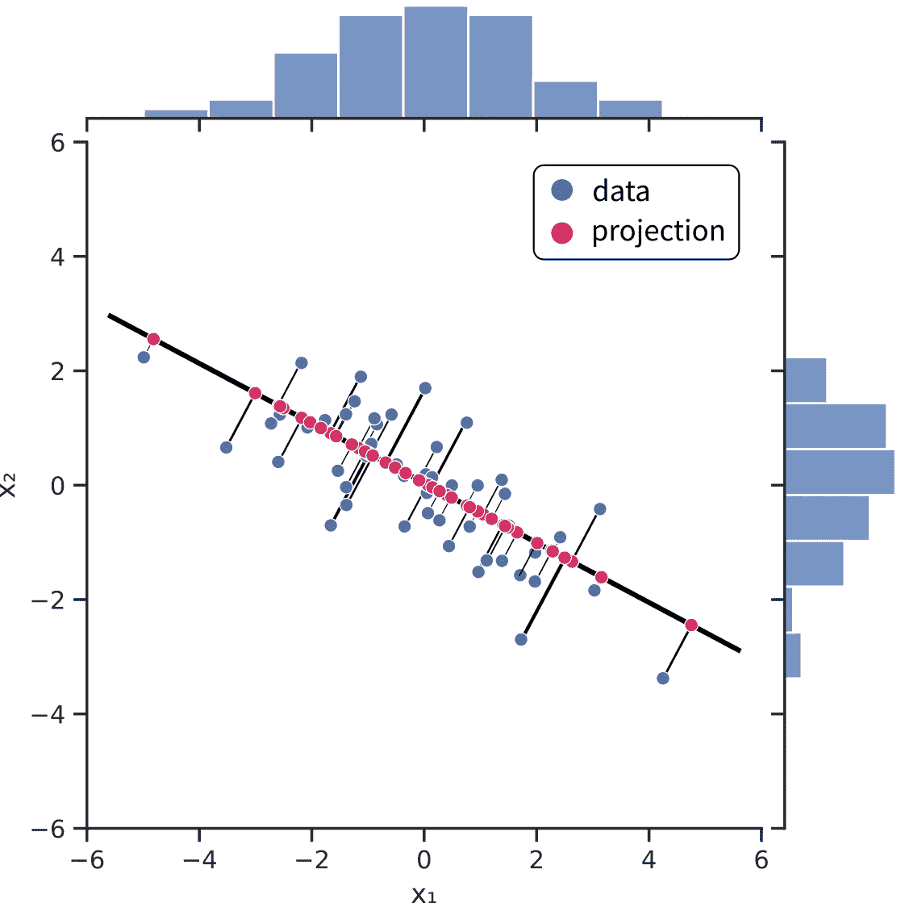

插图:寻找主成分。所有图片均由作者提供。

## 主成分分析的深入解释

用眼睛看数据的能力是机器学习中最不受重视的事情之一。在进行任何机器学习之前，可视化数据可以揭示许多模式。探索它们可以在以后获得巨大的回报，因为我们可以获得关于使用什么算法、忽略什么特性等的良好直觉。

然而，有一个大问题:人类无法看到大于三维的空间。因此，对于现实生活中的数据集，我们必须执行某些技巧，以受益于可视化可以提供的洞察力。

主成分分析(PCA)是实现这一目的的最基本和最有用的方法之一。主成分分析将数据线性转换到一个空间，突出每个新特征的重要性，从而使我们能够修剪那些没有揭示太多的特征。

首先，我们将对 PCA 有一个直观的了解，然后我们进行更详细的数学处理。

# PCA 背后的主要思想

为了更好地理解 PCA 的作用，我们将看看它在一个简单数据集上的表现。

假设我们的数据存储在矩阵中

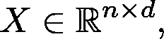

其中 *n* 代表特征， *d* 代表样本数。为了简单起见，我们假设 *n = 2* ，这样我们就可以想象正在发生什么。然而，所有这些都适用于一般情况。

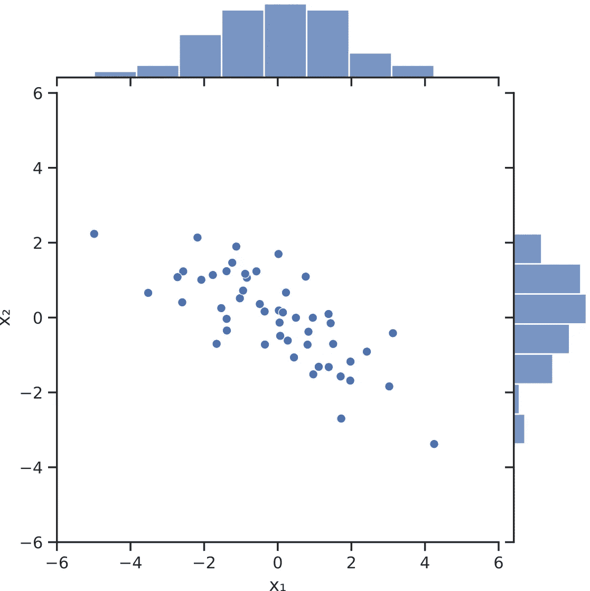

简单的数据集。

我们可以立即观察到的是，x₁的特征*和 x₂的特征*可能不是我们数据的最佳描述符。这种分布似乎在两个变量之间延伸，尽管形状表明数据可以从特定的角度简化。这些特征似乎是相互关联的:如果 x₁小，那么 x₂大。如果 x₁*大，x₂*小。这意味着变量包含冗余信息。当我们有数百个特性时，冗余是次优的。如果我们能够将数据重塑为变量不相关并根据重要性排序的形式，我们就能够丢弃那些不太有表现力的变量。**

我们可以用线性代数的语言来描述这个过程。为了使数据去相关，我们希望*对角化*X 的协方差矩阵。因为经验协方差矩阵

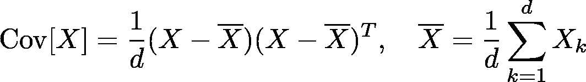

是对称的，[频谱分解定理](https://en.wikipedia.org/wiki/Eigendecomposition_of_a_matrix#Real_symmetric_matrices)保证作为正交矩阵 *U* 使得

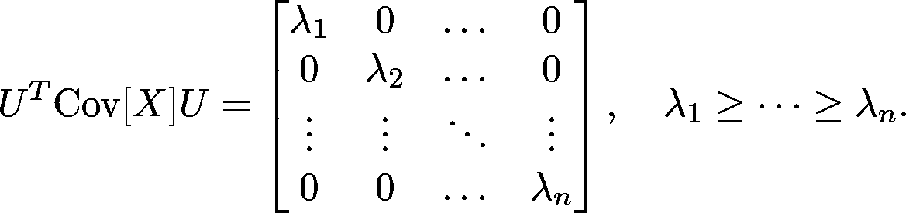

(注意，在不失一般性的情况下，我们可以假设对角线中的元素是递减的。)

所以，我们有

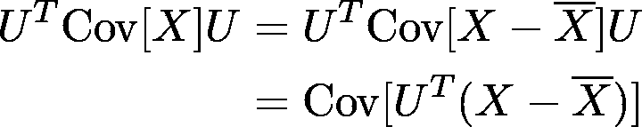

如果我们定义变换

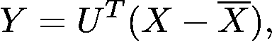

*Y* 表示具有不相关特征的数据视图。这就是*主成分分析*的精髓。 *Y* 的每个特征都是 *X* 特征的线性组合。 *Y* 称为 *X* 的*主成分向量*，而其特征称为*主成分*。

应用到我们的简单数据集，这是结果。

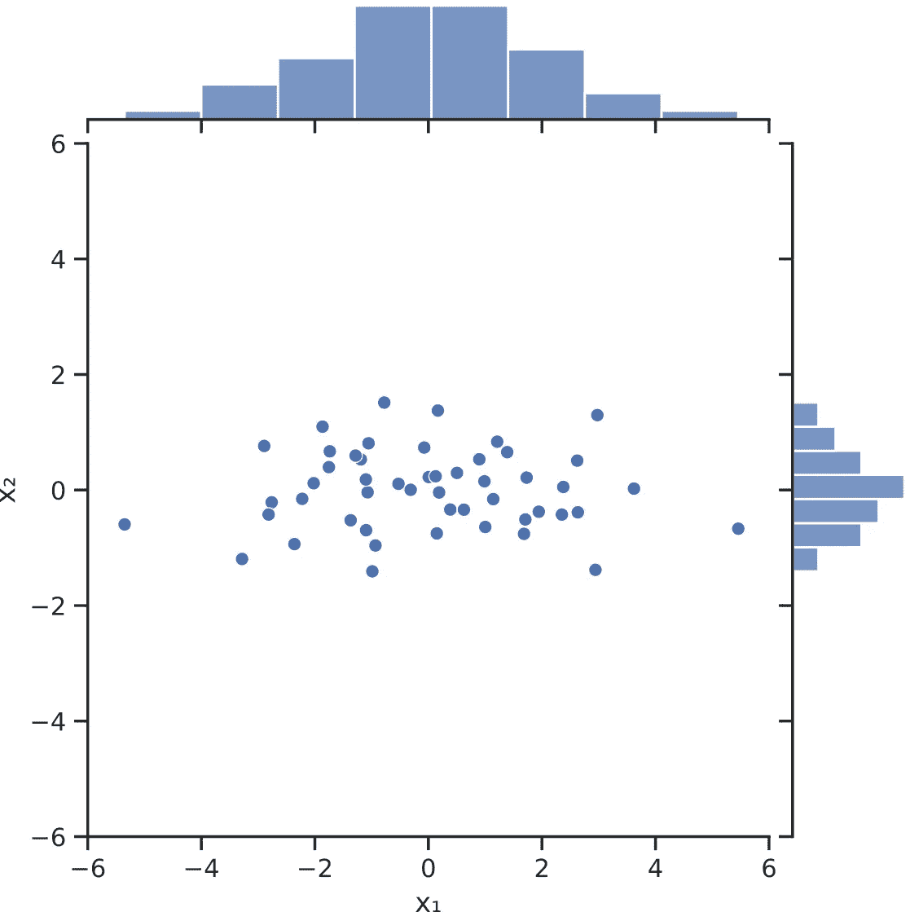

简单玩具数据集的 PCA 变换。

# 主成分使方差最大化

除了不相关的性质 *Y* 之外，还有一点使其特征独一无二:每个主成分在投影到数据上时都使数据的方差最大化。


寻找一个方向，使投射到它上面的数据的方差最大化。

PCA 可以被认为是寻找投影数据的方差最大的方向的迭代过程。

一般来说，第 *k* 个主分量可以通过寻找与第一个 *k-1 个*主分量正交的单位向量，并使投影到其上的数据的方差最大化来获得。

# 主成分分析降维

既然我们已经了解了 PCA 是如何工作的，我们应该研究它在真实数据集上是如何工作的。除了消除特征中的冗余，它还可以用来修剪那些没有传达很多信息的特征。回想一下，协方差矩阵


是对角线，特征的方差按降序排列:

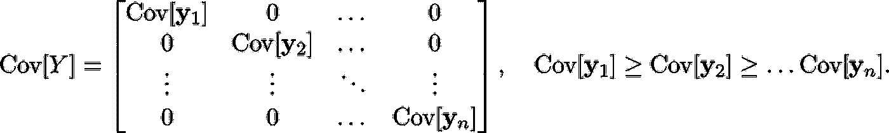

*解释了方差*对**的比值定义**

**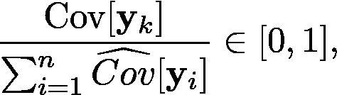**

**可以认为是数据中“所有方差”的百分比。因为方差在减小，所以最有意义的特征出现在最前面。这意味着如果累计解释方差**

**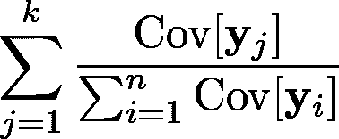**

**对于一些 *k* 来说足够大，比如说在 *95%* 左右，在 *k* 之后的主分量可以被丢弃，而没有显著的信息损失。**

**为了了解它在真实数据上的表现，我们将看看 PCA 在著名的 [Iris 数据集](https://scikit-learn.org/stable/auto_examples/datasets/plot_iris_dataset.html)上的表现！该数据集由来自三种不同种类鸢尾的四个特征(萼片长度、萼片宽度、花瓣长度、花瓣宽度)组成。这是数据集的外观。**

**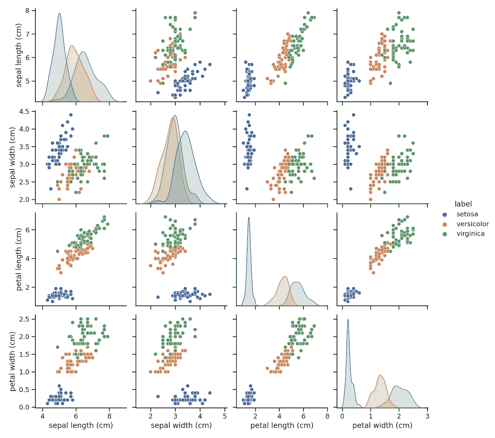**

**虹膜数据集。**

**通过检查，我们可以看到一些特性的组合很好地分离了数据，一些则没有。他们的顺序绝对不意味着他们的重要性。通过计算协方差矩阵，我们还可以注意到它们似乎是相关的:**

```
**[[ 0.68112222 -0.04215111 1.26582 0.51282889]
 [-0.04215111 0.18871289 -0.32745867 -0.12082844]
 [ 1.26582 -0.32745867 3.09550267 1.286972 ]
 [ 0.51282889 -0.12082844 1.286972 0.57713289]]**
```

**让我们应用 PCA 来看看它对我们的数据集做了什么！**

**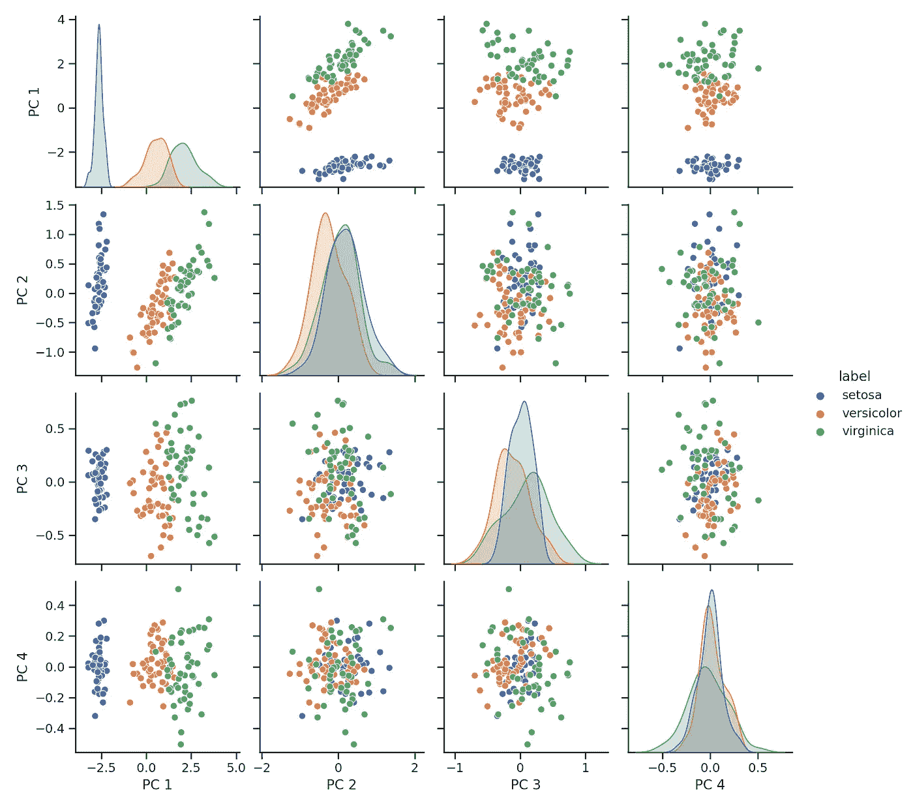**

**虹膜数据集的 PCA 变换。**

**前两个主成分几乎完全描述了数据集，而第三个和第四个主成分可以省略而不会明显丢失信息。协方差矩阵看起来也更好。它本质上是对角的，所以特征彼此不相关。**

```
**[[ 1.57502004e+02 -3.33667355e-15 2.52281147e-15 5.42949940e-16]
 [-3.33667355e-15 9.03948536e+00 1.46458764e-15 1.37986097e-16]
 [ 2.52281147e-15 1.46458764e-15 2.91330388e+00 1.97218052e-17]
 [ 5.42949940e-16 1.37986097e-16 1.97218052e-17 8.87857213e-01]]**
```

# **PCA 不做的是**

**尽管 PCA 经常用于特征工程，但它的功能是有限的。例如，如果数据集被拉伸得很薄，并且它们之间的分隔边距很小(如下例所示)，则 PCA 不会提供类之间差异较大的表示。**

**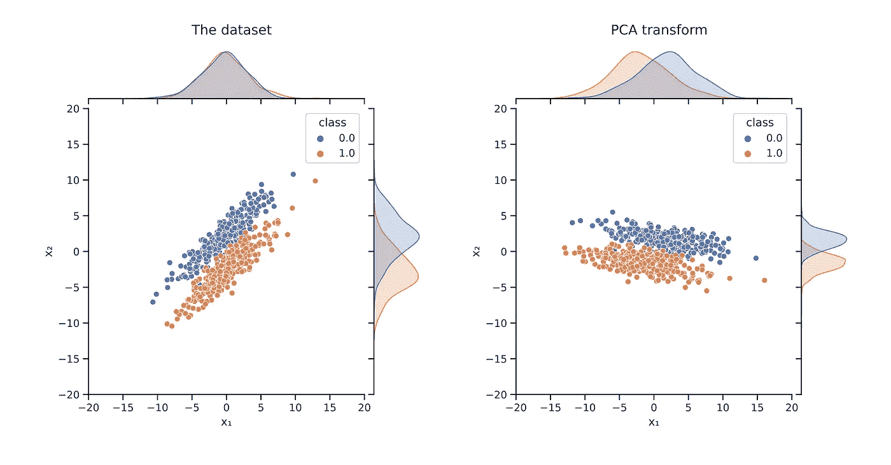**

**原因是正交变换给出主分量向量，并且正交变换保持距离。因此，这不会沿任何特征拉伸空间。这是优点，同时也是缺点。在二维空间中，正交变换只是旋转和反射的组合。**

**[***如果你喜欢把机器学习概念拆开，理解是什么让它们运转，我们有很多共同点。看看我的博客，我经常在那里发表这样的技术文章！***](https://www.tivadardanka.com/blog)**

**[](http://twitter.com/TivadarDanka)**