# 理解自动驾驶的感知和运动规划(2021)

> 原文：<https://towardsdatascience.com/understanding-perception-and-motion-planning-for-autonomous-driving-2021-e9241e067db7?source=collection_archive---------21----------------------->

## 深入研究当前的 SOTA 方法，共同预测汽车周围的环境及其行为

自动驾驶是移动的未来。图片由 [@ed259](https://unsplash.com/@ed259) 提供。

# 解释广告最新趋势的三篇论文

尊敬的 CVPR 2021 会议自动驾驶研讨会(WAD)，**我想与您分享三种最先进的自动驾驶感知和运动规划方法**。我选择了最近在当前基准中取得突出成绩的论文，其作者被选为 CVPR 2021 的主题演讲人。

为了更广泛地探索这个主题，这三篇论文涵盖了不同的方法: **Wayve** (英国初创公司)论文使用相机图像作为监督学习的输入，**丰田高级发展研究所(TRI-AD)** 使用非监督学习， **Waabi** (多伦多初创公司)使用激光雷达和高清地图作为输入的监督方法。

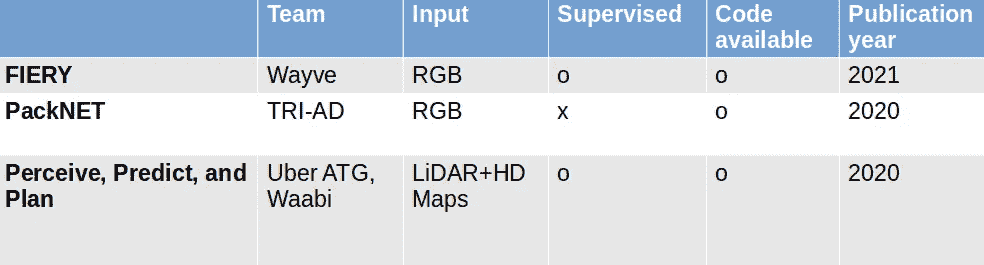

本文中介绍的论文的比较。图片由作者提供。

*   "**:来自周围单目摄像机的鸟瞰图中的未来实例预测。*"，安东尼·胡、扎克·穆雷兹、尼基尔·莫汉、索菲娅·杜达斯、杰弗里·霍克、‪vijay·巴德里纳拉亚南、罗伯托·奇波拉和亚历克斯·肯德尔，2021。[1]*
*   ****打包*** *:用于自监督单目深度估计的 3D 打包。*(CVPR 2020 口述)、熊伟·吉齐利尼、拉雷斯·安布鲁斯、苏迪普·皮莱、艾伦·拉文托斯和阿德里安·盖登。[2]*
*   ****感知、预测、规划*** *:通过可解释的语义表示进行安全运动规划*。ECCV (2020 年)。萨达特、卡萨斯、、任、吴、普拉纳布·达万和乌尔塔松。[3]*

## ***为什么感知和动作规划在一起:***

*自主车辆(AVs)感知的目标是从多个传感器中提取语义表示，并将结果表示融合到 ego-car 的单个“鸟瞰图”(BEV)坐标框架中，用于下一个下游任务:运动规划。*

*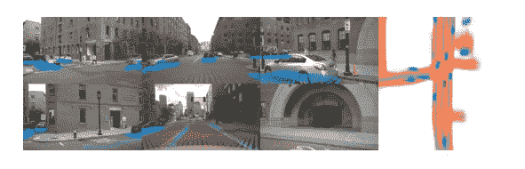*

*从六个摄像机(左图)转换到一个 ego-car 鸟瞰图(右图)的示例。我们可以看到汽车用蓝色标记，它们的运动由模型预测，用线表示。图片来自 NVIDIA paper Lift，Splat，Shoot [4]。*

*在最近的论文中，语义预测和鸟瞰图(BEV)是联合计算的(感知)。然后，时间状态能够联合预测周围代理的行为和本车运动(运动规划)。*

## **端到端才是王道**

*近年来，端到端多任务网络的表现优于顺序训练网络。目前，输入只是原始传感器测量值，输出是方向盘命令。为了避免“黑箱”效应，为了优化目的(每个块可能有其中间损失函数)和结果的可解释性(特别是当结果不好时)，有必要创建中间块。因此，我们可以在中间层块之间访问可解释的中间表示，如语义图、深度图、周围代理的概率行为(见下图)。*

*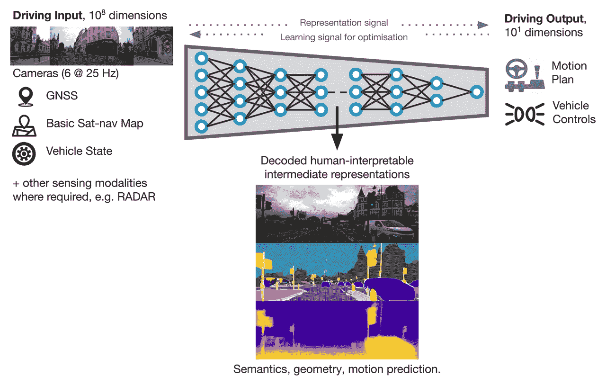*

*学习使用端到端 DL 和 CV 驾驶。图片来自亚历克斯·肯德尔(Wayve) CVPR 主题演讲[5]*

*这篇文章深入探讨了 AD 当前分裂的两个主要部分:*

*   ***第一部分:仅使用摄像机作为输入的模型:** ▹监督// ▹无监督*
*   ***第二部分:使用激光雷达(laser)和高清地图作为输入的模型** ▹监督**。***

# *第 1)节仅使用摄像机*

*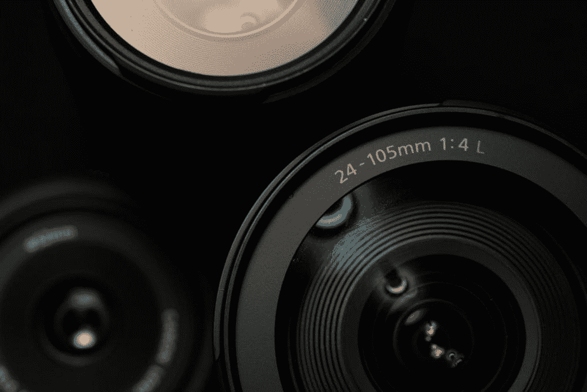*

*仅限摄像头。图片来自 [@jstepphoto](https://unsplash.com/@jstepphoto) 。*

## *监督*

*我们将乘坐一辆最新型号(CVPR 2021)" T8 " FIERY"[1]，由一家名为 **Wayve** (Alex Kendall CEO)的初创公司的研发人员制造。他们的目标是从单目相机中学习 3D 几何和时间推理的表示。*

*对于 AV 上只有单目摄像机的团队来说，第一个挑战是学习深度。这是创建鸟瞰图参考框架的重要步骤，在该参考框架中可以识别实例并规划运动。由于每个摄像机最初在其自己的参考坐标中输出其自己的推断，因此该任务更加困难。*

*该过程的一个重要步骤是从 2D 图像生成 3D 图像，因此我将首先解释将 2D 图像从相机装备“提升”到所有相机共享的世界的 3D 表示的最新方法。NVIDIA CVPR 2020 年发表的论文“ *Lift，Splat，Shoot:通过隐式取消投影到 3D 来编码来自任意相机装备的图像*”[4]中的这种方法也用于 FIERY。*

1.  ***使用“提升-拍打-拍摄”将 2D 编码为 3D***

*此处提供纸张和代码[。](https://nv-tlabs.github.io/lift-splat-shoot/)*

*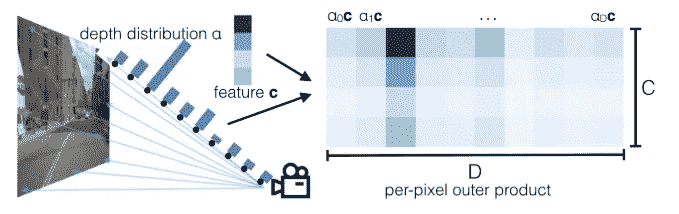*

*在 2D 图像上创建第三个维度。这张图片展示了“抬起、拍打、拍摄”纸张的“抬起”步骤[4]。*

***1。提升**:将本地 2D 坐标系转换为所有摄像机共享的 3D 坐标系。它们为每个像素生成所有可能(离散化)深度的表示。深度概率充当自我注意权重。*

*该模型通过将来自 2D 图像的每个像素与离散深度 d 的列表相关联来人工创建大的点云。对于具有(r，g，b，a)值的每个像素 p，网络预测上下文向量*c*和**深度分布*a*。上下文向量 c 然后乘以来自分布 d 的每个权重 a。作为矩阵的结果是 a 和 c 的外积。该操作使得能够对特定深度给予更多关注。如果深度分布 *a* 全为 0，但一个元素为 1，则该网络充当伪激光雷达。每个图像的点云张量馈入在图像网上预先训练的有效网骨干网。EfficientNet 模型将输出上述由要提升的特征 *c* 和一组离散深度概率 *a* 构成的外积。***

***2。Splat** :外部和内部相机参数用于将 3D 表示法 Splat 到鸟瞰视图平面上。*

*他们使用最初用于激光雷达点云中物体检测的点柱技术。Pointpillar 将点云转换为伪图像，以便能够应用 2D 卷积架构。*

*点云被离散化为 x-y 平面中的网格，这创建了一组柱子 p。云中的每个点被转换为 D 维(D=9)向量，其中我们添加( **Xc，Yc，Zc** )到柱子中所有点的算术平均值的距离和(Xp，Yp)从 x-y 坐标系中的柱子中心到原始点(x，y，z，反射率)的距离。从这个稀疏的支柱网格，他们创建了一个大小为(D，P，N)的密集张量，其中 P 是非空支柱的数量(可能用 0 填充)，N 是每个支柱的点数(如果一个支柱中有太多的点，则可能进行采样)。这个稠密张量馈入一个点网网络以生成一个(C，P，N)张量，随后是一个 max 运算以创建一个(C，P)张量。最后，我们使用 P 将特征散射回原始的柱子位置，以创建大小为(C，H，W)的伪图像。*

*在“提升，拍打，射击”中，作者在 D 轴上使用总和池而不是最大池来创建 C x H x W 张量。他们将这个张量输入由 ResNet 块组成的第二个主干网络，将点云转换为鸟瞰图像。*

*3.**拍摄**:他们为 BEV 中的每个实例“拍摄”不同的轨迹，计算它们的代价和代价最小的轨迹。*

*对于轨迹规划，让我们看看“*火热的*”而不是 NVIDIA 论文的拍摄部分。*

***2。用于运动规划的 FIERY:***

*代码可用[此处](https://github.com/wayveai/fiery)。*

*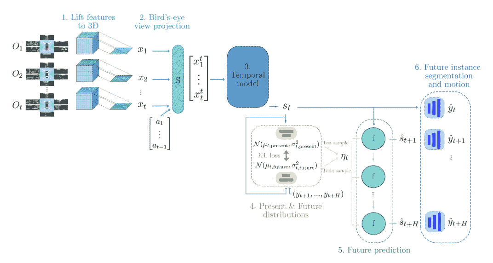*

*FIERY 的整体架构分六步走。图片来自原纸[1]。*

***学习时间表征:***

*让我们考虑我们已经获得了连续帧中的 BEV 特征 *X=(x_1，..，x_t)* 从上面*呈现的**Lift-Splat-Shoot*的提升步骤。*作者用空间变换模块 s 将 x 中所有这些过去的特征 *x_i* 扭曲到当前参考系 t，例如 *x_i^t =S(x_i，a_{t-1} a_{t-2}..a_i)，*使用a_i 时的平移/旋转矩阵 I**

*然后，这些特征被串联起来 *(x_1^t，…，x_t^t)* 并馈入 3D 卷积网络，以创建时空状态 *s_t* 。*

*他们用这个状态 s_t 来参数化两个概率分布:**现在的 P 和未来的分布 F** 。当前分布以当前状态 *s_t，*为条件，未来分布以当前状态 *s_t* 以及观察到的未来标记 *(y_{t+1}，…，y_{t+H})* 为条件，其中 H 为未来预测范围。*

*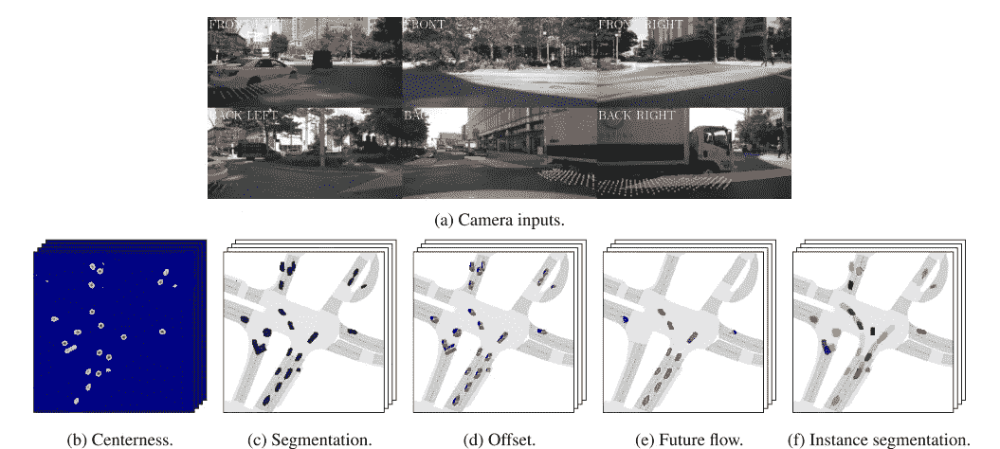*

*FIERY 型号的输入(a)和标签(b-f)。图片来自论文[1]。*

*我们可以想象上图中不同的标签。标签包含实例的未来中心度(=在该位置找到实例中心的概率)(b)、偏移量(=指向用于创建分段图的实例中心的向量(c)) (d)以及该实例的流量(=位移矢量场)(e)。*

*最终的聚合实例分段图如(f)所示。*

*这两种概率分布是对角高斯分布。因为来自当前分布的任何样本都应该编码可能的未来状态，所以当前分布被推动以覆盖具有 KL 散度损失的观察到的未来。*

*未来分布 F 是卷积门控递归单元网络，其将当前状态 *s_t* 和来自 F 的样本(在训练期间)或来自 P 的样本(在推断期间)作为输入，并且递归地生成未来状态。*

*通过 top-k 交叉熵来评估语义分割(仅 top-k 是因为大多数像素属于背景而没有任何相关信息)。*

***指标:***

*他们用未来视频全景质量评估他们的模型，用于评估**分割实例度量的一致性和准确性**，以及用于评估**模型预测多模态未来的能力**的广义能量距离。*

*它们在语义分割任务中优于其他最先进的方法(包括 Lift-Splat ),并且在未来实例预测中也优于基线模型。*

***结论**:*

*这一切都是为了摄像机系统的一种最先进的监控方法。要记住的关键是感知和计划是一起完成的，主要依赖于时间状态和多模态。*

## *无人监督的*

*代码可用[此处](https://github.com/TRI-ML/packnet-sfm)。*

*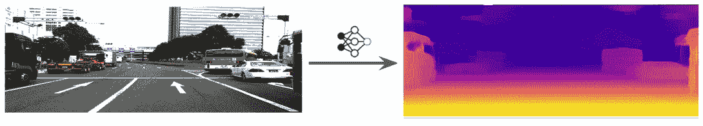*

*单幅 RGB 图像的深度估计。图片来自 TRI-AD 博客[7]*

*来自 TRI-AD 的 Adrien Gaidon 认为**监督学习不会扩展、推广和持续**。这就是为什么他在寻找一种高效的规模化监管方式…而不用贴标签！他们找到了方法:他们使用**自我监督**。*

*在没有任何监督标签的情况下，他的 TRI-AD 人工智能团队可以从单目图像中重建 3D 点云。*

*怎么可能呢？他们使用**射影几何的先验知识**通过他们的新模型 **PackNet** 产生期望的输出。他们取得了非常好的结果，他们的自我监督模型优于监督模型。*

*自我监督训练不需要任何深度数据。而是训练它合成深度作为中间体。*

*他们的方法解决了由于输入图像在通过传统的 conv 网(由于汇集)后分辨率损失而存在的瓶颈。因此，他们将卷积网络架构应用于深度估计任务。由于张量操作和 3D 卷积，他们的压缩模型具有保持目标图像分辨率的优势。*

*给定一张图片作为测试时间，他们的目标是学习:*

*   *将图像映射到每像素深度的函数 *f_d* ，*
*   *单目自我运动估计器 *f_x* 包含源图像到目标图像的旋转/平移。*

*我们将关注第一个学习目标:深度预测。*

*深度估计问题是一个训练过程中的图像重建问题，类似于传统的计算机视觉中的运动重建问题。*

*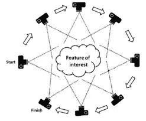*

*传统计算机视觉中的运动结构。图片来自[洪堡州立大学](https://gsp.humboldt.edu/OLM/Courses/GSP_216_Online/lesson8-2/SfM.html)。*

*PackNet 模型正在使用带有两个主要模块的单个摄像机学习这种 SfM。*

*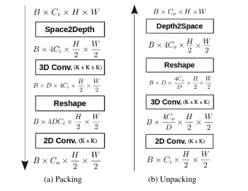*

*图片来自原纸[2]。*

1.  ***打包块**:用可逆的 Space2Depth 技术[【6】](https://arxiv.org/pdf/1609.05158.pdf)对输入的 RGB 图像张量进行缩减，然后网络学习压缩，学习用 3D conv 层进行扩展。结果通过整形变平，并馈送到 2D 卷积层。*
2.  ***解包块**学习解压缩和展开打包的卷积特征回到更高的分辨率。它再次使用 2D，然后三维层，然后通过深度 2 空间技术[6]重塑和扩展。*

*在训练期间，网络通过从源图像中采样像素来学习生成图像*t*。*

***损失***

*它们的深度映射损失分为两个部分:*

*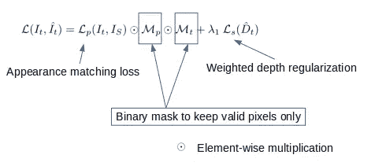*

*深度映射的损失。图片由作者提供。*

***外观匹配损失 L_p** :使用结构相似度项和 L1 损失项评估目标图像 I_t 和合成图像 t 之间的像素相似度*

***深度正则化损失 L_s** :他们鼓励估计的深度图在梯度上用 L1 罚函数进行局部平滑。因为在对象边缘上存在深度不连续，为了避免丢失无纹理的低梯度区域，当图像梯度高时，该平滑被加权为较低。*

*我们在这里不涉及这一点，但它们的损失利用相机速度来解决单目视觉固有的比例模糊。*

***结果:***

*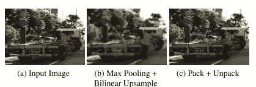*

*图像重建与传统流水线(b)和提出的方法(c)的比较。所提出的方法保留了细节。图片来自原纸[2]。*

*在著名的 KITTI 基准测试中，他们的模型优于 self、semi 和 fully supervised 方法。*

***2021 年更新:***

*他们最近通过他们的新 2021 型号扩展到了 360 度摄像机配置:*来自多个摄像机的全环绕单深度，*熊伟·圭齐利尼等人。*

*为了做到这一点，他们非常狡猾地利用时空信息。他们使用的六个摄像头重叠太少，无法在另一个摄像头(摄像头 B)的帧中重建一个摄像头(摄像头 A)的图像。为了解决这个问题，他们实际上使用来自摄像机 A 的过去帧的图像来投影到摄像机 b 的当前帧。*

*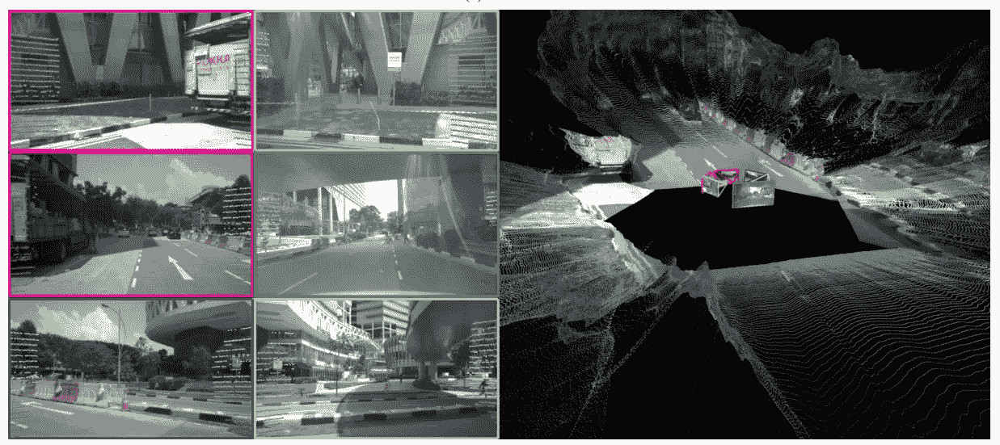*

*FSM 模型从 6 个相机装备配置(如左图所示)预测点云(右图)。图片来自原始纸张[2]*

***半监督** =自我监督+稀疏数据。*

*今年，TRI-AD 还提出了一个半监督推理网络:*“用于统一单目深度预测和完成的稀疏辅助网络(SANs)*，熊伟·圭齐利尼等人，这些 SANs 可以根据推理时只有 RGB 图像还是稀疏点云来执行深度预测和完成。*

# *第 2)节使用激光雷达和高清地图*

*自动驾驶汽车最初使用激光雷达、激光传感器和高清地图来预测和规划它们的运动。近年来，多任务深度学习的使用创造了利用激光雷达技术导航的端到端模型。*

***为什么使用高清地图？**高清地图包含关于语义场景的信息(车道、位置停车标志等)。*

*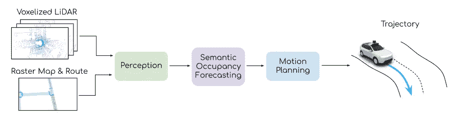*

*《感知、预测、规划》一文中提出的整体架构。图片来自论文[3]。*

*我来呈上优步·ATG 在《ECCV 2020》上发表的一篇论文:“ ***【感知、预测、规划】***【3】。这篇论文是由作者之一拉奎尔·乌尔萨顿提交的，她今年资助了自己的广告初创公司，名为 **Waadi** 。*

*她的论文提出了一个端到端的模型，它联合感知、预测和规划汽车的运动。他们创建了一个新的中间表示来学习他们的目标函数:**一个语义占用网格**来评估运动规划过程中每个轨迹的成本。这个语义层也被用作中间的和可解释的结果。这种网格使得广告比传统方法更安全，因为它不依赖于阈值来检测对象，并且可以检测任何形状*

*他们的模型被分成三块。*

1.  ***感知块***

*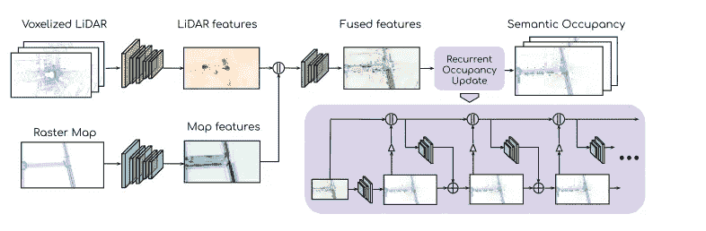*

*端到端感知和循环占用模型。||是串联、+元素式求和以及用于缩减的增量双线性插值。图片来自论文[3]。*

*感知模型首先从激光雷达测量和高清地图中独立提取特征。为此，他们将激光雷达的 10 次连续扫描体素化为 T=10 帧，并将其转换为 BEV(鸟瞰图)中的当前汽车帧。这将创建一个 3D 离散格网，每个像元都有一个二进制值:被占用或为空。*

*它们在 Z 轴上连接时间轴以获得(HxWxZT)张量。第三轴上的级联允许以后使用 2D 卷积骨干网。*

*地图的信息存储在 M 通道张量中。每个通道都包含不同的地图元素(道路、车道、停车标志等)。那么最后的输入张量就是 **HxWx(ZT+M)** 。实际上，ZT+M=17 个二进制通道。*

*然后，输入张量被送入由两个流组成的主干网络。一个流分别用于激光雷达和地图要素。这些流仅在使用的要素数量上有所不同(激光雷达流的要素越多)。输出被连接并馈入卷积层的最后一个块，以输出 256 维特征。*

***2。预测块***

*用于预测的语义类被组织成分层的组。每组都有不同的计划成本(停放的车辆没有移动的车辆重要)。这些组中的每一组都被表示为空间和时间上的分类随机变量的集合(对于 x，y 网格为 0.4m/像素，时间为 0.5s(因此 10 次扫描产生 5s 窗口)。简而言之，预测的目标是回答这个问题:谁(哪个类的哪个实例)将移动到哪里？*

*他们再次使用 2D 卷积块，主要是两个具有不同膨胀率的平行流。一个具有细粒度特征的流针对**最近未来**的预测。另一个流使用具有膨胀卷积的更粗糙的特征用于**长期**预测。使用先前的输出和连接的要素以循环方式更新输出。*

***3。运动规划模块***

*他们从自我车的各种轨迹中取样，并选择一个最小化学习成本函数的轨迹。该成本函数是主要考虑语义占用预测的成本函数: *fo* 和与舒适安全和交通规则相关的 *fr* 的总和。*

*fo 由两项组成:第一项惩罚与高概率区域相交的轨迹，第二项惩罚在不确定占有区域中的高速运动。*

***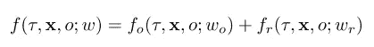*

*f 是成本函数，τ是轨迹，x 是输入数据，o 是占用预测，w 是可学习的参数。[3]*

*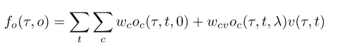*

*t 是时间步长，c 是占据网格的单元，τ是轨迹，λ是添加到周围物体以避免碰撞的余量参数，v 是速度。[3]*

*这些成本函数用于最终的多任务目标函数:*

*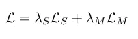*

*语义占用损失和规划损失之和。[3]*

***语义占据损失** *L_s* 是语义占据随机变量的地面分布 *p* 和预测分布 *q* 之间的交叉熵损失。*

***规划损失** *L_M* 是一种最大边际损失，鼓励人类驾驶轨迹(地面实况)比其他轨迹具有更小的成本。*

***结果***

*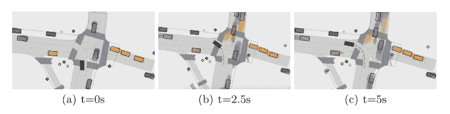*

*导致 5s 帧。图片来自报纸[3]*

*因此，在碰撞数量方面，将占用网格表示添加到模型优于最先进的方法。对整个管道进行端到端(而不是一个接一个)的训练提高了安全性(10%)和人类模仿性(5%)。*

# *结论*

*我简要地探讨了广告的最新趋势，概述了最近发表的三篇最先进的论文。*

***2021 年感知和运动规划的趋势是:***

*   *端到端模型优于顺序模型，*
*   *相机 VS 激光雷达，*
*   *学习深度如果你只依靠相机，*
*   *多智能体与自我车的纠缠互动。*

*许多生产级自动驾驶公司发布了他们最近进展的详细研究论文。此外，我们应该利用他们有时将代码作为开源库发布的优势。*

***感谢您的阅读！***

***中上关注我** [**推特**](https://twitter.com/ciel_delem) **！😃***

# *参考资料:*

*[1] *火热:从环绕单目摄像机鸟瞰视角预测未来实例，* Anthony Hu 等*

*[2]“打包:3 *用于自监督单目深度估计的 3d 打包。*(CVPR 2020)，熊伟·吉齐利尼，拉雷斯·安布鲁斯，苏迪普·皮莱，艾伦·拉文托斯，阿德里安·盖登。[https://arxiv.org/abs/1905.02693](https://arxiv.org/abs/1905.02693)*

*[3] " *感知、预测和规划:通过可解释的语义表示进行安全运动规划*"ECCV 2020。萨达特、卡萨斯、任、吴、普拉纳布·达万和 r .乌尔塔松、[和](https://arxiv.org/abs/2008.05930)*

*[4] " *举起、拍打、拍摄:通过隐式反投影将来自任意相机装备的图像编码为 3D，* ECCV 2020，*乔纳·菲利翁，桑亚·菲德勒，*[https://arxiv.org/abs/2008.05711](https://arxiv.org/abs/2008.05711)***

**[5]https://youtu.be/eOL_rCK59ZI[CVPR 2021 年自动驾驶研讨会](https://youtu.be/eOL_rCK59ZI)**

**[6] " *利用高效的亚像素卷积神经网络实现单幅图像和视频的实时超分辨率"*，2016，施，何塞·卡瓦列罗，费伦茨·胡斯萨尔，约翰内斯·托茨，安德鲁·p·艾特肯，罗布·毕晓普，丹尼尔·吕克尔特，，[，](https://arxiv.org/abs/1609.05158)。**

**[7][https://medium . com/Toyota research/self-supervised-learning-in-depth-part-1-of-2-74825 baaaa 04](https://medium.com/toyotaresearch/self-supervised-learning-in-depth-part-1-of-2-74825baaaa04)**