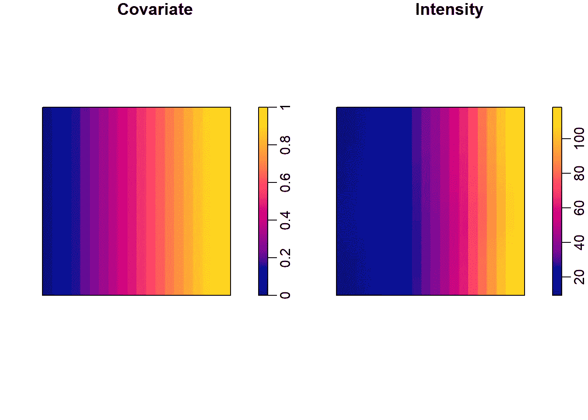
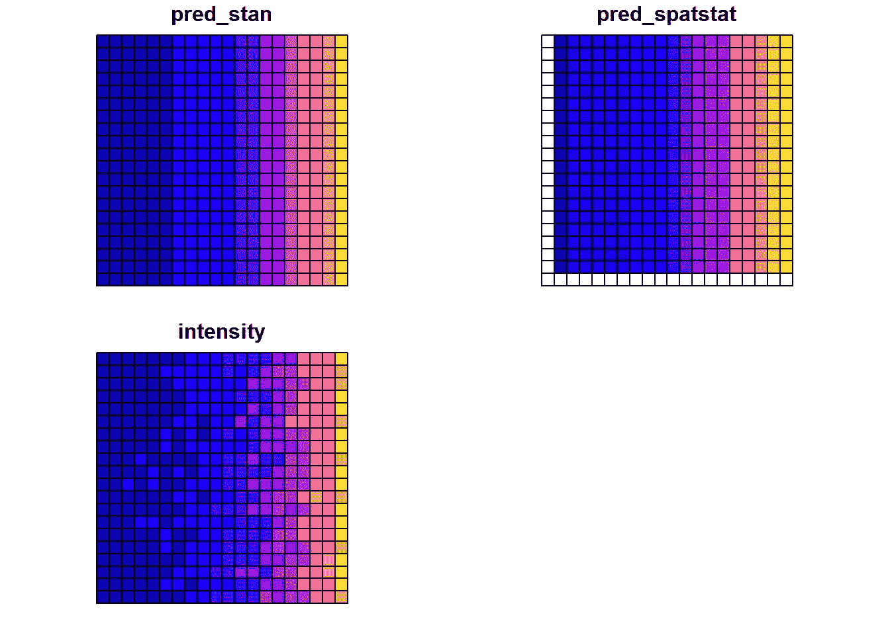
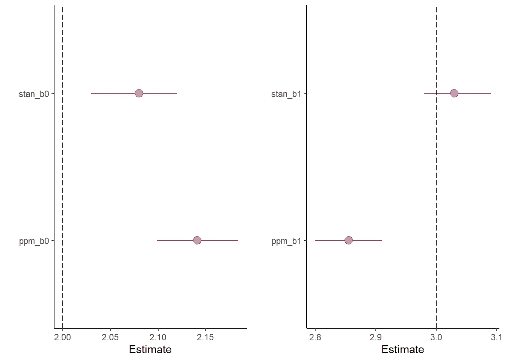

# 理解点流程模型—第 1 部分

> 原文：<https://towardsdatascience.com/understanding-point-process-model-with-r-983553ca2a86?source=collection_archive---------30----------------------->

## [实践教程](https://towardsdatascience.com/tagged/hands-on-tutorials)

## 用 R 对点过程模型的实际介绍

我最近一直在将空间数据作为一种学习练习，我对点模式分析特别感兴趣，这种分析通常用于流行病学，并在生态学中得到发展。虽然一些软件包已经有了这方面的固定功能(参见优秀的`inlabru`或众所周知的`spatstat`)，但我不喜欢依赖它们。因为我想提高我对点模式模型的理解，并决定在我需要从头开始编写模型代码的地方使用`rstan`。Stan，这是一种概率编程语言，使用哈密尔顿蒙特卡罗算法获得贝叶斯推断。

# 点模式和点过程

有许多资源介绍了点模式和点过程的概念，但是我将在这里快速解释这两个概念。

# 点模式

**点模式**代表一组点在时间、空间或更高维度中的分布。例如，森林中树木的位置可以被认为是一个点模式。犯罪地点是点模式的另一个例子。有三种通用模式:

*   **随机**:任意点在任意位置出现的概率相等，并且一个点的位置不受其他点位置的影响。例如，如果我把一袋大理石扔在地板上，图案很可能是随机的。
*   **均匀**:每个点都离它的邻居尽可能远。例如，我们可以想到一个人造森林，在那里树木被有规律地放置。
*   **群集**:许多点集中在一起，可能是由于协变量。我们可以以蜜蜂在田野中的位置为例，这些位置很可能聚集在花的周围。我们在这篇文章中模拟点模式代表了一个聚集的点模式。

# 点过程

**空间点过程**是点模式的描述。我们可以把它看作是生成点模式的模型。这些点来自随机过程，由局部强度λ(s)描述，局部强度测量空间中给定位置 s 处的点的预期密度。如果点独立且随机出现，则局部强度可由齐次泊松分布描述，并被称为*泊松点过程*。如果事件位置是独立的，但强度在空间上是变化的，则分布是由*非均匀点过程*产生的(即λ(s)变化)。后者也称为*非齐次泊松过程*。

我们可以将非均匀点过程的强度建模为协变量的函数。我们将这种类型模型描述如下:

λ(s)= exp(α+β÷X(u))

其中 X(u)是空间协变量，α和β是待估计的参数。Z(u)可以代表例如土壤的 pH 值或空气中的温度。

# r 库

要复制本教程，您需要加载以下库:

```
library(spatstat)
library(sf)
library(sp)
library(maptools)
library(raster)
library(rstan)
library(tidyverse)
library(cowplot)
```

# 模拟点模式

首先，我需要模拟一个点模式。在我看来，模拟数据有无数的好处，尤其有助于理解生成过程(即数据是如何创建的)。从实用的角度来看，当生成数据时，我们可以完全控制参数，并且很容易看出我们在拟合模型时是否犯了错误。

这是一个函数，它根据我们的α、β值和研究区域的尺寸在内部生成一个点模式。注意`dim[1]`和`dim[2]`必须相等。

该函数返回 3 个对象的列表:

*   每个网格单元中的点数。在 stan 中拟合模型时，这将非常有用。
*   一个 **ppp** 对象，它是一个 spatstat 对象。这将有助于用 spatstat 拟合模型
*   协变量，它是一个数值网格

```
genDat_pp <- function(b1, b2, dim, plotdat = TRUE){

  # Define the window of interest
  win <- owin(c(0,dim[1]), c(0,dim[2]))

  # set number of pixels to simulate an environmental covariate
  spatstat.options(npixel=c(dim[1],dim[2]))

  y0 <- seq(win$yrange[1], win$yrange[2],
            length=spatstat.options()$npixel[2])
  x0 <- seq(win$xrange[1], win$xrange[2],
            length=spatstat.options()$npixel[1])
  multiplier <- 1/dim[2]

  # Simulate the environmental covariate
  gridcov <- outer(x0,y0, function (x,y) multiplier*y + 0*x)# Set the coefficients
  beta0 <- b1
  beta1 <- b2

  # Simulate the point pattern
  pp <- rpoispp(im(exp(beta0 + beta1*gridcov), xcol=x0, yrow=y0))

  # We count the number of points in each grid cell, plot it and make a vector out of it
  qcounts <- quadratcount(pp, ny=dim[1], nx=dim[2])
  dens <- density(pp)
  Lambda <- as.vector(t(qcounts)) # We have to use t() as we need to # construct the vector with the column first

  if(plotdat == TRUE){
    par(mfrow=c(1,2), mar=c(2,2,1,1), mgp=c(1,0.5,0))
    plot(im(gridcov), main = 'Covariate')
    plot(dens, main = 'Intensity')
  }
  # Return a list with which I can play with
  return(list(Lambda = Lambda, pp = pp, gridcov = gridcov))
}
```

我为要复制的结果设置了一个种子，并为模拟选择了参数:

```
set.seed(123)
b1 <- 2
b2 <- 3
dim <- c(20,20)
```

最终生成我的点模式。该函数生成了两个图，第一个是模拟的协变量，第二个是点模式的模拟强度。

```
pp <- genDat_pp(b1, b2, dim)
```



瞧啊。我们现在有可以利用的数据了！

# 用 spatstat 拟合点过程模型

作为一个基本的检查，我用包`spatstat`中的函数`ppm()`来拟合模型，以确保我能够恢复我之前指定的参数。`spatstat`无疑是空间分析方面最成功的软件包，它具有大量用于拟合点过程模型和描述点模式的良好功能。查看[网站](https://spatstat.org/)！

```
cov <- im(pp$gridcov)
fit <- ppm(pp$pp ~ 1 + cov)
fit$coef## (Intercept)         cov 
##    2.187846    2.788411
```

模型的系数与我指定的系数是一致的。

# 在 stan 中拟合点过程模型

我在 stan 中为点流程模型编写的代码如下:

```
ppm_stan <- '
data{
  int<lower = 1> n;
  vector[n] x;
  int<lower = 0> y[n];
}
parameters{
  real beta0;
  real beta1;
}
transformed parameters{
}
model{
  //priors
  target += normal_lpdf(beta0 | 0,5);
  target += normal_lpdf(beta1 | 0,10);// likelihood
  target += poisson_log_lpmf(y | beta0 + beta1 * x);
}
generated quantities{
  vector[n] lambda_rep;
  lambda_rep = exp(beta0 + beta1 * x);
}'
```

我们接下来拟合这个模型:

```
stan_data = list(n = length(pp$Lambda), 
x = as.vector(t(pp$gridcov)), y = pp$Lambda)
fit_stan <- stan(model_code = ppm_stan, data = stan_data, 
                 warmup = 500, iter = 2000, chains = 3)
```

检查系数是否与我指定的一致:

```
print(fit_stan, pars = c('beta0', 'beta1'))## Inference for Stan model: 200e1419a3bfac13c3097743f3003142.
## 3 chains, each with iter=2000; warmup=500; thin=1; 
## post-warmup draws per chain=1500, total post-warmup draws=4500.
## 
##       mean se_mean   sd 2.5%  25%  50%  75% 97.5% n_eff Rhat
## beta0 2.12       0 0.02 2.08 2.11 2.12 2.14  2.17  1003    1
## beta1 2.97       0 0.03 2.91 2.95 2.97 2.99  3.02  1029    1
## 
## Samples were drawn using NUTS(diag_e) at Wed Dec 02 10:20:18 2020.
## For each parameter, n_eff is a crude measure of effective sample size,
## and Rhat is the potential scale reduction factor on split chains (at 
## convergence, Rhat=1).
```

这也是连贯的。我们注意到 Stan return 的系数比`ppm()`给我们的要高一点。

# 比较 spatstat 和 rstan 输出

我们能做的第一件事是检查预测是否正确。这可以帮助我们发展关于哪个软件性能更好的直觉，并帮助我们再次检查模型是否正确。

对`ppm()`对象进行预测比对 stan 对象进行预测更简单，但仍然相对简单:

```
# spatstat predictions
pred <- predict(fit)# Stan predictions
lambda_rep <- as.data.frame(rstan::extract(fit_stan)['lambda_rep'])
mean_lambda_rep <- apply(lambda_rep, 2, 'mean')
```

然后我们创建一个网格，在其中我们将收集所有的预测

```
pointp <- pp$pp
pp_sp <- as.SpatialPoints.ppp(pointp)
pp_sf <- st_as_sf(pp_sp)grid <- st_make_grid(pp_sf, n = dim, what = 'polygons') %>% st_as_sf()
grid$pred_stan <- mean_lambda_rep
grid$pred_spatstat <- as.vector(t(pred$v))
grid$intensity <- pp$Lambda
```

绘制预测图

```
plot(grid)
```



不知何故，spatstat 不能预测某些细胞。

我们还可以绘制系数，这将有助于我们可视化与参数值相关的误差。



从图中我们可以看到 stan 比`ppm()`函数执行得更好。我们可以通过计算**均方根误差**的总和来形式化这种直觉。

我们定义我们的助手函数`rmse`:

```
rmse <- function(true, observed){sqrt((true - observed)^2)}
```

我们计算。首先注意，我们去掉了 NAs 值，因为 spatstat 在某些网格单元中没有预测。

```
grid_no_na <- grid %>% filter(!is.na(pred_spatstat))
sum(rmse(grid_no_na$intensity, grid_no_na$pred_stan))## [1] 1993.056sum(rmse(grid_no_na$intensity, grid_no_na$pred_spatstat))## [1] 2551.068
```

stan 拟合的点过程模型的和 rmse 不如 spatstat 拟合的和 RMSE，这使我们得出结论，在这种情况下 stan 表现更好。

# 最后

在本文中，我介绍了点模式和点过程模型的概念。在处理空间数据分析中经常遇到的点模式时，ppm 是一类非常强大的模型。正如我提到的，理解你正在拟合的模型是很重要的，虽然 Stan 可能不是 ppm 的最佳选择( [INLA](https://www.r-inla.org/) 更有效)，从头开始编写你的模型会让你更好地理解你的模型在做什么，以及如何解释它的结果。

在第 2 部分中，我们将进一步研究点过程的情况，我们将了解如何模拟和拟合*考克斯过程*——它是一个具有随机强度函数的*非齐次泊松过程*。我们还将以*对数高斯考克斯过程*为例，其中考克斯过程的对数强度是高斯过程！