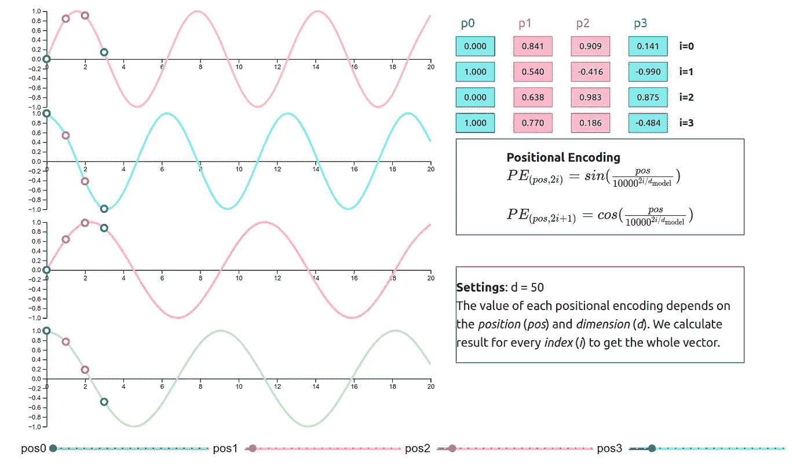

# 了解变压器中的位置编码

> 原文：<https://towardsdatascience.com/understanding-positional-encoding-in-transformers-dc6bafc021ab?source=collection_archive---------18----------------------->

## 理解 ML

## 变压器模型位置编码方法的可视化。

# 什么是位置编码？

正如我在[“注意力机制介绍”](https://erdem.pl/2021/05/introduction-to-attention-mechanism)中解释的，注意力并不关心输入的位置。为了解决这个问题，我们必须引入一种叫做**的位置编码**。这种编码在最初的[“注意力是你所需要的全部”](https://arxiv.org/abs/1706.03762)论文中有所涉及，它被添加到每个输入中(不是连接而是添加)。

*图 1:原变压器架构，来源* [*《注意力就是你需要的一切》，2017*](https://arxiv.org/abs/1706.03762)

这篇论文只考虑了固定的(不可训练的)位置编码，这就是我要解释的。现在编码是和模型一起训练的，但是这需要另一篇文章。为了计算位置编码的值，我们必须转到本文的第 **3.5 节**。作者使用 **sin** 和 **cos** 函数来计算每个输入向量的值。

如你所见，这些值取决于 *d_{model}* (输入尺寸)和 i *i* (位置向量的索引)。原始论文对 512 维向量进行操作，但为了简单起见，我将使用 *d_{model} = 50* 或 *d_{model} = 20* 。作者还附上了他们为什么选择这种函数的注释:

> 我们选择这个函数，因为我们假设它将允许模型容易地学习通过相对位置来参与，因为对于任何固定的偏移 k，PE_{pos+k}可以表示为 *PE_{pos}* 的线性函数。

# 位置编码可视化

图 2:位置编码可视化，设计基于[*“注意力是你所需要的全部”，NeurIPS 2017*](https://arxiv.org/abs/1706.03762) *论文*

> ***注意**
> 这只是原图中的一个屏幕，不幸的是我不能在介质上包含部分应用程序。如果你想玩，请直接进入[https://erdem . pl/2021/05/understanding-positional-encoding-in-transformers # positional-encoding-visualization](https://erdem.pl/2021/05/understanding-positional-encoding-in-transformers#positional-encoding-visualization)*

## *价值观念*

*我们使用给定指数的公式计算每个指数的值。值得注意的是， *cos* 函数中的 2 *i* 值是一个偶数，因此为了计算第 0 个和第 1 个索引的值，我们将使用:*

**

*这就是为什么第 0 个和第 1 个索引的值只取决于*位置*的值，而不是同时取决于*位置*和 d_{model} *dmodel* 的值。这从第二个指数向前改变，因为被除数不再等于 0，所以整个除数大于 1。*

## *维度依赖性*

*如果切换到第二步，那么可以比较一下 ***PE*** 值是如何根据 *d_{model}* 变化的。*

**

**图 3:不同维度 PE 值对比(d)，来源:* [*位置编码可视化*](https://erdem.pl/2021/05/understanding-positional-encoding-in-transformers#positional-encoding-visualization)*

*前两个指标的周期不随 *d_{model}* 的变化而变化，但随 *d_{model}* 的减小，后续指标(第 2 个及以上)的周期变宽。这可能是显而易见的，但仍然很好地看到了差异。*

## *功能周期*

*当我们绘制前 20 个*位置*向量的 ***PE*** 值时，我们得到如下结果:*

**

**图 4:前 20 位的位置编码值，使用* [*Tensorflow —位置编码*](https://www.tensorflow.org/tutorials/text/transformer#positional_encoding) *代码*生成*

*这个图是从 Tensorflow 的教程之一生成的，你可以在谷歌的帮助下直接从他们的网站上运行它。如你所见，位置向量的较低维度具有非常短的波长(相同点之间的距离)。指数 i = 6 的函数的波长具有大约 19 (2 * 10^{12/25}).)的波长*

*我们知道周期是随着 *i* 的增加而增加的。当 *i* 到达 *d_{model}* 边时，你需要大量的 *pos* 向量来覆盖整个函数周期。*

**

**图 5:进一步索引的函数值，来源:* [*位置编码可视化*](https://erdem.pl/2021/05/understanding-positional-encoding-in-transformers#positional-encoding-visualization)*

*较高索引的前 20 个位置的值几乎是恒定的。你可以在图 4 中看到同样的事情，其中 30-50 列的颜色几乎没有变化。为了看到这种变化，我们必须绘制成千上万个位置的值:*

**

**图 6:使用* [*Tensorflow —位置编码*](https://www.tensorflow.org/tutorials/text/transformer#positional_encoding) *代码*生成的进一步索引的位置编码周期*

> ****警告*** *这个图有一个内置的错觉，它实际上不是错觉，但因为它试图在 670px(高度)上打印 40k+值，所以它不能显示任何波长小于 1px 的值。这就是为什么第 24 列之前的任何内容在视觉上都是不正确的，即使使用了正确的值来生成该图。**

# *结论*

*位置嵌入为转换器提供了关于输入向量位置的知识。它们被添加(而不是连接)到相应的输入向量。编码取决于三个值:*

*   **位置* —矢量的位置*
*   **i* —向量内的索引*
*   *d_{model} —输入的维度*

*在周期函数(和)的帮助下交替计算值，这些函数的波长随着输入向量维数的增加而增加。当更远的索引需要很多位置来改变一个值(大周期)时，更靠近向量顶部的索引值(较低的索引)变化很快。*

*这只是进行位置编码的一种方式。当前的 SOTA 模型具有与模型一起训练的编码器，而不是使用预定义的函数。作者甚至在论文中提到了这个选项，但没有注意到结果的不同:*

> **我们还尝试使用习得的位置嵌入，发现两个版本产生了几乎相同的结果(见表 3 行(E))。我们选择正弦版本，因为它可以允许模型外推至比训练期间遇到的序列长度更长的序列长度。**

# *参考资料:*

*   *阿希什·瓦斯瓦尼等人，“注意力是你所需要的一切”，neur IPS 2017[https://arxiv.org/abs/1706.03762](https://arxiv.org/abs/1706.03762)*

**原载于*[*https://erdem . pl*](https://erdem.pl/2021/05/understanding-positional-encoding-in-transformers)*。**