# 理解概率模型和公理

> 原文：<https://towardsdatascience.com/understanding-probability-models-and-axioms-c0f498972b80?source=collection_archive---------8----------------------->

## 基本原则

## 为什么还要关心样本空间、事件和概率度量？

[孙富](https://unsplash.com/@zisun_word?utm_source=medium&utm_medium=referral)在 [Unsplash](https://unsplash.com?utm_source=medium&utm_medium=referral) 上的照片

> 你必须把基础的东西做好，因为否则那些花哨的东西是不会起作用的。—兰迪·波许，美国教育家，计算机科学教授

概率论是这些基础之一，为了在机器学习或人工智能领域取得成功，人们应该认真学习。

作为数学中有关不确定性概念的一个分支，概率论为我们提供了一个一致推理以及做出预测和决策的框架。它在机器学习中起着核心作用，处理非确定性问题。

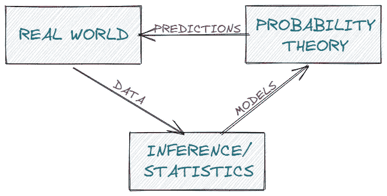

概率论和相互作用[图片由作者提供]

在下面的章节中，我们将处理概率论的基本概念，慢慢地在机器学习的主要支柱之一中建立我们的基础。

*声明:我不是数学专家。请把这篇文章仅仅作为一个指南，希望能为概率论的基础提供一些基本的直觉。*

# 概率空间

> 不严格地说，概率是关于不确定性的研究。

当我们谈论概率时，我们最有可能指的是不确定事件发生的几率。因此，概率可以被看作是一个事件发生的次数，或者是对一个事件的信任程度。例如，在一次投掷中硬币正面朝上的概率。

概率空间的构造提供了所需的数学结构，不仅可以正式讨论概率论，还可以描述实验的随机结果。

形式上，概率空间是由三元组(ω，F，ρ)定义的*:样本空间(ω)、事件空间和概率测度。*

## 样本空间

样本空间通常表示为ω，描述了所有可能结果的集合。

假设我们连续掷两次硬币。所有可能结果的集合将被定义如下:`{HH, HT, TH, TT} | H=Heads; T=Tails.`

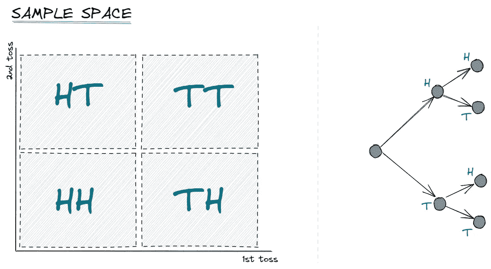

两次投掷硬币的样本空间[图片由作者提供]

知道了样本空间是什么，再来说说里面的元素及其性质。

当我们掷一枚硬币时，结果不是正面就是反面，而不是两个都是。这是因为所有的元素都是相互排斥的，也就是说一次只能有一个结果。

此外，元素是*集体穷举。*如果我们再掷一次硬币，至少会有一种结果。无论是正面还是反面的结果，都涵盖了整个样本空间内的所有可能性。

元素需要有“正确的”粒度。这仅仅意味着，样本空间中的元素需要与我们的实验相关。回到我们的单次抛硬币的例子，让我们扩大我们的样本空间，包括关于天气的元素`{HR, TR, HNR, TNR} | H=Heads; T=Tails; R=Raining; NR=Not raining.`虽然在抛硬币时记录这种信息可能很有趣，但它很可能与我们的实验结果*无关*。因此，新的样本空间没有合适的粒度。

## 事件空间

事件空间 *F* 描述了实验的一组*潜在结果*，因此是样本空间的子集。例如，一个 toin coss 的一组潜在结果将是`{H}`——硬币正面朝上。

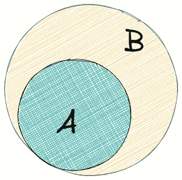

事件空间的欧拉图。b 是样本空间，A 是事件。[图片由作者提供]

## 概率测度

当我们投掷一枚硬币，想要表达硬币出现反面的概率时，我们需要某种函数将事件转换成一个实数值。

这就是概率测度(或概率分布)*ρ*的作用。它将事件 *E* ∈ *F* 映射到 0 和 1 之间的一个实数值。或者，换句话说，*ρ*可以被认为是将事件 *E* 转换为 0 到 1 范围内的实数值的函数，即事件空间 F 的元素。

在我们的例子中，表示事件通过一次抛硬币得到反面的概率是`P(T) = 0.5`

既然已经定义了概率空间，那么就可以谈谈某些规则或者说*概率公理*了。

# 概率公理

由安德雷·柯尔莫哥洛夫在 1933 年提出的三个概率公理仍然是概率论的核心和基础。

**第一公理:**

事件发生的概率是一个*非负实数。*

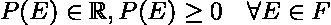

第一个公理，非负实数

上式告诉我们，事件空间 *F，*内事件 *E，*发生的概率 *P* 大于或等于零。概率也是实数值。

尽管方程看起来很复杂，但第一个公理应该是直观的。如果我们考虑扔硬币——硬币正面朝上的负概率没有任何意义，要么是正面，要么不是正面。

**第二条公理:**

第二个公理描述了*琐碎事件*，即至少一个基本事件至少出现一次。

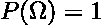

第二个公理，琐碎事件

这将是我们的硬币，至少出现正面或反面。

**第三条公理:**

两个(或任何可数序列的)不相交集合的概率可以通过每个集合的单独概率的总和来计算。

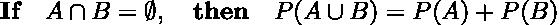

第三个公理，有限可加性的一个例子

简单地说，如果 A 和 B 是不相交的，这意味着它们的交集等于一个空集，那么 A 和 B 的并集的概率等于各自概率的总和。

在我们的例子中，事件 A 是正面，事件 B 是反面。这两个事件是不相交的，因此正面或反面发生的概率是`P(A) + P(B) = 0.5 + 0.5 = 1`

这个等式可以进一步推广。

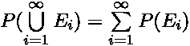

第三个公理，广义可加性

# 概率计算:示例

说完了理论背景，让我们通过看一些例子来获得更多的直觉。

**离散/有限示例**

想象一下连续滚动两个四面体(四边)骰子。样本空间将是覆盖所有可能结果的 4x4 网格。

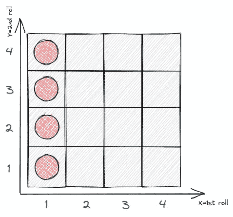

两卷四面体骰子[图片由作者提供]

在我们的样本空间中，总共有 16 个(4x4)元素。每种结局发生的概率是 1/16。第一个骰子作为一个出现的概率是多少？

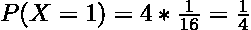

第一个骰子是一的概率

如上图所示，我们必须考虑四种可能的结果`{(1,1), (1,2), (1,3), (1,4)}`,因此任何一种结果发生的概率是 1/4。

本例中的基本原理是*离散统一定律或分布*。不严格地说，这意味着样本空间由 *n* 个同样可能的元素(1/16)组成，事件空间包含多个 *k* 个元素(4)。

**连续例子**

让我们假设我们向一个单位正方形投掷飞镖，无论如何，我们总是击中。这可以用 0 ≤ x，y ≤ 1 来描述。

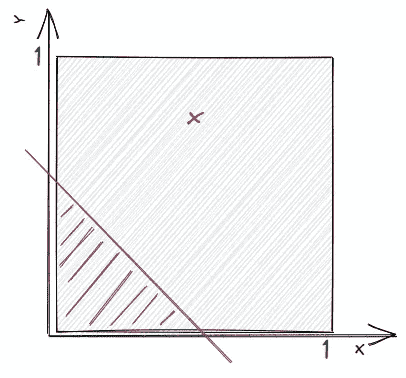

向单位正方形投掷飞镖[图片由作者提供]

以下事件的概率是多少？

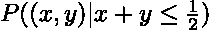

或者换句话说，投飞镖的概率是多少，击中 x + y ≤ 1/2 定义的区域，基本就是上图所示的三角形。如果我们用 1/2 *底*高来计算面积，我们得到

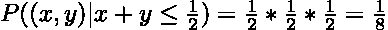

接下来，击中特定点`(0.5, 0.7)`的概率是多少？

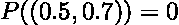

为了计算该事件的概率，我们必须计算单点的面积，该面积为零。

# 结论

我们讲了概率空间，定义它的三元组*(样本空间，事件空间，概率测度)*，了解了三个概率公理及其含义。

尽管是基本概念，但重要的是获得直觉，为简单的原则打下坚实的基础。最终，我们的*【花式模型】*将建立在这个基础上。

> 感谢您的阅读！确保保持联系&在 [Medium](https://medium.com/@marvinlanhenke) 、 [Kaggle](https://www.kaggle.com/mlanhenke) 上关注我，或者在 [LinkedIn](https://www.linkedin.com/in/marvin-lanhenke-11b902211/) 上说声“嗨”

*喜欢这篇文章吗？成为* [*中级会员*](https://medium.com/@marvinlanhenke/membership) *继续无限学习。如果你使用下面的链接，我会收到你的一部分会员费，不需要你额外付费。*

 [## 通过我的推荐链接加入 Medium-Marvin Lanhenke

### 作为一个媒体会员，你的会员费的一部分会给你阅读的作家，你可以完全接触到每一个故事…

medium.com](https://medium.com/@marvinlanhenke/membership) 

**参考资料/更多资料:**

[1] [2]戴森罗斯，议员，费萨尔，A. A .，Ong，C. S. (2020)。*机器学习的数学(第 152 页)*。剑桥大学出版社。

视频讲座:[麻省理工学院 2012 年春季课程](https://www.youtube.com/playlist?list=PLUl4u3cNGP60hI9ATjSFgLZpbNJ7myAg6)概率导论